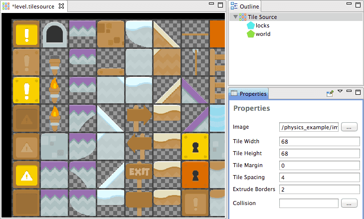
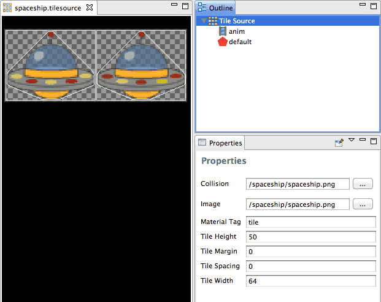
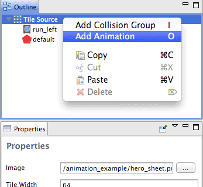
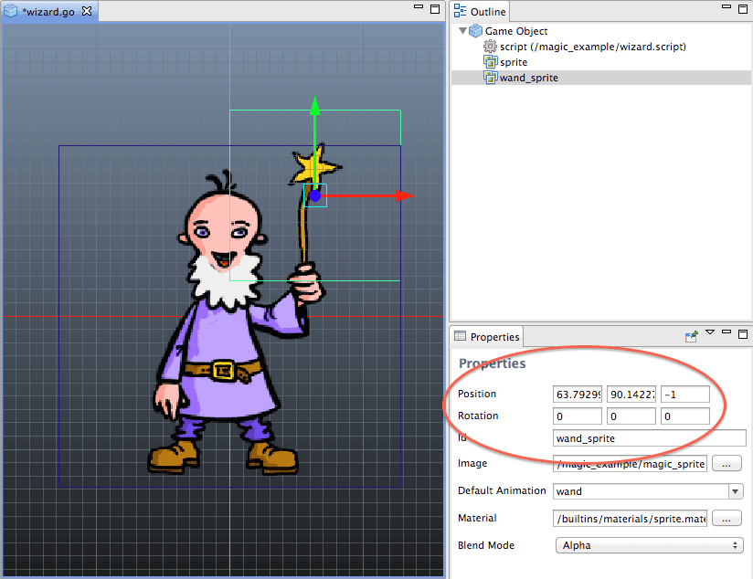

# 2D Graphics

2D games are commonly built by many images that are presented as is (for backgrounds or sprites), used in _flip-book animation_ (for sprites), combined and rigged to create _Spine animation_ (for sprites) or mapped out into tilemaps and used for levels or backgrounds.

For performance reasons, images are often combined into one or a few larger images, but the small original image can still be referenced as a sub-image on the larger one. Combining smaller images into larger is especially important on mobile devices where memory and processing power is more scarce than on desktop machines or dedicated game consoles.

In Defold, there are two types of asset that represent such a larger image:

Atlases
: An _atlas_ contains a list of separate images files, which are automatically combined into a larger image. See http://en.wikipedia.org/wiki/Texture_atlas


Tile Sources
: A tile source references an image file that is already containing sub-images ordered on a uniform grid. Other tools sometimes use the terms _tile set_ and _sprite sheet_ for this type of image. See http://en.wikipedia.org/wiki/Tileset#Tile_set


## Importing Image Files

Defold needs all assets that should be in your project hierarchy. Therefore you should start by importing the image files you want to build your graphics from. To import image assets, simply drag the files from the file system on your computer and drop them in an appropriate place in the Defold editor _Project Explorer_.

::: important
Currently, Defold supports the PNG and JPEG image formats.
:::


## Creating an Atlas

You need to populate an _Atlas_ before you can use it. As soon as you have added images and/or animations to the Atlas, it can be used as a graphics source for object components like Sprites and ParticleFX components.

1. Import your image files as described above.
2. Select <kbd>New ▸ Atlas File</kbd> from the context menu in the Project Explorer.
3. Select <kbd>Add Images</kbd> from the context menu in the Outline.

A dialog opens from which you can find and select the images you want to add to the Atlas. Note that you can filter the image files and select multiple files at once.


## Defining flip-book animations

You can define flip-book animations of selected sub-images in an atlas:

- Select <kbd>Add Animation Group</kbd> from the context menu in the Outline.
- Select <kbd>Add Images</kbd> from the context menu of the created animation group and choose the images that you want as frames of the animation.
- Adjust the *Properties* for the animation as needed.

You can reorder the images in the Outline by dragging them, if needed. You can also easily create duplicates by copying and pasting (From the <kbd>Edit</kbd> menu, the right click context menu or keyboard shortcuts) images in the outline. Select an animation and press <kbd>Space</kbd> on your keyboard to preview the animation.

## Creating a Tile Source

To create a Tile Source you need an image containing all the tiles. All tiles must have the exact same dimensions and be placed in a grid. Defold supports _spacing_ between the tiles and _padding_ around each tile. Defold can also automatically _extrude borders_ which is sometimes neccessary to avoid visual artifacts.

Once you have the source image created, you can create a Tile Source:

- Import the image to your project by dragging it into the Project Explorer.
- Create a new Tile Source file.
- Click the browse-button next to the *Image* property and select your image. Now you should see the image displayed in the editor.
- Adjust the *Tile Height*, *Tile Width*, *Tile Margin* and *Tile Spacing* to match the source image. When everything is correctly set you should see the tiles line up perfectly inside each cell of the transparent grid.



::: sidenote
If you use linear filtering (see below) and a Tile Source where each tile lies immediately next to each other (i.e. has no borders), there is a risk that you will experience a visual artifact called edge bleeding: if a neighboring tile has colored pixels on its edge, their color might bleed over at the edges. The easiest way to fix this problem is to set the *Extrude Border* property (which can be found on Atlases and Tile Sources). The value specifies how many times the edge pixels should be automatically replicated in the final texture used in when the game is run.

A good measure is to specify a number that corresponds to how much you scale the textures when viewed in game. If you display the game world at half scale (you can see 2 times as much) then set *Extrude Borders* to 2. When the texture is used scaled down to half the size, a _mipmap_ is used for rendering. That mipmap is half the width and height of the original image.
:::

## Tile Source collision shapes

Collision shapes that enable physics interaction with Tile Maps can be automatically generated. Defold uses the alpha channel from the image specified in the *Collision* property to generate a _convex_ shape for each tile. Often it is sensible to use the same image for collision as the one containing the actual graphics, but you are free to specify a separate image if you want collision shapes that differ from the visuals. When you specify a collision image, the preview is updated with an outline on each tile indicating the generated collision shapes. See the [Physics documentation](/manuals/physics) for more details.



## Tile Source flip-book animations

To define an animation in a Tile Source each frame must correspond to one tile (be on a grid of a certain width and height). Each frame tile must lie next to each other in a sequence left to right. The sequence can wrap from one row to the next. All newly created Tile Sources have a default animation named "anim". Selecting it displays the animation *Properties* that allow you to set a descriptive name, start and end frame, playback method, playback speed, and whether the animation should be visually flipped horizontally or vertically.


You can easily add more animations to the Tile Source by selecting <kbd>Add Animation</kbd> in the context menu that can be accessed by right clicking the root *Tile Source* in the Outline view.



## Manipulating Game Objects and components

When you add visual components (Sprites, ParticleFX, etc) to a game object, you are able to set the _position_ and _rotation_ of the component. These values are used as offsets against the position and rotation of the game object. What's more, the values are _set_ in the component when you assemble the game object.



Defold game objects can be moved, rotated, and have any of their properties animated. Components belonging to a manipulated game object undergo the same manipulations as the game object, but will keep their relative position and rotation as set in the game object. Components can be turned on and off, but it's not possible to animate, move, or rotate them dynamically (with an exception described below). Therefore, if you have graphics that you intend to alter you should put the graphics in separate game objects. A group of game objects or a game object hierarchy is conveniently assembled in a Collection. Then you can freely manipulate the objects through script:


```lua
-- Animate the wand game object to specified position and rotation.
go.animate("wand", "position", go.PLAYBACK_ONCE_FORWARD, vmath.vector3(530, 79, -0.1), go.EASING_INOUTSINE, 0.5)
go.animate("wand", "euler", go.PLAYBACK_ONCE_FORWARD, vmath.vector3(0, 0, -70), go.EASING_INOUTSINE, 0.5)
```

## Dynamically scaling Sprites

It is actually possible to dynamically alter the scale of Sprite components in a non-uniform way. This is a special feature that may feel odd when you try to construct a mental model for how game objects and components are related to each other and how to work with them.

Sprites have a property `scale` which is of type `vmath.vector3`. You can animate the components separately:

```lua
go.animate("my_object#sprite", "scale.x", go.PLAYBACK_ONCE_FORWARD, 1.5, go.EASING_INOUTSINE, 2)
```

## Sprites

Sprite components are used to add graphics and flip-book animations to game objects. They are typically used to create characters and props. Creating a Sprite component is very straightforward:

- Create (or open) the game object the Sprite should belong to.
- From the Game Object context menu in the Outline, select <kbd>Add Component</kbd>.
- Choose *Sprite*.
- Specify in the Sprite's *Image* property which Tile Source or Atlas the Sprite should use.
- Specify in the Sprite's *Default Animation* property which animation it should play by default.

The default animation is played when the game object is created in the running game. Note that if you use an Atlas as the image resource you will see still images as well as animations in the *Default Animation* drop down menu. If you want to create a Sprite with a still image out of a Tile Source, you can create a 1 frame animation and set its *Playback* property to "None".

## Collision Shapes

Sprites do not yet support Collision Shapes generated in Tile Sources. Instead, you add Collision Objects with Collision Shapes like you would for any game object. See the [Physics documentation](/manuals/physics) for details.

## Blend Mode

The *Blend Mode* property defines how the sprite should be blended with the graphics behind it. These are the available blend modes and how they are calculated:

Alpha
: Normal blending: a~0~ * rgb~0~ + (1 - a~0~) * rgb~1~

Add
: Brighten the background with the color values of the corresponding sprite pixels: rgb~0~ + rgb~1~

Add Alpha (deprecated!)
: Brighten the background with the corresponding visible sprite pixels: a~0~ * rgb~0~ + rgb~1~

Multiply
: Darken the background with values of the the corresponding sprite pixels: rgb~0~ * rgb~1~

## Sprite Shading

The default sprite shading files are located under */builtins/material/sprite.\** in your project. The default shading performs a regular texture lookup, but also has a tint (a fragment shader constant) which is multiplied with the texture color.

To obtain effects like flashing a sprite white when it is hit, you can implement custom shading. To set a custom shading for your sprites, follow these steps:

- Copy the files under */builtins/material/sprite.\** into one of your project directories (you can't modify the content of the *builtins*-directory). This is not mandatory but makes the process easier.
- Open the copied *sprite.material* file and remap the shader files (*.vp* and *.fp*) to your own copies.
- Edit the *.vp* and *.fp* copies as you please. If you introduce shader constants, they must also be declared in the material file.
- Open your sprite and specify your new material in the Properties.
- To set a shader constant while the game is running, use the functions [`sprite.set_constant()`](/ref/sprite#sprite.set_constant) and [`sprite.reset_contant()`](/ref/sprite#sprite.reset_constant).

## Tile Maps

A Tile Map is a component that allows you to assemble, or _paint_, tiles from a Tile Source onto a large grid area. Tile Maps are commonly used to build game level environments. You can also use the Collision Shapes from the Tile Source in your maps for collision detection and physics simulation.

## Painting Tiles

- Open the Tile Map you want to work in.
- Make sure that there are no flagged issues in the *Property* or *Outline* view.
- Select or create a Layer to paint on in the *Outline* view.
- Select a tile to use as brush (press <kbd>Space</kbd> to show the tile palette)


## Picking Tiles

You can also pick tiles directly from the Tile Map to use as a brush. Hold <kbd>Shift</kbd> and click a tile to pick it up as the current brush. While holding <kbd>Shift</kbd> you can also click and drag to select a block of tiles to use as a larger brush.


## Erasing Tiles

The Eraser tool is used to erase painted tiles. To select the Eraser, you can either:

- Select it from the <kbd>Tile Map</kbd> menu.
- Press <kbd>Backspace</kbd>.
- Click the active tile again in the tiles palette.
- Pick any empty cell on the Tile Map.

## Attaching Physics

You can attach physics to the Tile Map to do collision detection or physics simulations involving tiles. To attach physics to a Tile Map, see the [Physics documentation](/manuals/physics) for details.

## Changing tiles from script

You can change the content of a Tile Map dynamically while your game is running. To do so, call the [`tilemap.set_tile()`](/ref/tilemap/#tilemap.set_tile) function:

```lua
-- Replace the two door-tiles with "open door" tiles.
-- The door is two tiles, one on top of the other.
local x = 3
local y = 4
-- Lower part of door
tilemap.set_tile("/level#tilemap", "layer1", x, y, 58)
-- Upper part of door
tilemap.set_tile("/level#tilemap", "layer1", x, y+1, 46)
```

## Adding a Tile Map to your game

To add a Tile map to your game:

1. Create a game object to hold the Tile Map component. The game object can be in a file or created directly in a collection
2. Right-click the root of the game object and select <kbd>Add component from file</kbd>
3. Select the Tile Map file

The game object now contains the Tile Map and you can place or spawn the game object wherever you want it.


## Texture Filtering and Sampling

Defold supports two different ways to do texture sampling. The method governs the visual result in cases when a _texel_ (a pixel in a texture) is not perfectly aligned with a screen pixel. This happens when you move a Sprite containing the texture seamlessly (say 0.2 pixels in any direction), if your camera is moving seamlessly or if your camera zooms in or out:

Nearest
: The nearest texel will be picked to color the screen pixel. This sampling method should be chosen if you want a perfect one-to-one pixel mapping from your textures to what you see on screen. With nearest filtering everything will snap from pixel to pixel when moving which looks twitchy if the Sprite moves slowly.


Linear
: The texel will be averaged with its neighbors before coloring the screen pixel. This produces smooth appearances for slow, continuous motions as a Sprite will bleed into the pixels before fully coloring them--thus it is possible to move a Sprite less than a whole pixel.


The setting for which filtering to use is stored in the [Project Settings](/manuals/project-settings) file. There are two settings:

default_texture_min_filter
: Minifying filtering applies whenever the texel is smaller than the screen pixel.

default_texture_mag_filter
: Magnifying filtering applies whenever the texel is larger than the screen pixel.

Both settings accept the values `linear` or `nearest`. For example:

```ini
[graphics]
default_texture_min_filter = nearest
default_texture_mag_filter = nearest
```

If you don’t specify anything, both are set to `linear` by default.

(Some of the graphic assets used are made by Kenney: http://kenney.nl/assets)
