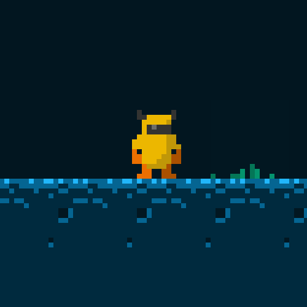
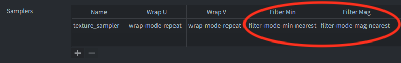

# Introduction

There are several things to consider when adapting your game and graphics to different screen sizes:

* Is this a retro game with low resolution pixel perfect graphics or a modern game with high resolution anti aliased graphics?
* How should the game behave when played in full screen on different screen sizes?
  * Should the player see more of the game content on a high resolution screen or should the graphics adaptively zoom to always show the same content?
* How should the game deal with aspect ratios other than the one you have set in game.project?
  * Should the player see more of the game content? Or maybe there should be black bars? Or maybe additional GUI chrome?
* What kind of menus and on-screen gui components do you need and how should they adapt to different screen sizes and screen orientations?

This manual will address some of these things and suggest best practices.

## Retro/8-bit graphics

Retro/8-bit graphics often refer to games emulating the graphical style of old game consoles or computers with their low resolution and limited color palette. As an example the Nintendo Entertainment System (NES) had a screen resolution of 256x240, the C64 320x200 and the Gameboy had 160x144, all of which are only a fraction of the size of modern screens. In order to make games emulating this graphical style and screen resolution playable on a modern high resolution screen the graphics has to be upscaled or zoomed several times. One simple way of doing this is to draw all of your graphics in the low resolution and style that you wish to emulate and zoom the graphics when it is rendered. This can easily be achieved in Defold using the render script and the [Fixed Projection](/manuals/render/#_default_view_projection) set to a suitable zoom value.

Let's take this tileset and player character and use them for an 8-bit retro game with a resolution of 320x200:


Setting 320x200 in the *game.project* file and launching the game would look like this:


The window is absolutely tiny on a modern high resolution screen! Increasing the window size four times to 1280x800 makes it more suitable for a modern screen:


Now that the window size is more reasonable we also need to do something about the graphics. It's so small it's very hard to see what is going on in the game. We can use the render script to set a fixed and zoomed projection:

```Lua
msg.post("@render:", "use_fixed_projection", { zoom = 4 })
```

Which will give the following result:


This is better. The window and graphics both have a good size, but if we look closer there is an obvious problem:


The graphics look blurred! This is caused by the way the zoomed in graphics is sampled from the texture when rendered by the GPU. The default setting in the *game.project* file under the Graphics section is *linear*:


Changing this to *nearest* will give the result we are after:




Now we have crisp pixel-perfect graphics for our retro game. There are even more things to consider, such as disabling sub-pixels for sprites in *game.project*:


With sub-pixels disabled sprites would never get rendered on half-pixels and instead always snapped to the nearest full pixel. Another thing that can be done is to add a texture sampler with filtering set to *nearest* to any font material in use:



This will make the font go from this:


To this:


## High resolution anti-aliased graphics

We have seen some of the considerations and changes needed to create nice looking retro graphics. When dealing with high resolution graphics we need to approach project and content setup in a different way. When dealing with high resolution graphics that may or may not need to scale and that should look good on high resolution screens there are other things to consider.

### High DPI setting and retina screens

Info here.


## Render script

Info here.


## Optimizing storage and run-time size of graphics

It is important to always keep in mind the limitations of your target platform(s). On mobile devices it is especially important to keep in mind both application size to reduce the download size from the app store and the size the images take up when loaded into memory.

For things such as background images it might for instance be ok to use a small image and scale it up to the desired size. This kind of image size optimization is done on the image before it is added to Defold in an atlas or a tilesource. Once the reduced size image is imported it can be scaled using the normal scale property of a game object or component depending on where it is supposed to be used.

It can also be acceptable to apply compression on images to reduce both storage size and run-time memory usage. Defold supports automatic texture processing and compression of image data using something called texture profiles. The texture profiles match groups of files or individual files to different texture compression algorithms with an option to apply different compression algorithms based on the target platform. You can read more about how to use this system in the [Texture Profiles manual](/manuals/texture-profiles/).

### Disable mipmaps

Info here.


## Adaptive GUIs

Info here.


## Testing on different screen resolutions

While it is recommended to test on actual hardware as much as possible it is also at times more convenient to test how the game behaves on different screen resolutions while developing the game on your local machine. Defold provides a menu option where you can switch between different screen resolutions while the game is running. Selecting a screen resolution option from the menu will resize the window and trigger any window listener set using window.set_listener() as well as apply a new gui layout if needed.
