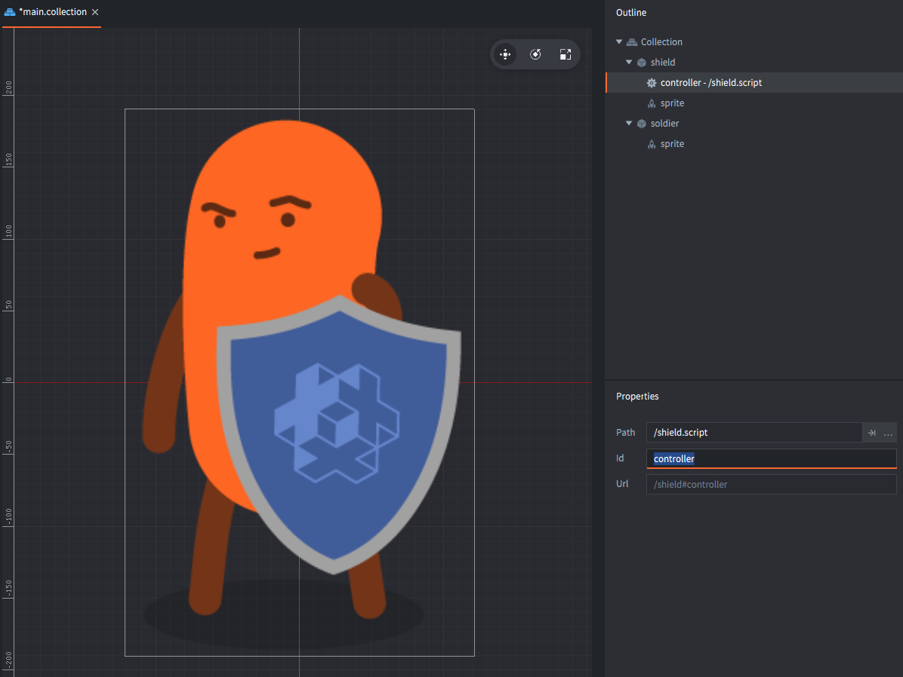
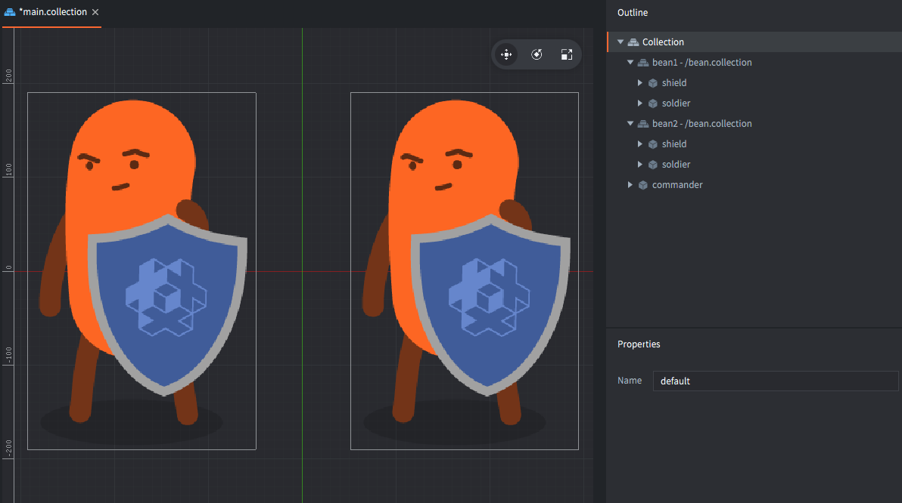
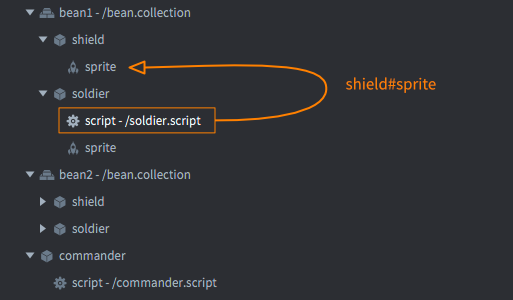
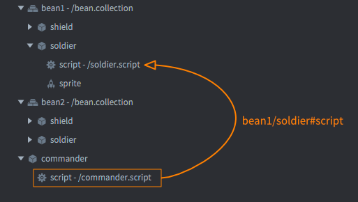
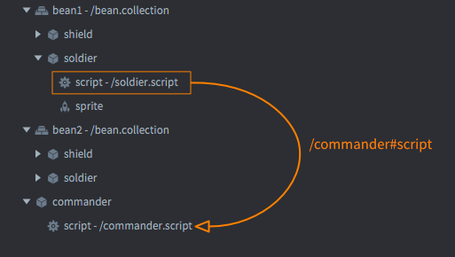

# Addressing

Every game object and component that exist in runtime must be possible to address. This manual describes how Defold solves the addressing problem.

## Identifiers

When you create a new game object or component in the editor, a unique *Id* property is automatically set. Game objects automatically get an id called "go" with an enumerator ("go2", "go3" etc) and components get an id corresponding to the component type ("sprite", "sprite2" etc). All these identifiers can be modified and you are encouraged to pick good, descriptive names for your game objects and components.



Suppose you have created a collection file containing two separate game objects. You have given the game objects the identifiers "soldier" and "shield". Each game object also contains a single sprite component. The sprites are both named "sprite". There is also a script component in the "shield" game object that you have named "controller".

Let's look a bit closer at the "shield" game object:


First, let's see how you can move the whole game object 10 pixels to the left:

```lua
local pos = go.get_position()
pos.x = pos.x + 10
go.set_position(pos)
```

Notice that there are no address identifiers in this code at all. Defold knows that the script is running in a component inside the "shield" game object. By omitting an address, the current game object is implied. The above code snippet is equivalent to the following where the game object id is explicitly specified:

```lua
local pos = go.get_position("shield")
pos.x = position.x + 10
go.set_position(pos, "shield")
```

Now suppose you want to write code in the script that disables the shield sprite only. The script and the sprite lives in the same game object so the game object id "shield" is implied:

```lua
msg.post("#sprite", "disable")
```

Notice the initial character '#' before the component id. The hash sign is used to separate the game object id from the component id. Since you don't have a game object id before the hash sign, it starts the address string.

If the script wants to disable the sprite in the "soldier" game object, it is no longer possible to leave out the game object id:

```lua
msg.post("soldier#sprite", "disable")
```

Without the "soldier" part in the address, the runtime cannot separate the component "sprite" in the "shield" game object from the component "sprite" in the "soldier" game object. Defold combines the identity of the game object with that of the component which is why you can have two components named "sprite" without violating the requirement for identity uniqueness.


## Collections and game object ids

Suppose now that you need more than one bean soldiers in your game. You don't want to duplicate the "soldier" and "shield" game objects, so instead you create a new collection called "bean.collection". You put the two game objects in the collection and then, in "main.collection" you add two copies of "bean.collection":



You also add a game object called "commander" containing a script. The idea is that the "commander" script should be responsible for giving orders to the bean soldiers. In order for this to work, the "commander" script needs to be able to send messages to each bean.

Within the context of "bean.collection", each game object still has the ids "soldier" and "shield". However, since we added several instances of this collection, each instance defines a new namespace with a unique id (in this case "bean1" and "bean2"). When the game data is compiled, the collection hierarchy is flattened and identities are combined down the collection hierarchy to each game object and they are given their full ids:

- /bean1/soldier
- /bean1/shield
- /bean2/soldier
- /bean2/shield
- /commander

## Absolute and relative ids

Addressing works a bit like directory paths. A script in a game object can reference any object at the same namespace level and deeper. A script that is attached to the "soldier" game object instances can address its corresponding "shield" game object by the id that is local to "bean.collection":

```lua
msg.post("shield#sprite", "disable")
```



If you want the "commander" script to send messages to the two "soldier" script instances, you you must specify which one to address. You do that by providing the combined ids:

```lua
msg.post("bean1/soldier#script", "be_alert")
msg.post("bean2/soldier#script", "stay_frosty")
```



But what if you want the soldier in "bean1" to send a message to the "commander" script? The "soldier" object and "commander" are not in the same namespace. In this case you must provide an *absolute* address, one that starts from the root:

```lua
msg.post("/commander#script", "i_need_medic") -- Note the leading '/'!
```

If you would have provided the address `commander#script` *without* the leading slash, that would have resolved to `/bean1/commander#script`.



Any address that starts with a '/' will be resolved from the root namespace of the game world. This corresponds to the root of the *bootstrap collection* that is loaded on game start.

## Identities are static

We have seen how every object in Defold can uniquely addressed any other object through an absolute or relative address. These addresses are set at *compile time* and stays fixed throughout the object’s lifetime. There is *no way* an object can change its identity. This means that if you save the address to an object that address will stay valid for as long as the object exists; you never have to worry about updating object references that you store.

