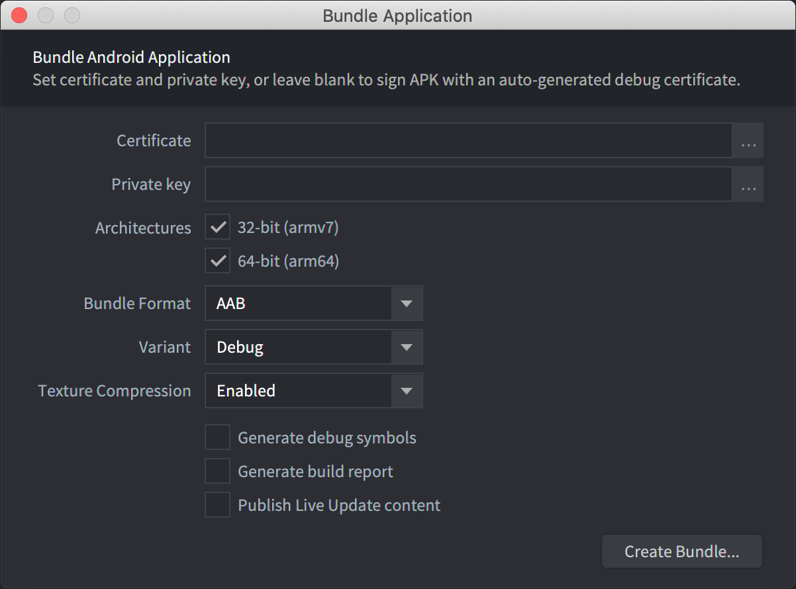
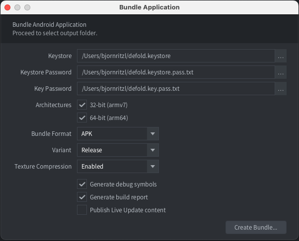
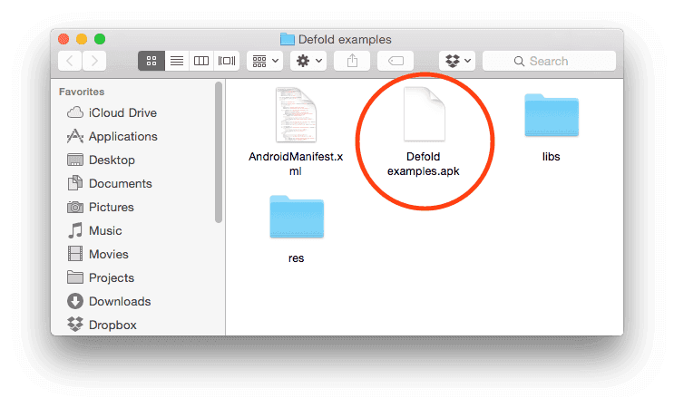
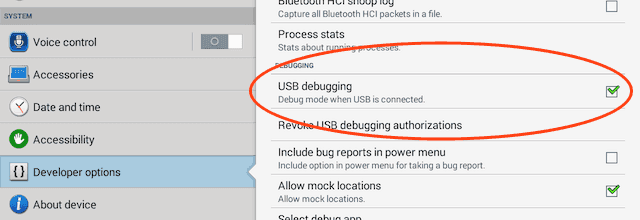

# Android development

Android devices allows you to freely run your own apps on them. It is very easy to build a version of your game and copy it onto an Android device. This manual explains the steps involved in bundling your game for Android. During development, running your game through the [development app](/manuals/dev-app) is often preferred since it allows you to hot reload content and code wirelessly directly to your device.

## Android and Google Play signing process

Android requires that apps that you want to install are digitally signed. Unlike iOS where all certificates are issued by Apple, Android allows self signed apps so you can freely create certificates and keys required to sign apps.

The process of creating certificates and keys may seem complicated but as long as you are in development, Defold fully automates the process. When you create an Android application bundle from the editor you can provide a specific certificate and key. If you don't, Defold generates a random certificate and a key and signs the resulting *.apk* (Android Application Package) file.

It is important to note that when it is time to release an app on Google Play, you will need to create a certificate and key that you use to sign the app. The reason is that when you intend to publish an updated version of the app, _the updated *.apk* file needs to be signed with the same signature as the current version_. If you sign with a different private key, Google Play will reject the *.apk* update and you will need to publish the game as a totally new app.

You can find more information from the [Google Play developer console](https://play.google.com/apps/publish/).

## Creating certificates and keys

You need the to create certificates in *.pem*-format and keys in *.pk8*-format. You can generate these with the `openssl` tool:

```sh
$ openssl genrsa -out key.pem 2048
$ openssl req -new -key key.pem -out request.pem
$ openssl x509 -req -days 9999 -in request.pem -signkey key.pem -out certificate.pem
$ openssl pkcs8 -topk8 -outform DER -in key.pem -inform PEM -out key.pk8 -nocrypt
```

This will leave you with the files *certificate.pem* and *key.pk8* that you can use to sign your application bundles.

::: important
Make sure that you store your certificate and key safely. If you lose them you will _not_ be able to upload updated *.apk* file versions to Google Play.
:::

## Creating an Android application bundle

The editor lets you easily create a stand alone application bundle for your game. Before bundling you can specify what icon(s) to use for the app, set version code etc in the "game.project" [project settings file](/manuals/project-settings/#android). To bundle select <kbd>Project ▸ Bundle... ▸ Android Application...</kbd> from the menu.

If you want the editor to automatically create random debug certificates, leave the *Certificate* and *Private key* fields empty:



If you want to sign your bundle with a particular certificate and key, specify the *.pem* and *.pk8* files:



Press <kbd>Create Bundle</kbd> and you will then be prompted to specify where on your computer the bundle will be created.



### Installing an Android application bundle

The editor writes an *.apk* file which is an Android application bundle. This file can be copied to your device with the `adb` tool (see below), or to Google Play via the [Google Play developer console](https://play.google.com/apps/publish/).

```
$ adb install Defold\ examples.apk
4826 KB/s (18774344 bytes in 3.798s)
  pkg: /data/local/tmp/my_app.apk
Success
```

## Permissions

The Defold engine requires a number of different permissions for all engine features to work. The permissions are defined in the `AndroidManifest.xml`, specified in the "game.project" [project settings file](/manuals/project-settings/#android). You can read more about Android permissions in [the official docs](https://developer.android.com/guide/topics/permissions/overview). The following permissions are requested in the default manifest:

### android.permission.INTERNET and android.permission.ACCESS_NETWORK_STATE (Protection level: normal)
Allows applications to open network sockets and access information about networks. These permission are needed for internet access. ([Android official docs](https://developer.android.com/reference/android/Manifest.permission#INTERNET)) and ([Android official docs](https://developer.android.com/reference/android/Manifest.permission#ACCESS_NETWORK_STATE)).

### android.permission.WRITE_EXTERNAL_STORAGE (Protection level: dangerous)
Allows an application to write to external storage. Starting in API level 19, this permission is not required to read/write files in your application-specific directories returned by Context.getExternalFilesDir(String) and Context.getExternalCacheDir(). This permission is needed if you intend to save/load files from disk (using io.* or sys.save/load) outside of the folder provided by [sys.get_save_file()](/ref/sys/#sys.get_save_file:application_id-file_name) and have `android:minSdkVersion` set to less than 19 in the Android manifest. ([Android official docs](https://developer.android.com/reference/android/Manifest.permission#WRITE_EXTERNAL_STORAGE)).

### android.permission.WAKE_LOCK (Protection level: normal)
Allows using PowerManager WakeLocks to keep processor from sleeping or screen from dimming. This permission is needed to temporarily prevent the device from sleeping while receiving a push notification. ([Android official docs](https://developer.android.com/reference/android/Manifest.permission#WAKE_LOCK))


## Android Debug Bridge

The `adb` command line tool is an easy to use and versatile program that is used to interact with Android devices. You can download and install `adb` as part of the Android SDK Platform-Tools, for Mac, Linux or Windows.

Download the Android SDK Platform-Tools from: https://developer.android.com/studio/releases/platform-tools. You find the *adb* tool in */platform-tools/*. Alternatively, platform specific packages can be installed through respective package managers.

On Ubuntu Linux:

```
$ sudo apt-get install android-tools-adb
```

On Fedora 18/19:

```
$ sudo yum install android-tools
```

On Mac OS X (Homebrew)

```
$ brew cask install android-platform-tools
```

You can veryfy that `adb` works by connecting your Android device to your computer via USB and issue the following command:

```
$ adb devices
List of devices attached
31002535c90ef000    device
```

If your device does not show up, verify that you have enabled *USB debugging* on the Android device. Open the device *Settings* and look for *Developer options* (or *Development*).



## Debugging an application bundle

A bundle built with the debug mode version of the engine (i.e. "Debug" selected as variant during bundling) will send all its console output to the Android system log. Access the log with the `adb` tool and give the `logcat` command. You probably want to filter the output by a tag (`-s [tagname]`):

```
$ adb logcat -s "defold"
--------- beginning of /dev/log/system
--------- beginning of /dev/log/main
I/defold  ( 6210): INFO:DLIB: SSDP started (ssdp://192.168.0.97:58089, http://0.0.0.0:38637)
I/defold  ( 6210): INFO:ENGINE: Defold Engine 1.2.50 (8d1b912)
I/defold  ( 6210): INFO:ENGINE: Loading data from:
I/defold  ( 6210): INFO:ENGINE: Initialised sound device 'default'
I/defold  ( 6210):
D/defold  ( 6210): DEBUG:SCRIPT: Hello there, log!
...
```

## Troubleshooting

I'm getting "Failure [INSTALL_PARSE_FAILED_INCONSISTENT_CERTIFICATES]" when installing
: Android detects that you try to install the app with a new certificate. When bundling debug builds, each build will be signed with a temporary certificate. Uninstall the old app before installing the new version:

  ```
  $ adb uninstall com.defold.examples
  Success
  $ adb install Defold\ examples.apk
  4826 KB/s (18774344 bytes in 3.798s)
          pkg: /data/local/tmp/Defold examples.apk
  Success
  ```
