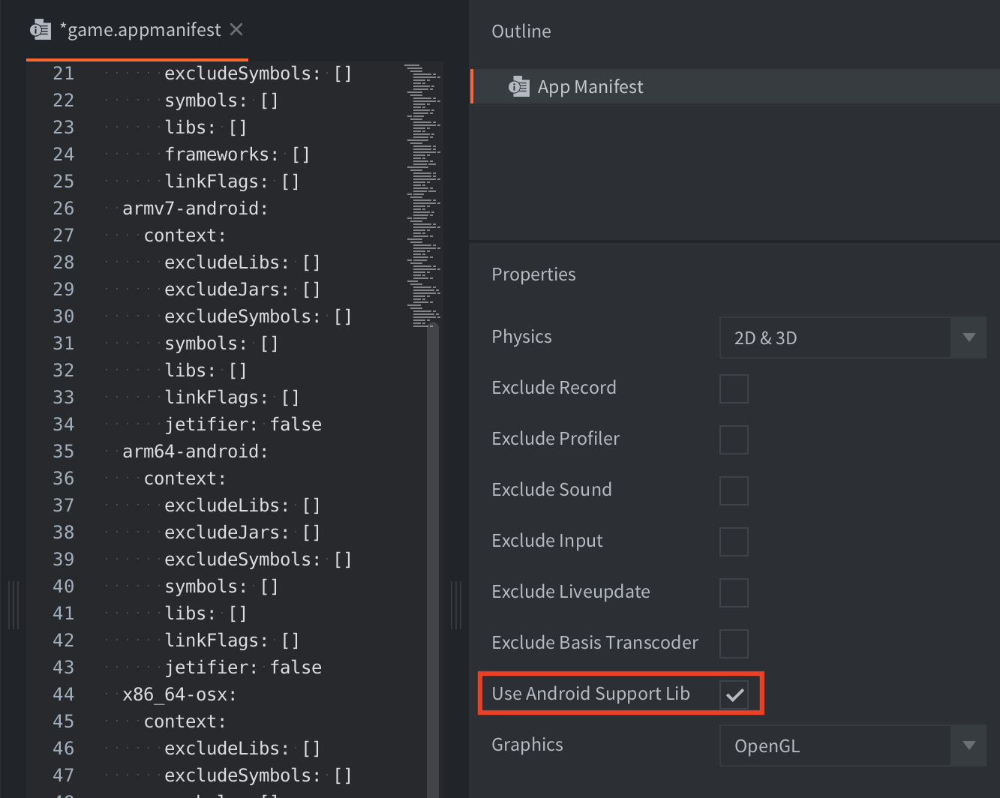

# Android development

Android devices allows you to freely run your own apps on them. It is very easy to build a version of your game and copy it onto an Android device. This manual explains the steps involved in bundling your game for Android. During development, running your game through the [development app](/manuals/dev-app) is often preferred since it allows you to hot reload content and code directly to your device.

## Android and Google Play signing process

Android requires that all APKs be digitally signed with a certificate before they are installed on a device or updated. If you use Android App Bundles, you need to sign only your app bundle before you upload it to the Play Console, and [Play App Signing](https://developer.android.com/studio/publish/app-signing#app-signing-google-play) takes care of the rest. However, you can also manually sign your app for upload to Google Play, other app stores and for distribution outside of any store.

When you create an Android application bundle from the Defold editor or the [command line tool](/manuals/bob) you can provide a keystore (containing your certificate and key) and keystore password which will be used when signing your application. If you don't, Defold generates a debug keystore and uses it when signing the application bundle.

::: important
You should **never** upload your application to Google Play if it was signed using a debug keystore. Always use a dedicated keystore which you have created yourself.
:::

## Creating a keystore

::: sidenote
The Android signing process in Defold changed in version 1.2.173 from using a stand-alone key and certificate to a keystore. [More information in this forum post](https://forum.defold.com/t/upcoming-change-to-the-android-build-pipeline/66084).
:::

You can create a keystore [using Android Studio](https://developer.android.com/studio/publish/app-signing#generate-key) or from a terminal/command prompt:

```bash
keytool -genkey -v -noprompt -dname "CN=John Smith, OU=Area 51, O=US Air Force, L=Unknown, ST=Nevada, C=US" -keystore mykeystore.keystore -storepass 5Up3r_53cR3t -alias myAlias -keyalg RSA -validity 9125
```

This will create a keystore file named `mykeystore.keystore` containing a key and certificate. Access to key and certificate will be protected by the password `5Up3r_53cR3t`. The key and certificate will be valid for 25 years (9125 days). The generated key and certificate will be identified by the alias `myAlias`.

::: important
Make sure to store the keystore and associated password somewhere safe. If you sign and upload your applications to Google Play yourself and the keystore or keystore password is lost there is no way for you to update the application on Google Play. You can avoid this by using Google Play App Signing and let Google sign your applications for you.
:::


## Creating an Android application bundle

The editor lets you easily create a stand alone application bundle for your game. Before bundling you can specify what icon(s) to use for the app, set version code etc in the *game.project* [project settings file](/manuals/project-settings/#android).

To bundle select <kbd>Project ▸ Bundle... ▸ Android Application...</kbd> from the menu.

If you want the editor to automatically create random debug certificates, leave the *Keystore* and *Keystore password* fields empty:


If you want to sign your bundle with a particular keystore, specify the *Keystore* and *Keystore password*. The *Keystore* is expected to have the `.keystore` file extension while the password is expected to be stored in a text file with the `.txt` extension. It is also possible to specify a *Key password* if the key in the keystore uses a different password than the keystore itself:


Defold supports the creation of both APK and AAB files. Select APK or AAB from the Bundle Format drop down.

Press <kbd>Create Bundle</kbd> when you have configured the application bundle settings. You will then be prompted to specify where on your computer the bundle will be created.


:[Build Variants](../shared/build-variants.md)

### Installing an Android application bundle

#### Installing an APK

An *`.apk`* file can be copied to your device with the `adb` tool, or to Google Play via the [Google Play developer console](https://play.google.com/apps/publish/).

:[Android ADB](../shared/android-adb.md)

```
$ adb install Defold\ examples.apk
4826 KB/s (18774344 bytes in 3.798s)
  pkg: /data/local/tmp/my_app.apk
Success
```

#### Installing an APK using editor

You can install and launch an *`.apk`* file using the editor's "Install on connected device" and "Launch installed app" check-boxes in the Bundle dialog:


For this feature to work, you will need ADB installed and *USB debugging* enabled on the connected device. If the editor can't detect the install location of the ADB command line tool, you will need to specify it in [Preferences](/manuals/editor-preferences/#tools).

#### Installing an AAB

An *.aab* file can be uploaded to Google Play via the [Google Play developer console](https://play.google.com/apps/publish/). It is also possible to generate an *`.apk`* file from an *.aab* file to install it locally using the [Android bundletool](https://developer.android.com/studio/command-line/bundletool).

## Permissions

The Defold engine requires a number of different permissions for all engine features to work. The permissions are defined in the `AndroidManifest.xml`, specified in the *game.project* [project settings file](/manuals/project-settings/#android). You can read more about Android permissions in [the official docs](https://developer.android.com/guide/topics/permissions/overview). The following permissions are requested in the default manifest:

### android.permission.INTERNET and android.permission.ACCESS_NETWORK_STATE (Protection level: normal)
Allows applications to open network sockets and access information about networks. These permission are needed for internet access. ([Android official docs](https://developer.android.com/reference/android/Manifest.permission#INTERNET)) and ([Android official docs](https://developer.android.com/reference/android/Manifest.permission#ACCESS_NETWORK_STATE)).

### android.permission.WAKE_LOCK (Protection level: normal)
Allows using PowerManager WakeLocks to keep processor from sleeping or screen from dimming. This permission is needed to temporarily prevent the device from sleeping while receiving a push notification. ([Android official docs](https://developer.android.com/reference/android/Manifest.permission#WAKE_LOCK))


## Using AndroidX
AndroidX is a major improvement to the original Android Support Library, which is no longer maintained. AndroidX packages fully replace the Support Library by providing feature parity and new libraries. Most of the Android extensions in the [Asset Portal](/assets) support AndroidX. If you do not wish to use AndroidX you can explicitly disable it in favour of the old Android Support Library by checking the `Use Android Support Lib` in the [application manifest](https://defold.com/manuals/app-manifest/).



## FAQ
:[Android FAQ](../shared/android-faq.md)
