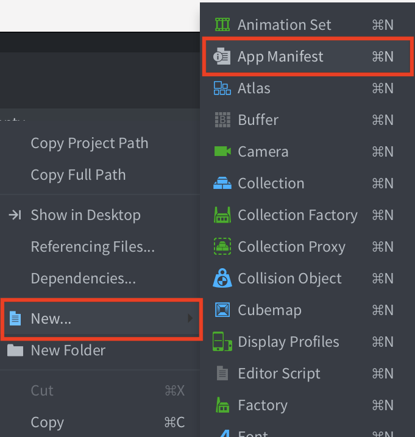
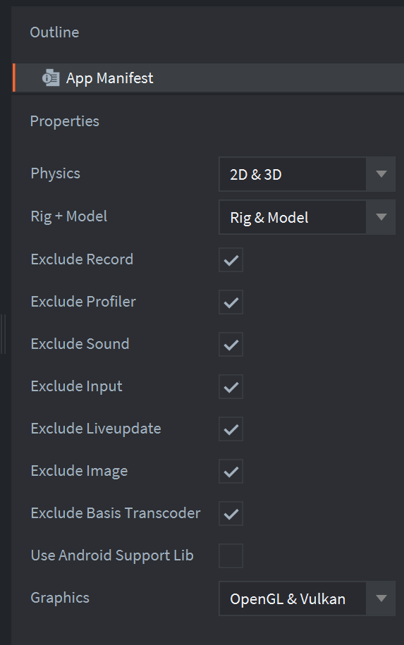

# App manifest

The application manifest is used to exclude or control which features to include in the engine. Excluding unused features of the engine is a recommended best practice since it will decrease the final binary size of your game.
Also application manifest contains some options to control compiling code for HTML5 platform like minimum browser supported version/memory settings that's also can affect on result binary size.

# Applying the manifest

In `game.project`, assign the manifest to `Native Extensions` -> `App Manifest`.

## Physics

Control which physics engine to use, or select None to exclude physics completely.

## Rig + Model

Control rig and model functionality, or select None to exclude model and rig completely. (See [`Model`](https://defold.com/manuals/model/#model-component) documentation).

## Exclude Record

Excluded the video recording capability from the engine (see the [`start_record`](https://defold.com/ref/stable/sys/#start_record) message documentation).

## Exclude Profiler

Exclude the profiler from the engine. The profiler is used for gathering performance and usage counters. Learn how to use the profiler in the [Profiling manual](/manuals/profiling/).

## Exclude Sound

Exclude all sound playing capabilities from the engine.

## Exclude Input

Exclude all input handling from the engine.

## Exclude Live Update

Exclude the [Live Update functionality](/manuals/live-update) from the engine.

## Exclude Image

Exclude `image` script module [link](https://defold.com/ref/stable/image/) from the engine.

## Exclude Types

Exclude `types` script module [link](https://defold.com/ref/stable/types/) from the engine.

## Exclude Basis Universal

Exclude the Basis Universal [texture compression library](/manuals/texture-profiles) from the engine.

## Use Android Support Lib

Use the deprecated Android Support Library instead of Android X. [More info](https://defold.com/manuals/android/#using-androidx).

## Graphics

Select which graphics backend to use.

* OpenGL - Include only OpenGL.
* Vulkan - Include only Vulkan.
* OpenGL and Vulkan - Include both OpenGL and Vulkan. Vulkan will be the default and fall back to OpenGL if Vulkan is not available.

## Minimum Safari version (js-web and wasm-web only)
YAML field name: **`minSafariVersion`**
Default value: **90000**

Minimum supported version of Safari. Cannot be less than 90000. For more information look Emscripten compiler options [link](https://emscripten.org/docs/tools_reference/settings_reference.html?highlight=environment#min-safari-version).

## Minimum Firefox version (js-web and wasm-web only)
YAML field name: **`minFirefoxVersion`**
Default value: **34**

Minimum supported version of Firefox. Cannot be less than 34. For more information look Emscripten compiler options [link](https://emscripten.org/docs/tools_reference/settings_reference.html?highlight=environment#min-firefox-version).

## Minimum Chrome version (js-web and wasm-web only)
YAML field name: **`minChromeVersion`**
Default value: **32**

Minimum supported version of Chrome. Cannot be less than 32. For more information look Emscripten compiler options [link](https://emscripten.org/docs/tools_reference/settings_reference.html?highlight=environment#min-chrome-version).

## Initial memory (js-web and wasm-web only)
YAML field name: **`initialMemory`**
Default value: **33554432**

The size of memory that allocated for web application. In case if ALLOW_MEMORY_GROWTH=0 (js-web) - there is a total amount of memory that web application can use. for more information look [link](https://emscripten.org/docs/tools_reference/settings_reference.html?highlight=environment#initial-memory). Value in bytes. Note that value must be a multiple of WebAssembly page size (64KiB).
That options relates to `html5.heap_size` in game.project [link](https://defold.com/manuals/html5/#heap-size). Option that configured via application manifest is set during compilation and used as default value for `INITIAL_MEMORY` option. Value from game.project overrides value from application manifest and used in runtime.

## Stack size (js-web and wasm-web only)
YAML field name: **`stackSize`**
Default value: **5242880**

The stack size of application. For more information look [link](https://emscripten.org/docs/tools_reference/settings_reference.html?highlight=environment#stack-size). Value in bytes.
