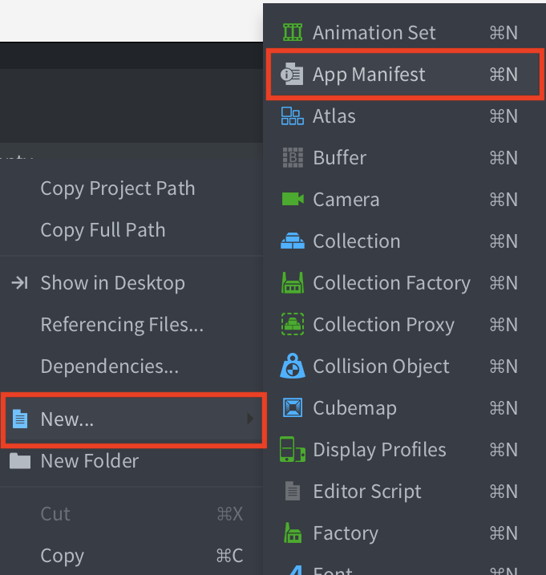
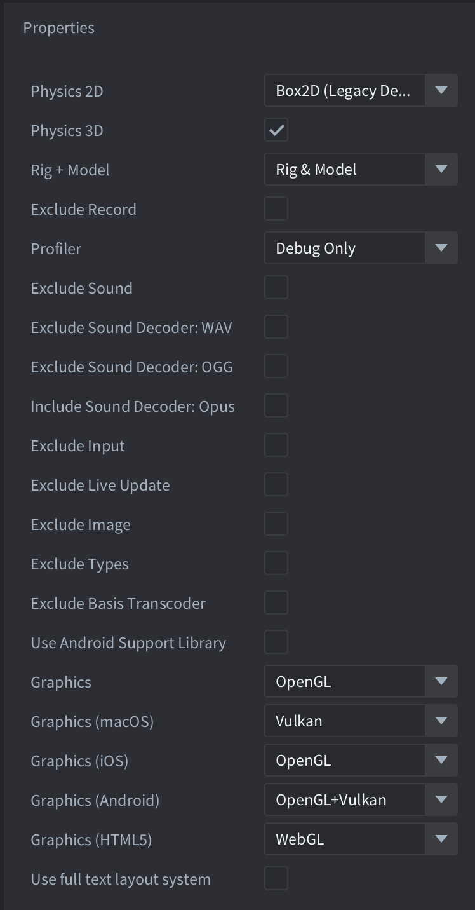

# App manifest

The application manifest controls which features and backends are linked into the engine. Excluding unused features is recommended because it decreases the final binary size of your game. The application manifest also contains build-time options such as the minimum supported HTML5 browser versions and WebAssembly memory settings.

# Applying the manifest

In `game.project`, assign the manifest to `Native Extensions` -> `App Manifest`.

## Physics 2D

Select which Box2D implementation to include:

* **Box2D Version 3** - Include Box2D 3. This is opt-in and may produce different simulation results than the legacy implementation, so existing projects may need to retune their physics settings.
* **Box2D (Legacy Defold version)** - Include the legacy Defold Box2D implementation. This is the default.
* **None** - Exclude 2D physics.

The Box2D solver settings are version-specific. See the [Box2D project settings](/manuals/project-settings/#box2d) for details.

## Physics 3D

Include the Bullet 3D physics implementation. It is included by default; disable this setting to exclude 3D physics.

## Rig + Model

Control rig and model functionality, or select None to exclude model and rig completely. (See [`Model`](https://defold.com/manuals/model/#model-component) documentation).

## Exclude Record

Excluded the video recording capability from the engine (see the [`start_record`](https://defold.com/ref/stable/sys/#start_record) message documentation).

## Profiler

Control when profiler functionality is linked into the engine:

* **Debug Only** - Include the profiler in debug builds only. This is the default.
* **None** - Exclude profiler functionality from all build variants.
* **Always** - Include the profiler in both debug and release builds.

The app-manifest setting controls whether the profiler code is linked into a build. The settings under `profiler` in *game.project* control profiler behavior at runtime. Learn how to use the available facilities in the [Profiling manual](/manuals/profiling/).

## Sound

The sound controls determine which sound system and decoders are linked into the engine.

### Exclude Sound

Exclude all sound playing capabilities from the engine.

### Exclude Sound Decoder: WAV

Exclude support for WAV sound resources.

### Exclude Sound Decoder: OGG

Exclude support for Ogg Vorbis sound resources.

### Include Sound Decoder: Opus

Include support for Ogg Opus sound resources. The Opus decoder is excluded by default, so this option must be enabled before `.opus` resources can be played. See the [Sound manual](/manuals/sound/) for supported formats.

## Exclude Input

Exclude all input handling from the engine.

## Exclude Live Update

Exclude the [Live Update functionality](/manuals/live-update) from the engine.

## Exclude Image

Exclude `image` script module [link](https://defold.com/ref/stable/image/) from the engine.

## Exclude Types

Exclude `types` script module [link](https://defold.com/ref/stable/types/) from the engine.

## Exclude Basis Transcoder

Exclude the Basis Universal [texture compression library](/manuals/texture-profiles) from the engine.

## Use Android Support Lib

Use the deprecated Android Support Library instead of Android X. [More info](https://defold.com/manuals/android/#using-androidx).

## Graphics

Select which graphics backends to include for each platform. A combined choice includes both backends so the preferred backend can fall back when it is unavailable.

| Field | Platforms | Choices | Default |
|---|---|---|---|
| **Graphics** | Windows and Linux | OpenGL, Vulkan, OpenGL & Vulkan | OpenGL |
| **Graphics (macOS)** | macOS | OpenGL, Metal, Vulkan, OpenGL & Metal, OpenGL & Vulkan | Vulkan |
| **Graphics (iOS)** | iOS | OpenGL, Metal, Vulkan, OpenGL & Metal, OpenGL & Vulkan | OpenGL |
| **Graphics (Android)** | Android | OpenGL+Vulkan, OpenGL, Vulkan | OpenGL+Vulkan |
| **Graphics (HTML5)** | HTML5 | WebGL, WebGPU, WebGL & WebGPU | WebGL |

On Linux ARM64, the **OpenGL** choice uses the OpenGL ES backend. The Android combined default prefers Vulkan when available and falls back to OpenGL ES.

## Use full text layout system

If enabled (`true`), it will allow to use runtime generation for SDF type fonts, when using True Type Fonts (`.ttf`) in the project. Read more details in the [Font Manual](https://defold.com/manuals/font/#enabling-runtime-fonts).

## Minimum browser versions

The YAML fields **`minSafariVersion`**, **`minFirefoxVersion`**, and **`minChromeVersion`** specify the minimum browser versions targeted by Emscripten. The current defaults and minimum supported versions differ between the non-threaded and threaded targets:

| Target | Safari | Firefox | Chrome |
|---|---:|---:|---:|
| `wasm-web` | `101000` | `40` | `45` |
| `wasm_pthread-web` | `150000` | `79` | `75` |

Specify overrides in the context for the relevant target. The threaded target also has additional [hosting requirements](/manuals/html5/#creating-html5-bundle). See the Emscripten settings reference for [`MIN_SAFARI_VERSION`](https://emscripten.org/docs/tools_reference/settings_reference.html#min-safari-version), [`MIN_FIREFOX_VERSION`](https://emscripten.org/docs/tools_reference/settings_reference.html#min-firefox-version), and [`MIN_CHROME_VERSION`](https://emscripten.org/docs/tools_reference/settings_reference.html#min-chrome-version).

## Initial memory (HTML5)
YAML field name: **`initialMemory`**
Default value: **33554432**

The initial amount of memory allocated for the web application, in bytes. The value must be a multiple of the WebAssembly page size (64 KiB). See Emscripten's [`INITIAL_MEMORY`](https://emscripten.org/docs/tools_reference/settings_reference.html#initial-memory) setting.

This option supplies the compile-time default. The [`html5.heap_size`](/manuals/html5/#heap-size) value in *game.project* overrides it at runtime.

## Stack size (HTML5)
YAML field name: **`stackSize`**
Default value: **5242880**

The application stack size, in bytes. See Emscripten's [`STACK_SIZE`](https://emscripten.org/docs/tools_reference/settings_reference.html#stack-size) setting.
