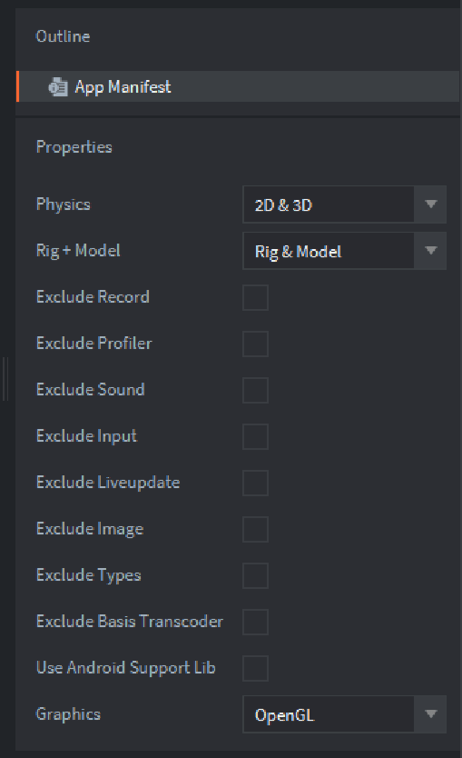

# App manifest

The application manifest is used to exclude or control which features to include in the engine. Excluding unused features of the engine is a recommended best practice since it will decrease the final binary size of your game.

## Physics

Control which physics engine to use, or select None to exclude physics completely.

## Rig + Model

Control rig and model functionality, or select None to exclude model and rig completely. (See [`Model`](https://defold.com/manuals/model/#model-component) documentation).

## Exclude Record

Excluded the video recording capability from the engine (see the [`start_record`](https://defold.com/ref/stable/sys/#start_record) message documentation).

## Exclude Profiler

Exclude the profiler from the engine. The profiler is used for gathering performance and usage counters. Learn how to use the profiler in the [Profiling manual](/manuals/profiling/).

## Exclude Sound

Exclude all sound playing capabilities from the engine.

## Exclude Input

Exclude all input handling from the engine.

## Exclude Live Update

Exclude the [Live Update functionality](/manuals/live-update) from the engine.

## Exclude Image

Exclude `image` script module [link](https://defold.com/ref/stable/image/) from the engine.

## Exclude Basis Universal

Exclude the Basis Universal [texture compression library](/manuals/texture-profiles) from the engine.

## Use Android Support Lib

Use the deprecated Android Support Library instead of Android X. [More info](https://defold.com/manuals/android/#using-androidx).

## Graphics

Select which graphics backend to use.

* OpenGL - Include only OpenGL.
* Vulkan - Include only Vulkan.
* OpenGL and Vulkan - Include both OpenGL and Vulkan. Vulkan will be the default and fall back to OpenGL if Vulkan is not available.
