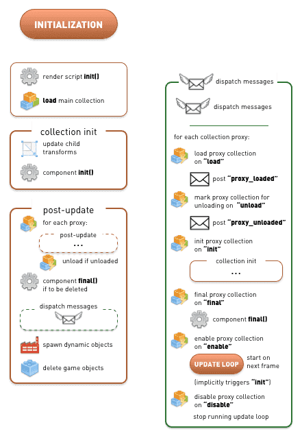
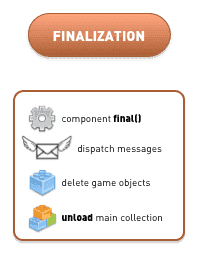

# Application lifecycle

The lifecycle of a Defold application or game is on the large scale simple. The engine moves through three stages of execution: initialization, the update loop (where apps and games spend most of their time) and finalization.


In many cases only a rudimentary understanding of Defold's inner workings is necessary. However, you might run into edge cases where the exact order Defold carries out its tasks becomes vital. This document describes how the engine runs an application from start to finish.

The application starts by initializing everything that is needed to run the engine. It loads the main collection and calls [`init()`](/ref/go#init) on all loaded components that have an `init()` Lua function (script components and GUI components with GUI scripts). This allows you to do custom initialization.

The application then enters the update loop where the application will spend the majority of its lifetime. Each frame, game objects and the components they contain are updated. Any script and GUI script [`update()`](/ref/go#update) functions are called. During the update loop messages are dispatched to their recipients, sounds are played and all graphics are rendered.

At some point the application's lifecycle will come to an end. Before the application quits the engine steps out of the update loop and enters a finalization stage. It prepares all loaded game objects for deletion. All object components’ [`final()`](/ref/go#final) functions are called, which allows for custom cleanup. Then the objects are deleted and the main collection is unloaded.

## Initialization

This diagram contains a more detailed breakdown of the initialization steps. The steps involved in the "dispatch messages" pass (right before "spawn dynamic objects") have been put in a separate block to the right for clarity.



The engine actually takes many more steps during initialization, before the main collection is loaded. The memory profiler, sockets, graphics, HID (input devices), sound, physics and much more are set up. The application configuration ("game.project") is also loaded and set up.

The first user-controllable entry point, at the end of engine initialization, is the call to the current render script’s `init()` function.

The main collection is then loaded and initialized. All game objects in the collection apply their transforms (translation (change of position), rotation and scaling) to their children. All component `init()` functions that exist are then called.

::: sidenote
The order in which game object component `init()` functions are called is unspecified. You should not assume that the engine initializes objects belonging to the same collection in a certain order.
:::

Since your `init()` code can post new messages, tell factories to spawn new objects, mark objects for deletion and do all sorts of things, the engine performs a full "post-update" pass next. This pass carries out message delivery, the actual factory game object spawning and object deletion. Note that the post-update pass includes a "dispatch messages" sequence that not only sends any queued messages but also handles messages sent to collection proxies. Any subsequent updates on the proxies (enable and disable, loading and mark for unloading) are performed during those steps.

Studying the diagram above reveals that it is fully possible to load a [collection proxy](/manuals/collection-proxy) during `init()`, ensure all its contained objects are initialized, and then unload the collection through the proxy---all this before the first component `update()` is called, i.e. before the engine has left the initialization stage and entered the update loop:

```lua
function init(self)
    print("init()")
    msg.post("#collectionproxy", "load")
end

function update(self, dt)
    -- The proxy collection is unloaded before this code is reached.
    print("update()")
end

function on_message(self, message_id, message, sender)
    if message_id == hash("proxy_loaded") then
        print("proxy_loaded. Init, enable and then unload.")
        msg.post("#collectionproxy", "init")
        msg.post("#collectionproxy", "enable")
        msg.post("#collectionproxy", "unload")
        -- The proxy collection objects’ init() and final() functions
        -- are called before we reach this object’s update()
    end
end
```

## The update loop

The update loop runs through a long sequence once every frame. The update sequence in the diagram below is divided into logical sequence blocks for clarity. "Dispatch messages" is also broken out separately for the same reason:


## Input

Input is is read from available devices, mapped against [input bindings](/manuals/input) and then dispatched. Any game object that has acquired input focus gets input sent to all its components' `on_input()` functions. A game object with a script component and a GUI component with a GUI script will get input to both components’ `on_input()` functions---given that they are defined and that they have acquired input focus.

Any game object that has acquired input focus and contains collection proxy components dispatches input to components inside the proxy collection. This process continues recursively down enabled collection proxies within enabled collection proxies.

## Update

Each game object component in the main collection is traversed. If any of these components has a script `update()` function, then that will be called. If the component is a collection proxy, each component in the proxy collection is recursively updated with all the steps in the "update" sequence in the diagram above.

::: sidenote
The order in which game object component `update()` functions are called is unspecified. You should not assume that the engine updates objects belonging to the same collection in a certain order.
:::

In the next step all posted messages are dispatched. Since any receiver components’ `on_message()` code can post additional messages the message dispatcher will continue to dispatch posted messaged until the message queue is empty. There is, however, a limit to how many runs through the message queue the message dispatcher performs. See [Message passing](/manuals/message-passing) and the section "Advanced topics" for details.

For collision object components, physics messages (collisions, triggers, ray_cast responses etc) are dispatched throughout the encompassing game object to all components that contain a script with an `on_message()` function.

Transforms are then done, applying any game object movement, rotation and scaling to each game object component and any child game object components.

## Render update

The render update block dispatches messages to the `@render` socket (camera component `set_view_projection` messages, `set_clear_color` messages etc). The render script `update()` is then called.

## Post update

After the updates, a post update sequence is run. It unloads from memory collection proxies that are marked for unloading (this happens during the "dispatch messages" sequence). Any game object that is marked for deletion will call all of its components’ `final()` functions, if there are any. The code in `final()` functions often posts new messages to the queue so a "dispatch messages" pass is run afterwards.

Any factory component that has been told to spawn a game object will do that next. Finally, game objects that are marked for deletion are actually deleted.

The last step in the update loop involves dispatching `@system` messages (`exit`, `reboot` messages, toggling the profiler, starting and stopping video capture etc). Then graphics are rendered. During the graphics rendering, video capture is done, as is any rendering of the visual profiler (see the [Debugging documentation](/manuals/debugging).)

## Frame rate and collection time step

The number of frame updates per second (which equals the number of update-loop runs per second) can be set in the project settings, or programmatically by sending a `set_update_frequency` message to the `@system` socket. In addition, it is possible to set the _time step_ for collection proxies individually by sending a `set_time_step` message to the proxy. Changing a collection's time step does not affect the frame rate. It does affect the physics update time step as well as the `dt` variable passed to `update().` Also note that altering the time step does not alter the number of times `update()` will be called each frame---it is always exactly once.

(See the [Collection proxy manual](/manuals/collection-proxy) and [`set_time_step`](/ref/collectionproxy#set-time-step) for details)

## Finalization

When the application exits, first it finishes the last update loop sequence, which will unload any collection proxies: finalizing and deleting all game objects in each proxy collection.

When that is done the engine enters a finalization sequence that handles the main collection and its objects:



Component `final()` functions are called first. A subsequent dispatching of messages follows. Finally, all game objects are deleted and the main collection is unloaded.

The engine follows up with behind the scenes shutting down of subsystems: project configuration is deleted, the memory profiler is shut down, and so forth.

The application is now completely shut down.
