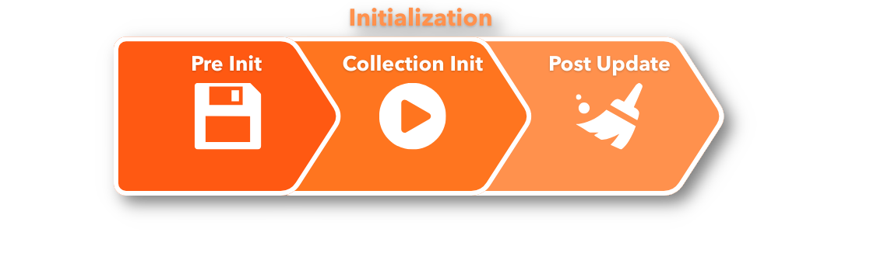
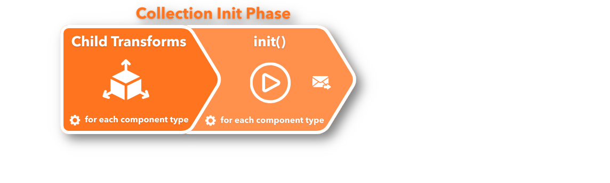
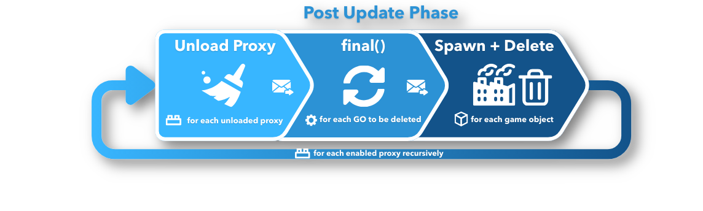
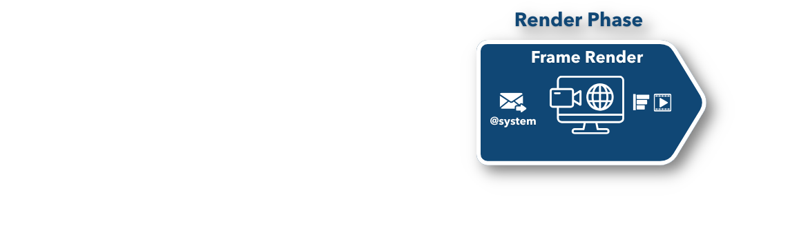
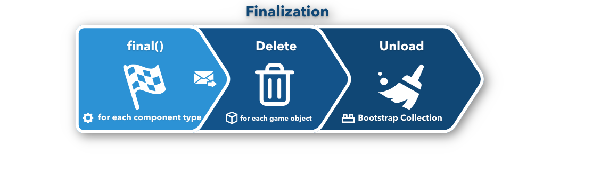
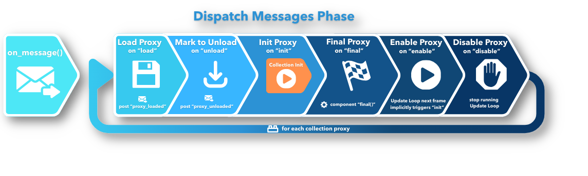

# Application lifecycle

The lifecycle of a Defold application or game is, on the large scale, simple. The engine moves through three stages of execution: initialization, the update loop (where apps and games spend most of their time), and finalization.

::: sidenote
The manual is regarding Defold versions from 1.12.0. In version 1.12.0 changes regarding lifecycle and new `late_update()` function were introduced.
:::


In many cases only a rudimentary understanding of Defold’s inner workings is necessary. However, you might run into edge cases where the exact order Defold carries out its tasks becomes vital. This document describes how the engine runs an application from start to finish.

The application starts by initializing everything needed to run the engine. It loads the main collection and calls [`init()`](/ref/go#init) on all loaded components that have an `init()` Lua function (script components and GUI components with GUI scripts). This allows you to do custom initialization.

The application then enters the update loop where the application will spend the majority of its lifetime. Each frame, game objects and the components they contain are updated. Any script and GUI script [`update()`](/ref/go#update) functions are called. During the update loop messages are dispatched to their recipients, sounds are played and all graphics are rendered.

At some point, the application’s lifecycle will come to an end. Before the application quits the engine steps out of the update loop and enters a finalization stage. It prepares all loaded game objects for deletion. All object components’ [`final()`](/ref/go#final) functions are called, which allows for custom cleanup. Then the objects are deleted and the main collection is unloaded.

The steps involved in the ["dispatch messages"](#dispatching-messages) pass are shown in a separate diagram at the end of this manual for clarity and are marked in diagrams with a small "envelope with an arrow" icon 📩.

## Initialization

This is where your game starts and is the first step of the running game. It can be separated into 3 phases:



### Pre Init

During `Pre Init` phase, the engine takes many steps, before the main (bootstrap) collection is loaded. The memory profiler, sockets, graphics, HID (input devices), sound, physics and much more are set up. The application configuration (*game.project*) is also loaded and set up.


The first user-controllable entry point, at the end of engine initialization, is the call to the current render script’s `init()` function.

The main collection is then loaded and initialized.

### Collection Init

During the `Collection Init` phase, all game objects in the collection apply their transforms: translation (change of position), rotation and scaling, to their children. All components’ `init()` functions that exist are then called.



::: sidenote
The order in which game object component `init()` functions are called is unspecified. You should not assume that the engine initializes objects belonging to the same collection in a certain order.
:::

### Post Update in Initialization

The engine then performs a full `Post Update` pass - the same pass that is performed after each `Update Loop` step later on. It is performed at the end of intialization, because your `init()` code can post new messages, instruct factories to spawn new objects, mark objects for deletion, and perform other actions.


This pass carries out message delivery, actual factory game object spawning, and object deletion. Note that the `Post Update` pass includes a "dispatch messages" sequence that not only delivers queued messages, but also processes messages sent to collection proxies. Any subsequent proxy updates (enable, disable, init, final, loading, and mark for unloading) are performed during those steps.

It is entirely possible to load a [collection proxy](/manuals/collection-proxy) during `init()`, ensure all its contained objects are initialized, and then unload the collection through the proxy - all this before the first component `update()` is called, i.e. before the engine has left the initialization stage and entered the update loop:

```lua
function init(self)
    print("init()")
    msg.post("#collectionproxy", "load")
end

function update(self, dt)
    -- The proxy collection is unloaded before this code is reached.
    print("update()")
end

function on_message(self, message_id, message, sender)
    if message_id == hash("proxy_loaded") then
        print("proxy_loaded. Init, enable and then unload.")
        msg.post("#collectionproxy", "init")
        msg.post("#collectionproxy", "enable")
        msg.post("#collectionproxy", "unload")
        -- The proxy collection objects’ init() and final() functions
        -- are called before we reach this object’s update()
    end
end
```

## Update Loop

The Update Loop runs through a specific sequence once per frame. This sequence can be defined by 5 main phases:


1. Input (processing and handling)
2. Update (including Fixed, Regular, Late and engine components’ updates)
3. Render Update
4. Post Update (unloading collection proxies, spawning and deleting game objects)
5. Frame Render (final graphics are rendered)

### Input Phase

Input is read from available devices, mapped against [input bindings](/manuals/input) and then dispatched. Any game object that has acquired input focus gets input sent to all its components’ `on_input()` functions. A game object with a script component and a GUI component with a GUI script will get input to both components’ `on_input()` functions - given that they are defined and that they have acquired input focus.


Any game object that has acquired input focus and contains collection proxy components dispatches input to components inside the proxy collection. This process continues recursively down enabled collection proxies within enabled collection proxies.

### Update Phase

The `Update` phase is a part of the Update Loop. It is started once for the root collection, and then runs recursively for each enabled collection proxy.

Within a collection, Defold processes callbacks by component type: it iterates over all instances of a component type that implements the relevant stage, calls the Lua callback for each instance, flushes messages, then moves on to the next component type.

The high-level order of *script* component Lua callback stages is:

1. `fixed_update()` - called 0..N times per frame (if using fixed timestep)
2. `update()` - called 1 time per frame
3. `late_update()` - called 1 time per frame


Each game object component in the main collection is traversed. If any of these components has a script with a `fixed_update()`/`update()`/`late_update()` function, then that will be called. If the component is a collection proxy, each component in the proxy collection is recursively updated with all the steps in the `Update` phase.

::: sidenote
The order in which game object component `update()` functions are called is unspecified. You should not assume that the engine updates objects belonging to the same collection in a certain order. The same is true for `fixed_update()` and `late_update()` (since 1.12.0).
:::

#### Physics

For collision object components, physics messages (collisions, triggers, ray cast responses etc.) are dispatched throughout the encompassing game object to all components that contain a script with the `on_message()` function.

If a [fixed timestep](/manuals/physics/#physics-updates) is used for physics simulation, there may also be a call to the `fixed_update()` function in all script components. This function is useful in physics based games when you wish to manipulate physics objects at regular intervals to achieve a stable physics simulation.

#### Transforms

Before **each** component-type update, multiple times during the `Update Loop`, if needed, the transforms are updated, applying any game object movement, rotation and scaling to each game object component and any child game object components.

There is one additional final transforms update at the end of the `Update Loop`, if needed.

#### Engine Update Phase (no fixed updates)

The tables below describe the *engine-level* update passes. They deliberately omit the exact internal component priority order (which is an engine implementation detail), but they reflect the ordering guarantees relevant to scripting:

- `fixed_update()` runs before `update()`
- `late_update()` runs after `update()`
- posted messages are flushed between component-type updates, and also between the script callback stages

When `Use Fixed Timestep` is `false` and/or Fixed Update Frequency is `0`, at the beginning of the phase it prepares `dt` and then the flow is as presented in the table below:

:::sidenote
Note that after **each** component type’s update, all messages are dispatched - this is not marked in the table below to keep it clean.
:::’

| Step | Engine Phase | Lua Callback | Comment |
|-|-|-|-|
| 1 | **Update** | `update()` | Called once per frame for each component type that implements Update (usually scripts) in the internal priority order (usually scripts). Additionally GO property animations started with `go.animate()` are updated here as a separate component type. |
| 2 | **Update** (engine components) | | Called once per frame for each other component type that implements Update in the internal priority order. **Physics** components are updated here. For each enabled Collection Proxy the whole `Update` phase is called recursively from step 1. |
| 3 | **Late Update** | `late_update()` | Called once per frame for each component type that implements Late Update  in the internal priority order. |
| 4 | **Transforms** | | One additional final transforms update is performed at the end for each component if needed. |

#### Engine Update Phase with Fixed Timestep

When `Use Fixed Timestep` is `true` and Fixed Update Frequency is non-zero, at the beginning of the phase it prepares `dt` (delta time),  `fixed_dt` and `num_fixed_steps` (`0..N`) - so how many times fixed update will be called, determined by the time since last update to ensure there is a fixed amount of updates.

:::sidenote
Note that after **each** component type’s update, all messages are dispatched - this is not marked in the table below to keep it clean.
:::’

Then it loops:

| Step | Engine Phase | Lua Callback | Comment |
|-|-|-|-|
| 1 | **Fixed Update** | | Called `0..N` times per frame depending on timing for each component type that implements Fixed Update in the internal priority order. It includes *Physics* components Fixed Update steps. |
| 2 | **Update** | | Called once per frame for each component type that implements Update in the internal priority order. Additionally GO property animations started with `go.animate()` are updated here as a separate component type. For each enabled Collection Proxy the `Update` phase is called recursively from step 1. |
| 3 | **Late Update** | `late_update()` | Called once per frame for each component type that implements late update in the internal priority order. |
| 4 | **Transforms** | | One additional final transforms update is performed at the end for each component if needed. |

If you ever need more details on how Defold works internally during the Update phase, it is worth reading the [`gameobject.cpp`](https://github.com/defold/defold/blob/dev/engine/gameobject/src/gameobject/gameobject.cpp) code itself.

### Render Update Phase

The render update block dispatches first all messages sent to the `@render` socket (e.g. camera component `set_view_projection` messages, `set_clear_color` messages etc). The render script `update()` is then called.


### Post update Phase

After the updates, a post update sequence is run. It unloads from memory collection proxies that are marked for unloading (this happens during the "dispatch messages" sequence). Any game object that is marked for deletion will call all of its component’s `final()` functions, if there are any. The code in the `final()` functions often posts new messages to the queue, so the "dispatch messages" pass is run afterwards.



Any factory component that has been told to spawn a game object will do that next. Finally, game objects that are marked for deletion are actually deleted.

### Render Phase

The last step in the update loop involves dispatching `@system` messages (`exit`, `reboot` messages, toggling the profiler, starting and stopping video capture, etc.).



Then graphics are rendered, as is any rendering of the visual profiler (see the [Debugging documentation](/manuals/debugging)). After the graphics rendering, a video capture is done.

#### Frame rate and collection time step

The number of frame updates per second (which equals the number of update-loop runs per second) can be set in the project settings, or programmatically by sending a `set_update_frequency` message to the `@system` socket. In addition, it is possible to set the _time step_ for collection proxies individually by sending a `set_time_step` message to the proxy. Changing a collection’s time step does not affect the frame rate. It does affect the physics update time step as well as the `dt` variable passed to `update().` Also note that altering the time step does not alter the number of times `update()` will be called each frame --- it is always exactly once.

(See the [Collection proxy manual](/manuals/collection-proxy) and [`set_time_step`](/ref/collectionproxy#set-time-step) for details)

#### Engine throttling

Defold 1.12.0 introduced an engine throttling API that can skip engine updates and rendering entirely, while still detecting input. Any input wakes up the engine again, and the engine can re-enter throttling after a cooldown.

See `sys.set_engine_throttle()` API for details and usage examples.

## Finalization

When the application exits, first it finishes the last update loop sequence, which will unload any collection proxies: finalizing and deleting all game objects in each proxy collection.

When that is done the engine enters a finalization sequence that handles the main collection and its objects:



Component `final()` functions are called first. A subsequent dispatching of messages follows. Finally, all game objects are deleted and the main collection is unloaded.

The engine then proceeds with behind-the-scenes shutting down of subsystems: project configuration is deleted, the memory profiler is shut down, and so forth.

The application is now completely shut down.

## Dispatching Messages

**Dispatching Messages** is a special pass that is performed after **each** component type’s update, so e.g. sprites update, scripts update, and any other action that may send messages. During its execution all posted messages that are gathered in a queue are dispatched. Those are marked in the diagrams with small "envelope with an arrow" icons 📩.



After all **user messages** are dispatched by calling `on_message()` for each component, Defold special messages are handled in the following order (as presented in the diagram too), for each collection proxy:

1. `load` messages - to load collection proxies marked for loading, posts back `proxy_loaded` message.
2. `unload` messages - to unload collection proxies marked for unloading, posts back `proxy_unloaded` message.
3. `init` messages - triggers the `Collection Init` phase for all collection proxies to be initialized.
4. `final` messages - triggers `final()` on all components of the proxy marked to be finalized.
5. `enable` messages - enables the collection proxy, so the `Update Loop` will be performed for it in the next frame; this implicitly triggers `init()` for each component of the collection.
6. `disable` messages - disables the collection proxy, so the `Update Loop` will **not** be performed for it in the next frame; it stops running `Update Loop` for it completely.

Since any receiver components’ `on_message()` code can post additional messages, the message dispatcher will continue to dispatch posted messaged recursively until the message queue is empty. There is, however, a limit to how many runs through the message queue the message dispatcher performs. See [Message Chains](/manuals/message-passing) for details.
