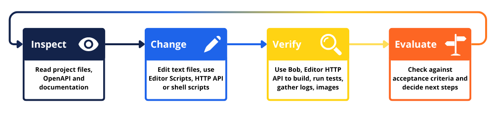

# Automation and working with AI agents

Defold supports automation at several levels:

* [editor scripts](/manuals/editor-scripts) allow you to customize editor workflows, add specific tools, and speed up the creation of levels, assets, etc.
* [editor UI scripts](/manuals/editor-scripts-ui/) allow you to create custom visual tools, popups, configurators, etc.
* [editor HTTP API](https://github.com/defold/defold/blob/dev/editor/doc/http-api.md) allows you to control an open project via OpenAPI operations.
* [Bob CLI](/manuals/bob) can build a project and create data archives or standalone bundles from the command line.
* shell scripts can generate, validate, and manage files.

Therefore, Defold can offer:

* team- or project-specific processes and tool integrations;
* repeatable, custom commands used during project development;
* content generation and validation;
* local testing tools;
* continuous integration (CI);
* IDE integrations;
* support for AI coding agents;
* visual and multimodal analysis.

Defold is well suited to these tasks because it combines text-based project files that are easy to edit and manage with version control—Lua scripts and Protobuf-based resource files—with version-matched API documentation, a machine-readable editor interface, structured compilation results, observable runtime output, scene previews, an extensible editor, and a command-line build tool. LLM coding agents can be an optional layer on top of this toolset. Test collections, browser automation, image comparison tools, or multimodal models can be used to verify the results.

::: important
The editor HTTP API is experimental and may change between Defold versions. Always read the OpenAPI document generated by the currently running editor.
:::

## Choosing an automation interface

Choosing an interface appropriate to the task is one of the most important aspects of effective automation. The table below can help you choose the simplest interface for a given action:

| Interface                   | Suitable for                                                              |
| --------------------------- | ------------------------------------------------------------------------- |
| Shell script or task runner | Generation, formatting, validation, and repeatable local tasks            |
| Bob                         | Editor-independent builds, bundles, reports, and CI                       |
| Editor script               | Custom commands, resource tools, user interfaces, and editor integrations |
| Lifecycle hook              | Validation or generation before and after editor builds or bundling       |
| Editor HTTP API             | External tools, IDE integrations, test controllers, and AI agents         |
| In-game test collection     | Game logic, messages, components, input, physics, and engine behavior     |
| Browser automation          | HTML5 interaction tests, screenshots, and web integrations                |
| AI coding agent             | Tasks where the required files and operations are not known in advance    |
| Multimodal model            | Semantic analysis of scenes, GUI layouts, and runtime screenshots         |

Prefer a deterministic solution when the sequence of operations is already known. For example, a level validator should normally have stable inputs, outputs, and exit codes.

An agent might be useful when a task requires investigation, finding the relevant resources, selecting an implementation, modifying several files, interpreting errors, and iterating towards clearly defined acceptance criteria.

## The automation loop

A reliable automation process should form a closed loop:

1. Inspect - read project files, OpenAPI, and documentation
2. Change - use editor scripts, the HTTP API, or shell scripts to modify files
3. Verify - use Bob and the Editor HTTP API to build, run tests, and gather logs and images
4. Evaluate - check acceptance criteria and decide next steps: finish or retry



Verification should provide evidence from the actual environment. Suitable evidence includes:

* a successful compilation result;
* a completed test suite;
* expected output from the running game;
* a generated bundle;
* a deterministic image comparison;
* a screenshot that satisfies defined visual criteria.

Define the expected result before making changes. Also define a timeout or a maximum number of repair attempts. An unattended process should not continue indefinitely when it cannot satisfy the acceptance criteria.

## Starting the Defold editor from an automation tool

To start Defold locally, an automation tool must know the path to the editor executable and the absolute path to the project's `game.project` file.

Tools can locate installed Defold versions through the `installations.json` metadata, as described in the [Editor manual](/manuals/editor/#editor-installation-metadata).

The `launcherPath` field contains the executable that should be started. Pass the `game.project` path as the first positional argument to open that project directly.

The optional `--port` or `-p` argument selects the editor HTTP server port. Omitting it lets Defold choose an available port and is usually preferable when several projects may be open.

For example:

```sh
# Linux
/path/to/Defold/Defold --port 8181 /absolute/path/to/project/game.project
```

```sh
# macOS
/path/to/Defold.app/Contents/MacOS/Defold --port 8181 /absolute/path/to/project/game.project
```

```powershell
# Windows
C:\path\to\Defold\Defold.exe --port 8181 C:\absolute\path\to\project\game.project
```

The editor is a graphical desktop application, so it must be started in an interactive user session with access to the display.
Use Bob instead when a graphical editor session is unavailable, such as in headless CI.

After launching the editor, wait until the project has finished opening and `.internal/editor.port` has been created, then poll `http://localhost:$(cat .internal/editor.port)/openapi.json` until it returns the OpenAPI document. This document provides everything the tool needs to discover and use the editor API.

## Automating a running editor via HTTP server

When a project is open, the editor starts a local HTTP server. Select <kbd>Help ▸ Open Editor Server</kbd> to open its local home page in the default web browser on localhost at the selected port:


The selected port is also written to:

```text
.internal/editor.port
```

The following variables are used in the examples below:

```sh
PORT="$(cat .internal/editor.port)"
BASE_URL="http://127.0.0.1:$PORT"
```

::: important
The editor server is a local control interface for the development environment. Do not expose it through a public address or an untrusted tunnel.
:::

## Discovering the API through OpenAPI

The only Defold-specific bootstrap information an external tool should need to work with an open Defold editor is an `openapi.json` file hosted by the editor's local HTTP server:

```sh
curl -sS "http://localhost:$(cat .internal/editor.port)/openapi.json"
```

The returned OpenAPI 3.0.3 document describes the operations supported by the current editor version, including paths, methods, parameters, command names, request formats, responses, status codes, and authentication requirements.

List the documented paths:

```sh
curl -sS "$BASE_URL/openapi.json" |
  jq -r '.paths | keys[]'
```

List the available editor commands:

```sh
curl -sS "$BASE_URL/openapi.json" |
  jq -r '
    .paths["/command/{command}"].post.parameters[]
    | select(.name == "command")
    | .schema.enum[]
  '
```

A version-aware integration should read it to verify that the required operations are available and configure its tools from the returned schemas.

Project-specific endpoints can also appear in the same document when the editor scripts that define them include an OpenAPI operation description.

### Built-in operations

In Defold 1.13.1, the most useful endpoints are:

| Endpoint                    | Purpose                                                  |
| --------------------------- | -------------------------------------------------------- |
| `GET /openapi.json`         | Discover the current editor API                          |
| `POST /command/{command}`   | Execute an editor command                                |
| `GET /ref`                  | Search the runtime and editor API documentation (1.13.1+)|
| `GET /console`              | Read the current console contents                        |
| `GET /console/stream`       | Continuously follow console output                       |
| `GET /preview/{path}`       | Render a supported scene resource to PNG (1.13.1+)       |
| `POST /eval`                | Execute authenticated Lua code in the editor environment (1.13.0+) |
| `GET`, `POST /prefs/{path}` | Read and write editor preferences                        |

## Automated compiling and running

Editor commands are invoked through:

```text
POST /command/{command}
```

Compile without running the game:

```sh
curl -sS \
  -X POST \
  "$BASE_URL/command/compile" |
  jq
```

Compile and run:

```sh
curl -sS \
  -X POST \
  "$BASE_URL/command/run" |
  jq
```

A successful compilation returns:

```json
{
  "success": true,
  "issues": []
}
```

A failed compilation returns HTTP status `422` with a structured list of issues:

```json
{
  "success": false,
  "issues": [
    {
      "message": "Example compiler message",
      "severity": "error",
      "resource": "/main/player.script",
      "range": {
        "start": {
          "line": 12,
          "character": 4
        },
        "end": {
          "line": 12,
          "character": 17
        }
      }
    }
  ]
}
```

The available fields depend on the type of error. Use the resource path and source range when available, but also handle issues that contain only a message.

Commonly used commands include:

`compile`
: Compile the project without running it.

`run`
: Compile and run the project.

`clean-build`
: Clear the build cache and rebuild the project. Use this only when a normal compilation behaves inconsistently or appears to miss changes.

`build-html5`
: Build the project for HTML5 and open it in a browser.

`fetch-libraries`
: Download and reload project dependencies.

`hot-reload`
: Reload modified resources into a running game.

`reload-extensions`
: Reload editor scripts.

`debugger-start`
: Start the project with the debugger or attach the debugger to a running project.

`debugger-stop`
: Stop the debugger and the running project.

Older examples may use `/command/build`, but you should use the commands exposed by the current OpenAPI document.

Commands that operate on project resources synchronize changes made outside the editor before execution. This makes the following loop reliable:

```text
edit file → POST /command/compile → inspect issues
```

Possible command responses include:

| Status | Meaning                                               |
| ------ | ----------------------------------------------------- |
| `200`  | The command completed and returned a result           |
| `202`  | The command was accepted and continues asynchronously |
| `403`  | The command is not active in the current editor state |
| `404`  | The command is not available                          |
| `422`  | Compilation or validation failed                      |
| `500`  | An internal editor error occurred                     |

### HTML5 browser automation

Automated workflows and agents can also build HTML5 through the editor:

```sh
curl -sS \
  -X POST \
  "$BASE_URL/command/build-html5"
```

The command runs asynchronously and normally returns HTTP `202`. The editor serves the result at:

```text
http://127.0.0.1:<editor-port>/html5/
```

Wait until the address is available before starting browser tests.

HTML5 builds can be exercised with external browser automation tools such as Playwright, Puppeteer, or Selenium. These tools can generate keyboard, mouse, and emulated touch events targeting the Defold canvas, which the engine processes through the project’s normal input bindings and `on_input()` callbacks. They can also modify the viewport size. This makes HTML5 useful for automated interaction tests.

## Discovering documentation

The `/ref` endpoint searches the API documentation included with the running editor version. It is the preferred source for exact API names and signatures that match the version of Defold being used.

Search for a function:

```sh
curl -sS \
  --get \
  --data-urlencode "q=go.animate" \
  "$BASE_URL/ref" |
  jq
```

Filter by environment and language:

```sh
curl -sS \
  --get \
  --data-urlencode "environment=runtime" \
  --data-urlencode "language=Lua" \
  --data-urlencode "q=collision message|raycast" \
  "$BASE_URL/ref" |
  jq
```

Available parameters:

`environment`
: `editor`, `runtime`, or comma-separated values.

`language`
: `Lua`, `C`, `C++`, or comma-separated values.

`q`
: A case-insensitive search expression. Whitespace represents the AND operator, while `|` represents OR.

Agents should prefer focused queries instead of retrieving the entire API reference in order to save tokens.

### Documentation as knowledge base for LLMs

Defold also publishes official documentation in formats suitable for language models and local search tools:

* the [LLM documentation index](https://defold.com/llms.txt) is a concise index of individual manuals, API namespaces, and examples;
* the [full LLM documentation](https://defold.com/llms-full.txt) combines all manuals, API documentation, and examples into one searchable file.

Use `llms.txt` to retrieve only the relevant pages in the official documentation needed for the current task.

Use `llms-full.txt` for offline search, local indexing, or [Retrieval-Augmented Generation (RAG)](https://en.wikipedia.org/wiki/Retrieval-augmented_generation). Again, the complete file should not normally be included in every model request in order to save tokens.

## Automating reading logs and test results

The editor HTTP API provides access to console output. Read the current console contents as JSON using the `console` command:

```sh
curl -sS "$BASE_URL/console" | jq
```

The response contains console lines in the `lines` field and semantic regions in the `regions` field, such as errors, evaluation results, and resource references.

To continuously follow new output, use the console stream:

```sh
curl -N "$BASE_URL/console/stream"
```

The connection remains open until the client closes it, such as after receiving a completion marker or an error, detecting process termination, or reaching a timeout or line limit.

Defold can also persist the game log by setting `Write Log File` in `game.project`. Read more details about logging in the [Debugging manual](/manuals/debugging-game-and-system-logs/). File logging is particularly useful for packaged applications and tests on target devices where the editor console is unavailable.

### Logging solutions

Reading the console is useful only when the project logs custom information in addition to internal errors and warnings. Useful logs can help agents understand the flow of the game, detect issues, and debug more effectively. Some tools, such as Cursor, offer a debug mode that uses print statements to gather additional information, which can work well with Defold projects.

The project can use `print()` and `pprint()` directly or adopt a community logging library from [assets tagged logging](https://defold.com/assets/?tag=logging) or [assets tagged debugging](https://defold.com/assets/?tag=debugging).

### Automated test reporting

Human-readable messages are useful during development and debugging, but automation should use a stable result protocol. One option is a unique prefix followed by a JSON object, e.g.:

```text
TEST {"run":"8f13","event":"suite_start","tests":2} TEST {"run":"8f13","event":"case","name":"player_moves","status":"pass","duration_ms":3}
```

The collector could then search each console line for the `TEST` marker, ignoring unrelated messages, and decode and parse the JSON after it.

Every test suite should print an unambiguous final result. A process crash, a timeout, or a disconnected stream is neither a pass nor an ordinary assertion failure and should be reported separately.

It is good practice to store the complete console output and, when a test fails, include the test name, assertion details, elapsed time, relevant log lines, Defold version, target platform, and paths to generated artifacts.

### Test frameworks

Projects may implement their own small runner or use a [community library](https://defold.com/assets/?tag=testing).

For example, [DefTest](https://defold.com/assets/deftest/) is a Defold unit-testing library based on the Telescope framework. It supports test suites, setup and teardown functions, assertions, test-name filtering, mocks for selected Defold APIs, and optional coverage collection through LuaCov. Tests can run from a dedicated bootstrap collection, including in a headless build created with Bob.

A framework's normal console output may be sufficient for developers, but agents and CI systems should still receive an explicit final event or another unambiguous machine-readable result. If an existing framework does not provide the required format, add a small adapter around its completion callback or summary output.

## Rendering scene previews

Since Defold 1.13.1, a supported scene resource can be rendered to PNG through the `/preview/{path}` endpoint, for example:

```sh
mkdir -p build/automation

curl -sS \
  "$BASE_URL/preview/main/main.collection?width=1280&height=720" \
  --output build/automation/main-preview.png
```

This command creates a screenshot of the main collection from the open Basic 3D template project:


The following command generates a screenshot of the cube model:

```sh
curl -sS \
  "$BASE_URL/preview/assets/models/cube.model?width=1280&height=720" \
  --output build/automation/cube-preview.png
```


Previews can be useful in automation workflows and can help multimodal agents analyze a visual setup automatically, for example, by verifying level and GUI layouts, checking the correctness of shaders and lighting setups, performing visual regression tests, and generating documentation thumbnails. A multimodal model can evaluate semantic conditions that are difficult to express, such as clipped text, overlapping controls, unclear selection states, or content extending outside a safe area.

The path after `/preview/` does not include a leading slash. The optional dimensions default to the project display size and must be between `1` and `4096`.

| Status | Meaning                                                       |
| ------ | ------------------------------------------------------------- |
| `200`  | The preview was rendered                                      |
| `400`  | The dimensions are invalid                                    |
| `404`  | The resource was not found                                    |
| `422`  | The resource is not loaded or does not support scene previews |

> **Note**
>
> A preview is rendered by the editor. It is not a screenshot of the running game and does not verify scripts, user input, physics, runtime-created objects, post-processing, or platform-specific behavior.

Use a screenshot of the running game when these elements matter.

## Executing editor Lua code

The authenticated `POST /eval` endpoint executes Lua code in the editor extension environment.

The current session token is stored in `.internal/editor.token`:

```sh
TOKEN="$(cat .internal/editor.token)"
```

The token is reset each session. Using the token, you can run Lua code from an external CLI:

```sh
curl -sS \
  -H "Authorization: Bearer $TOKEN" \
  -H "Content-Type: text/plain" \
  --data-binary 'print(editor.version) return editor.platform' \
  "$BASE_URL/eval"
```

Printed output and return values are provided as text:

```text
1.13.1
=> x86_64-linux
```

| Status | Meaning                                       |
| ------ | --------------------------------------------- |
| `200`  | The code was executed                         |
| `401`  | The bearer token is missing or invalid        |
| `422`  | The Lua code could not be parsed or executed  |
| `503`  | The editor extension environment is not ready |

A client may retry after a `503` response, but it should use a bounded number of attempts. Correct the code before repeating a request that returned `422`.

Lua code running in the editor can use the [Editor API](https://defold.com/ref/editor-lua/). Through this API, code can use the full editor scripting environment and the Bob builder, open URLs in the default browser, run commands, and more. This can be useful for custom development workflows and for creating or modifying resources.

It cannot use game runtime APIs such as `go.*` to manipulate the running game. Use runtime tests, the console, the debugger, or browser automation to verify gameplay.

### Modifying resources and files

Many Defold source resources are stored in text formats, but their schemas are implementation details of the editor. Prefer editor transactions when modifying structured resources. Choose the modification method according to the resource type:

| Change                                                              | Preferred method                       |
| ------------------------------------------------------------------- | -------------------------------------- |
| Lua, shader, JSON, or another known text format                     | Direct file modification               |
| Unsaved text in an open editor tab                                  | `editor.get()` and `editor.transact()` |
| Collection, game object, GUI, atlas, or another structured resource | Editor transaction                     |
| Repeatedly generated content                                        | Standalone generator                   |
| Repeatable project operation                                        | Editor command or custom HTTP endpoint |
| CI-only transformation                                              | Standalone script run before Bob       |

Inspect a resource before changing it:

```sh
curl -sS \
  -H "Authorization: Bearer $TOKEN" \
  -H "Content-Type: text/plain" \
  --data-binary '
    local path = "/game.project"
    pprint(editor.properties(path))
    return editor.get(path, "path")
  ' \
  "$BASE_URL/eval"
```

Check `editor.can_get()`, `editor.can_set()`, and the other `editor.can_*()` functions before performing a transaction.

Use `editor.execute()` to run a formatter, validator, or generator:

```lua
local output = editor.execute(
  "python3",
  "scripts/generate_levels.py",
  {
    out = "capture"
  }
)

print(output)
```

When the command does not modify project resources, set `reload_resources = false` to avoid an unnecessary reload.

::: important
Do not modify files in `.internal/` or generated content in `build/`.
:::

## Preferences

Editor preferences can be read and written through:

```text
GET /prefs/{path}
POST /prefs/{path}
```

For example, the following request prints the currently set font size:

```sh
curl -sS "$BASE_URL/prefs/code/font/size" | jq
```

The following request sets the current font size to 16:

```sh
curl -sS \
  -X POST \
  -H "Content-Type: application/json" \
  --data '16' \
  "$BASE_URL/prefs/code/font/size"
```

The editor validates the value against the preference schema. An invalid path or value returns HTTP `400`.

Preferences are persistent user or project-user settings, not project configuration (`game.project`) stored in the repository. If an automation changes a preference temporarily, it should save the previous value and restore it after the operation.

## Custom HTTP endpoints

Additional endpoints can be defined with the [`get_http_server_routes()`](/manuals/editor-scripts/#http-server) editor script function.

The optional OpenAPI operation table makes the endpoint available through the same `/openapi.json` entry point as the built-in operations.

Custom endpoints can be useful for content generation and validation, project reports, localization checks, resource analysis, project-specific testing operations, or simplified tools for IDEs and AI agents.

A good endpoint should perform one clearly named operation, validate its input, return a structured result, be idempotent where possible, and limit expensive operations.

Custom endpoints are not automatically protected by the `/eval` token. When an endpoint performs sensitive operations, add project-specific authentication or additional safety measures.

## Lifecycle hooks

A project can contain one `hooks.editor_script` file in its root directory.

Hooks are available before and after builds, before and after bundle creation, and when a game process starts or terminates. Only the root `hooks.editor_script` receives these events, giving the project one place in which to define the order of its steps.

Lifecycle hooks run only in the editor. Put shared validation and generation logic in standalone scripts and invoke the same scripts from both editor hooks and CI.

They can respond to editor lifecycle events, for example:

```lua
local M = {}

local function validate_project()
  print(editor.execute(
    "python3",
    "scripts/validate_project.py",
    {
      out = "capture",
      reload_resources = false
    }
  ))
end

function M.on_build_started(opts)
  validate_project()
end

function M.on_build_finished(opts)
  print("Build successful:", opts.success)
end

return M
```

An error raised from `on_build_started()` stops the editor build.

## Additional best practices for automated testing

Use several levels of verification. Begin with the narrowest and fastest test capable of detecting the problem, then continue to runtime and platform tests.

Prefer separate, isolated test collections. Each test should establish a known state, execute one behavior, verify the result, clean up its resources, and print a structured status.

For more complex games, you can also create separate "development room" collections that contain predefined setups, preferably with gray-boxed blockouts, and allow you to test different mechanics or scenarios.

### Writing reusable and testable code

When writing code, keep reusable logic in Lua modules with minimal engine dependencies. This makes it easier to test independently of the game environment.

Read more in the [Writing Code manual](https://defold.com/manuals/writing-code/).

### Agentic testing workflow

AI agents should `POST /command/compile` after each coherent group of source changes to inspect errors or warnings. Frequent, small compilation gates make it easier to identify which change introduced a problem.

Modifying the `game.project` file allows you to select a separate bootstrap collection for tests:

```ini
[bootstrap]
main_collection = /test/test.collectionc
```

After successfully running automated tests or agentic verification, it is good practice to restore the previous bootstrap collection setting.

## Headless automation and continuous integration

Continuous integration (CI) should use the Bob build tool.

A basic CI process can resolve dependencies, build an archive, and generate a JSON report:

```sh
mkdir -p build/reports

java -jar bob.jar \
  --root . \
  --archive \
  --build-report-json build/reports/build-report.json \
  resolve build
```

Alternatively, build a headless test bundle with test settings:

```sh
java -jar bob.jar \
  --root . \
  --settings test/test.settings \
  --platform x86_64-linux \
  --variant headless \
  --archive \
  --bundle-output build/test-bundle \
  resolve build bundle
```

Run the resulting executable with a platform-appropriate process runner and capture its exit code and logs.

The [Bob manual](/manuals/bob) describes supported platforms, settings files, bundles, caches, native extensions, and build reports.

An AI agent can help diagnose or repair a failed stage, but the stage itself should remain deterministic.

## AI agents and integration layers

Defold interfaces are model-neutral. They can be used by Claude Code, Codex, Cursor, Grok-based tools, DeepSeek, and other open-source models, as well as any custom agent environment that can:

* read and write project files;
* execute local commands;
* send HTTP requests to `localhost`;
* parse JSON;
* inspect images when needed.

A model available only through a chat interface can suggest code, but it cannot independently inspect the running editor or verify the result.

### Automation integration layer

An integration layer, sometimes referred to as an automation bridge, connects Defold to an external tool.

The integration layer can be:

* a shell script;
* a command-line program;
* an IDE extension;
* a client generated from OpenAPI;
* a test controller;
* an MCP server.

The integration layer should expose controlled operations and keep authentication data local. Deterministic tools should provide verification evidence.

When working with the editor, it should discover operations through `openapi.json`. It should not maintain a separate, permanently hard-coded copy of the editor API.

### Model Context Protocol

[Model Context Protocol](https://modelcontextprotocol.io/) is one possible communication protocol between an AI agent and an integration layer. An MCP server can expose Defold operations as tools and project documentation as resources.

As of now, Defold does not provide an official MCP server. Official integration is based on the editor OpenAPI document, Bob, editor scripts, and project-defined tools.

Keeping MCP separate from the editor core provides several advantages:

* the editor remains independent of a specific model provider or agent protocol;
* the same interface supports automation unrelated to artificial intelligence;
* clients can use OpenAPI directly;
* an MCP adapter can expose only the operations appropriate for its environment;
* permission and confirmation policies remain under the control of the application hosting the agent.

It might be practical to separate tools by privilege level:

| Level        | Examples                                              |
| ------------ | ----------------------------------------------------- |
| Read-only    | Project inspection, OpenAPI, `/ref`, console, preview |
| Verification | Compilation, tests, HTML5 builds, image comparisons   |
| Modification | File changes, resource transactions                   |
| Privileged   | `/eval`, external commands, dependency changes        |


::: important
Do not give every model unrestricted shell and `/eval` access.
:::

Community-created MCP projects include:

* the [Fulviuus Defold MCP project](https://github.com/Fulviuus/defold-mcp);
* the [ChadAragorn Defold MCP project](https://github.com/ChadAragorn/defold-mcp);
* an [AIbase directory entry](https://mcp.aibase.com/server/1917146819408359426) for the ChadAragorn project.

These projects are not developed, audited, maintained, or officially supported by the Defold Foundation. Before installing any community solution, inspect its current source code, dependencies, permissions, network behavior, tests, and compatibility with the current Defold version.

### Project instructions and AGENTS.md

Store project-specific automation rules in version control. A concise, canonical file, such as `AGENTS.md`, can be used across different tools' configurations. There are many resources on writing effective agent instructions; among their most important recommendations are keeping the instructions concise and maintainable.

Agents should preferably follow the same automation loop as any other automated integration.

Agents can also use certain `skills`, which are text files that explain to models how to perform particular actions or follow specific workflows.

One good example of agent instructions and a set of custom skills suited to Defold can be found [here](https://forum.defold.com/t/agent-config-collection-of-agents-md-and-skills/82387).

## Security

Automation is part of the project's security model.

* Connect to the editor server through `127.0.0.1` and do not expose its port publicly.
* Treat the entire editor HTTP server as a trusted local control interface.
* Protect `.internal/editor.token`; it grants access to `/eval`.
* Allow the local integration layer to use the token without placing it in model prompts or reports.
* Remember that custom endpoints are not authenticated automatically.
* Do not provide a general AI agent with signing keys, deployment tokens, store credentials, or production secrets.
* Run broad autonomous changes in a separate branch, worktree, temporary copy, container, or restricted account.
* Require approval before deleting resources, adding dependencies, changing native extensions, modifying release settings, publishing bundles, or accessing external services.
* Treat issue content, imported files, source comments, and generated data as untrusted input.
* Verify that project policy allows code, assets, logs, or screenshots to be sent to a hosted model.

Before using a third-party integration layer or MCP server, inspect what it can read, write, execute, download, and expose over the network.
