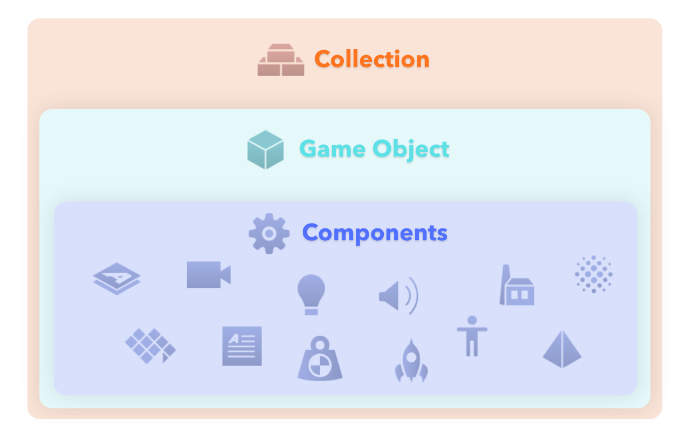
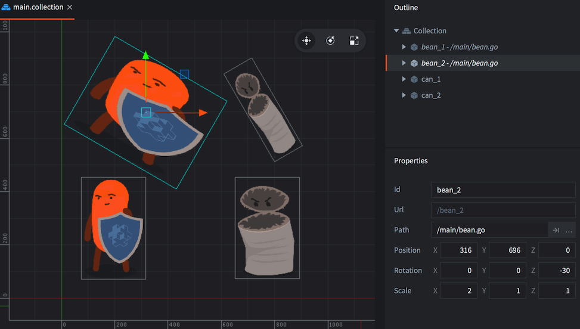

#  Building blocks

At the core of Defold's design are a few concepts that may take a little while to get a good grip on. This manual explains what the building blocks of Defold consist of. After having read this manual, move on to the [addressing manual](/manuals/addressing) and the [message passing manual](/manuals/message-passing). There are also a set of [tutorials](/tutorials/getting-started) available from within the editor to get you up and running quickly.

{srcset="images/building_blocks/building_blocks@2x.png 2x"}

There are three basic types of building blocks that you use to construct a Defold game:

Collection
: A collection is a file used to structure your game. In collections you build hierarchies of game objects and other collections. They are typically used to structure game levels, groups of enemies or characters built out of several game objects.

Game object
: A game object is a container with an id, position, rotation and scale. It is used to contain components. They are typically used to create player characters, bullets, the game’s rule system or a level loader/unloader.

Component
: Components are entities that are put in game object to give them visual, audible and/or logic representation in the game. They are typically used to create character sprites, script files, add sound effects or add particle effects.

## Collections

Collections are tree structures that hold game objects and other collections. A collection is always stored on file.

When the Defold engine starts, it loads a single _bootstrap collection_ as specified in the "game.project" settings file. The bootstrap collection is often named "main.collection" but you are free to use any name you like.

A collection can contain game objects and other collections (by reference to the sub-collection's file), nested arbitrarily deep. Here is an example file called "main.collection". It contains one game object (with the id "can") and one sub-collection (with the id "bean"). The sub-collection, in turn, contains two game objects: "bean" and "shield".

{srcset="images/building_blocks/collection@2x.png 2x"}

Notice that the sub-collection with id "bean" is stored in its own file, called "/main/bean.collection" and is only referenced in "main.collection":

{srcset="images/building_blocks/bean_collection@2x.png 2x"}

You cannot address collections themselves since there are no runtime objects corresponding to the "main" and "bean" collections. However, you sometimes need to use the identity of a collection as part of the _path_ to a game object (See the [addressing manual](/manuals/addressing) for details):

```lua
-- file: can.script
-- get position of the "bean" game object in the "bean" collection
local pos = go.get_position("bean/bean")
```

A collection is always added to another collection as a reference to a collection file:

<kbd>Right-click</kbd> the collection in the *Outline* view and select <kbd>Add Collection File</kbd>.

## Game objects

Game objects are simple objects that each have a separate lifespan during the execution of your game. Game objects have a position, rotation, and scale that each of which can be manipulated and animatied at runtime.

```lua
-- animate X position of "can" game object
go.animate("can", "position.x", go.PLAYBACK_LOOP_PINGPONG, 100, go.EASING_LINEAR, 1.0)
```

Game objects can be used empty (as position markers, for instance) but are usually used equipped with various components, like sprites, sounds, scripts, models, factories and more. Game objects are either created in the editor, placed in collection files, or dynamically spawned at run-time through _factory_ components.

Game objects are either added in-place in a collection, or added to a collection as a reference to a game object file:

<kbd>Right-click</kbd> the collection in the *Outline* view and select <kbd>Add Game Object</kbd> (add in-place) or <kbd>Add Game Object File</kbd> (add as file reference).


## Components

:[components](../shared/components.md)

Refer to the [component overview](/manuals/components/) for a list of all available component types.

## Objects added in-place or by reference

When you create a collection, game object or component _file_, you create a blueprint, or a prototype. This only adds a file to the project file structure, nothing is added to your running game. To add an instance of a collection, game object or component based on a blueprint file, you add an instance of it in one of your collection files.

You can see what file an object instance is based on in the outline view. The file "main.collection" contains three instances that are based on files:

1. The "bean" sub-collection.
2. The "bean" script component in the "bean" game object in the "bean" sub-collection.
3. The "can" script component in the "can" game object.

{srcset="images/building_blocks/instance@2x.png 2x"}

The benefit of creating blueprint files becomes apparent when you have multiple instances of a game object or collection and wishes to change all of them:

{srcset="images/building_blocks/go_instance@2x.png 2x"}

By changing the blueprint file, any instance that uses that file will immediately be updated.

{srcset="images/building_blocks/go_instance2@2x.png 2x"}

## Childing game objects

In a collection file, you can build hierarchies of game objects so that one or more game objects are children to a single parent game object. By simply <kbd>dragging</kbd> one game object and <kbd>dropping</kbd> it onto another the dragged game object is childed under the target:

{srcset="images/building_blocks/childing@2x.png 2x"}

Object parent-child hierarchies is a dynamic relation affecting how objects react to transformations. Any transformation (movement, rotation or scaling) applied to an object will in turn be applied to the object’s children, both in the editor and in runtime:

{srcset="images/building_blocks/child_transform@2x.png 2x"}

Conversely, a child's translations are done in the local space of the parent. In the editor, you can choose to edit a child game object in the local space or world space by selecting <kbd>Edit ▸ World Space</kbd> (the default) or <kbd>Edit ▸ Local Space</kbd>.

It is also possible to alter an object’s parent in run-time by sending a `set_parent` message to the object.

```lua
local parent = go.get_id("bean")
msg.post("child_bean", "set_parent", { parent_id = parent })
```

A common misunderstanding is that a game object's place in the collection hierarchy changes when it becomes part of a parent-child hierarchy. However, these are two very different things. Parent-child hierarchies dynamically alters the scene graph which allows objects to be visually attached to each other. The only thing that dictates a game object's address is its place in the collection hierarchy. The address is static throughout the lifetime of the object.
