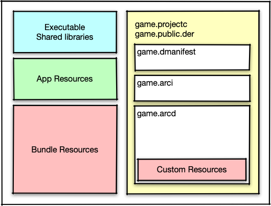

# Bundling an application

While developing your application you should make a habit of testing the game on the target platforms as often as possible. You should do this to detect performance issues early on in the development process where these things are much easier to fix. It is also recommended to test on all target platforms to find discrepancies in things such as shaders. When developing on mobile you have the option to use the [mobile development app](/manuals/dev-app/) to push content to the app, instead of having to do a full bundle and uninstall/install cycle.

You can create an application bundle for all platforms that Defold supports from within the Defold editor itself, with no external tools needed. You can also bundle from the command line using our command line tools. Application bundling requires a network connection if your project contains one or more [native extensions](/manuals/extensions).

## Bundling from within the editor

You create an application bundle from the Project menu and Bundle option:

Selecting any of the menu options will bring up the Bundle dialog for that specific platform.

### Build reports

When bundling your game there is an option to create a build report. This is very useful to get a grip on the size of all the assets that are part of your game bundle. Simply check the *Generate build report* checkbox when bundling the game.

{srcset="images/profiling/build_report@2x.png 2x"}

To learn more about build reports please refer to the [Profiling manual](/manuals/profiling/#build-reports).

### Android

Creating an Android application bundle (.apk file) is documented in the [Android manual](/manuals/android/#creating-an-android-application-bundle).

### iOS

Creating an iOS application bundle (.ipa file) is documented in the [iOS manual](/manuals/ios/#creating-an-ios-application-bundle).

### macOS

Creating a macOS application bundle (.app file) is documented in the [macOS manual](/manuals/macos).

### Linux

Creating a Linux application bundle requires no specific setup and no optional platform specific configuration in the "game.project" [project settings file](/manuals/project-settings/#linux).

### Windows

Creating a Windows application bundle (.exe file) is documented in the [Windows manual](/manuals/windows).

### HTML5

Creating an HTML5 application bundle as well as optional setup is documented in the [HTML5 manual](/manuals/html5/#creating-html5-bundle).

#### Facebook Instant Games

It is possible to create a special version of an HTML5 application bundle specifically for Facebook Instant Games. This process is documented in the [Facebook Instant Games manual](/manuals/instant-games/).

## Bundling from the command line

The editor uses our command line tool [Bob](/manuals/bob/) to bundle the application.

While doing day to day development of your application it is likely that you build and bundle from within the Defold editor. In other circumstances you may wish to automatically generate application bundles, for instance batch building for all targets when releasing a new version or when creating nightly builds of the latest version of the game, perhaps in a CI environment. Building and bundling of an application can be done outside the normal editor workflow using the [Bob command line tool](/manuals/bob/).

## The bundle layout

The logical bundle layout is structured like this:

A bundle is output into a folder. Depending on platform, that folder may also be zip archived into an `.apk` or `.ipa`.
The contents of the folder depends on the platform.

Apart from the executable files, our bundling process also collects the required assets for the platform (e.g. the .xml resource files for Android).

Using the [bundle_resources](https://defold.com/manuals/project-settings/#bundle-resources) setting, you can configure assets that should be placed within the bundle as-is.
You can control this per platform.

The game assets are located in the `game.arcd` file, and they are individually compressed using LZ4 compression.
Using the [custom_resources](https://defold.com/manuals/project-settings/#custom-resources) setting, you can configure assets that should be placed (with compression) within the game.arcd.
These assets can be accessed via the [sys.load_resource()](https://defold.com/ref/sys/#sys.load_resource) function.

