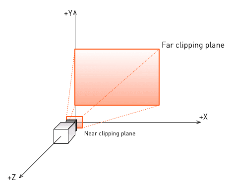
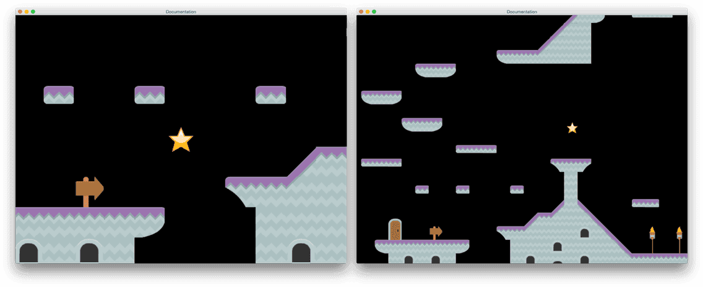
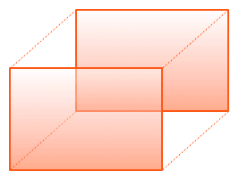

Cameras
=======

Defold contains a primitive camera component. This manual describes its functionality and intended use.

A camera is a component type that you use to provide a view into your game world. Cameras are very simple objects that in essence does the following:

1. They have a location in space---either 2D or 3D.
2. They can be moved around in space---by moving the containing game object.
3. They provide the render script with the data necessary to render with computed view and projection matrices.

Cameras in OpenGL are expressed as coordinate systems with a viewer, or eye, position, a near and a far clipping plane. The near clipping plane equals the viewing plane, or the screen.



A 3D camera usually have a viewing volume, a _frustum_, that is shaped like a cut off pyramid. The effect of this is that objects further away from the camera will be rendered smaller--the perspective will be realistic. The wider the _field of view_, the more the camera sees of the scenery, and the more dramatic will the difference between near and far object be.


## Creating a camera

To create a camera, add a _Camera component_ to a game object:


The camera component has a set of properties that defines the camera frustum.


::: important
The current default FOV value is misleading. It is not expressed in degrees but in radians. For a 45 degree FOV, change the value to 0.785 (&#120529; / 4).
:::

aspect_ratio
: The ratio between the frustum width and height. 1.0 means that you assume a quadratic view. 1.33 is good for a 4:3 view like 1024x768. 1.78 is good for a 16:9 view.

fov
: The camera field of view expressed in _radians_.

near_z
: The Z-value of the near clipping plane.

far_z
: The Z-value of the far clipping plane.

auto_aspect_ratio
: Set this to 1 to let the camera automatically set the aspect ratio based on the game's screen settings.


## Camera focus

To activate the camera and have it feed its view and projection matrices, you send the component a `acquire_camera_focus` message:

```lua
msg.post("#camera", "acquire_camera_focus")
```

As soon as the camera component has camera focus, it will each frame send a `set_view_projection` message to the `@render` socket, i.e. to your render script:

```lua
-- example.render_script
--
function update(self)
    ...
    render.set_view(self.view)

    render.set_projection(self.projection)
    ...
end

function on_message(self, message_id, message)
    if message_id == hash("set_view_projection") then
    	-- Camera view and projection arrives here. Store them.
        self.view = message.view
        self.projection = message.projection
    end
end
```

If you use both camera view and projection in your render script you will get a camera view into your game world with 3D perspective, even though your game content is strictly 2D. This is sometimes useful. You can, for instance, move the camera back to reveal more of the level. A simple camera script that measures the current camera move speed and pulls it back relative that speed could look like this:

```lua
-- camera.script
--
function init(self)
	msg.post("#camera", "acquire_camera_focus")

    -- Track current position and where someone told us to look at.
	self.pos = go.get_world_position()
	self.look_at = self.pos
    -- Store measured speed
	self.speed = 0
end

function update(self, dt)
	-- Calculate a new position based on current pos interpolated towards current
	-- target position.
	self.pos = vmath.lerp(0.03, self.pos, self.look_at)
	
	-- Measure speed on the 2D plane (zero Z)
	local v1 = go.get_world_position()
	v1.z = 0
	local v2 = self.pos
	v2.z = 0
	local speed = vmath.length(v2 - v1)

	-- Depending on how fast player is moving, pull camera back or push it forward.
	self.pos.z = 500 + speed * speed * 10
	go.set_position(self.pos)
end

function on_message(self, message_id, message, sender)
    -- This camera reacts to "look_at" messages with a position as where
    -- to go.
	if message_id == hash("look_at") then	
		self.look_at = message.position
	end
end
```



Of course, we're not limited to moving the camera around. We can also rotate it along its X, Y and Z axis.

```lua
-- 0.314 radians is about 18 degrees.
go.set_rotation(vmath.quat_rotation_z(0.314) * vmath.quat_rotation_y(0.314))
```


## Orthographic projection

For many 2D games, the business of having a camera that can move back and forth becomes a problem, especially if you have content that you would like to render pixel perfect. Instead of trying to place your camera at the perfect Z distance to get the view you want, you should instead set up a camera with _orthographic projection_. This means that the view of the camera is no longer dictated by a frustum, but by a much simpler box.



Orthographic projection is unrealistic in that it does not alter the size of objects based on their distance. A person standing 10000 meters away will still render at the same size as the person standing right in front of the camera. However, this method of projecting graphics is sometimes useful and 2D games often benefit from using it. To use orthographic projection you just have to modify your render script:

```lua
-- example.render_script
--
function update(self)
    ...
    render.set_view(self.view)
    -- Set up an orthographic projection based on the width and height of the
    -- game window.
	local w = render.get_width()
	local h = render.get_height()
	render.set_projection(vmath.matrix4_orthographic(- w / 2, w / 2, -h / 2, h / 2, -1000, 1000))
    ...
end

function on_message(self, message_id, message)
    if message_id == hash("set_view_projection") then
    	-- Camera view and projection arrives here. We only need the view.
        self.view = message.view
    end
end
```

This is almost what the default render script does, with the difference that the above example centers the screen at the camera position.

(Some of the graphic assets used are made by Kenney: http://kenney.nl/assets)
