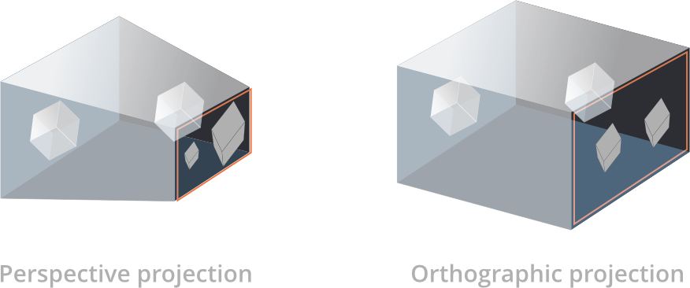
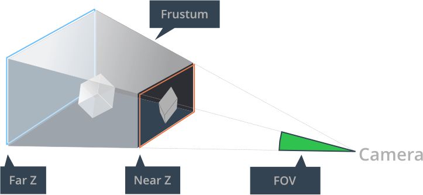

# Cameras

A camera in Defold is a component that changes the viewport and projection of the game world. The camera component defines a bare bones perspective or orthographic camera that provides a view and projection matrix to the render script.

A perspective camera is typically used for 3D games where the view of the camera and the size and perspective of objects is based on a view frustum and the distance and view angle from the camera to the objects in the game.

For 2D games, it is often desirable to render the scene with an orthographic projection. This means that the view of the camera is no longer dictated by a view frustum, but by a box. Orthographic projection is unrealistic in that it does not alter the size of objects based on their distance. An object 1000 units away will render at the same size as an object right in front of the camera.




## Creating a camera

To create a camera, <kbd>right click</kbd> a game object and select <kbd>Add Component ▸ Camera</kbd>. You can alternatively create a component file in your project hierarchy and add the component file to the game object.


The camera component has the following properties that defines the camera *frustum*:



Id
: The id of the component

Aspect Ratio
: (**Perspective camera only**) - The ratio between the frustum width and height. 1.0 means that you assume a quadratic view. 1.33 is good for a 4:3 view like 1024x768. 1.78 is good for a 16:9 view. This setting is ignored if *Auto Aspect Ratio* is set.

Fov
: (**Perspective camera only**) - The *vertical* camera field of view expressed in _radians_. The wider the field of view, the more the camera will see.

Near Z
: The Z-value of the near clipping plane.

Far Z
: The Z-value of the far clipping plane.

Auto Aspect Ratio
: (**Perspective camera only**) - Set this to let the camera automatically calculate the aspect ratio.

Orthographic Projection
: Set this to switch the camera to an orthographic projection (see below).

Orthographic Zoom
: (**Orthographic camera only**) - A user-controlled zoom multiplier (> 1 = zoom in, < 1 = zoom out). In `Fixed` mode it is the effective zoom. In `Auto Fit` and `Auto Cover` modes it is multiplied by the automatically calculated zoom, which makes it possible to add extra zoom without disabling automatic sizing.

Orthographic Mode
: (**Orthographic camera only**) - Controls how the orthographic camera determines zoom relative to the window size and your design resolution (the values in `game.project` → `display.width/height`).
  - `Fixed` (uses constant zoom): Uses the current `Orthographic Zoom` value as-is.
  - `Auto Fit` (contain): Automatically calculates zoom so the full design area fits inside the window, then multiplies it by `Orthographic Zoom`. May show extra content on sides or top/bottom.
  - `Auto Cover` (cover): Automatically calculates zoom so the design area covers the entire window, then multiplies it by `Orthographic Zoom`. May crop on sides or top/bottom.
  Available only when `Orthographic Projection` is enabled.


## Using the camera

All cameras are automatically enabled and updated during a frame, and the lua `camera` module is available in all script contexts. Since Defold 1.8.1 there is no longer a need to explicitly enable a camera via sending an `acquire_camera_focus` message to the camera component. The old acquire and release messages are still available, but it is recommended to instead use the `enable` and `disable` messages like for any other component that you wish to enable or disable:

```lua
msg.post("#camera", "disable")
msg.post("#camera", "enable")
```

To list all currently available cameras, you can use `camera.get_cameras()`:

```lua
-- Note: The render calls are only available in a render script.
--       The camera.get_cameras() function can be used anywhere,
--       but render.set_camera can only be used in a render script.

for k,v in pairs(camera.get_cameras()) do
    -- the camera table contains the URLs of all cameras
    render.set_camera(v)
    -- do rendering here - anything rendered here that uses materials with
    -- view and projection matrices specified, will use matrices from the camera.
end
-- to disable a camera, pass in nil (or no arguments at all) to render.set_camera.
-- after this call, all render calls will use the view and projection matrices
-- that are specified on the render context (render.set_view and render.set_projection)
render.set_camera()
```

The scripting `camera` module has multiple functions that can be used to manipulate the camera. Here's just a few functions that can be used, to see all of the available functions, please consult the manual at the [API docs](/ref/camera/)).

```lua
camera.get_aspect_ratio(camera) -- get aspect ratio
camera.get_far_z(camera) -- get far z
camera.get_fov(camera) -- get field of view
camera.get_orthographic_mode(camera) -- get orthographic mode (one of camera.ORTHO_MODE_*)
camera.get_orthographic_zoom(camera) -- get the user-controlled zoom multiplier
camera.get_orthographic_auto_zoom(camera) -- get the automatically calculated zoom
camera.set_aspect_ratio(camera, ratio) -- set aspect ratio
camera.set_far_z(camera, far_z) -- set far z
camera.set_near_z(camera, near_z) -- set near z
camera.set_orthographic_mode(camera, camera.ORTHO_MODE_AUTO_FIT) -- set orthographic mode
... And so forth
```

A camera is identified by a URL, which is the full scene path of the component, including the collection, the gameobject it belongs to and the component id. In this example, you would use the URL `/go#camera` to identify the camera component from within the same collection, and `main:/go#camera` when accessing a camera from a different collection, or the render script.


```lua
-- Accessing a camera from a script in the same collection:
camera.get_fov("/go#camera")

-- Accessing a camera from a script in a different collection:
camera.get_fov("main:/go#camera")

-- Accessing a camera from the render script:
render.set_camera("main:/go#camera")
```

Each frame, the camera component that currently has camera focus will send a `set_view_projection` message to the `@render` socket:

```lua
-- builtins/render/default.render_script
--
function on_message(self, message_id, message)
    if message_id == hash("set_view_projection") then
        self.view = message.view                    -- [1]
        self.projection = message.projection
    end
end
```
1. The message posted from the camera component includes a view matrix and a projection matrix.

The camera component supplies the render script with either a perspective or orthographic projection matrix depending on the *Orthographic Projection* property of the camera. The projection matrix also takes into account the defined near and far clipping plane, the field of view and the aspect ratio settings of the camera.

The view matrix provided by the camera defines the position and orientation of the camera. A camera with an *Orthographic Projection* will center the view on the position of the game object it is attached to, while a camera with a *Perspective Projection* will have the lower left corner of the view positioned on the game object it is attached to.


### Render script

When using the default render script Defold will automatically set the last enabled camera that should be used for rendering. Before this change, a script somewhere in the project needed to explicitly send the `use_camera_projection` message to the renderer to notify it that the view and projection from camera components should be used. This is no longer necessary, but it is still possible to do so for backwards compatibility purposes.

Alternatively, you can set a specific camera that should be used for rendering in a render script. This could be useful in cases where you need to control more specifically which camera should be used for rendering, for example in a multiplayer game.

```lua
-- render.set_camera will automatically use the view and projection matrices
-- for any rendering happening until render.set_camera() is called.
render.set_camera("main:/my_go#camera")
```

To check if a camera is active or not, you can use the `get_enabled` function from the [Camera API](https://defold.com/ref/alpha/camera/#camera.get_enabled:camera):

```lua
if camera.get_enabled("main:/my_go#camera") then
    -- camera is enabled, use it for rendering!
    render.set_camera("main:/my_go#camera")
end
```

::: sidenote
To use the `set_camera` function together with frustum culling, you need to pass this as an option to the function:
`render.set_camera("main:/my_go#camera", {use_frustum = true})`
:::

### Panning the camera

You pan/move the camera around the game world by moving the game object the camera component is attached to. The camera component will automatically send an updated view matrix based on the current x and y axis position of the camera.

### Zooming the camera

You can zoom in and out when using a perspective camera by moving the game object the camera is attached to along the z-axis. The camera component will automatically send an updated view matrix based on the current z-position of the camera.

You can zoom in and out when using an orthographic camera by changing the *Orthographic Zoom* property of the camera, either in the editor or at runtime:

```lua
-- In Fixed mode, this is the effective zoom.
go.set("#camera", "orthographic_zoom", 2)
```

In `Auto Fit` and `Auto Cover` modes, *Orthographic Zoom* is applied on top of the automatically calculated zoom; it is not ignored. For example, set *Orthographic Mode* to `Auto Fit` and *Orthographic Zoom* to `1.25` in the editor to fit the design area to the window and then zoom in an additional 25%. The equivalent runtime setup is:

```lua
camera.set_orthographic_mode("#camera", camera.ORTHO_MODE_AUTO_FIT)
go.set("#camera", "orthographic_zoom", 1.25)

local auto_zoom = camera.get_orthographic_auto_zoom("#camera")
local zoom_multiplier = camera.get_orthographic_zoom("#camera")
local effective_zoom = auto_zoom * zoom_multiplier
```

`camera.get_orthographic_auto_zoom()` returns the zoom calculated from the current window and project dimensions in `Auto Fit` and `Auto Cover` modes. It returns `1.0` in `Fixed` mode. The same value is available through the read-only `orthographic_auto_zoom` component property:

```lua
local auto_zoom = go.get("#camera", "orthographic_auto_zoom")
```

When using an orthographic camera you can also switch how zoom is determined using the `Orthographic Mode` setting or via script:

```lua
-- get current mode (one of camera.ORTHO_MODE_FIXED, _AUTO_FIT, _AUTO_COVER)
local mode = camera.get_orthographic_mode("#camera")

-- switch to auto-fit (contain) to always keep the full design area visible
camera.set_orthographic_mode("#camera", camera.ORTHO_MODE_AUTO_FIT)

-- switch to auto-cover to ensure the design area covers the window
camera.set_orthographic_mode("#camera", camera.ORTHO_MODE_AUTO_COVER)

-- switch to fixed mode to use orthographic_zoom without automatic sizing
camera.set_orthographic_mode("#camera", camera.ORTHO_MODE_FIXED)
```

### Adaptive zoom

The concept behind adaptive zoom is to adjust the camera zoom value when the resolution of the display change from the initial resolution set in *game.project*.

Two common approaches to adaptive zoom are:

1. Max zoom - Calculate a zoom value such that the content covered by the initial resolution in *game.project* will fill and expand beyond the screen bounds, possibly hiding some content to the sides or above and below.
2. Min zoom - Calculate a zoom value such that the content covered by the initial resolution in *game.project* will be completely contained within the screen bounds, possibly showing additional content to the sides or above and below.

Example:

```lua
local DISPLAY_WIDTH = sys.get_config_int("display.width")
local DISPLAY_HEIGHT = sys.get_config_int("display.height")

function init(self)
    local initial_zoom = go.get("#camera", "orthographic_zoom")
    local display_scale = window.get_display_scale()
    window.set_listener(function(self, event, data)
        if event == window.WINDOW_EVENT_RESIZED then
            local window_width = data.width
            local window_height = data.height
            local design_width = DISPLAY_WIDTH / initial_zoom
            local design_height = DISPLAY_HEIGHT / initial_zoom

            -- max zoom: ensure that the initial design dimensions will fill and expand beyond the screen bounds
            local zoom = math.max(window_width / design_width, window_height / design_height) / display_scale

            -- min zoom: ensure that the initial design dimensions will shrink and be contained within the screen bounds
            --local zoom = math.min(window_width / design_width, window_height / design_height) / display_scale
            
            go.set("#camera", "orthographic_zoom", zoom)
        end
    end)
end
```

A complete example of adaptive zoom can be seen in [this sample project](https://github.com/defold/sample-adaptive-zoom).

Note: With an orthographic camera you can now achieve contain/cover behavior without custom code by setting `Orthographic Mode` to `Auto Fit` (contain) or `Auto Cover` (cover). In these modes the zoom calculated from the window size and design resolution is multiplied by `Orthographic Zoom`.


### Following a game object

You can have the camera follow a game object by setting the game object the camera component is attached to as a child of the game object to follow:


An alternative way is to update the position of the game object the camera component is attached to every frame as the game object to follow moves.

### Converting between screen and world coordinates

When a camera has panned, zoomed, or changed its projection, input coordinates no longer directly match world coordinates. Use the camera conversion functions with `action.screen_x` and `action.screen_y`. If the optional camera URL is omitted, the last enabled camera is used.

For an orthographic camera, [`camera.screen_xy_to_world()`](/ref/camera/#camera.screen_xy_to_world:x-y-[camera]) returns the world-space point on the camera's near plane for a screen pixel:

```lua
function on_input(self, action_id, action)
    if action_id == hash("touch") and action.pressed then
        local world_position = camera.screen_xy_to_world(
            action.screen_x, action.screen_y, "#camera")
        go.set_position(world_position, "/marker")
    end
end
```

For a perspective camera, [`camera.screen_to_world()`](/ref/camera/#camera.screen_to_world:pos-[camera]) takes a `vector3` whose Z component is view depth in world units measured from the camera plane:

```lua
local depth = 10
local world_position = camera.screen_to_world(
    vmath.vector3(action.screen_x, action.screen_y, depth), "#camera")
```

[`camera.world_to_screen()`](/ref/camera/#camera.world_to_screen:world_pos-[camera]) performs the reverse conversion. It returns screen-pixel X and Y plus the same view-depth convention in Z, so its result can be passed back to `camera.screen_to_world()`:

```lua
-- Update the cached world transform first if the object moved this frame.
go.update_world_transform("/marker")
local world_position = go.get_world_position("/marker")
local screen_position = camera.world_to_screen(world_position, "#camera")
```

Visit the [Examples page](https://defold.com/examples/render/screen_to_world/) to see coordinate conversion in action. There is also a [sample project](https://github.com/defold/sample-screen-to-world-coordinates/) showing the same APIs.

::: sidenote
The [third-party camera solutions mentioned in this manual](/manuals/camera/#third-party-camera-solutions) provides functions for converting to and from screen coordinates.
:::

## Runtime manipulation
You can manipulate cameras in runtime through a number of different messages and properties (refer to the [API docs for usage](/ref/camera/)).

A camera has a number of different properties that can be manipulated using `go.get()` and `go.set()`:

`fov`
: The camera field-of-view (`number`).

`near_z`
: The camera near Z-value (`number`).

`far_z`
: The camera far Z-value (`number`).

`orthographic_zoom`
: The user-controlled orthographic camera zoom multiplier. In `Auto Fit` and `Auto Cover` modes it is multiplied by `orthographic_auto_zoom`. (`number`).

`orthographic_auto_zoom`
: The calculated orthographic zoom for `Auto Fit` and `Auto Cover` modes, or `1.0` in `Fixed` mode. READ ONLY. (`number`).

`aspect_ratio`
: The ratio between the frustum width and height. Used when calculating the projection of a perspective camera. (`number`).

`view`
: The calculated view matrix of the camera. READ ONLY. (`matrix4`).

`projection`
: The calculated projection matrix of the camera. READ ONLY. (`matrix4`).


## Third-party camera solutions

There are community-made camera solutions that implement common features such as screen shake, following game objects, screen-to-world coordinate conversion and much more. They can be downloaded from the Defold asset portal:

- [Orthographic camera](https://defold.com/assets/orthographic/) (2D only) by Björn Ritzl.
- [Defold Rendy](https://defold.com/assets/defold-rendy/) (2D and 3D) by Klayton Kowalski.
