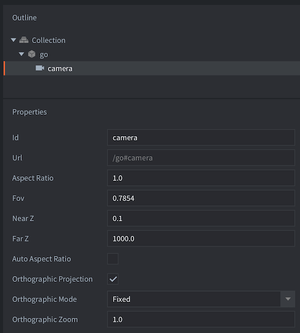

# Cameras

A camera in Defold is a component that changes the viewport and projection of the game world. The camera component defines a bare bones perspective or orthographic camera that provides a view and projection matrix to the render script. A perspective camera is typically used for 3D games while an orthographic camera is used for 2D games. If you need advanced features like chasing, zooming, shake etc you will need to implement it yourself (see section on [third-party camera solutions](https://www.defold.com/manuals/camera/#third-party-camera-solutions) below).

## Creating a camera

To create a camera, <kbd>right click</kbd> a game object and select <kbd>Add Component ▸ Camera</kbd>. You can alternatively create a component file in your project hierarchy and add the component file to the game object.

{srcset="images/camera/create@2x.png 2x"}

The camera component has the following properties that defines the camera *frustum* (perspective camera only):

{srcset="images/camera/settings@2x.png 2x"}

Id
: The id of the component

Aspect Ratio
: (**Perspective camera only**) - The ratio between the frustum width and height. 1.0 means that you assume a quadratic view. 1.33 is good for a 4:3 view like 1024x768. 1.78 is good for a 16:9 view. This setting is ignored if *Auto Aspect Ratio* is set.

Fov
: (**Perspective camera only**) - The *vertical* camera field of view expressed in _radians_. The wider the field of view, the more the camera will see. Note that the current default value (45) is misleading. For a 45 degree field of view, change the value to 0.785 ($\pi / 4$).

Near Z
: (**Perspective camera only**) - The Z-value of the near clipping plane.

Far Z
: (**Perspective camera only**) - The Z-value of the far clipping plane.

Auto Aspect Ratio
: (**Perspective camera only**) - Set this to let the camera automatically calculate the aspect ratio.

## Using the camera

To activate a camera and have it feed its view and projection matrices to the render script, you send the component an acquire_camera_focus message:

```lua
msg.post("#camera", "acquire_camera_focus")
```

Each frame, the camera component that currently has camera focus will send a `"set_view_projection"` message to the "@render" socket, i.e. it will arrive to your render script:

```lua
-- builtins/render/default.render_script
--
function on_message(self, message_id, message)
    if message_id == hash("set_view_projection") then
        self.view = message.view                    -- [1]
        self.projection = message.projection
    end
end
```
1. The message posted from the camera component includes a view matrix and a projection matrix.

### Panning the camera

You pan/move the camera around the game world by moving the game object the camera component is attached to. The camera component will automatically send an updated view matrix based on the current x and y axis position of the camera.

### Zooming the camera

You can zoom in and out when using a perspective camera by moving the game object the camera is attached to along the z-axis. The camera component will automatically send an updated view matrix based on the current z-position of the camera.

You can only zoom in and out when using an orthographic camera if the projection type is set to `Fixed`, and in that case the zoom is changed by sending a message to the render script with the required zoom level:

```Lua
msg.post("@render:", "use_fixed_projection", { zoom = 2, near = -1, far = 1 })
```

### Following a game object

You can have the camera follow a game object by setting the game object the camera component is attached to as a child of the game object to follow:


An alternative way is to update the position of the game object the camera component is attached to every frame as the game object to follow moves.

### Converting mouse to world coordinates

When the camera has panned, zoomed or changed it's projection from the default orthographic Stretch projection the mouse coordinates provided in the on_input() lifecycle function will no longer match to the world coordinates of your game objects. You need to manually account for the change in view or projection. Converting from mouse/screen coordinates to world coordinates from the default render script is done like this:

::: sidenote
The [third-party camera solutions mentioned in this manual](/manuals/camera/#third-party-camera-solutions) provides functions for converting to and from screen coordinates.
:::

```Lua
-- builtins/render/default.render_script
--
local function screen_to_world(x, y, z)
	local inv = vmath.inv(self.projection * self.view)
	x = (2 * x / render.get_width()) - 1
	y = (2 * y / render.get_height()) - 1
	z = (2 * z) - 1
	local x1 = x * inv.m00 + y * inv.m01 + z * inv.m02 + inv.m03
	local y1 = x * inv.m10 + y * inv.m11 + z * inv.m12 + inv.m13
	local z1 = x * inv.m20 + y * inv.m21 + z * inv.m22 + inv.m23
	return x1, y1, z1
end
```

## Projections

The camera component supplies the render script with a perspective projection. This is well suited for 3D games. For 2D games, it is often desirable to render the scene with *orthographic projection*. This means that the view of the camera is no longer dictated by a frustum, but by a box. Orthographic projection is unrealistic in that it does not alter the size of objects based on their distance. An object 1000 units away will render at the same size as an object right in front of the camera.

{srcset="images/camera/projections@2x.png 2x"}

### Orthographic projection (2D)
To use an orthographic projection you ignore the projection matrix sent by the camera component and instead provide one yourself in the render script. The default render script supports three orthographic projections; `Stretch`, `Fixed` and `Fixed Fit`. You select which one to use by sending a message to the render script:

```lua
msg.post("@render:", "use_fixed_fit_projection", { near = -1, far = 1 })
```

::: important
Note that the near and far planes are also specified in the message. The near and far planes set on the camera properties are only used for the perspective projection.
:::

::: important
With an orthographic projection the view will be positioned such that the lower-left corner of the rendered portion of the screen will correspond to the position of the game object the camera component is attached to.
:::

Learn more about the render script and how to change which type of orthographic projection to use in the [Render manual](/manuals/render/#default-view-projection).

### Perspective projection (3D)
To use perspective projection you must use both the view and projection provided by the camera. You tell the render script to use the projection coming from the camera by sending a message to the render script:

```lua
msg.post("@render:", "use_camera_projection")
```

Learn more about the render script in the [Render manual](/manuals/render/#perspective-projection).


## Third-party camera solutions

There are a few library camera solutions that implements common camera features such as game object follow, screen to world coordinate conversion and so on. They are available from the Defold community assets portal:

- [Rendercam](https://defold.com/assets/rendercam/) (2D & 3D) by Ross Grams.
- [Ortographic camera](https://defold.com/assets/orthographic/) (2D only) by Björn Ritzl.
