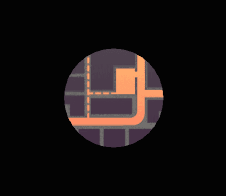
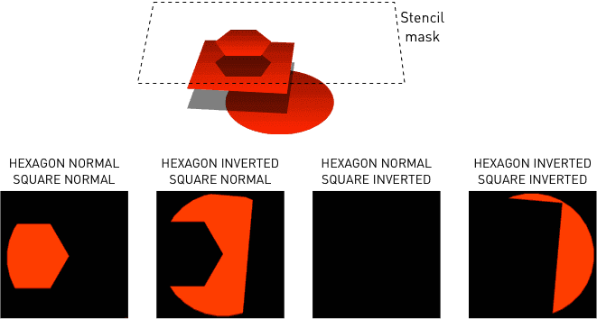
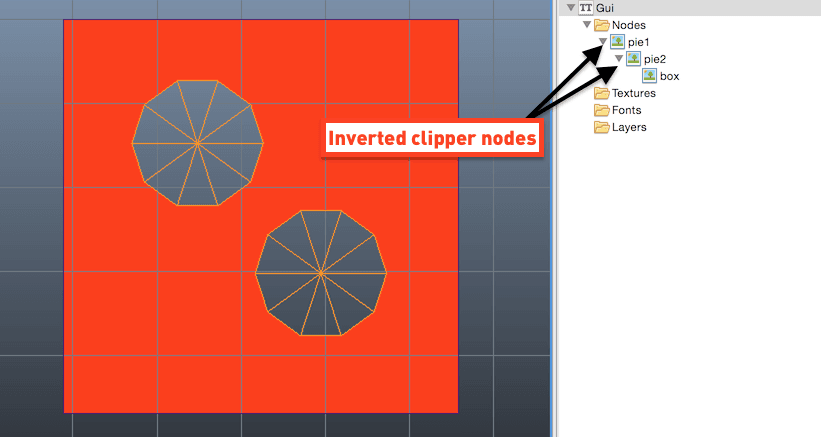
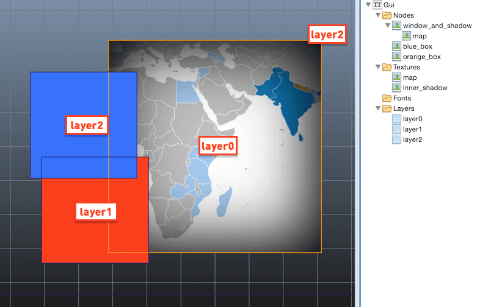

Clipping
========
:location: documentation manuals gui
:type: manual

GUI nodes with textures or text add graphics to the GUI. However, sometimes it is convenient to be able to _mask_ what is being shown, to be able to _remove_ particular parts of the graphics from the screen. This manual explains how to achieve that. 

Say, for instance, that you want to create an on-screen HUD element containing a mini-map that the player can use to help orient herself in your game.

Using a pie node with clipping makes creating the minimap a very easy task:

- Add a pie node. It will act as a "keyhole" for the map.
- Add a box node and apply the map texture to it.
- Child the box node to the pie node.
- Set the *Clipping* property of the pie node to "Stencil".

Now the parent node will act as a "keyhole" down to its children. Only graphics bound by the parent clipping node will show so the parent node will define the graphical outer bounds of the map. We are therefore free to move the map node around and whatever part is currently within the parent bounds will show.

Clipping can be applied to box nodes and pie nodes. Text nodes can not clip other nodes. Two different types of clipping is available and a node can be set to *Visible clipper* which draws the clipper shape, and *Inverted clipper* which inverts how the clipper affects the clipping mask (see below for details).

Stencil clipping can be applied to box nodes and pie nodes. Stencils has some limitations:

- The total number of stencil clippers can not exceed 256.
- The maximum nesting depth of child _stencil_ nodes is 8 levels deep. (Only nodes with stencil clipping count.)
- The maximum number of stencil node siblings is 127. For each level down a stencil hierarchy, the max limit is halved.
- Inverted nodes have a higher cost. There is a limit to 8 inverted clipping nodes and each will halve the max amount of non-inverted clipping nodes.
- Stencils render a stencil mask from the _geometry_ of the node (not the texture). It is possible to invert the mask by setting the *Inverted clipper* property.

## Stencil mask

To understand how stencil clipping works, it is useful to imagine how a hierarchy of stencils apply their individual clipping shapes, in turn down the hierarchy, to the total mask. The mask set of a clipping node is inherited to the children of that node and the children can never _extend_ the mask, only clip it. Let's look at a concrete example:

The hexagon and square shapes are both set to stencil clippers. Setting the *Inverted clipper* property inverts the mask as inherited to that node. For the hierarchy above, four combinations of normal and inverted clippers are possible:

If a node below an inverted node is also set to *Inverted clipper*, the part of the mask bound by the child node is in turn inverted. By childing inverted clippers to each other, it is thus possible to cut multiple holes in a node:

## Layers

Layers can be used to control rendering order (and batching) of nodes. When using layers and clipping nodes the usual layering order is overridden. Clipping order take precedence over layer order, meaning that regardless of what layer a node belongs to, it will be clipped according to the node hierarchy. Layers only affects the draw order of graphics--and furthermore, the layer set on a clipping node does only affect the draw order _in that clipper's hierarchy_.

To illustrate, consider this clipper node "window_and_shadow" that has an inner shadow texture applied to it. By setting the node's *Visible clipper* property and then layering it ("layer2") in relation to the clipped "map" node ("layer0"), the clipper's texture is rendered on top of the child "map". Note that the layer set on "map", nor the one on "window_and_shadow", has any effect on its render order in relation to "blue_box" ("layer2") and "orange_box" ("layer1"). If you want to change the render order of "window_and_shadow" in relation to "blue_box" and "orange_box", simply change their order in the node tree.

