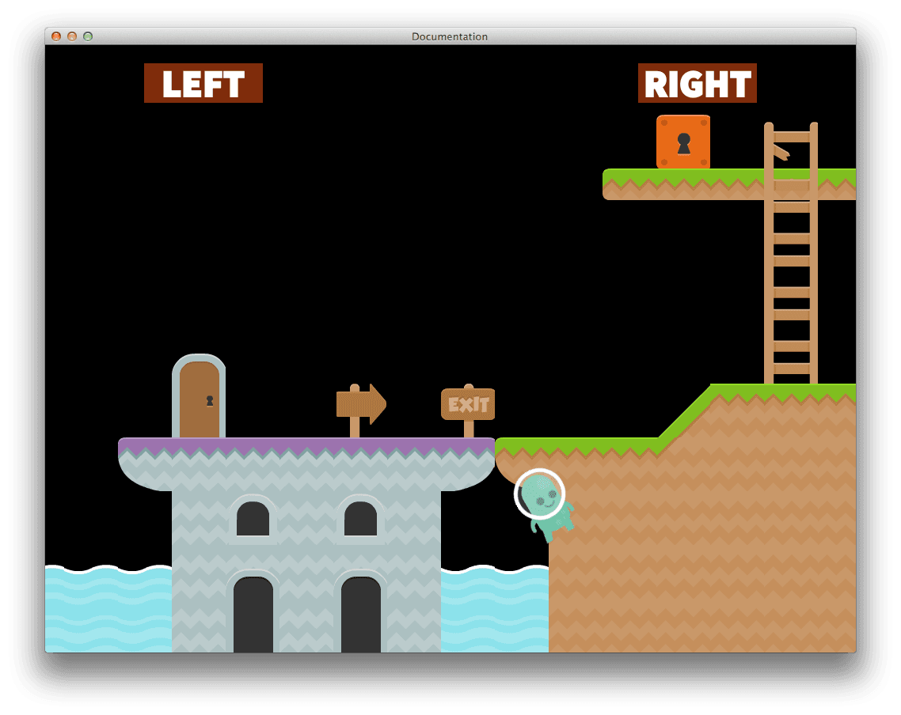
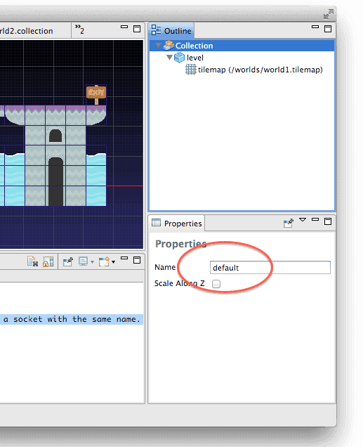
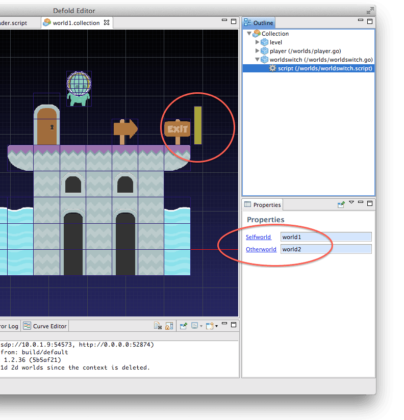
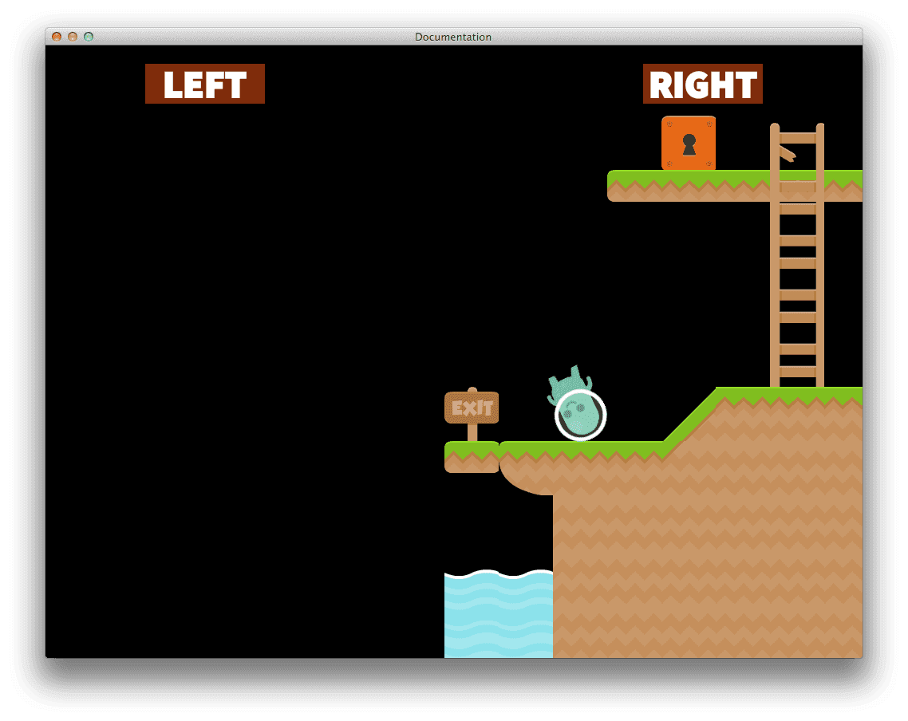
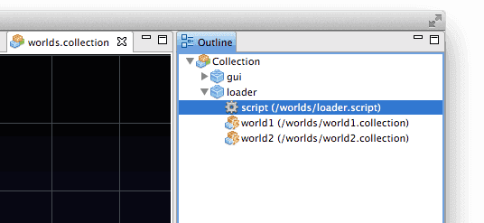

# Collection Proxies

The collection proxy component is used to load and unload new game worlds dynamically based on the content of a collection file.

Defold organizes all game objects in collections. A collection can contain game objects and other collections (i.e. sub-collections). When Defold starts up it loads, initiates and enables a top level collection as defined in the project settings (see [Project settings](/manuals/project-settings)). Most templates have a preset *main.collection* that loads at startup.

For many projects, containing the whole app in the top level collection is sufficient, but there are several cases where you will need more powerful means of organizing your project, for instance:

* Switching between game levels.
* Switching between the game and the front end GUI.
* Loading/unloading of narrative "scenes" throughout a level.
* Loading/unloading of mini-games.

::: important
Collection proxies are not intended for simultaneously loading large amounts of collections. Each loaded collection creates a new game world which comes with a relatively large memory footprint. If you load dozens of collections simultaneously through proxies, you might want to reconsider your design. To spawn many instances of game object hierarchies, [collection factories](/manuals/collection-factory) are more suitable.
:::

Collection proxies allow you to keep your content separated in collections and then dynamically manage the collections through scripting. A collection proxy component acts as an outlet that serves on behalf of a collection file---you can communicate with a collection file that is not yet loaded through the proxy. You can tell a collection proxy to load, initialize, enable, disable, finalize and unload the collection it is an outlet for.

All communication with collection proxies regarding loading and unloading is done asynchronously: however, the actual loading and unloading is not implemented as a background process, so the engine will briefly pause when the loading and unloading happens.

## Worlds

Through collection proxies it is possible to load more than one top level collection, or *game world* into the engine. When doing so it is important to know that each top level collection is a separate physical world. Physics interactions (collisions, triggers, ray-casts) only happen between objects belonging to the same collection. There is no physics interaction between objects belonging to different top level collections.

In the following example we have split the game world into two collections that we dynamically load through collection proxies. The loading and unloading of the two collections is controlled by a game object called "loader" that we put in our main collection, "worlds". We configure the game to automatically load the "worlds.collection" file at startup (see [Project settings documentation](/manuals/project-settings) for details). The "worlds" collection will hold the "loader" object as well as the GUI elements that allow us to move our character around.


The first collection, "world1", is on the left with purple ground tiles. To the right of the "exit" sign is the "world2" collection with green ground tiles.


Our player character is set up with physics collision against all ground tiles in the level, which allows the player to roll the character on the ground. But let’s see what happens when the player reaches the end of the "world1" collection:



The tiles in "world2" have exactly the same collision set up as in "world1", but since the player character game object belongs to "world1", no collision is registered and the character falls through the world.

In games where levels are fully contained within a collection and the player is not expected to seamlessly move between the levels you will never encounter this aspect of collections as separate worlds.

Later we’re going to look deeper into this example and explore how a game can use physics collision and triggers and yet dynamically load pieces of a game world that the player can move between. But first, let’s look at collection proxy basics.

## Editing

To set up a collection proxy you simply add a collection proxy component to a game object. You then name the proxy (give it an id) and tell it which collection file it acts on behalf of:


## Naming collections

Before you start communicating with your collection proxy, you should check the name of each of your collections. Each collection you create in the editor will automatically be assigned the name "default". As long as you’re not dynamically loading that collection through a proxy you can keep that name.



However, when you load more than one top level collection through collection proxies, each one must be addressable through the socket part of a URL, and that socket name must be unique:

```lua
msg.post("world1:manager#script", "remove_player")
msg.post("world2:manager#script", "spawn_player")
```

So a collection you want to load through a proxy should be renamed to a unique name. If you don’t give it a unique name the engine will signal a name collision error:

```txt
ERROR:GAMEOBJECT: The collection 'default' could not be created since there is already a socket with the same name.
WARNING:RESOURCE: Unable to create resource: build/default/worlds/world1.collectionc
ERROR:GAMESYS: The collection /worlds/world1.collectionc could not be loaded.
```

## Loading

Loading a collection through a proxy is done by sending a message "load" to a proxy component in a game object:

```lua
-- Tell the proxy "world1" to start loading.
msg.post("loader#world1", "load")
```

The proxy will send back a message "proxy_loaded" when the loading is done. You can then initialize and enable the collection:

```lua
function on_message(self, message_id, message, sender)
    if message_id == hash("proxy_loaded") then
        -- New world is loaded. Init and enable it.
        msg.post(sender, "init")
        msg.post(sender, "enable")
        ...
    end
end
```

Alternatively your logic can check the origin of the message an act accordingly. The collection proxy that sent the "proxy_loaded" message is indicated in the fragment part of the sender URL:

```lua
function on_message(self, message_id, message, sender)
    if message_id == hash("proxy_loaded") and sender.fragment == hash("myproxy1") then
        -- "myproxy1" is loaded. Let’s init and enable it.
        ...
    end
end
```

Initializing the collection through the proxy with the `init` message will recursively initialize all the objects contained in the collection. Enabling the collection through the proxy with the `enable` message recursively enables all the objects contained in the collection.

(See [Application lifecycle](/manuals/application-lifecycle) for details on the lifespan of an object)

Sending "enable" to a loaded proxy will automatically initialize the collection before it is enabled. So if you don’t need fine grained control through the initialization and enable steps you can just do:

```lua
-- New world is loaded. Init and enable it.
msg.post(sender, "enable")
```

In our platformer example we put a trigger in the "world1" collection at the point where we want to load "world2":



We make the trigger part of a "worldswitch" game object that contains the switching logic, to it we tie two properties that allow us to reuse the object. Since the properties are hashes we need to construct URL objects to communicate with the proxies. Note that we want to send our messages to the collection "worlds", where we put our "loader" game object:

```lua
go.property("selfworld", hash(""))
go.property("otherworld", hash(""))

function init(self)
        -- Construct urls for the proxies. We're gonna use these later.
        self.selfurl = msg.url()
        self.selfurl.socket = "worlds"
        self.selfurl.path = hash("/loader")
        self.selfurl.fragment = self.selfworld
        self.otherurl = msg.url()
        self.otherurl.socket = "worlds"
        self.otherurl.path = hash("/loader")
        self.otherurl.fragment = self.otherworld
end
```

Here’s the setup in the "world2" collection:


The "exit" sign is placed at the exact same coordinates in both collections, giving one tile of overlap between them. Also notice that there is a "player" object in "world2" as well as in "world1". Because each collection is its own physics world we need a separate player in each and we just make sure to transfer the position and input control from one player object to the other when we move between the worlds.

```lua
function on_message(self, message_id, message, sender)
    if message_id == hash("trigger_response") and message.enter then -- <1>
        -- Player hits the world switch trigger.
        -- Load the next world as referenced through the
        -- previously constructed url.
        msg.post(self.url, "load")
    elseif message_id == hash("proxy_loaded") then -- <2>
        -- New world is loded. Enable it.
        msg.post(sender, "enable")
        -- We have to transfer the position of the player -- <3>
        -- to the player in the other world.
        local currentsocket = ""
        -- We can't use the hashed properties to build
        -- strings:
        if self.selfworld == hash("world1") then
            currentsocket = "world1"
        elseif self.selfworld == hash("world2") then
            currentsocket = "world2"
        end
        msg.post(currentsocket .. ":" .. "/player#script", "request_player")
    elseif message_id == hash("player_response") then -- <4>
        -- We're getting player position back.
        -- Now we have to apply it to the other world's player.
        local othersocket = ""
        if self.otherworld == hash("world1") then
                othersocket = "world1"
        elseif self.otherworld == hash("world2") then
                othersocket = "world2"
        end
        -- Pass along the message we got back.
        msg.post(othersocket .. ":" .. "/player#script", "inherit_player", message)
    end
end
```
1. When the player hits the trigger in "world1" we start by loading "world2":
2. We then enable the collection when it’s loaded:
3. Then it’s time to switch the player object. We start by sending the current player a message requesting the data we need, which is the current position of the player object:
4. We get a response back and pass the player data to the player in the newly loaded collection:

The message `inherit_player` just inherits the position sent so the new player is repositioned to the same spot where the old player was. (It's inside the trigger, but that is fine. It won’t detect the new player since they are parts of two different collections and therefore separate physical worlds.)

If we run the game we can move from "world1" to "world2", but the player object in "world1" is still present, and will fall through the world of "world2".


But now we can control the player object of "world2" and roll the character further into the level:


## Unloading

Now we only have to clean up the world switch a bit. For illustrative purposes we will simply unload the collection we’re leaving. But first, let’s look at how unloading works.

Unloading is handled conversely to loading:

```lua
msg.post("loader#world1", "disable")
msg.post("loader#world1", "final")
msg.post("loader#world1", "unload")
```

`disable`
: This message disables the collection through the proxy. It recursively disables all the objects in the collection loaded through the proxy.

`final`
: This message finalizes the collection through the proxy. It recursively finalizes all the objects in the collection.

`unload`
: This message removes the collection from memory. If you don’t need the finer grained control, you can send the `unload` message without first disabling and finalizing the collection. The proxy will then automatically disable and finalize the collection before it’s unloaded.

When the proxy has unloaded the collection it will send back a `proxy_unloaded` message to the script that sent the `unload` message:

```lua
if message_id == hash("unload_level") then
    local proxy = msg.url("#proxy")
    msg.post(proxy, "disable")
    msg.post(proxy, "final")
    msg.post(proxy, "unload")
elseif message_id == hash("proxy_unloaded") then
    -- Ok, the level is unloaded
    ...
end
```

Now back to our platformer example where the only thing we need to do is to send the messages to the right proxy. We do that right after we send the request for data to the new player object:

```lua
...
msg.post(currentsocket .. ":" .. "/player#script", "request_player")

-- Now it's time to ditch the world we left behind.
-- Normally you wouldn't do this on-screen but we're doing just that
-- to make the whole process clearer and clearly visible.
msg.post(self.selfurl, "disable")
msg.post(self.selfurl, "final")
msg.post(self.selfurl, "unload")
```

And now the collection that is left will unload behind the player:



In a real game you wouldn’t want to unload a collection that is still visible on screen. Moreover, you would want to make a smoother player object switch. This simple example just inherits the position of the old player, but the angular and linear velocity is just reset to zero. Depending on your player control you could inherit momentum and animation state of the player object, or you could mask the switch point somehow.

## Input

If you have objects in your loaded collection that require input actions, you need to make sure that the game object that contains the collection proxy acquires input. When the game object receives input messages these are propagated to the components of that object, i.e. the collection proxies. The input actions are sent via the proxy into the loaded collection.



If we want to receive input action in objects belonging to either "world1" or "world2", we simply acquire input focus in the script for the "loader" game object:

```lua
function init(self)
    -- Acquire input so collection objects will receive it.
    msg.post(".", "acquire_input_focus")
    ...
end
```

Any object in either "world1" or "world2" (that is loaded) can now `acquire_input_focus` and start receiving input actions. (For more information on input, see [Input](/manuals/input).)

## Time step

Each collection proxy can individually control the update time step in relation to the application update frequency. You can set the global update frequency in the application project settings (it defaults to 60 frame updates per second), or it can be set by sending a message to the `@system` socket:

```lua
msg.post("@system:", "set_update_frequency", { frequency = 60 } )
```

Collection proxy updates can be scaled by altering the _time step_. This means that even though the game ticks at a steady 60 FPS, a proxy can update at a higher or lower pace, affecting physics and the `dt` variable passed to `update()`. You can also set the update mode, which allows you to control if the scaling should be performed discretely (which only makes sense with a scale factor below 1.0) or continuously.

You control the scale factor and the scaling mode by sending the proxy a `set_time_step` message:

```lua
-- update proxy collection at one-fifth-speed.
msg.post("#proxy", "set_time_step", {factor = 0.2, mode = 1}
```

To see what's happening when changing the time step, we can create an object with the following code in a script component and put it in the collection we're altering the timestep of:

```lua
function update(self, dt)
    print("update() with timestep (dt) " .. dt)
end
```

With a time step of 0.2, we get the following result in the console:

```txt
INFO:DLIB: SSDP started (ssdp://192.168.0.102:54967, http://0.0.0.0:62162)
INFO:ENGINE: Defold Engine 1.2.37 (6b3ae27)
INFO:ENGINE: Loading data from: build/default
DEBUG:SCRIPT: update() with timestep (dt) 0
DEBUG:SCRIPT: update() with timestep (dt) 0
DEBUG:SCRIPT: update() with timestep (dt) 0
DEBUG:SCRIPT: update() with timestep (dt) 0
DEBUG:SCRIPT: update() with timestep (dt) 0.016666667535901
DEBUG:SCRIPT: update() with timestep (dt) 0
DEBUG:SCRIPT: update() with timestep (dt) 0
DEBUG:SCRIPT: update() with timestep (dt) 0
DEBUG:SCRIPT: update() with timestep (dt) 0
DEBUG:SCRIPT: update() with timestep (dt) 0.016666667535901
```

`update()` is still called 60 times a second, but the value of `dt` changes. We see that only 1/5 (0.2) of the calls to `update()` will have a `dt` of 1/60 (corresponding to 60 FPS)---the rest is zero. All physics simulations will also be updated according to that dt and advance only in one fifth of the frames.

See [`set_time_step`](/ref/collection-proxy#set_time_step) for more details.

(Some of the graphic assets used are made by Kenney: http://kenney.nl/assets)
