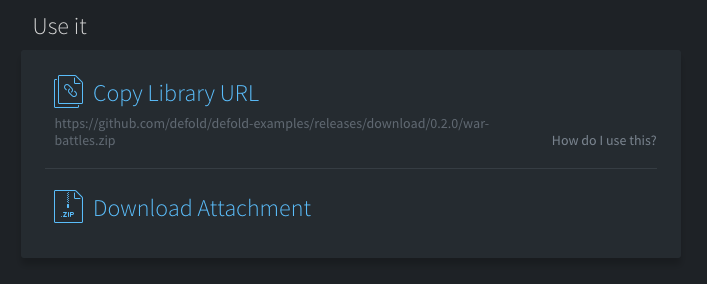
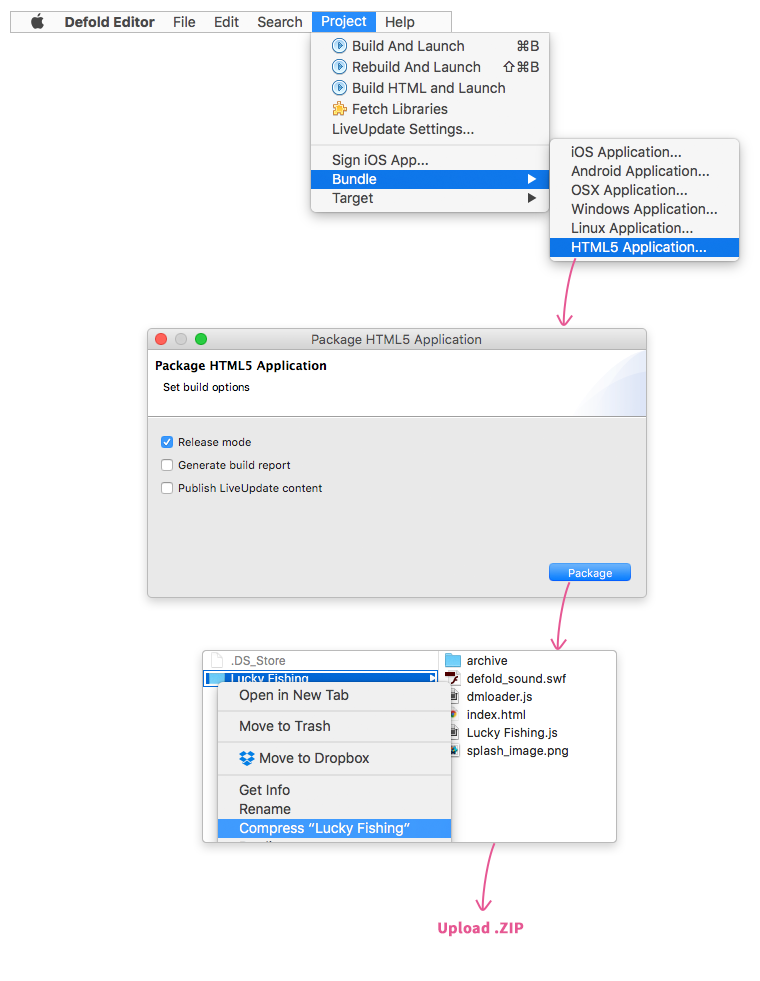

# The Defold Community Pages

We are in the process of building a community platform for all Defold users (known on the forums as "Project: Sticky Iron"). While we plan to continue to build features and expand the platform, the first release includes *community pages*---a new way to *easily share your games and assets*, as well as *find games and assets made by the community*.

__________________

## Community page

*"Community page"* is the umbrella term for all the pages listed on Games and Assets. Creating a community page is very easy---simply sign in to your dashboard, choose a project, click the “Community page” tab next to “Settings”, and click “Try it” to create either a *game community page* or an *asset community page*. You can also create a community page from the Games section or the Asset portal.

*The two steps required to create a community page*

Your community page will be *private* by default, until you feel ready to share it with the world (see visibility settings). There are two types of community pages: *game* community pages and *asset* community pages:

## Game community pages

Game pages are *community pages specifically for games*—finished as well as in production. You can customise your community page freely—add a dev log, tags, a HTML5 playable, add a description text, images, and more. All public game community pages are furthermore listed on the Games section.

## Asset community pages

Asset pages are *community pages specifically for assets*—libraries, extensions, example projects, standalone tools, tutorials, or whatever form your asset might have. It has all the components of a game community page, but what differs game pages from asset pages is that you can *enable library use* and/or *add an attachment*—depending on how you want to share your asset with the community. All public asset community pages are furthermore listed on the Asset portal.

*Asset pages allow you to enable library use of your asset, or upload an attachment.*

## Customisation

There are many ways in which you can customise your community page for you to make it look the way you want. This section will explain everything you can do—all of which can be done from the "Settings" tab, located on your community page directly below your community page title.

HTML5 playable
: Adding an HTML5 playable will allow people to easily play your game or try out your asset. To add a playable, simply follow these steps.

1. In Defold, choose <kbd>Project ▸ Bundle ▸ HTML5 application</kbd> (make sure to check "Release mode" in order to optimise HTML5 performance).

2. .zip the *folder* which is created from the bundling.

3. Click "Upload HTML5 playable" and upload the .zip file with the folder that was created in the bundling process.

{srcset="images/community/upload_html5@2x.png 2x"}

HTML5 playable cover image
: The HTML5 playable cover image is the *placeholder image* which is visible in the "Play it" section on your community page. A good idea is to use the title screen or a screenshot from your game.

Dev log
: You can very easily create a dev log on your community page, to let people know how it’s going with your game or asset. Simply click "New dev log" on the bottom of your community page, and you’re good to go.

Game/Asset title
: This is the name which will appear on your *community page* and the *listing page* for assets or games, depending on what type your project is. If your hero image already contains the title of your project, you can hide the default title.

Tags
: You can also add tags to make your game or asset easier to find. Games and assets have different sets of tags. You need to add tags to your community page before you can make it public.

Description
: The description is the main area where you describe your project. If your project is an asset, it is a good idea to write the instructions for how the community can use your asset here.

  Most Markdown features are allowed, meaning you can add headers, images, dividers, code snippets, and more. For an explanation on how Markdown works, we recommend reading this guide (https://guides.github.com/features/mastering-markdown/).

Screenshots
: You can add up to twelve screenshots to let people know what your game or asset is about. (Video support coming soon)

Thumbnail image
: The thumbnail image is the image displayed on the Games/Assets listing page.

Hero image
: The hero image (or cover image) is the large "first impression image" of your community page, and is displayed in the header area.

Link to external playable
: If you have playable versions of your game on an app store or an external site, you can add links to them here.

Studio
: This is used to display credits on the community page, and can link to your portfolio, studio website, or similar.

Website
: If your game or asset has an external website, Github repo, or similar, you can link to it here.

Social media links
: If you have social media pages for your game, you can link to them here.

## Visibility settings

Private
: Your community page is *private* by default. This means that the only persons who can access the community page are *you and your team* (the people with whom you have shared the project). All members of your team can edit the community page.

Public
: As soon as you are ready to show your game or asset to the world, all you have to do is click the "Private" button and choose “Public” as the visibility setting. Keep in mind that there are a few things you need to do before you can make your community page public:

Game page
: In order to make your game public, you need to add tags.

Asset page
: In order to make your asset public, you need to do the following:

  a) *Add tags,*

  b) *Choose a license.*

## Assets

Assets are community pages which either has a) *enabled library use*, or b) *added an attachment*. Asset pages will be listed on the Asset portal once they are made public.

## Enabling library use of your asset

If your asset is suited for library use (i.e. if you have made a library or an extension), choose "Add library URL" to add your library to your community page. This will allow you to choose hosting for your asset:

Easy hosting
: If you have your project hosted on the Defold servers (if you created your project from defold.com/dashboard), choosing this option will generate a library URL, usable by the community. Please note that you need to have folders added in *Include dirs* in your "game.project" file.

<!-- Note: It is very important for us that we can provide a stable hosting solution for people depending on assets hosted on Defold’s servers, which is why *it’s not possible to remove releases* hosted via Easy hosting, in order to never break dependencies to people using the library. However—this naturally does not prevent you from switching visibility setting back to "Private" (if you no longer want your asset to be public), or make new releases (if you find that there are bugs in your latest release)—*but projects which use your library or extension can always continue to do so.* If you are worried about breaking dependencies, it could be a good idea to locally download and store libraries and extensions you are using. -->

GitHub hosting
: If your asset is hosted in a public GitHub repo, choose this option, and enter the link to your extension or library .zip. Please note that you need to have a "game.project" file in the root folder of your .zip, and also have folders added in "Include dirs" in your "game.project" file.

## Attachment

You can also choose to add an attachment to your asset community page. This is a good option if your asset is a standalone tool, a downloadable example project, an asset pack, or similar.

## License

In order to make your asset page public, you need to choose a license which lets people know how they are allowed to use your asset. We recommend CC0 1.0 Universal, which lets people freely use your asset anyway they want. But you are of course free to use any license you want. If so, choose "Custom", and enter the link to the terms you want.

**tl;dr license descriptions:**

CC0 1.0 Universal [https://creativecommons.org/publicdomain/zero/1.0/](https://creativecommons.org/publicdomain/zero/1.0/)
: You’re free to use these assets in any project, personal or commercial. There’s no need to ask permission before using these. Giving attribution is not required.

MIT license [https://en.wikipedia.org/wiki/MIT_License](https://en.wikipedia.org/wiki/MIT_License)
: A short, permissive software license. You are free to do whatever you want as long as you include the original copyright and license notice in any copy of the software/source.

Apache License 2.0 [https://www.apache.org/licenses/LICENSE-2.0.html](https://www.apache.org/licenses/LICENSE-2.0.html)
: You can do what you like with the software, as long as you include the required notices. This permissive license contains a patent license from the contributors of the code.

GNU General Public License v 3.0 [https://opensource.org/licenses/GPL-3.0](https://opensource.org/licenses/GPL-3.0)
: You may copy, distribute and modify the software as long as you track changes/dates in source files. Any modifications to or software including (via compiler) GPL-licensed code must also be made available under the GPL along with build & install instructions. 

