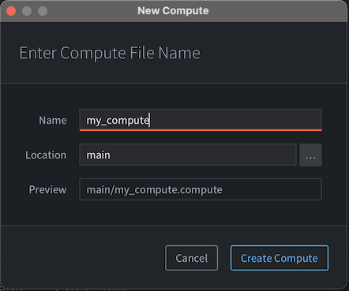
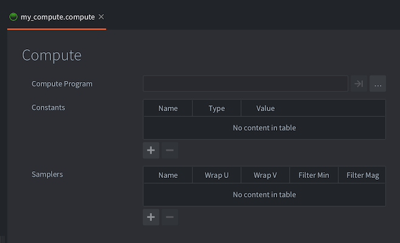
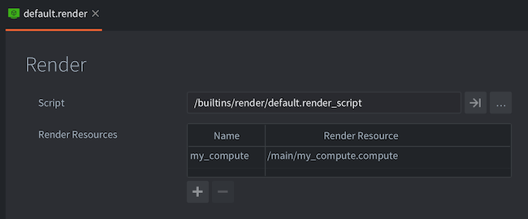

# Compute programs

::: sidenote
Compute shader support in Defold currently in *technical preview*.
This means that there are some features lacking, and that the API could potentially change in the future.
:::

Compute shaders are a powerful tool for performing general-purpose computations on the GPU. They allow you to leverage the parallel processing power of the GPU for tasks such as physics simulations, image processing, and more. A compute shader operates on data stored in buffers or textures, performing operations in parallel across many GPU threads. This parallelism is what makes compute shaders so powerful for intensive computations.

* For more information on the render pipeline, see the [Render documentation](/manuals/render).
* For an in depth explanation of shader programs, see the [Shader documentation](/manuals/shader).

## What can I do with compute shaders?

Since compute shaders are meant to be used for generic computation, there is really no limit to what you can do with them. Here are some examples what compute shaders are typically used for:

Image Processing
  - Image filtering: Apply blurs, edge detection, a sharpen filter and so on.
  - Color grading: Adjust the color space of an image.

Physics
  - Particle systems: Simulating large numbers of particles for effects like smoke, fire, and fluid dynamics.
  - Soft Body Physics: Simulating deformable objects like cloth and jelly.
  - Culling: Occlusion culling, frustum culling

Procedural Generation
  - Terrain Generation: Creating detailed terrain using noise functions.
  - Vegetation and Foliage: Creating procedurally generated plants and trees.

Rendering effects
  - Global illumination: Simulating realistic lighting by approximating the way light bounces around a scene.
  - Voxelization: Create a 3D voxel grid from mesh data.

## How does compute shaders work?

At a high level, compute shaders work by dividing a task into many smaller tasks that can be executed simultaneously. This is achieved through the concept of `work groups` and `invocations`:

Work Groups
: The compute shader operates on a grid of `work groups`. Each work group contains a fixed number of invocations (or threads). The size of the work groups and the number of invocations are defined in the shader code.

Invocations
: Each invocation (or thread) executes the compute shader program. Invocations within a work group can share data through shared memory, allowing for efficient communication and synchronization between them.

The GPU executes the compute shader by launching many invocations across multiple work groups in parallel, providing significant computational power for suitable tasks.

## Creating a compute program

To create a compute program, <kbd>right click</kbd> a target folder in the *Assets* browser and select <kbd>New... ▸ Compute</kbd>. (You can also select <kbd>File ▸ New...</kbd> from the menu, and then select <kbd>Compute</kbd>). Name the new compute file and press <kbd>Ok</kbd>.



The new compute will open in the *Compute Editor*.



The compute file contains the following information:

Compute Program
: The compute shader program file (*.cp*) to use. The shader operates on "abstract work items", meaning that there is no fixed definition of the input and output data types. It is up to the programmer to define what the compute shader should produce.

Constants
: Uniforms that will be passed to the compute shader program. See below for a list of available constants.

Samplers
: You can optionally configure specific samplers in the materials file. Add a sampler, name it according to the name used in the shader program and set the wrap and filter settings to your liking.


## Using the compute program in Defold

In contrast to materials, compute programs are not assigned to any components, and are not part of the normal render flow. A compute program must be `dispatched` in a render script to do any work. Before dispatching however, you need to make sure the render script has a reference to the compute program. Currently, the only way for a render script to know about the compute program is to add it into the .render file that holds the reference to your render script:



To use the compute program, it first needs to be bound to the render context. This is done in the same way as materials:

```lua
render.set_compute("my_compute")
-- Do compute work here, call render.set_compute() to unbind
render.set_compute()
```

While the compute constants will be automatically applied when the program is dispatched, there is no way to bind any inputs or output resources (textures, buffers and so on) to a compute program from the editor. Instead this must be done via render scripts:

```lua
render.enable_texture("blur_render_target", "tex_blur")
render.enable_texture(self.storage_texture, "tex_storage")
```

To run the program in the working space you have decided, you need to dispatch the program:

```lua
render.dispatch_compute(128, 128, 1)
-- dispatch_compute also accepts an options table as the last argument
-- you can use this argument table to pass in render constants to the dispatch call
local constants = render.constant_buffer()
constants.tint = vmath.vector4(1, 1, 1, 1)
render.dispatch_compute(32, 32, 32, {constants = constants})
```

### Writing data from compute programs

Currently, generating any type of output from a compute program can only be done via `storage textures`. A storage texture is similar to a "regular texture" except that they support more functionality and configurability. Storage textures, as the name implies, can be used as a generic buffer that you can read and write data to from a compute program. You can then bind the same buffer to a different shader program for reading.

To create a storage texture in Defold, you need to do this from a regular .script file. Render scripts does not have this functionality as dynamic textures need to be created via the resource API which is only available in regular .script files.

```lua
-- In a .script file:
function init(self)
    -- Create a texture resource like usual, but add the "storage" flag
    -- so it can be used as the backing storage for compute programs
    local t_backing = resource.create_texture("/my_backing_texture.texturec", {
        type   = resource.TEXTURE_TYPE_IMAGE_2D,
        width  = 128,
        height = 128,
        format = resource.TEXTURE_FORMAT_RGBA32F,
        flags  = resource.TEXTURE_USAGE_FLAG_STORAGE + resource.TEXTURE_USAGE_FLAG_SAMPLE,
    })

    -- get the texture handle from the resource
    local t_backing_handle = resource.get_texture_info(t_backing).handle

    -- notify the renderer of the backing texture, so it can be bound with render.enable_texture
    msg.post("@render:", "set_backing_texture", { handle = t_backing_handle })
end
```

## Putting it all together

### Shader program

```glsl
// compute.cp
#version 450

layout (local_size_x = 1, local_size_y = 1, local_size_z = 1) in;

// specify the input resources
uniform vec4 color;
uniform sampler2D texture_in;

// specify the output image
layout(rgba32f) uniform image2D texture_out;

void main()
{
    // This isn't a particularly interesting shader, but it demonstrates
    // how to read from a texture and constant buffer and write to a storage texture

    ivec2 tex_coord   = ivec2(gl_GlobalInvocationID.xy);
    vec4 output_value = vec4(0.0, 0.0, 0.0, 1.0);
    vec2 tex_coord_uv = vec2(float(tex_coord.x)/(gl_NumWorkGroups.x), float(tex_coord.y)/(gl_NumWorkGroups.y));
    vec4 input_value = texture(texture_in, tex_coord_uv);
    output_value.rgb = input_value.rgb * color.rgb;

    // Write the output value to the storage texture
    imageStore(texture_out, tex_coord, output_value);
}
```

### Script component
```lua
-- In a .script file

-- Here we specify the input texture that we later will bind to the
-- compute program. We can assign this texture to a model component,
-- or enable it to the render context in the render script.
go.property("texture_in", resource.texture())

function init(self)
    -- Create a texture resource like usual, but add the "storage" flag
    -- so it can be used as the backing storage for compute programs
    local t_backing = resource.create_texture("/my_backing_texture.texturec", {
        type   = resource.TEXTURE_TYPE_IMAGE_2D,
        width  = 128,
        height = 128,
        format = resource.TEXTURE_FORMAT_RGBA32F,
        flags  = resource.TEXTURE_USAGE_FLAG_STORAGE + resource.TEXTURE_USAGE_FLAG_SAMPLE,
    })

    local textures = {
        texture_in = resource.get_texture_info(self.texture_in).handle,
        texture_out = resource.get_texture_info(t_backing).handle
    }

    -- notify the renderer of the input and output textures
    msg.post("@render:", "set_backing_texture", textures)
end
```

### Render script
```lua
-- respond to the message "set_backing_texture"
-- to set the backing texture for the compute program
function on_message(self, message_id, message)
    if message_id == hash("set_backing_texture") then
        self.texture_in = message.texture_in
        self.texture_out = message.texture_out
    end
end

function update(self)
    render.set_compute("compute")
    -- We can bind textures to specific named constants
    render.enable_texture(self.texture_in, "texture_in")
    render.enable_texture(self.texture_out, "texture_out")
    render.set_constant("color", vmath.vector4(0.5, 0.5, 0.5, 1.0))
    -- Dispatch the compute program as many times as we have pixels.
    -- This constitutes our "working group". The shader will be invoked
    -- 128 x 128 x 1 times, or once per pixel.
    render.dispatch_compute(128, 128, 1)
    -- when we are done with the compute program, we need to unbind it
    render.set_compute()
end
```

## Compatability

Defold currently supports compute shaders in the following graphics adapters:

- Vulkan
- Metal (via MoltenVK)
- OpenGL 4.3+
- OpenGL ES 3.1+

::: sidenote
There is currently no way to check if the running client supports compute shaders.
This means that there is no guarantee that the client supports running compute shaders if the graphics adapter is OpenGL, or OpenGL ES based.
Vulkan and Metal support compute shaders from version 1.0. To use Vulkan, you need to create a custom manifest and select Vulkan as the backend.
:::

