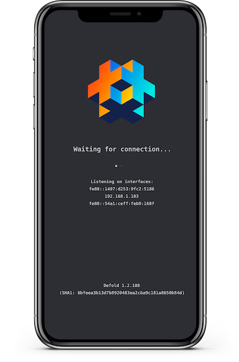

# The mobile development app

The development app is a very convenient bare bones version of the engine that allows you to push content to it over wifi. You install the development app on your device(s), start the app and then select the device as a build target from the editor.

## Signing the development app (iOS)

Currently, at least one team member needs to run macOS and act as signer. The signer needs a code signing identity certificate installed on his/her computer. The signer also needs a mobile provisioning profile on his/her computer. (Note that the auto generated free provisioning profile Xcode can generate is only valid for one device)

To upload a signed development app to the Defold Dashboard, the following steps are required:

- In the editor, select <kbd>Project ▸ Sign iOS App...</kbd>
- Select your code signing identity.
- Browse for your mobile provisioning file.
- Press the <kbd>Sign</kbd> button.


The Defold dev app is uploaded to the project page on the Dashboard.
Each project member can now:

- Browse to the Dashboard from their iOS device.
- Open the project page from the list of projects.
- Click the link *Install the Defold App*, which can be found below the *Members* section.


## Installing the development dmengine (Android)

A stand-alone version of the Defold engine is available as a ready made *.apk* file that you can install on a device and use for iterative development wirelessly.

* Visit http://d.defold.com where Defold downloads can be found.
* Click on the version you want to download to expand a list of available engine builds.
* Select *engine/armv7-android/dmengine.apk* for a debug enabled build for the Android platform (Armv7).


Download the file, then issue the following `adb` command from the location of the *.apk*:

```sh
$ adb install dmengine.apk
4445 KB/s (8706017 bytes in 1.912s)
    pkg: /data/local/tmp/dmengine.apk
Success
```

The development "dmengine" app is now available on the device.


## Launching your game

To launch your game on your device, the dev app and editor must be able to connect, over the same wifi network or using USB (see below).

1. Make sure the editor is up and running.
2. Launch the dev app on the device.
3. Select your device under <kbd>Project ▸ Targets</kbd> in the editor.
4. Select <kbd>Project ▸ Build And Launch</kbd> to run the game. It may take a while for the game to start since the game content is streamed to the device over the network.
5. While the game is running, you can use [hot reloading](/manuals/debugging#_hot_reloading) as usual.



### Connecting to an iOS device using USB on Windows

When connecting over USB on Windows to a dev app running on an iOS device you first need to [install iTunes](https://www.apple.com/lae/itunes/download/). When iTunes is installed you also need to [enable Personal Hotspot](https://support.apple.com/en-us/HT204023) on your iOS device from the Settings menu. If you see an alert that says tap "Trust This Computer?" tap Trust. The device should now show up under <kbd>Project ▸ Targets</kbd> when the dev app is running.

### Connecting to an iOS device using USB on Linux

On Linux you need to enable Personal Hotspot on your device from the Settings menu when connected using USB. If you see an alert that says tap "Trust This Computer?" tap Trust. The device should now show up under <kbd>Project ▸ Targets</kbd> when the dev app is running.

### Connecting to an iOS device using USB on OSX

On newer iOS versions the device will automatically open a new ethernet interface between the device and computer when connected using USB on OSX. The device should show up under <kbd>Project ▸ Targets</kbd> when the dev app is running.

On older iOS versions you need to enable Personal Hotspot on your device from the Settings menu when connected using USB on OSX. If you see an alert that says tap "Trust This Computer?" tap Trust. The device should now show up under <kbd>Project ▸ Targets</kbd> when the dev app is running.

### Connecting to an Android device using USB on OSX

On OSX it is possible to connect over USB to a running dev app on an Android device when the device is in USB Tethering Mode. On MacOS you need to install a third-party driver such as [HoRNDIS](https://joshuawise.com/horndis#available_versions). When HoRNDIS is installed you also need to allow it to run via the Security & Privacy settings. Once USB Tethering is enabled the device will show up under <kbd>Project ▸ Targets</kbd> when the dev app is running.

### Connecting to an Android device using USB on Windows or Linux

On Windows and Linux it is possible to connect over USB to a running dev app on an Android device when the device is in USB Tethering Mode. Once USB Tethering is enabled the device will show up under <kbd>Project ▸ Targets</kbd> when the dev app is running.

## Troubleshooting

Unable to download application
: Make sure the your device UDID is included in the mobile provisioning that was used for signing the app.

Your device does not appear in the Targets menu
: Make sure that your device is connected to the same wifi network as your computer.

The game does not start with a message about mis-matching versions
: This happens when you have upgraded the editor to the latest version. On iOS you need to sign the app again (<kbd>Project ▸ Sign iOS App...</kbd>) which creates a new dev app from the current engine version. Then download the new app from the dashboard onto your device. On Android you will need to download a new *dmengine.apk* and install it on your device.
