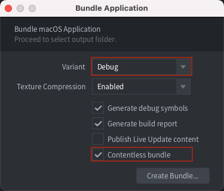

# The mobile development app

The development app allows you to push content to it over wifi. This will greatly reduce iteration time as you don't have to bundle and install every time you wish to test your changes. You install the development app on your device(s), start the app and then select the device as a build target from the editor.

## Installing a development app

Any iOS or Android application that is bundled in Debug mode will be able to act as a development app. In fact, this is the recommended solution as the development app will have the correct project settings and uses the same [native extensions](/manuals/extensions/) as the project you are working on. 

Starting with Defold 1.4.0 it is possible to bundle a Debug variant of your project without any content. Use this option to create a version of your application with native extensions, suitable for iterative development as described in this manual.

### Installing on iOS

Follow the [instructions in the iOS manual](/manuals/ios/#creating-an-ios-application-bundle) to bundle for iOS. Make sure to select Debug as variant!

### Installing on Android

Follow the [instructions in the Android manual](https://defold.com/manuals/android/#creating-an-android-application-bundle) to bundle for Android.

## Launching your game

To launch your game on your device, the dev app and editor must be able to connect, over the same wifi network or using USB (see below).

1. Make sure the editor is up and running.
2. Launch the dev app on the device.
3. Select your device under <kbd>Project ▸ Targets</kbd> in the editor.
4. Select <kbd>Project ▸ Build</kbd> to run the game. It may take a while for the game to start since the game content is streamed to the device over the network.
5. While the game is running, you can use [hot reloading](/manuals/hot-reload/) as usual.

### Connecting to an iOS device using USB on Windows

When connecting over USB on Windows to a dev app running on an iOS device you first need to [install iTunes](https://www.apple.com/lae/itunes/download/). When iTunes is installed you also need to [enable Personal Hotspot](https://support.apple.com/en-us/HT204023) on your iOS device from the Settings menu. If you see an alert that says tap "Trust This Computer?" tap Trust. The device should now show up under <kbd>Project ▸ Targets</kbd> when the dev app is running.

### Connecting to an iOS device using USB on Linux

On Linux you need to enable Personal Hotspot on your device from the Settings menu when connected using USB. If you see an alert that says tap "Trust This Computer?" tap Trust. The device should now show up under <kbd>Project ▸ Targets</kbd> when the dev app is running.

### Connecting to an iOS device using USB on macOS

On newer iOS versions the device will automatically open a new ethernet interface between the device and computer when connected using USB on macOS. The device should show up under <kbd>Project ▸ Targets</kbd> when the dev app is running.

On older iOS versions you need to enable Personal Hotspot on your device from the Settings menu when connected using USB on macOS. If you see an alert that says tap "Trust This Computer?" tap Trust. The device should now show up under <kbd>Project ▸ Targets</kbd> when the dev app is running.

### Connecting to an Android device using USB on macOS

On macOS it is possible to connect over USB to a running dev app on an Android device when the device is in USB Tethering Mode. On macOS you need to install a third-party driver such as [HoRNDIS](https://joshuawise.com/horndis#available_versions). When HoRNDIS is installed you also need to allow it to run via the Security & Privacy settings. Once USB Tethering is enabled the device will show up under <kbd>Project ▸ Targets</kbd> when the dev app is running.

### Connecting to an Android device using USB on Windows or Linux

On Windows and Linux it is possible to connect over USB to a running dev app on an Android device when the device is in USB Tethering Mode. Once USB Tethering is enabled the device will show up under <kbd>Project ▸ Targets</kbd> when the dev app is running.

## Troubleshooting

Unable to download application
: Make sure the your device UDID is included in the mobile provisioning that was used for signing the app.

Your device does not appear in the Targets menu
: Make sure that your device is connected to the same wifi network as your computer. Make sure the dev app is built in Debug mode.

The game does not start with a message about mis-matching versions
: This happens when you have upgraded the editor to the latest version. You need to build and install a new version.
