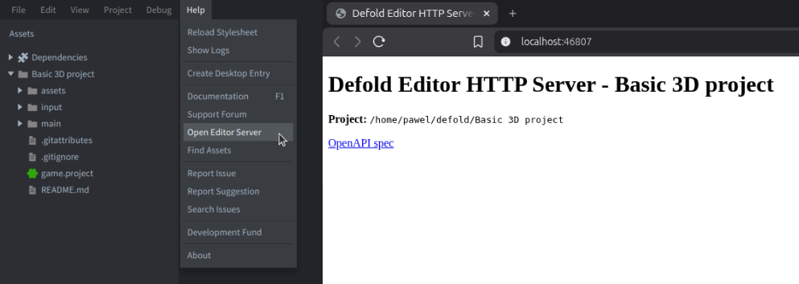

# Automating the Defold editor with HTTP

The editor HTTP API controls an open project in the Defold editor. Use it for editor commands, builds, project resources, previews, preferences, console output, documentation search, and editor-script integrations. To inspect or control the running game instead, use the [engine service or a runtime automation API](/manuals/engine-service).

::: important
The editor HTTP API is experimental and may change between Defold versions. The `/openapi.json` document generated by the running editor is the source of truth for its available operations and schemas.
:::

## Starting the editor from an external tool

An external tool needs the editor executable and the absolute path to the project's `game.project` file.

Installed Defold versions can be located through `installations.json`, as described in the [Editor manual](/manuals/editor/#editor-installation-metadata). Its `launcherPath` field contains the executable to start. Pass the `game.project` path as the first positional argument to open that project directly.

The optional `--port` or `-p` argument selects the editor server port. Omitting it lets Defold choose an available port and is usually preferable when several projects may be open.

```sh
# Linux
/path/to/Defold/Defold --port 8181 /absolute/path/to/project/game.project
```

```sh
# macOS
/path/to/Defold.app/Contents/MacOS/Defold --port 8181 /absolute/path/to/project/game.project
```

```powershell
# Windows
C:\path\to\Defold\Defold.exe --port 8181 C:\absolute\path\to\project\game.project
```

The editor is a graphical desktop application. Start it in an interactive user session with access to the display. Use [Bob](/manuals/bob) when a graphical session is unavailable, such as in headless CI.

After starting the editor, wait until the project has opened and `.internal/editor.port` exists. Then poll `/openapi.json` until it returns a valid document. Do not assume that creating the process means the project is ready.

## Locating the editor server

The editor starts a local HTTP server while a project is open. Select <kbd>Help ▸ Open Editor Server</kbd> to open its home page in the default browser:



The selected port is written inside the project to:

```text
.internal/editor.port
```

The examples in this manual use these shell variables:

```sh
PORT="$(cat .internal/editor.port)"
BASE_URL="http://127.0.0.1:$PORT"
```

The port file belongs to the current editor session. Read it again after restarting the editor.

::: important
The editor server is a trusted local control interface. Connect through `127.0.0.1` and do not expose it through a public address, port forward, or untrusted tunnel.
:::

## Discovering operations through OpenAPI

The only Defold-specific bootstrap information an external tool should need is the editor port and the OpenAPI document:

```sh
curl -sS "http://127.0.0.1:$(cat .internal/editor.port)/openapi.json"
```

The returned OpenAPI 3.0.3 document describes the operations supported by the running editor version, including paths, methods, parameters, command names, request formats, responses, status codes, and authentication requirements.

List the documented paths:

```sh
curl -sS "$BASE_URL/openapi.json" |
  jq -r '.paths | keys[]'
```

List the available editor commands:

```sh
curl -sS "$BASE_URL/openapi.json" |
  jq -r '
    .paths["/command/{command}"].post.parameters[]
    | select(.name == "command")
    | .schema.enum[]
  '
```

A version-aware integration should verify each required operation and configure requests from the returned schema. Do not maintain a supposedly exhaustive copy of endpoint or command names.

Project-defined routes also appear in `/openapi.json` when their editor scripts provide an OpenAPI operation description.

## Executing editor commands

Editor commands are invoked through:

```text
POST /command/{command}
```

For example, the current `build` command compiles and runs the project:

```sh
curl -sS \
  -X POST \
  "$BASE_URL/command/build" |
  jq
```

A successful build returns a structured result:

```json
{
  "success": true,
  "issues": []
}
```

A failed build returns HTTP status `422` with issues such as:

```json
{
  "success": false,
  "issues": [
    {
      "message": "Example compiler message",
      "severity": "error",
      "resource": "/main/player.script",
      "range": {
        "start": {
          "line": 12,
          "character": 4
        },
        "end": {
          "line": 12,
          "character": 17
        }
      }
    }
  ]
}
```

The available fields depend on the error. Use the resource path and source range when present, but also handle issues that contain only a message.

Commonly useful commands, when listed by the running editor, include:

`build`
: Compile and run the project.

`clean-build`
: Clear the build cache, then compile and run. Use this only when an ordinary build behaves inconsistently or appears to miss changes.

`build-html5`
: Build the project for HTML5 and make the output available through the editor server.

`fetch-libraries`
: Download and reload project dependencies.

`hot-reload`
: Reload modified resources into a running game.

`reload-extensions`
: Reload editor scripts.

`debugger-start`, `debugger-stop`, and the debugger step commands
: Control a debug session and the running project.

This is not an exhaustive command reference. Exact names and availability depend on the editor version and current editor state; discover them from `/openapi.json`.

Commands that operate on project resources synchronize external file changes before execution. This supports a reliable loop:

```text
edit file --> POST /command/build --> inspect issues and runtime output
```

For compile-only automation, standalone bundles, or headless CI, use [Bob](/manuals/bob).

### Command responses and asynchronous work

The command operation documents response codes in the current OpenAPI schema. Typical meanings are:

| Status | Meaning |
| --- | --- |
| `200` | The command completed and returned a result |
| `202` | The command was accepted and continues asynchronously |
| `403` | The command is not active in the current editor state |
| `404` | The command is not available |
| `422` | Build or validation failed |
| `500` | An internal editor error occurred |

An HTTP `202` response is not proof that the requested result exists. Wait for the relevant output, resource, console marker, or served URL and enforce a timeout.

### Building HTML5

If the current OpenAPI document lists `build-html5`, invoke it through the command operation:

```sh
curl -sS \
  -X POST \
  "$BASE_URL/command/build-html5"
```

The command runs asynchronously and normally returns HTTP `202`. After the build completes, the editor serves it at:

```text
http://127.0.0.1:<editor-port>/html5/
```

Wait until the URL is available before starting browser tests. See [Browser tests for HTML5](/manuals/automated-testing/#browser-tests-for-html5).

## Searching API documentation

When present in `/openapi.json`, the `/ref` operation searches API documentation included with the running editor version. It provides names and signatures that match that version.

Search for a function:

```sh
curl -sS \
  --get \
  --data-urlencode "q=go.animate" \
  "$BASE_URL/ref" |
  jq
```

Filter by environment and language:

```sh
curl -sS \
  --get \
  --data-urlencode "environment=runtime" \
  --data-urlencode "language=Lua" \
  --data-urlencode "q=collision message|raycast" \
  "$BASE_URL/ref" |
  jq
```

The search parameters are:

`environment`
: `editor`, `runtime`, or comma-separated values.

`language`
: `Lua`, `C`, `C++`, or comma-separated values.

`q`
: A case-insensitive expression. Whitespace represents AND, while `|` represents OR.

Prefer focused searches instead of retrieving an entire reference when only one API or message is needed.

## Reading console output

Read the editor console as JSON:

```sh
curl -sS "$BASE_URL/console" | jq
```

The response contains console text in `lines` and semantic regions in `regions`, including errors, evaluation results, and resource references.

Follow console output continuously:

```sh
curl -N "$BASE_URL/console/stream"
```

The stream includes existing console lines and then remains open for new output. Close it after receiving a completion marker or error, detecting process termination, or reaching a timeout or line limit.

For test-result framing and failure classification, see [Automated testing and verification](/manuals/automated-testing/#structured-test-results).

## Rendering scene previews

When `/preview/{path}` is available, the editor can render a supported scene resource to PNG:

```sh
mkdir -p build/automation

curl -sS \
  "$BASE_URL/preview/main/main.collection?width=1280&height=720" \
  --output build/automation/main-preview.png
```

This renders the main collection from the open Basic 3D template project:


Render its cube model in the same way:

```sh
curl -sS \
  "$BASE_URL/preview/assets/models/cube.model?width=1280&height=720" \
  --output build/automation/cube-preview.png
```


The path after `/preview/` does not include a leading slash. The optional dimensions default to the project display size and must be between `1` and `4096`.

| Status | Meaning |
| --- | --- |
| `200` | The preview was rendered |
| `400` | The dimensions are invalid |
| `404` | The resource was not found |
| `422` | The resource is not loaded or does not support scene previews |

Previews are useful for checking static level and GUI layouts, shader and lighting setup, visual regressions, and documentation thumbnails.

::: important
An editor preview is not a screenshot of the running game. It does not verify scripts, input, physics, dynamically created objects, runtime post-processing, or platform-specific rendering. Use a [runtime screenshot](/manuals/automated-testing/#editor-previews-and-runtime-screenshots) when those elements matter.
:::

## Executing editor Lua

The authenticated `POST /eval` operation executes Lua in the editor extension environment. The per-session bearer token is stored in:

```text
.internal/editor.token
```

Read the token and execute code:

```sh
TOKEN="$(cat .internal/editor.token)"

curl -sS \
  -H "Authorization: Bearer $TOKEN" \
  -H "Content-Type: text/plain" \
  --data-binary 'print(editor.version) return editor.platform' \
  "$BASE_URL/eval"
```

Printed output and return values are returned as text. Typical responses are:

| Status | Meaning |
| --- | --- |
| `200` | The code was executed |
| `401` | The bearer token is missing or invalid |
| `422` | The Lua code could not be parsed or executed |
| `503` | The editor extension environment is not ready |

A client may retry after `503`, but it should use a bounded number of attempts. Correct the code before repeating a request that returned `422`.

Evaluated code can use the [Editor API](https://defold.com/ref/editor-lua/) and the editor scripting environment. It cannot use game runtime APIs such as `go.*` to manipulate a running game. Use a runtime test, debugger, browser test, or [runtime automation API](/manuals/engine-service/#automation-bridge-extension) for gameplay.

### Modifying resources and files

Many Defold source resources use text formats, but their schemas are implementation details of the editor. Prefer editor transactions for structured resources:

| Change | Preferred method |
| --- | --- |
| Lua, shader, JSON, or another known text format | Direct file modification |
| Unsaved text in an open editor tab | `editor.get()` and `editor.transact()` |
| Collection, game object, GUI, atlas, or another structured resource | Editor transaction |
| Repeatedly generated content | Standalone generator |
| Repeatable project operation | Editor command or custom HTTP endpoint |
| CI-only transformation | Standalone script run before Bob |

Inspect a resource before changing it:

```sh
curl -sS \
  -H "Authorization: Bearer $TOKEN" \
  -H "Content-Type: text/plain" \
  --data-binary '
    local path = "/game.project"
    pprint(editor.properties(path))
    return editor.get(path, "path")
  ' \
  "$BASE_URL/eval"
```

Check `editor.can_get()`, `editor.can_set()`, and the other `editor.can_*()` functions before performing a transaction.

Use `editor.execute()` in editor Lua to run a formatter, validator, or generator:

```lua
local output = editor.execute(
  "python3",
  "scripts/generate_levels.py",
  {
    out = "capture"
  }
)

print(output)
```

When the command does not modify project resources, set `reload_resources = false` to avoid an unnecessary reload.

::: important
Do not modify files in `.internal/` or generated content in `build/`.
:::

## Preferences

Editor preferences can be read and written through the path documented in OpenAPI, currently `/prefs/{path}`.

Read the configured code font size:

```sh
curl -sS "$BASE_URL/prefs/code/font/size" | jq
```

Set it to 16:

```sh
curl -sS \
  -X POST \
  -H "Content-Type: application/json" \
  --data '16' \
  "$BASE_URL/prefs/code/font/size"
```

The editor validates the value against its preference schema. An invalid path or value returns HTTP `400`.

Preferences are persistent user or project-user settings, not project configuration stored in `game.project`. If automation changes a preference temporarily, save the previous value and restore it afterward.

## Project-defined routes

Editor scripts can define additional routes with [`get_http_server_routes()`](/manuals/editor-scripts/#http-server). An optional OpenAPI operation table exposes a route through the same `/openapi.json` document as built-in operations.

Project-defined routes can provide content generation, validation, reports, localization checks, resource analysis, project-specific tests, or a smaller interface for an IDE or external controller.

A good route should perform one clearly named operation, validate its input, return a structured result, be idempotent where possible, and limit expensive work.

Project-defined routes are not automatically protected by the `/eval` token. Add project-specific authentication and safety checks when a route performs sensitive operations.

## Lifecycle hooks

A project can contain one `hooks.editor_script` file in its root. Hooks run before and after builds, before and after bundle creation, and when a game process starts or terminates. Only the root hook file receives these events, giving the project one place to define their order.

```lua
local M = {}

local function validate_project()
  print(editor.execute(
    "python3",
    "scripts/validate_project.py",
    {
      out = "capture",
      reload_resources = false
    }
  ))
end

function M.on_build_started(opts)
  validate_project()
end

function M.on_build_finished(opts)
  print("Build successful:", opts.success)
end

return M
```

An error raised from `on_build_started()` stops the editor build. Lifecycle hooks run only in the editor; put shared validation and generation logic in standalone scripts that can also be invoked from CI.

## Security and compatibility

Treat the entire editor server as a trusted local interface:

* Do not expose the port access publicly.
* Protect `.internal/editor.token`; it authorizes `/eval` for the current session.
* Do not give every model unrestricted `/eval` access.
* Keep the token in the local integration layer rather than prompts, reports, or logs.
* Remember that project-defined routes do not inherit `/eval` authentication.
* Read up-to-date `/openapi.json` after editor restart, before relying on an operation.
* Use bounded waits for asynchronous commands and for editor startup.

## Engine Server

The editor server belongs to the editor process. A running game has a different port and different responsibilities, described in [the engine service and runtime HTTP API manual](/manuals/engine-service).
