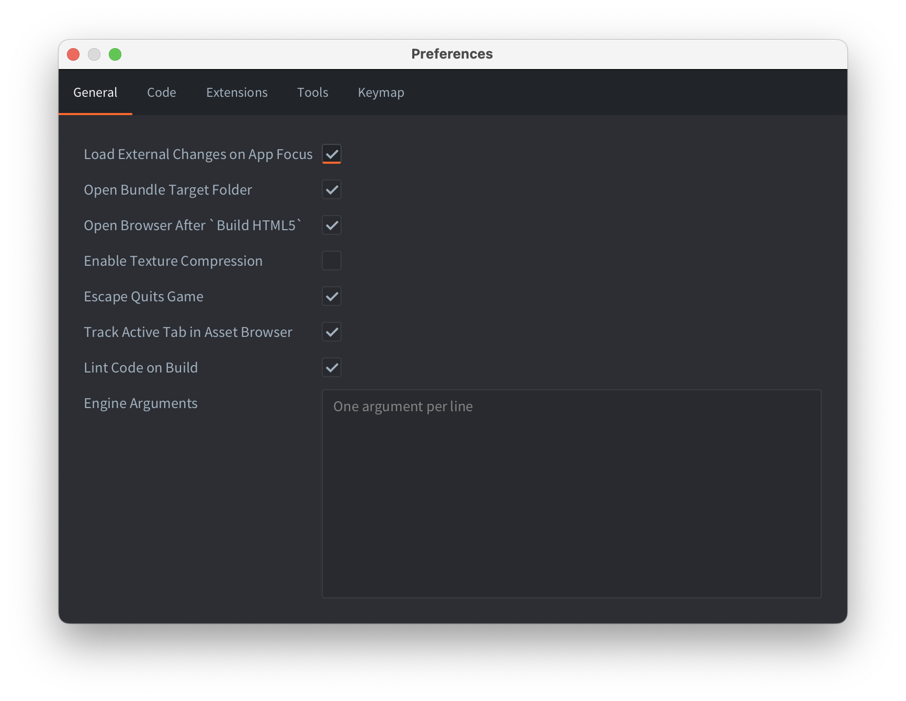

# Editor preferences

You can modify the settings of the editor from the Preferences window. The preferences window is opened from the <kbd>File -> Preferences</kbd> menu.

## General

{srcset="images/editor/preferences_general@2x.png 2x"}

Load External Changes on App Focus
: Enables scanning for external changes when the editor receives focus.

Open Bundle Target Folder
: Enables opening of the target bundle folder after bundling process is done.

Enable Texture Compression
: Enables [texture compression](/manuals/texture-profiles) for all builds made from the editor.

Escape Quits Game
: Shutdown a running build of your game using the <kbd>Esc</kbd> key.

Track Active Tab in Asset Browser
: The file edited in selected tab in the *Editor* pane will be selected in the Asset Browser (also known as the *Asset* pane).

Path to custom keymap
: Absolute path to a file containing [custom keyboard shortcuts](/manuals/editor-keyboard-shortcuts).

## Code

{srcset="images/editor/preferences_code@2x.png 2x"}

Custom Editor
: Absolute path to an external editor. On macOS it should be the path to the executable inside the .app (eg `/Applications/Atom.app/Contents/MacOS/Atom`).

Open File
: The pattern used by the custom editor to specify which file to open. The pattern `{file}` will be replaced by the filename to open.

Open File at Line
: The pattern used by the custom editor to specify which file to open and on which line number. The pattern `{file}` will be replaced by the filename to open and `{line}` by the line number.

Code editor font
: Name of a system installed font to use in the code editor.
◊

## Extensions

{srcset="images/editor/preferences_extensions@2x.png 2x"}

Build Server
: URL to the build server used when building a project containing [native extensions](/manuals/extensions). It is possible to add a username and access token to the URL for authenticated access to the build server. Use the following notation to specify the username and access token: `username:token@build.defold.com`. Authenticated access is required for Nintendo Switch builds and when running your own build server instance with authentication enabled ([refer to the build server documentation](https://github.com/defold/extender/blob/dev/README_SECURITY.md) for more information). The username and password can also be set as the system environment variables `DM_EXTENDER_USERNAME` and `DM_EXTENDER_PASSWORD`.

Build Server Headers
: additional headers to the build server when building native extensions. It's important for using CloudFlare service or similar services with extender.
