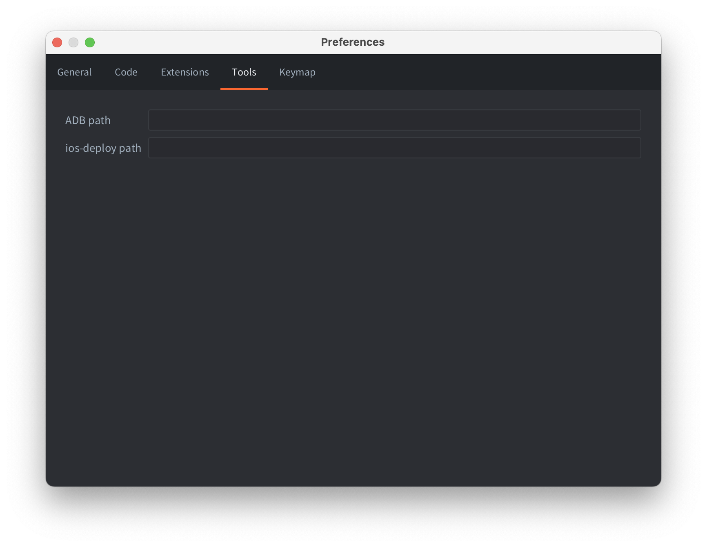
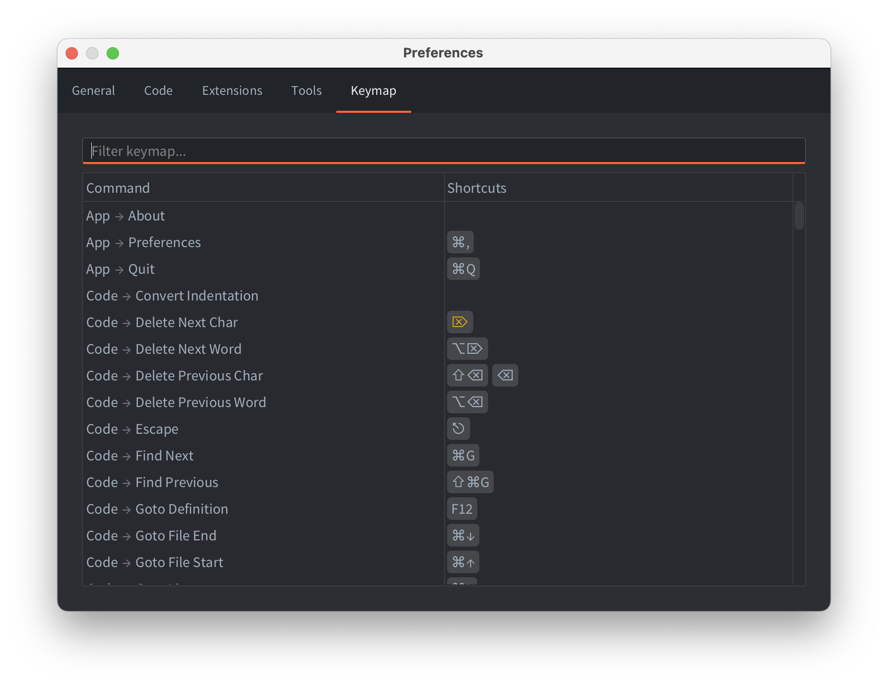

# Editor preferences

You can modify the settings of the editor from the Preferences window. The preferences window is opened from the <kbd>File -> Preferences</kbd> menu.

## General


Load External Changes on App Focus
: Enables scanning for external changes when the editor receives focus.

Open Bundle Target Folder
: Enables opening of the target bundle folder after bundling process is done.

Enable Texture Compression
: Enables [texture compression](/manuals/texture-profiles) for all builds made from the editor.

Escape Quits Game
: Shutdown a running build of your game using the <kbd>Esc</kbd> key.

Track Active Tab in Asset Browser
: The file edited in selected tab in the *Editor* pane will be selected in the Asset Browser (also known as the *Asset* pane).

Lint Code on Build
: Enables [code linting](/manuals/writing-code/#linting-configuration) when the project is built. This option is enabled by default, but can be disabled if the linting in a large project takes too much time.

Engine Arguments
: Arguments that will be passed to the dmengine executable when the editor builds and runs.
 Use one argument per line. For example:
 ```
--config=bootstrap.main_collection=/my dir/1.collectionc
--verbose
--graphics-adapter=vulkan
```


## Code


Custom Editor
: Absolute path to an external editor. On macOS it should be the path to the executable inside the .app (e.g. `/Applications/Atom.app/Contents/MacOS/Atom`).

Open File
: The pattern used by the custom editor to specify which file to open. The pattern `{file}` will be replaced by the filename to open.

Open File at Line
: The pattern used by the custom editor to specify which file to open and on which line number. The pattern `{file}` will be replaced by the filename to open and `{line}` by the line number.

Code editor font
: Name of a system installed font to use in the code editor.

Zoom on Scroll
: Whether to change the font size when scrolling in the code editor while holding Cmd/Ctrl button.


### Open script files in Visual Studio Code


To open script files from the Defold Editor directly in Visual Studio Code, you must set the following settings by specifying the path to the executable file:

- MacOS: `/Applications/Visual Studio Code.app/Contents/MacOS/Electron`
- Linux: `/usr/bin/code`
- Windows: `C:\Program Files\Microsoft VS Code\Code.exe`

 Set these parameters to open specific files and lines:

- Open File: `. {file}`
- Open File at Line: `. -g {file}:{line}`

The `.` character here is required to open the entire workspace, not an individual file.


## Extensions


Build Server
: URL to the build server used when building a project containing [native extensions](/manuals/extensions). It is possible to add a username and access token to the URL for authenticated access to the build server. Use the following notation to specify the username and access token: `username:token@build.defold.com`. Authenticated access is required for Nintendo Switch builds and when running your own build server instance with authentication enabled ([refer to the build server documentation](https://github.com/defold/extender/blob/dev/README_SECURITY.md) for more information). The username and password can also be set as the system environment variables `DM_EXTENDER_USERNAME` and `DM_EXTENDER_PASSWORD`.

Build Server Username
: username for authentication.

Build Server Password
: password for authentication, will be stored encrypted in the preferences file.

Build Server Headers
: additional headers to the build server when building native extensions. It's important for using CloudFlare service or similar services with extender.

## Tools



ADB path
: Path to [ADB](https://developer.android.com/tools/adb) command line tool installed on this system. If you have ADB installed on your system, the Defold editor will use it to install and run bundled Android APKs to a connected Android Device. By default, the editor checks if ADB is installed in well-known locations, so you only need to specify the path if you have ADB installed in a custom location.

ios-deploy path
: Path to [ios-deploy](https://github.com/ios-control/ios-deploy) command line tools installed on this system (only relevant for macOS). Similarly to the ADB path, the Defold editor will use this tool to install and run bundled iOS applications on a connected iPhone. By default, the editor checks if ios-deploy is installed in well-known locations, so you only need to specify the path if you use a custom installation of ios-deploy.

## Keymap



You can configure the editor shortcuts, both adding custom and removing the built-in ones. Use context menu on individual commands in the shortcut table to edit the shortcuts, or double-click/press <kbd>Enter</kbd> to open a new shortcut popup.

Some shortcuts might have warnings: they are displayed using orange color. Hover over the shortcut to see the warning. Typical warnings are:
- typeable shortcuts: the selected shortcut is typeable in a text inputs. Make sure the command is off in the code editing / text input contexts. 
- conflicts: the same shortcut is assigned to multiple different commands. Make sure at most one command is enabled when the shortcut is invoked, otherwise the editor will execute one of the assigned commands in an undefined manner.