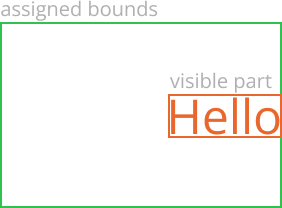
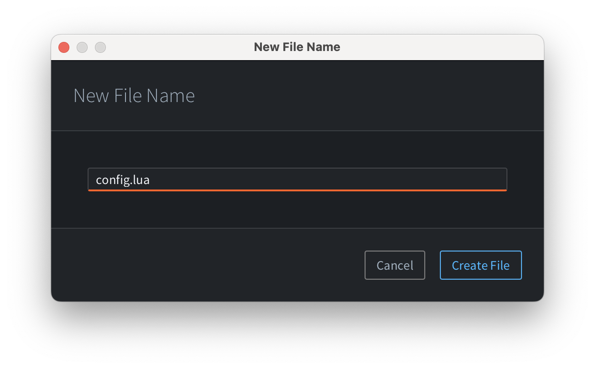

# Editor scripts and UI

This manual explains how to create interactive UI elements in the editor using editor scripts written in Lua. To get started with editor scripts, see [Editor Scripts manual](/manuals/editor-scripts). Currently, it's only possible to create interactive dialogs, though we want to expand the UI scripting support to the rest of the editor in the future.

## Hello world

All UI-related functionality exists in the `editor.ui` module. Here is the simplest example of an editor script with a custom UI to get started:
```lua
local M = {}

function M.get_commands()
    return {
        {
            label = "Do with confirmation",
            locations = {"View"},
            run = function()
                local result = editor.ui.show_dialog(editor.ui.dialog({
                    title = "Perform action?",
                    buttons = {
                        editor.ui.dialog_button({
                            text = "Cancel",
                            cancel = true,
                            result = false
                        }),
                        editor.ui.dialog_button({
                            text = "Perform",
                            default = true,
                            result = true
                        })
                    }
                }))
                print('Perform action:', result)
            end
        }
    }
end

return M

```

This code snippet defines a **View → Do with confirmation** command. When you execute it, you will see the following dialog:


Finally, after pressing <kbd>Enter</kbd> (or clicking on the `Perform` button), you'll see the following line in the editor console:
```
Perform action:	true
```

## Basic concepts

### Components

The editor provides various UI **components** that can be composed to create the desired UI. By convention, all components are configured using a single table called **props**. The components themselves are not tables, but **immutable userdatas** used by the editor for creating the UI.

### Props

**Props** are tables that define inputs into components. Props should be treated as immutable: mutating the props table in-place will not cause the component to re-render, but using a different table will. UI is updated when the component instance receives a props table that is not shallow-equal to the previous one.

### Alignment

When the component gets assigned some bounds in the UI, it will consume the whole space, though it does not mean that the visible part of the component will stretch. Instead, the visible part will take the space it needs, and then it will be aligned within the assigned bounds. Therefore, most built-in components define an `alignment` prop.

For example, consider this label component:
```lua
editor.ui.label({
    text = "Hello",
    alignment = editor.ui.ALIGNMENT.RIGHT
})
```
The visible part is the `Hello` text, and it's aligned within the assigned component bounds:



## Built-in components

The editor defines various built-in components that can be used together to build the UI. Components may be roughly grouped into 3 categories: layout, data presentation and input.

### Layout components

Layout components are used for placing other components next to each other. Main layout components are **`horizontal`**, **`vertical`** and **`grid`**. These components also define props such as **padding** and **spacing**, where padding is an empty space from the edge of the assigned bounds to the content, and spacing is an empty space between children:


Editor defines `small`, `medium` and `large` padding and spacing constants. When it comes to spacing, `small` is intended for spacing between different sub-elements of an individual UI element, `medium` is for spacing between individual UI elements, and `large` is a spacing between groups of elements. Default spacing is `medium`. With paddings, `large` means padding from the edges of the window to content, `medium` is padding from the edges of a significant UI element, and `small` is a padding from the edges of small UI elements like context menus and tooltips (not implemented yet).

A **`horizontal`** container places its children one after another horizontally, always making the height every child fill the available space. By default, the width of every child is kept to a minimum, though it's possible to make it take as much space as possible by setting `grow` prop to `true` on a child.

A **`vertical`** container is similar to horizontal, but with the axes switched.

Finally, **`grid`** is a container component that lays out its children in a 2D grid, like a table. The `grow` setting in a grid applies to rows or columns, therefore it's set not on a child, but on column configuration table. Also, children in a grid may be configured to span multiple rows or columns with `row_span` and `column_span` props. Grids are useful for creating multi-input forms:
```lua
editor.ui.grid({
    padding = editor.ui.PADDING.LARGE, -- add padding around dialog edges
    columns = {{}, {grow = true}}, -- make 2nd column grow
    children = {
        {
            editor.ui.label({ 
                text = "Level Name",
                alignment = editor.ui.ALIGNMENT.RIGHT
            }),
            editor.ui.text_field({})
        },
        {
            editor.ui.label({ 
                text = "Author",
                alignment = editor.ui.ALIGNMENT.RIGHT
            }),
            editor.ui.text_field({})
        }
    }
})
```
The code above will produce the following dialog form:


### Data presentation components

The editor defines 4 data presentation components:
- **`label`** — text label, intended to be used with form inputs.
- **`icon`** — an icon; currently, it can only be used for presenting a small set of predefined icons, but we intend to allow more icons in the future.
- **`heading`** — text element intended for presenting a heading line of text in e.g. a form or a dialog. The `editor.ui.HEADING_STYLE` enum defines various heading styles that include HTML's `H1`-`H6` heading, as well as editor-specific `DIALOG` and `FORM`.
- **`paragraph`** — text element intended for presenting a paragraph of text. The main difference with `label` is that paragraph supports word wrapping: if the assigned bounds are too small horizontally, the text will wrap, and possibly will be shortened with `"..."` if it can't fit in the view.

### Input components

Input components are made for the user to interact with the UI. All input components support `enabled` prop to control if the interaction is enabled or not, and define various callback props that notify the editor script on interaction.

If you create a static UI, it's enough to define callbacks that simply modify locals. For dynamic UIs and more advanced interactions, see [reactivity](#reactivity).

For example, it's possible to create a simple static New File dialog like so:
```lua
-- initial file name, will be replaced by the dialog
local file_name = ""
local create_file = editor.ui.show_dialog(editor.ui.dialog({
    title = "Create New File",
    content = editor.ui.horizontal({
        padding = editor.ui.PADDING.LARGE,
        spacing = editor.ui.SPACING.MEDIUM,
        children = {
            editor.ui.label({
                text = "New File Name",
                alignment = editor.ui.ALIGNMENT.CENTER
            }),
            editor.ui.text_field({
                grow = true,
                text = file_name,
                -- Typing callback:
                on_text_changed = function(new_text)
                    file_name = new_text
                end
            })
        }
    }),
    buttons = {
        editor.ui.dialog_button({ text = "Cancel", cancel = true, result = false }),
        editor.ui.dialog_button({ text = "Create File", default = true, result = true })
    }
}))
if create_file then
    print("create", file_name)
end
```
Here is a list of built-in input components:
- **`string_field`**, **`integer_field`** and **`number_field`** are variations of a single-line text field that allow editing strings, integeres, and numbers.
- **`select_box`** is used for selecting an option from predefined array of options with a dropdown control.
- **`check_box`** is a boolean input field with `on_value_changed` callback
- **`button`** with `on_press` callback that gets invoked on button press.
- **`external_file_field`** is a component intended for selecting a file path on the computer. It consists of a text field and a button that opens a file selection dialog.
- **`resource_field`** is a component intended for selecting a resource in the project.

All components except buttons allow setting an `issue` prop that displays the issue related to the component (either `editor.ui.ISSUE_SEVERITY.ERROR` or `editor.ui.ISSUE_SEVERITY.WARNING`), e.g.:
```lua
issue = {severity = editor.ui.ISSUE_SEVERITY.WARNING, message = "This value is deprecated"}
```
When issue is specified, it changes how the input component looks, and adds a tooltip with the issue message.

Here is a demo of all inputs with their issue variants:


### Dialog-related components

To show a dialog, you need to use `editor.ui.show_dialog` function. It expects a **`dialog`** component that defines the main structure of Defold dialogs: `title`, `header`, `content` and `buttons`. Dialog component is a bit special: you can't use it as a child of another component, because it represents a window, not a UI element. `header` and `content` are usual components though.

Dialog buttons are special too: they are created using **`dialog_button`** component. Unlike usual buttons, dialog buttons don't have `on_pressed` callback. Instead, they define a `result` prop with a value that will be returned by the `editor.ui.show_dialog` function when the dialog is closed. Dialog buttons also define `cancel` and `default` boolean props: button with a `cancel` prop is triggered when user presses <kbd>Escape</kbd> or closes the dialog with the OS close button, and `default` button is triggered when the user presses <kbd>Enter</kbd>. A dialog button may have both `cancel` and `default` props set to `true` at the same time.

### Utility components

Additionally, the editor defines some utility components: 
- **`separator`** is a thin line used for delimiting blocks of content
- **`scroll`** is a wrapper component that shows scroll bars when the wrapped component does not fit in the assigned space

## Reactivity

Since components are **immutable userdatas**, it's impossible to change them after they are created. How to make the UI change over time then? The answer: **reactive components**. 

::: sidenote
The editor scripting UI draws inspiration from [React](https://react.dev/) library, so knowing about reactive UI and React hooks will help. 
:::

In the most simple terms, a reactive component is a component with a Lua function that receives data (props) and returns view (another component). Reactive component function may use **hooks**: special functions in the `editor.ui` module that add reactive features to your components. By convention, all hooks have a name that starts with `use_`.

To create a reactive component, use `editor.ui.component()` function. 

Let's have a look at this example — a New File dialog that only allows creating a file if the entered file name is not empty:

```lua
-- 1. dialog is a reactive component
local dialog = editor.ui.component(function(props)
    -- 2. the component defines a local state (file name) that defaults to empty string
    local name, set_name = editor.ui.use_state("")

    return editor.ui.dialog({ 
        title = props.title,
        content = editor.ui.vertical({
            padding = editor.ui.PADDING.LARGE,
            children = { 
                editor.ui.string_field({ 
                    value = name,
                    -- 3. typing + Enter updates the local state
                    on_value_changed = set_name 
                }) 
            }
        }),
        buttons = {
            editor.ui.dialog_button({ 
                text = "Cancel", 
                cancel = true 
            }),
            editor.ui.dialog_button({ 
                text = "Create File",
                -- 4. creation is enabled when the name exists
                enabled = name ~= "",
                default = true,
                -- 5. result is the name
                result = name
            })
        }
    })
end)

-- 6. show_dialog will either return non-empty file name or nil on cancel
local file_name = editor.ui.show_dialog(dialog({ title = "New File Name" }))
if file_name then 
    print("create " .. file_name)
else
    print("cancelled")
end
```

When you execute a menu command that runs this code, the editor will show a dialog with disabled `"Create File"` dialog at the start, but, when you type a name and press <kbd>Enter</kbd>, it will become enabled:



So, how does it work? On the very first render, `use_state` hook creates a local state associated with the component and returns it with a setter for the state. When the setter function is invoked, it schedules a component re-render. On subsequent re-renders, the component function is invoked again, and `use_state` returns the updated state. New view component returned by the component function is then diffed against the old one, and the UI is updated where the changes were detected.

This reactive approach greatly simplifies building interactive UIs and keeping them in sync: instead of explicitly updating all affected UI components on user input, the view is defined as a pure function of the input (props and local state), and the editor handles all the updates itself.

### Rules of reactivity

The editor expects reactive function components to behave nicely for them to work:

1. Component functions must be pure. There is no guarantee on when or how often the component function will be invoked. All side-effects should be outside of rendering, e.g. in callbacks
2. Props and local state must be immutable. Don't mutate props. If your local state is a table, don't mutate it in-place, but create a new one and pass it to the setter when the state needs to change.
3. Component functions must call the same hooks in the same order on every invokation. Don't call hooks inside loops, in conditional blocks, after early returns etc. It is a best practice to call hooks in the beginning of the component function, before any other code.
4. Only call hooks from component functions. Hooks work in a context of a reactive component, so it's only allowed to call them in the component function (or another function called directly by the component function).

### Hooks

::: sidenote
If you are familiar with [React](https://react.dev/), you will notice that hooks in the editor have slightly different semantics when it comes to hook dependencies.
:::

The editor defines 2 hooks: **`use_memo`** and **`use_state`**.

### **`use_state`**

Local state can be created in 2 ways: with a default value or with an initializer function:
```lua
-- default value
local enabled, set_enabled = editor.ui.use_state(true)
-- initializer function + args
local id, set_id = editor.ui.use_state(string.lower, props.name)
```
Similarly, setter can be invoked with a new value or with an updater function:
```lua
-- updater function
local function increment_by(n, by)
    return n + by
end

local counter = editor.ui.component(function(props)
    local count, set_count = editor.ui.use_state(0)
    
    return editor.ui.horizontal({
        spacing = editor.ui.SPACING.SMALL,
        children = {
            editor.ui.label({
                text = tostring(count),
                alignment = editor.ui.ALIGNMENT.LEFT,
                grow = true
            }),
            editor.ui.text_button({
                text = "+1",
                on_pressed = function() set_count(increment_by, 1) end
            }),
            editor.ui.text_button({
                text = "+5",
                on_pressed = function() set_count(increment_by, 5) end
            })
        }
    })
end)
```

Finally, the state may be **reset**. The state is reset when any of the arguments to `editor.ui.use_state()` change, checked with `==`. Because of this, you must not use literal tables or literal initializer functions as arguments to `use_state` hook: this will cause the state to reset on every re-render. To illustrate:
```lua
-- ❌ BAD: literal table initializer causes state reset on every re-render
local user, set_user = editor.ui.use_state({ first_name = props.first_name, last_name = props.last_name})

-- ✅ GOOD: use initializer function outside of component function to create table state
local function create_user(first_name, last_name) 
    return { first_name = first_name, last_name = last_name}
end
-- ...later, in component function:
local user, set_user = editor.ui.use_state(create_user, props.first_name, props.last_name)


-- ❌ BAD: literal initializer function causes state reset on every re-render
local id, set_id = editor.ui.use_state(function() return string.lower(props.name) end)

-- ✅ GOOD: use referenced initializer function to create the state
local id, set_id = editor.ui.use_state(string.lower, props.name)
```

### **`use_memo`**

You can use `use_memo` hook to improve performance. It is common to perform some computations in the render functions, e.g. to check if the user input is valid. `use_memo` hook can be used in cases where checking if arguments to the computation function have changed is cheaper than invoking the computation function. The hook will call the computation function on first render, and will re-use the computed value on subsequent re-renders if all the args to `use_memo` are unchanged:
```lua
-- validation function outside of component function
local function validate_password(password)
    if #password < 8 then
        return false, "Password must be at least 8 characters long."
    elseif not password:match("%l") then
        return false, "Password must include at least one lowercase letter."
    elseif not password:match("%u") then
        return false, "Password must include at least one uppercase letter."
    elseif not password:match("%d") then
        return false, "Password must include at least one number."
    else
        return true, "Password is valid."
    end
end

-- ...later, in component function
local username, set_username = editor.ui.use_state('')
local password, set_password = editor.ui.use_state('')
local valid, message = editor.ui.use_memo(validate_password, password)
```
In this example, password validation will run on every password change (e.g. on typing in a password field), but not when the username is changed.

Another use-case for `use_memo` is creating callbacks that are then used on input components, or when a locally-created function is used as a prop value for another component — this prevents unnecessary re-renders.