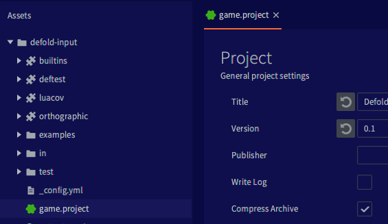
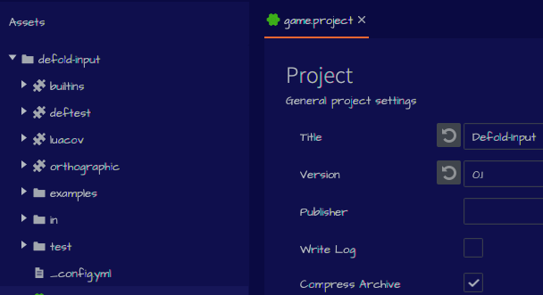

# Editor styling

You can modify the colors, typography and other visual aspects of the editor using a custom stylesheet:

* Create a folder named `.defold` in your user home directory.
  * On Windows `C:\Users\**Your Username**\.defold`
  * On macOS `/Users/**Your Username**/.defold`
  * On Linux `~/.defold`
* Create a `editor.css` file in the `.defold` folder

The editor will on startup load your custom stylesheet and apply it on top of the default style. The editor uses JavaFX for the user interface and the stylesheets are almost identical to the CSS files used in a browser to apply style attributes to the elements of a webpage. The default stylesheets for the editor are [available for inspection on GitHub](https://github.com/defold/defold/tree/editor-dev/editor/styling/stylesheets/base).

## Changing color

The default colors are defined in [`_palette.scss`](https://github.com/defold/defold/blob/editor-dev/editor/styling/stylesheets/base/_palette.scss) and look like this:

```
* {
	// Background
	-df-background-darker:    derive(#212428, -10%);
	-df-background-dark:      derive(#212428, -5%);
	-df-background:           #212428;
	-df-background-light:     derive(#212428, 10%);
	-df-background-lighter:   derive(#212428, 20%);

	// Component
	-df-component-darker:     derive(#464c55, -20%);
	-df-component-dark:       derive(#464c55, -10%);
	-df-component:            #464c55;
	-df-component-light:      derive(#464c55, 10%);
	-df-component-lighter:    derive(#464c55, 20%);

	// Text & icons
	-df-text-dark:            derive(#b4bac1, -10%);
	-df-text:                 #b4bac1;
	-df-text-selected:        derive(#b4bac1, 20%);

  and so on...
```

The basic theme is divided into three groups of colors (with darker and lighter variants):

* Background color - background color in panels, windows, dialogs
* Component color - buttons, scroll bar handles, text field outlines
* Text color - text and icons

As an example, if you add this to your custom `editor.css` stylesheet in `.defold` folder in user home:

```
* {
	-df-background-darker:    derive(#0a0a42, -10%);
	-df-background-dark:      derive(#0a0a42, -5%);
	-df-background:           #0a0a42;
	-df-background-light:     derive(#0a0a42, 10%);
	-df-background-lighter:   derive(#0a0a42, 20%);
}
```

You will get the following look in your editor:




## Changing fonts

The editor uses two fonts: `Dejavu Sans Mono` for code and mono spaced text (errors) and `Source Sans Pro` for the rest of the UI. The font definitions are mainly found in [`_typography.scss`](https://github.com/defold/defold/blob/editor-dev/editor/styling/stylesheets/base/_typography.scss) and look like this:

```
@font-face {
  src: url("SourceSansPro-Light.ttf");
}

@font-face {
  src: url("DejaVuSansMono.ttf");
}

$default-font-mono: 'Dejavu Sans Mono';
$default-font: 'Source Sans Pro';
$default-font-bold: 'Source Sans Pro Semibold';
$default-font-italic: 'Source Sans Pro Italic';
$default-font-light: 'Source Sans Pro Light';

.root {
    -fx-font-size: 13px;
    -fx-font-family: $default-font;
}

Text.strong {
  -fx-font-family: $default-font-bold;
}

and so on...
```

The main font is defined in a root element which makes it quite easy to replace the font in most places. Add this to your `editor.css`:

```
@import url('https://fonts.googleapis.com/css2?family=Architects+Daughter&display=swap');

.root {
    -fx-font-family: "Architects Daughter";
}
```

You will get the following look in your editor:



It is also possible to use a local font instead of a web font:

```
@font-face {
  font-family: 'Comic Sans MS';
  src: local("cs.ttf");
}

.root {
  -fx-font-family: 'Comic Sans MS';
}
```

::: sidenote
The code editor font is defined separately in the editor Preferences!
:::
