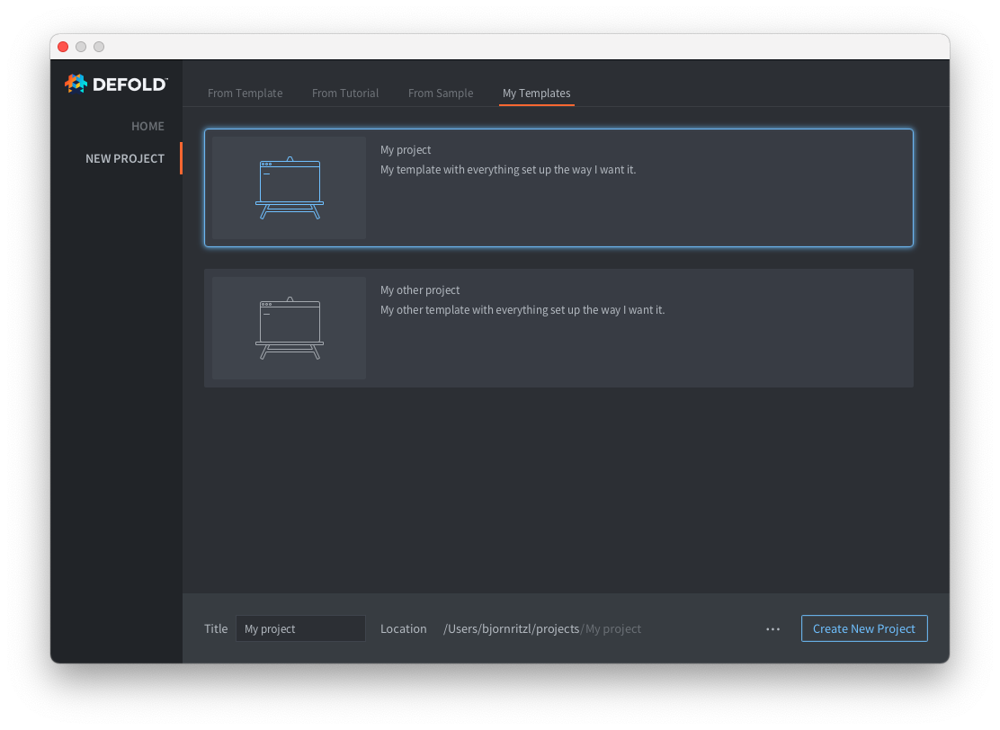

# Editor templates

You can add your own custom project templates to the New Project window:



In order to add one or more new tabs with custom project templates you need to add a `welcome.edn` file in the `.defold` folder in your user home directory:

* Create a folder named `.defold` in your user home directory.
  * On Windows `C:\Users\**Your Username**\.defold`
  * On macOS `/Users/**Your Username**/.defold`
  * On Linux `~/.defold`
* Create a `welcome.edn` file in the `.defold` folder

The `welcome.edn` file uses the Extensible Data Notation format. Example:

```
{:new-project
  {:categories [
    {:label "My Templates"
     :templates [
          {:name "My project"
           :description "My template with everything set up the way I want it."
           :image "empty.svg"
           :zip-url "https://github.com/britzl/template-project/archive/master.zip"
           :skip-root? true},
          {:name "My other project"
           :description "My other template with everything set up the way I want it."
           :image "empty.svg"
           :zip-url "https://github.com/britzl/template-other-project/archive/master.zip"
           :skip-root? true}]
    }]
  }
}
```

This will create the list of templates seen in the screenshot above.

::: sidenote
You can only use the template images [bundled with the editor](https://github.com/defold/defold/tree/dev/editor/resources/welcome/images).
:::
