# Editor overview

The editor allows you to browse and manipulate all files and folders in your game project in an efficient manner. Editing files brings up a suitable editor and shows all relevant information about the file in separate views.

## Starting the Editor

When you run the Defold Editor, you are presented with a project selection and creation screen. Click to select what you want to do:

MY PROJECTS
: Here are your recently opened projects so you can quickly access them. This is the default view of the starting screen.

  If you didn't open any projects earlier (or removed all), it will show two buttons - you can click `Open From Disk…` to find and open one using system file browser or click `Create New Project` button and it will switch to a tab `TEMPLATES`.

  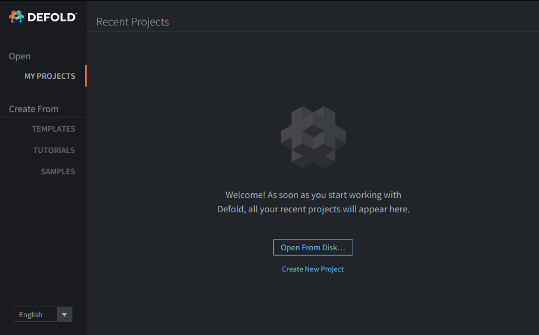


  If you have earlier opened projects, it will show a list of your projects, like on the picture below:

  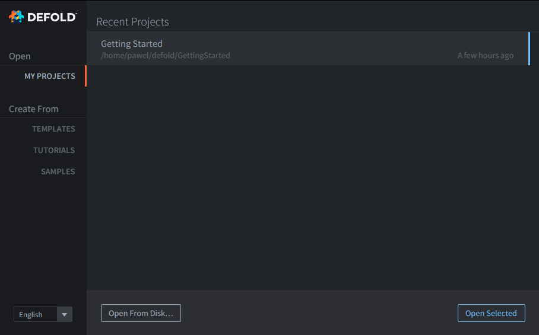

TEMPLATES
: Contains empty or almost empty basic projects made for quick start of a new Defold project for certain platforms or using certain extensions.


TUTORIALS
: Contains projects with guided tutorials to learn, play and modify, if you would like to follow a tutorial.


SAMPLES
: Contains projects prepared to showcase certain use cases.

  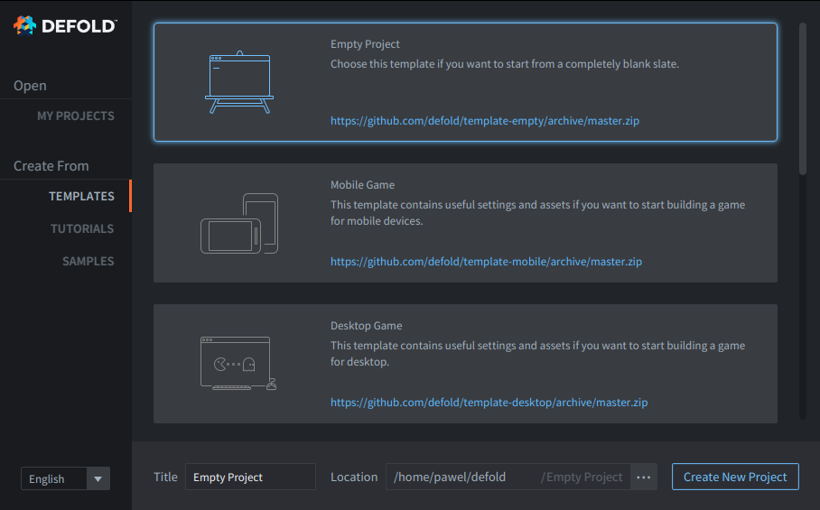

When you create a new project it is stored on your local drive and any edits you do are saved locally.

You can learn more about the different options in the [Project Setup manual](https://www.defold.com/manuals/project-setup/).

## Editor Language

In the bottom left corner of the starting screen you can see a Language selection - select from the currently available localizations. This is also available in the Editor in `File ▸ Preferences ▸ General ▸ Editor Language`.

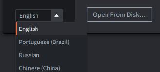

## The Editor panes {#the-editor-views}

The Defold Editor is separated into a set of panes, or views, that display specific information.


### 1. Assets pane
Lists all the files and folders that are part of your project in a tree structure, corresponding to the same structure on your disk. Click and scroll to navigate the list. All file oriented operations can be made in this view:

   - <kbd>Left Mouse Click</kbd> to select any file or folder, and while holding <kbd>⇧ Shift</kbd> you can expand selection or while holding <kbd>Ctrl</kbd>/<kbd>⌘ Cmd</kbd> you can (un)select clicked.
   - <kbd>Double Mouse Click</kbd> a file to open it in a specific editor for that file type.
   - <kbd>Drag and Drop</kbd> to add files from elsewhere on your disk to the project or move files and folders to new locations in the project.
   - <kbd>Right Mouse Click</kbd> to open a _Context Menu_ from where you can create new files or folders, rename, delete, track file dependencies and more.

### 2. Scene Editor pane {#the-scene-editor}

Double-clicking a collection, game object, or visual component file opens the *Scene Editor* — the visual editor for building and editing scenes. Script files and other non-visual resources open in their own dedicated editors instead.

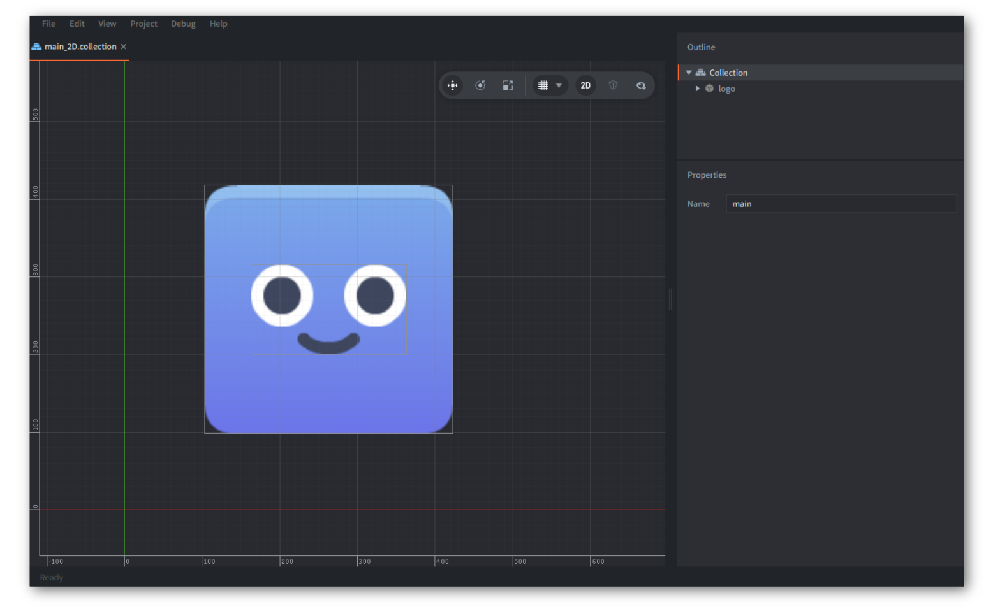

Some of the core features offered by the Scene Editor:

- [2D and 3D scene navigation](/manuals/scene-editing/#2d-and-3d-scene-orientation) with orthographic and perspective camera modes
- [Transform tools](/manuals/scene-editing/#manipulating-objects) for moving, rotating and scaling objects
- [Free Camera Mode](/manuals/scene-editing/#free-camera-mode) for first-person 3D navigation
- [Grid settings](/manuals/scene-editing/#grid-settings) with configurable size, plane and appearance
- [Visibility filters](/manuals/scene-editing/#visibility-filters) to toggle component types and guides

Read more in the [Scene Editor manual](/manuals/scene-editing/).

### 3. Outline pane

This view shows the content of the file currently being edited, but in a hierarchical tree structure. The Outline reflects the editor view and allows you to perform operations on your items:

   - <kbd>Left Mouse Click</kbd> to select an item, and while holding <kbd>⇧ Shift</kbd> you can expand selection or while holding <kbd>Ctrl</kbd>/<kbd>⌘ Cmd</kbd> you can (un)select clicked.
   - <kbd>Drag and drop</kbd> to move items. Drop a game object on another game object in a collection to create a parent-child relationship.
   - <kbd>Right Mouse Click</kbd> to open a _Context Menu_ from where you can add items, delete selected items etc.

It is possible to toggle the visibility of game objects and visual components by clicking on the little `👁` Eye Icon to the right of an element in the list.

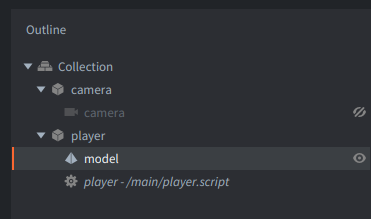

### 4. Properties pane

This view shows properties associated with the currently selected item, like Id, URL, Position, Rotation, Scale, and/or other component specific properties and also custom properties for scripts.

You can also <kbd>Drag</kbd> the `↕` Up-Down Arrow and move mouse to change value of the given numerical property.

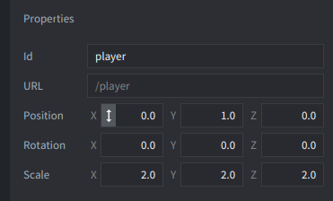

### 5. Tools pane

This view has several tabs.

*Console* tab : shows any error, warning and info engine output or purposeful printing that you do while your game is running,

*Build Errors* : shows errors from the building process,

*Search Results* : shows results of searching (<kbd>Ctrl</kbd>/<kbd>⌘ Cmd</kbd> + <kbd>Shift</kbd> + <kbd>F</kbd>) the whole project, if you click `Keep Results`

*Curve Editor* : used when editing curves in the [Particle Editor](/manuals/particlefx/).

The Tools pane is also used for interacting with the integrated debugger. Read more about it in the [Debugging Manual](/manuals/debugging/).

### 6. Changed Files pane

If your project uses the distributed version-control system Git this view lists any files that has been changed, added or deleted in your project. By synchronizing the project regularly you can bring your local copy in sync with what is stored in the project Git repository, that way you can collaborate within a team, and you won’t lose your work if disaster strikes. You can learn more about Git in our [Version Control manual](/manuals/version-control/). Some file oriented operations can be performed in this view:

   - <kbd>Left Mouse Click</kbd> - to select a given file, and while holding <kbd>⇧ Shift</kbd> you can expand selection or while holding <kbd>Ctrl</kbd>/<kbd>⌘ Cmd</kbd> you can (un)select clicked. If a single changed file is selected you can click `Diff` to show the differences. You can click `Revert` to undo changes in all selected files.
   - <kbd>Double Left Mouse Click</kbd> a file to open a view of the file. The editor opens the file in a suitable editor, just like in the assets view.
   - <kbd>Right Mouse Click</kbd> a file to open a pop up menu from where you can open a diff view, revert all changes done to the file, find the file on the filesystem and more.

### Menu Bar

On the top of the Editor view or in System Bar on Mac you can find Menu Bar with 6 menus: `File`, `Edit`, `View`, `Project`, `Debug`, `Help`. Their functions will be explained in the manuals.

### Status Bar

On the bottom bar of the Editor you can find a narrow space in which the Status is displayed, e.g.:
- when a new update is available a clickable button `Update Available` will be visible - check section Updating the Editor in this manual below.
- when building or bundling a progress of it will be presented there.

## Panes Size and Visibility

Panes size can be adjusted inside the Editor by <kbd>Dragging</kbd> the section borders between all described above 6 Panes.

Panes visibility can be toggled in the Editor by using options in `View` menu or using given shortcuts:
- `Toggle Assets Pane` (<kbd>F6</kbd>) to toggle Assets and Changed Files Panes visibility
- `Toggle Changed Files` to toggle visibility of the Changed Files Pane alone
- `Toggle Tools Pane` (<kbd>F7</kbd>) to toggle Tools Pane visibility
- `Toggle Properties Pane` (<kbd>F8</kbd>) to toggle Outline and Properties Panes visibility

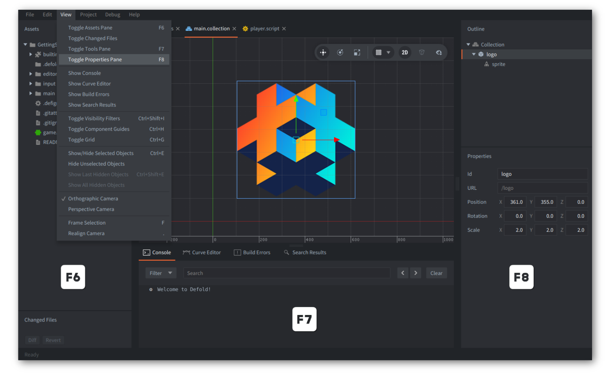

In the `View` menu you can also toggle or change other visibility related settings, like Grid, Guides, Camera or fit the view to selection (`Frame Selection` or <kbd>F</kbd> key) and toggle between default 2D and 3D view (`Realign Camera` or <kbd>.</kbd> key), many of them accessible from the Toolbar or via shortcuts too.

## Tabs

If you have multiple files open, a separate tab for each file is shown at the top of the Editor view.  Tabs in a single pane can be moved around - <kbd>Drag and Drop</kbd> them to swap their positions inside the tabs bar. You can also:

- <kbd>Right Mouse Click</kbd> on a tab to open a _Context Menu_,
- Click `Close` (<kbd>Ctrl</kbd>/<kbd>⌘ Cmd</kbd> + <kbd>W</kbd>) a single tab,
- Click `Close Others` to close all tabs except the selected one,
- Click `Close All` (<kbd>Ctrl</kbd>/<kbd>⌘ Cmd</kbd> + <kbd>Shift</kbd>+<kbd>W</kbd>) to close all tabs in the active pane,
- Select `➝| Open As` - to use other than default editor or associated external tool set in `File ▸ Preferences ▸ Code ▸ Custom Editor`. Check more in [Preferences manual](/manuals/editor-preferences).

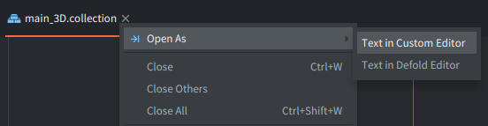

## Side-by-side editing

It is possible to open 2 editor views side by side.

- <kbd>Right Mouse Click</kbd> the tab for the editor you want to move and select `Move to Other Tab Pane`.

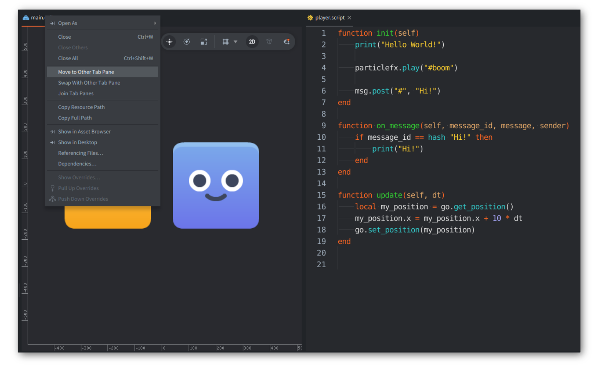

You can also use the tab menu to `Swap with Other Tab Pane` to move given tab between panes or `Join Tab Panes` to a single pane.

## Creating new project files

To create new resource files, either select `File ▸ New…` and then choose the file type from the menu, or use the context menu:

<kbd>Right Mouse Click</kbd> the target location in the `Assets` browser, then select `New… ▸ [file type]`:

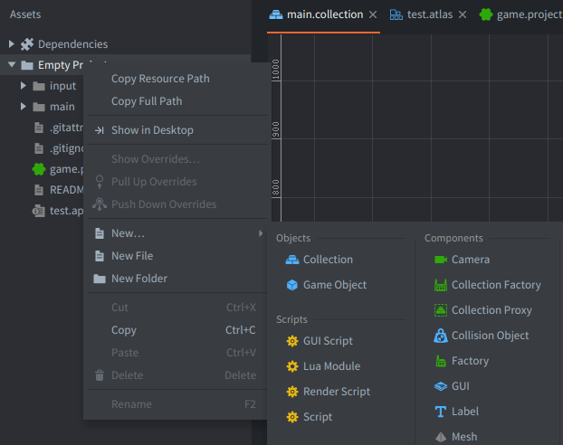

Type a suitable *Name* for the new file and eventually change *Location*. The full file name including the file type suffix is shown under *Preview* in the dialog:

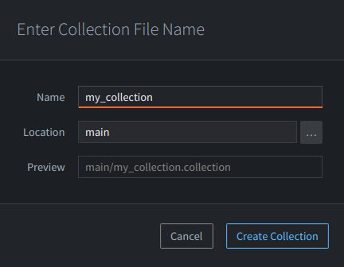

## Templates

It is possible to specify custom templates for each project. To do so, create a new folder named `templates` in the project’s root directory, and add new files named `default.*` with the desired extensions, such as `/templates/default.gui` or `/templates/default.script`. Additionally, if the `{{NAME}}` token is used in these files, it will be replaced with the filename specified in the file creation window.

If a template is available for a given file type, whenever a new file of this type is created, it will be initialized with the content of the file from `templates`.


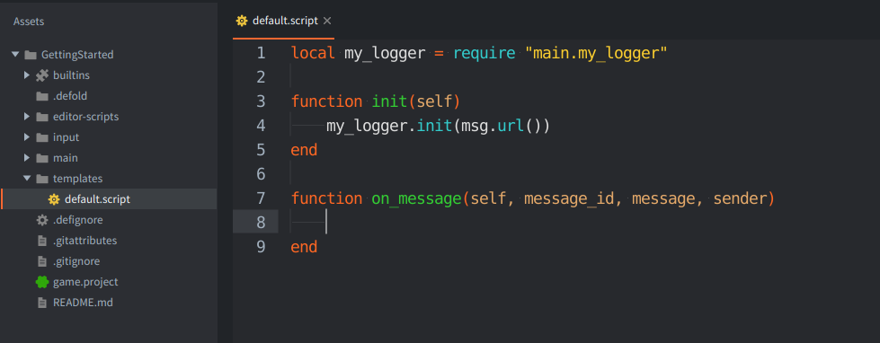

## Importing files to your project

To add asset files (images, sounds, models etc) to your project, simply drag and drop them to the correct position in the *Assets* browser. This will make _copies_ of the files at the selected location in the project file structure. Read more about [how to import assets in our manual](/manuals/importing-assets/).


## Updating the Editor

The Editor will automatically check for updates when connected to internet. When an update is detected a blue clickable link `Update Available` will be shown in the lower left corner of the project selection screen or in the lower right corner of the Editor window.

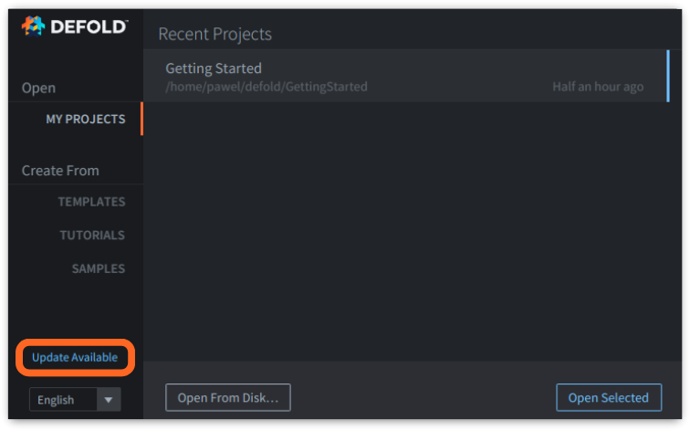
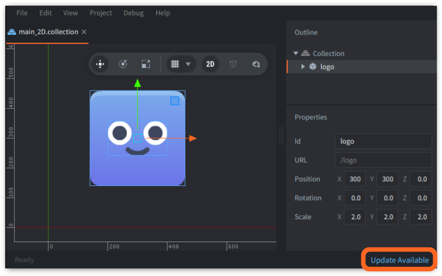

Press the `Update Available` clickable link to download and update. A confirmation window with information will pop up - click `Download Update` to proceed.

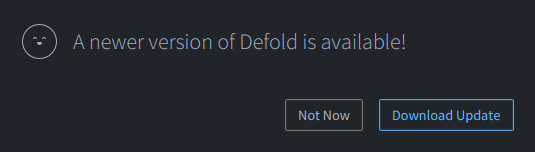

You will see the download progress in the bottom status bar:

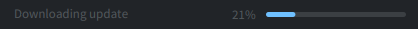

After update is downloaded the blue link will change to `Restart to Update`. Click it to restart and open the updated Editor.

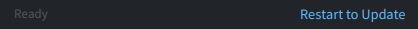

## Preferences

You can modify the settings of the Editor in the `Preferences` window. To open it click `File ▸ Preferences…` or shortcut <kbd>Ctrl</kbd>/<kbd>⌘ Cmd</kbd> + <kbd>,</kbd>

Read more details in the [Preferences manual](/manuals/editor-preferences)

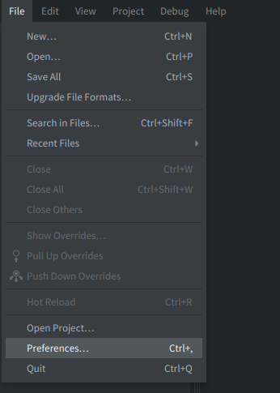

## Editor Logs
If you run into a problem with the Editor and need to report issue (`Help  ▸ Report Issue`)  it is a good idea to provide log files from the editor itself. To open location of the logs in your system browser click on `Help ▸ Show Logs`.

Read more in [Getting Help manual](/manuals/getting-help/#getting-help).

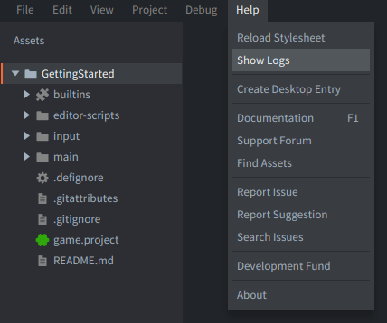

The editor logs files can be found here:

  * Windows: `C:\Users\ **Your Username** \AppData\Local\Defold`
  * macOS: `/Users/ **Your Username** /Library/Application Support/` or `~/Library/Application Support/Defold`
  * Linux: `$XDG_STATE_HOME/Defold` or `~/.local/state/Defold`

You can also get access to editor logs while the Editor is running if it is started from a terminal/command prompt. To launch the Editor use command:

```shell
# Linux:
$ ./path/to/Defold/Defold

# macOS:
$ > ./path/to/Defold.app/Contents/MacOS/Defold
```

## Editor Server

When the Editor opens a project, it will start a web server on a random port. The server may be used to interact with the editor from other applications. The port is written to the `.internal/editor.port` file.

The server provides an OpenAPI specification at `http://localhost:$(cat .internal/editor.port)/openapi.json`. This is a useful minimal starting point for agentic workflows.

Additionally, the editor executable has a command line option `--port` (or `-p`), which allows specifying the port during launch, e.g.::
```shell
# Windows
.\path\to\Defold\Defold.exe --port 8181

# Linux:
./path/to/Defold/Defold --port 8181

# macOS:
./path/to/Defold/Defold.app/Contents/MacOS/Defold --port 8181
```

## Editor Installation Metadata

When the Editor starts, it writes information about the launcher and installation paths to a well-known location. This can be used by third-party IDE integrations and other tools to find installed Defold editors:

| OS      | Location |
|---------|----------|
| macOS   | `~/Library/Application Support/Defold/installations.json` |
| Linux   | `${XDG_STATE_HOME:-~/.local/state}/Defold/installations.json` |
| Windows | `%LOCALAPPDATA%\Defold\installations.json` |

The file contains a JSON array with one object per known installation:

```json
[
  {
    "launcherPath": "/Applications/Defold.app/Contents/MacOS/Defold",
    "installPath": "/Applications/Defold.app",
    "lastLaunchedAt": "2026-07-06T12:34:56.789Z"
  }
]
```

## Editor Styling

Editor appearance can be changed with custom styling. Read more in the [Editor Styling manual](/manuals/editor-styling).

## FAQ
:[Editor FAQ](../shared/editor-faq.md)
