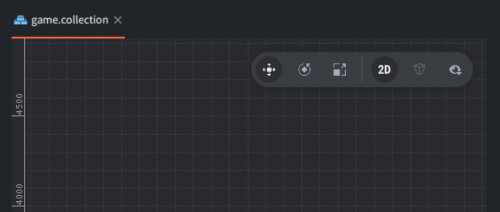

# Editor overview

The editor allows you to browse and manipulate all files in your game project in an efficient manner. Editing files brings up a suitable editor and shows all relevant information about the file in separate views.

## Starting the editor

When you run the Defold editor, you are presented with a project selection and creation screen. On the left side there are three main views available. Click to select what you want to do:

Home
: Click to show a lists your recently opened projects so you can quickly access them. This is the default view.

New
: Click if you want to create a new Defold project, then select if you want to base your project on a basic template (from the *From Template* tab), if you would like to follow a tutorial (the *From Tutorial* tab), or try one of the sample projects (the *From Sample* tab).

  {srcset="images/editor/new_project@2x.png 2x"}

  When you create a new project it is stored on your local drive and any edits you do are saved locally. To share the project with members of your team, use the *Synchronize* feature in the editor. It creates a Defold cloud Git storage project for you through which you and your team can synchronize work.

Import project
: Create a working copy from an existing project from you Defold cloud Git storage account. The local copy is linked to the cloud Git project so it's ready for team synchronization.

  {srcset="images/editor/import_project@2x.png 2x"}

  Access to the Defold cloud git storage requires that you provide your Defold account credentials.

You can learn more about the different options in the [Project Setup manual](https://www.defold.com/manuals/project-setup/).

## The editor views

The Defold editor is separated into a set of panes, or views, that display specific information.

The *Assets* view
: Lists all the files that are part of your project. Click and scroll to navigate the list. All file oriented operations can be made in this view:

   - <kbd>Double click</kbd> a file to open it in an editor for that file type.
   - <kbd>Drag and drop</kbd> to add files from elsewhere on your disk to the project or move files and folders to new locations in the project.
   - <kbd>Right click</kbd> to open a _context menu_ from where you can create new files or folders, rename, delete, track file dependencies and more.

The *Editor* view

: The center view shows the currently open file in an editor for that file type. All visual editors allows you to change the camera view:

- Pan: <kbd>Alt + left mouse button</kbd>.
- Zoom: <kbd>Alt + Right button</kbd> (three button mouse) or <kbd>Ctrl + Mouse button</kbd> (one button). If your mouse has a scroll wheel, it can be used to zoom.
- Rotate in 3D: <kbd>Ctrl + left mouse button</kbd>.

There is a toolbar in the top right corner of the scene view where you find object manipulation tools: *Move*, *Rotate* and *Scale*.

{srcset="images/editor/toolbar@2x.png 2x"}

The *Outline*
: This view shows the content of the file currently being edited, but in a hierarchial tree structure. The outline reflects the editor view and allows you to perform operations on your items:
   - <kbd>Click</kbd> to select an item. Hold <kbd>Shift</kbd> or <kbd>Option</kbd> to expand the selection.
   - <kbd>Drag and drop</kbd> to move items. Drop a game object on another game object in a collection to child it.
   - <kbd>Right click</kbd> to open a _context menu_ from where you can add items, delete selected items etc.

The *Properties* view
: This view shows properties associated with the currently selected item, like Position, Rotation, Animation etc, etc.

The *Console*
: This view shows any error output or purposeful printing that you do while your game is running. Alongside the console are tabs containing the *Curve Editor* which is used when editing curves in the particle editor, the *Build Errors* view that shows build errors, and the *Search Results* view that displays search results. The console is also used for interacting with the integrated debugger.

The *Changed Files* view:
: This view lists any files that has been changed, added or deleted in your project. By synchronizing the project regularly you can bring your local copy in sync with what is stored in the project Git repository, that way you can collaborate within a team, and you won’t lose your work if unfortune strikes. Some file oriented operations can be performed in this view:

   - <kbd>Double click</kbd> a file to open a diff view of the file. Editor 2 opens the file in a suitable editor, just like in the assets view.
   - <kbd>Right click</kbd> a file to open a pop up menu from where you can open a diff view, revert all changes done to the file, find the file on the filesystem and more (editor 2).

## Side-by-side editing

If you have multiple files open, a separate tab for each file is shown at the top of the editor view. It is possible to open 2 editor views side by side. <kbd>Right click</kbd> the tab for the editor you want to move and select <kbd>Move to Other Tab Pane</kbd>.

{srcset="images/editor/2-panes@2x.png 2x"}

You can also use the tab menu to swap the position of the two panes and join them to a single pane.

## The scene editor

Double clicking a collection or game object file brings up the *Scene Editor*:

Selecting objects
: Click on objects in the main window to select them. The rectangle surrounding the object in the editor view will highlight green to indicate what item is selected. The selected object is also highlighted in the *Outline* view.

  You can also select objects by:

  - <kbd>Click and drag</kbd> to select all objects inside the selection region.
  - <kbd>Click</kbd> objects in the Outline view.

  Hold <kbd>Shift</kbd> or <kbd>⌘</kbd> (Mac) / <kbd>Ctrl</kbd> (Win/Linux) while clicking to expand the selection.

The move tool
: {.left}
  To move objects, use the *Move Tool*. You find it in the toolbar in the top right corner of the scene editor, or by pressing the <kbd>W</kbd> key.

  

  The selected object shows a set of manipulators (squares and arrows). Click and drag the green center square handle to move the object freely in screen space, click and drag the arrows to move the object along the X, Y or Z-axis. There arn also square handles for moving the object in the X-Y plane and (visible if rotating the camera in 3D) for moving the object in the X-Z and Y-Z planes.

The rotate tool
: {.left}
  To rotate objects, use the *Rotate Tool* by selecting it in the toolbar, or by pressing the <kbd>E</kbd> key.

  

  This tool consists of four circular manipulators. An orange manipulator that rotates the object in screen space and one for rotation around each of the X, Y and Z axes. Since the view is peripendicular to the X- and Y-axis, the circles only appear as two lines crossing the object.

The scale tool
: {.left}
  To scale objects, use the *Scale Tool* by selecting it in the toolbar, or by pressing the <kbd>R</kbd> key.

  

  This tool consists of a set of square handles. The center one scales the object uniformly in all axes (including Z). There also one handle for scaling along each of the X, Y and Z axes and one handle for scaling in the X-Y plane, the X-Z plane and the Y-Z plane.

## Creating new project files

To create new resource files, either select <kbd>File ▸ New...</kbd> and then choose the file type from the menu, or use the context menu:

<kbd>Right click</kbd> the target location in the *Assets* browser, then select <kbd>New... ▸ [file type]</kbd>:

{srcset="images/editor/create_file@2x.png 2x"}

Type a suitable name for the new file. The full file name including the file type suffix is shown under *Path* in the dialog:

{srcset="images/editor/create_file_name@2x.png 2x"}

## Importing files to your project

To add asset files (images, sounds, models etc) to your project, simply drag and drop them to the correct position in the *Assets* browser. This will make _copies_ of the files at the selected location in the project file structure.

{srcset="images/editor/import@2x.png 2x"}
