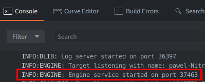
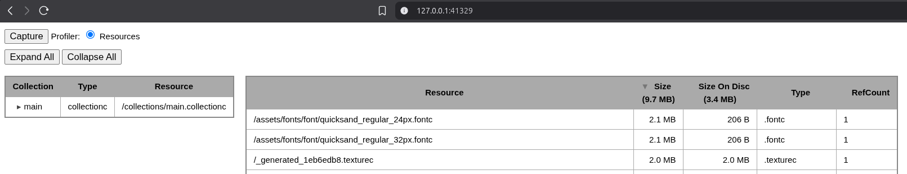

# The engine service and runtime HTTP APIs

Running a project in Debug mode creates a process for a given runtime instance of the engine with your game and a special engine service that can be accessed for development and profiling infrastructure, runtime logic and messages, engine state and extensions.

The engine service is a development HTTP service owned by a running debug engine (`dmengine`).

It is separate from the [editor server](/manuals/editor-http-api), which belongs to the Defold editor and controls the open project.

The two services use different ports. A tool that connects to the editor port cannot call runtime extension routes there, and vice versa - a tool that connects to the engine service cannot call editor operations.

The engine service is part of debug, development and profiling infrastructure. Release engine instances do not create the service.

## Availability and port discovery

When the editor starts a debug engine, it requests a dynamically assigned service port. The engine reports the selected port in `Console` (`and its log if run from a CLI):



```text
INFO:ENGINE: Engine service started on port <port>
```

The line appears in the editor console when the game was launched from the editor. A simple local controller can parse this line, but a reusable integration should let the editor or its wrapper track the engine instance and registered port. This avoids confusing an old port with a newly started or reused process.

The engine also advertises development targets through service discovery on supported platforms. That mechanism is primarily used by Defold tooling and should not be replaced with a permanently hard-coded port.

Server is accessible on localhost (`127.0.0.1`) at a given port:



## Built-in endpoints

The current debug engine registers a small set of core routes.

| Endpoint | Purpose |
| --- | --- |
| `GET /ping` | Check that the engine service responds |
| `GET /info` | Read engine version, platform, build identifier, and log-service information |
| `GET /state` | Read development connection state used by Defold tooling |
| `POST /post/<socket>/<message-type>` | Post a Protobuf-encoded Defold message to a named engine socket |

For example:

```sh
curl -sS "$ENGINE_URL/ping"
curl -sS "$ENGINE_URL/info" | jq
curl -sS "$ENGINE_URL/state" | jq
```

The `/post` route is used by development operations such as hot reload, reboot, resize, and process control. Its body is a binary Protobuf message of the type named in the route; it is not a JSON message API. The Protobuf message can be no larger than 1024 bytes serialized, otherwise a `400 Too large message` will be returned.

These routes are development infrastructure, and additional profiler and resource-inspection routes exist in the engine implementation.

## Extension-defined runtime routes

In debug builds, the native extension SDK can provide access to the engine web server. An extension can register a route prefix on that server and expose operations that depend on runtime data.

This is useful for development tools because an extension can share the existing engine service instead of opening another HTTP server.

An extension-defined runtime automation API should:

* use a distinct, versioned route prefix;
* expose supported capabilities;
* return structured errors;
* handle unavailable platform or engine features explicitly;
* keep operations local to development and testing;
* document whether it is omitted from release builds.

## Automation Bridge extension

The official Defold [Automation Bridge](https://github.com/defold/extension-automation-bridge) is a debug-only native extension built on the engine service. It registers a versioned runtime automation API under:

```text
http://127.0.0.1:<engine-service-port>/automation-bridge/v1
```

Its runtime API provides capabilities such as scene and node inspection, input, screen information, screenshots, recording, lifecycle information, and optional application-defined synchronization. Some operations include:

| Operation | Action |
| --- | --- |
| `GET  /automation-bridge/v1/health` | health report, API capabilities and compatibility |
| `POST /automation-bridge/v1/input/click` | for runtime input interactions |
| `GET  /automation-bridge/v1/screenshot` | for runtime screenshots |

Use the extension's [native API documentation](https://github.com/defold/extension-automation-bridge/tree/master/automation_bridge) and [Python helper documentation](https://github.com/defold/extension-automation-bridge/tree/master/automation_bridge/automation-bridge-python) for the version installed in the project.

Automation Bridge exposes neither its HTTP API nor its Lua module in release builds.

### Editor and runtime clients

The Automation Bridge Python helpers illustrate the two-client architecture. Function `editor.open_project()` returns an editor project client, and `project.build_and_run()` returns a separate engine client.

| Client | Purpose |
| --- | --- |
| Project | Editor HTTP API, commands, debugger, console, preferences, reference, previews, build, and port discovery |
| Game - engine service | Scene, input, screenshots, runtime state, and synchronization |

The division between `project` and `game` makes the process boundary explicit. Editor operations remain on the editor server, while observations and actions against the live game remain on the engine service.

```python
from automation_bridge import editor

project = editor.open_project(".")
game = project.build_and_run()
```

## Limitations and security

The engine service and extension-defined routes are development tools, and should be treated as such.

::: important
The engine service does not currently publish an OpenAPI document. Integrations should limit themselves to documented behavior or to an extension's versioned API.
:::

Runtime scripts, physics, input, dynamically created objects, and platform rendering require a running engine and should be verified through [automated runtime testing](/manuals/automated-testing).

* Do not publish the service through a router, public interface, or untrusted tunnel.
* Do not assume that engine service routes require authentication.
* Runtime routes can vary by extension version, platform, graphics backend, and engine capabilities.
* Use version or capability negotiation for extension-defined up-to-date APIs.
