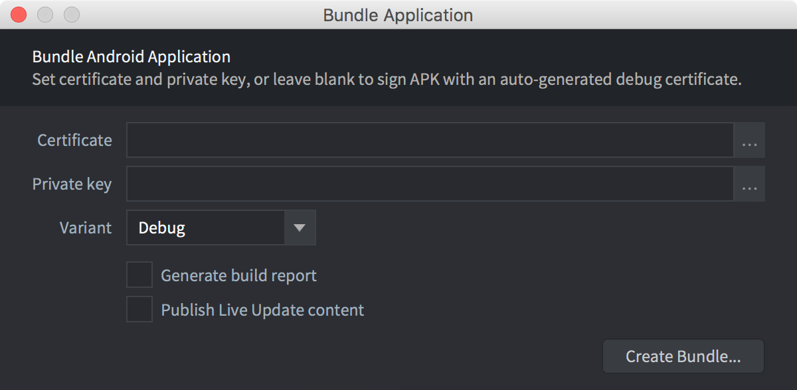
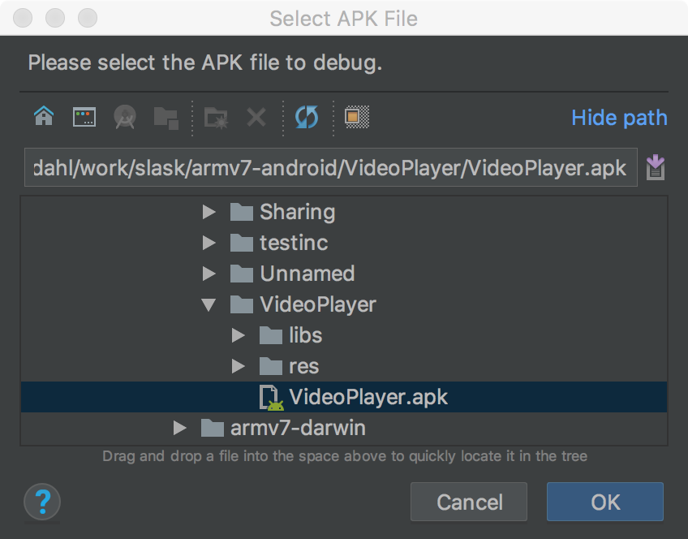

# Debugging on Android

Here we list some ways to debug your executable running on an Android device

## Android Studio

* Prepare the bundle by setting the `android.debuggable` option in `game.project`

	

* Bundle the app in debug mode into a folder of choice.

	

* Launch [Android Studio](https://developer.android.com/studio/)

* Choose `Profile or debug APK`

	

* Choose the apk bundle you just created

	

* Select the main `.so` file, and make sure it has debug symbols

	

* If it doesn't, upload an unstripped `.so` file. (size is around 20mb)

* Path mappings help you remap where the individual paths from where the executable was built (in the cloud) to an actual folder on your local drive.

* Select the .so file, then add a mapping your local drive

	

	

* If you have access to the engine source, add a path mapping to that too

		* make sure to checkout the version you are currently debugging

			defold$ git checkout 1.2.148

* Press `Apply changes`

* You should now see the source mapped in your project

	

* Add a breakpoint

	

* Press `Run` -> `Debug "Appname"` and invoke the code you meant to break into

	

* You can now step in the callstack as well as inspect the variables

## Notes

### Native Extension job folder

Currently, the workflow is a bit troublesome for development. This is because the job folder name
is random for each build, making the path mapping invalid for each build.

However, it works fine for a debugging session.

The path mappings are stored in the <project>.iml file in the Android Studio project.

It's possible to get the job folder from the executable

	$ arm-linux-androideabi-readelf --string-dump=.debug_str build/armv7-android/libdmengine.so | grep /job

The jobfolder is named like so `job1298751322870374150`, each time with a random number.

