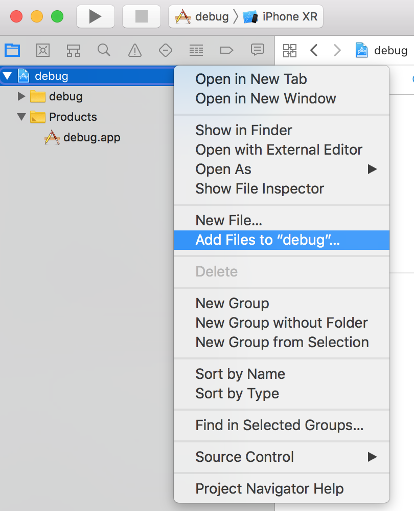
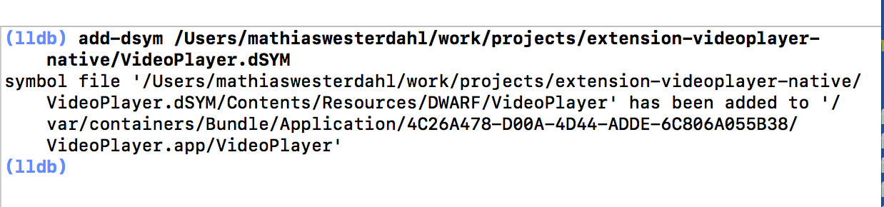

# Debugging on iOS/macOS

Here we describe how to debug a build using [XCode](https://developer.apple.com/xcode/), Apple's preferred IDE for developing for macOS and iOS.

## Xcode

* Bundle the app by using bob, with the `--with-symbols` option

		$ cd myproject
		$ wget http://d.defold.com/archive/<sha1>/bob/bob.jar
		$ java -jar bob.jar --platform armv7-darwin build --with-symbols debug --archive bundle -bo build/ios -mp <app>.mobileprovision --identity "iPhone Developer: Your Name (ID)"

* Install the app, either with `XCode`, `iTunes` or [ios-deploy](https://github.com/ios-control/ios-deploy)

		$ ios-deploy -b <AppName>.ipa

* Get the `.dSYM` folder (i.e the debug symbols)

	* If it's not using Native Extensions, you can download the `.dSYM` file from [d.defold.com](http://d.defold.com)

	* If you are using a native extension, then the `.dSYM` folder is generated when you build with [bob.jar](https://www.defold.com/manuals/bob/). Only building is required (no archive or bundling):

			$ cd myproject
			$ unzip .internal/cache/arm64-ios/build.zip
			$ mv dmengine.dSYM <AppName>.dSYM
			$ mv <AppName>.dSYM/Contents/Resources/DWARF/dmengine <AppName>.dSYM/Contents/Resources/DWARF/<AppName>

### Create Project

To properly debug, we need to have a project, and the source code mapped.
We're not using this project to build things, only debug.

* Create new XCode project, choose the `Game` template

	

* Choose a name (e.g. `debug`) and the default settings

* Choose a folder to save the project into

* Add your code to the app

	

* Make sure the "Copy items if needed" is unchecked.

	

* This is the end result

	

* Disable the `Build` step

	

	

* Set the `Deployment target` version so it's now larger than your device iOS version

	

* Select the target device

	

### Launch the debugger

You have a few options to debug an app

1. Either choose `Debug` -> `Attach to process...` and select the app from there

1. Or choose the `Attach to process by PID or Process name`

	

	1. Start the app on the device

1. In `Edit Scheme` add the <AppName>.app folder as the executable

### Debug symbols

**To use lldb, the execution must be paused**

* Add the `.dSYM` path to lldb

		(lldb) add-dsym <PathTo.dSYM>

	

* Verify that `lldb` read the symbols successfully

		(lldb) image list <AppName>

### Path mappings

* Add the engine source (change accordingly for your need)

		(lldb) settings set target.source-map /Users/builder/ci/builds/engine-ios-64-master/build /Users/mathiaswesterdahl/work/defold
		(lldb) settings append target.source-map /private/var/folders/m5/bcw7ykhd6vq9lwjzq1mkp8j00000gn/T/job4836347589046353012/upload/videoplayer/src /Users/mathiaswesterdahl/work/projects/extension-videoplayer-native/videoplayer/src

	* It's possible to get the job folder from the executable.
	The jobfolder is named like so `job1298751322870374150`, each time with a random number.

			$ dsymutil -dump-debug-map <executable> 2>&1 >/dev/null | grep /job

* Verify the source mappings

		(lldb) settings show target.source-map

You can check what source file a symbol was originating from using

	(lldb) image lookup -va <SymbolName>

### Breakpoints

* Open a file in the project view, and set a breakpoint

	

## Notes

### Check UUID of binary

In order for the debugger to accept the `.dSYM` folder, the UUID need to match the UUID of the executable being debugged. You can check the UUID like so:

	$ dwarfdump -u <PathToBinary>
