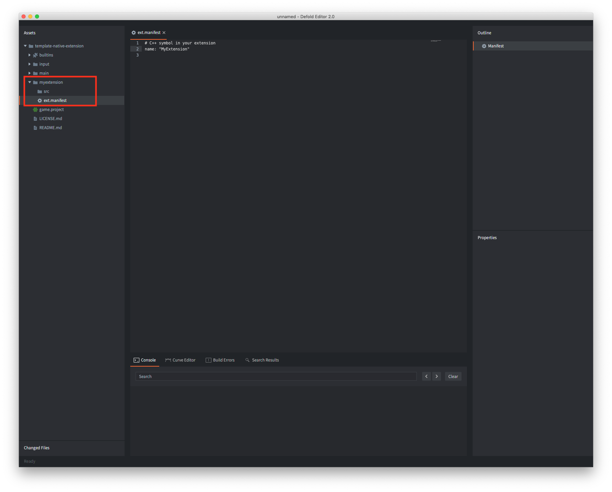

# Native extensions

If you need custom interaction with external software or hardware on a low level where Lua won't suffice, the Defold SDK allows you to write extensions to the engine in C, C++, Objective C, Java or Javascript, depending on target platform. Typical use cases for native extensions are:

- Interaction with specific hardware, for instance the camera on mobile phones.
- Interaction with external low level APIs, for instance advertising network APIs that do not allow interaction through network APIs where Luasocket could be used.
- High performance calculations and data processing.

## The build server

Defold provides a zero setup entry point to native extensions with a cloud based build solution. Any native extension that is developed and added to a game project, either directly or through a [Library Project](/manuals/libraries/), becomes part of the ordinary project content. There is no need to build special versions of the engine and distribute them to team members, that is handled automatically---any team member that builds and runs the project will get a project specific engine executable with all native extensions baked in.


Defold provides the cloud build server free of charge, without any usage restrictions. The server is hosted in Europe, and the URL to which native code is sent is configured in the [Editor Preferences window](/manuals/editor-preferences/#extensions) or through the `--build-server` command line option to [bob](/manuals/bob/#usage). If you wish to set up your own server please [follow these instructions](/manuals/extender-local-setup).

## Project layout

To create a new extension, create a folder in the project root. This folder will contain all settings, source code, libraries and resources associated with the extension. The extension builder recognizes the folder structure and collects any source files and libraries.

```
 myextension/
 │
 ├── ext.manifest
 │
 ├── src/
 │
 ├── include/
 │
 ├── lib/
 │   └──[platforms]
 │
 ├── manifests/
 │   └──[platforms]
 │
 └── res/
     └──[platforms]

```
*ext.manifest*
: The extension folder _must_ contain an *ext.manifest* file. This file is a configuration file with flags and defines used when building a single extension. File format definition can be found in the [Extension Manifest manual](https://defold.com/manuals/extensions-ext-manifests/).

*src*
: This folder should contain all source code files.

*include*
: This optional folder contains any include files.

*lib*
: This optional folder contains any compiled libraries that the extension depends on. Library files should be placed in subfolders named by `platform`, or `architecture-platform`, depending on what architectures are supported by your libraries.

  :[platforms](../shared/platforms.md)

*manifests*
: This optional folder contains additional files used in the build or bundling process. See below for details.

*res*
: This optional folder contains any extra resources that the extension depends on. Resource files should be placed in subfolders named by `platform`, or `architecture-platform` just as the "lib" subfolders. A subfolder `common` is also allowed, containing resource files common for all platforms.

### Manifest files

The optional *manifests* folder of an extension contains additional files used in the build and bundling process. Files should be placed in subfolders named by `platform`:

* `android` - This folder accepts a manifest stub file to be merged into the main application ([as described here](/manuals/extensions-manifest-merge-tool)).
  * The folder can also contain a `build.gradle` file with dependencies to be [resolved by Gradle](/manuals/extensions-gradle).
  * Finally the folder can also contain zero or more ProGuard files (experimental).
* `ios` - This folder accepts a manifest stub file to be merged into the main application ([as described here](/manuals/extensions-manifest-merge-tool)).
  * The folder can also contain a `Podfile` file with dependencies to be [resolved by Cocoapods](/manuals/extensions-cocoapods).
* `osx` - This folder accepts a manifest stub file to be merged into the main application ([as described here](/manuals/extensions-manifest-merge-tool)).
* `web` - This folder accepts a manifest stub file to be merged into the main application ([as described here](/manuals/extensions-manifest-merge-tool)).


## Sharing an extension

Extensions are treated just like any other assets in your project and they can be shared in the same way. If a native extension folder is added as a Library folder it can be shared and used by others as a project dependency. Refer to the [Library project manual](/manuals/libraries/) for more information.


## A simple example extension

Let's build a very simple extension. First, we create a new root folder *`myextension`* and add a file *`ext.manifest`* containing the name of the extension "`MyExtension`". Note that the name is a C++ symbol and must match the first argument to `DM_DECLARE_EXTENSION` (see below).



```yaml
# C++ symbol in your extension
name: "MyExtension"
```

The extension consists of a single C++ file, *`myextension.cpp`* that is created in the "`src`" folder.


The extension source file contains the following code:

```cpp
// myextension.cpp
// Extension lib defines
#define LIB_NAME "MyExtension"
#define MODULE_NAME "myextension"

// include the Defold SDK
#include <dmsdk/sdk.h>

static int Reverse(lua_State* L)
{
    // The number of expected items to be on the Lua stack
    // once this struct goes out of scope
    DM_LUA_STACK_CHECK(L, 1);

    // Check and get parameter string from stack
    char* str = (char*)luaL_checkstring(L, 1);

    // Reverse the string
    int len = strlen(str);
    for(int i = 0; i < len / 2; i++) {
        const char a = str[i];
        const char b = str[len - i - 1];
        str[i] = b;
        str[len - i - 1] = a;
    }

    // Put the reverse string on the stack
    lua_pushstring(L, str);

    // Return 1 item
    return 1;
}

// Functions exposed to Lua
static const luaL_reg Module_methods[] =
{
    {"reverse", Reverse},
    {0, 0}
};

static void LuaInit(lua_State* L)
{
    int top = lua_gettop(L);

    // Register lua names
    luaL_register(L, MODULE_NAME, Module_methods);

    lua_pop(L, 1);
    assert(top == lua_gettop(L));
}

dmExtension::Result AppInitializeMyExtension(dmExtension::AppParams* params)
{
    return dmExtension::RESULT_OK;
}

dmExtension::Result InitializeMyExtension(dmExtension::Params* params)
{
    // Init Lua
    LuaInit(params->m_L);
    printf("Registered %s Extension\n", MODULE_NAME);
    return dmExtension::RESULT_OK;
}

dmExtension::Result AppFinalizeMyExtension(dmExtension::AppParams* params)
{
    return dmExtension::RESULT_OK;
}

dmExtension::Result FinalizeMyExtension(dmExtension::Params* params)
{
    return dmExtension::RESULT_OK;
}


// Defold SDK uses a macro for setting up extension entry points:
//
// DM_DECLARE_EXTENSION(symbol, name, app_init, app_final, init, update, on_event, final)

// MyExtension is the C++ symbol that holds all relevant extension data.
// It must match the name field in the `ext.manifest`
DM_DECLARE_EXTENSION(MyExtension, LIB_NAME, AppInitializeMyExtension, AppFinalizeMyExtension, InitializeMyExtension, 0, 0, FinalizeMyExtension)
```

Note the macro `DM_DECLARE_EXTENSION` that is used to declare the various entry points into the extension code. The first argument `symbol` must match the name specified in *ext.manifest*. For this simple example, there is no need for any "update" or "on_event" entry points, so `0` is provided in those locations to the macro.

Now it is just a matter of building the project (<kbd>Project ▸ Build</kbd>). This will upload the extension to the extension builder which will produce a custom engine with the new extension included. If the builder encounters any errors, a dialog with the build errors will show.

To test the extension, create a game object and add a script component with some test code:

```lua
local s = "abcdefghijklmnopqrstuvwxyzABCDEFGHIJKLMNOPQRSTUVWXYZ"
local reverse_s = myextension.reverse(s)
print(reverse_s) --> ZYXWVUTSRQPONMLKJIHGFEDCBAzyxwvutsrqponmlkjihgfedcba
```

And that's it! We have created a fully working native extension.


## Extension Lifecycle

As we saw above the `DM_DECLARE_EXTENSION` macro is used to declare the various entry points into the extension code:

`DM_DECLARE_EXTENSION(symbol, name, app_init, app_final, init, update, on_event, final)`

The entry points will allow you to run code at various points in the lifecycle of an extension:

* Engine start
  * Engine systems are starting
  * Extension `app_init`
  * Extension `init` - All Defold APIs have been initialized. This is the recommended point in the extension lifecycle where Lua bindings to extension code is created.
  * Script init - The `init()` function of script files are called.
* Engine loop
  * Engine update
    * Extension `update`
    * Script update - The `update()` function of script files are called.
  * Engine events (window minimize/maximize etc)
    * Extension `on_event`
* Engine shutdown (or reboot)
  * Script final - The `final()` function of script files are called.
  * Extension `final`
  * Extension `app_final`

## Defined platform identifiers

The following identifiers are defined by the builder on each respective platform:

* `DM_PLATFORM_WINDOWS`
* `DM_PLATFORM_OSX`
* `DM_PLATFORM_IOS`
* `DM_PLATFORM_ANDROID`
* `DM_PLATFORM_LINUX`
* `DM_PLATFORM_HTML5`

## Build server logs

Build server logs are available when the project is using native extensions. The build server log (`log.txt`) is downloaded together with the custom engine when the project is built and stored inside the file `.internal/%platform%/build.zip` and also unpacked to the build folder of your project.

## Example extensions

* [Basic extension example](https://github.com/defold/template-native-extension) (the extension from this manual)
* [Android extension example](https://github.com/defold/extension-android)
* [HTML5 extension example](https://github.com/defold/extension-html5)
* [macOS, iOS and Android videoplayer extension](https://github.com/defold/extension-videoplayer)
* [macOS and iOS camera extension](https://github.com/defold/extension-camera)
* [iOS and Android In-app Purchase extension](https://github.com/defold/extension-iap)
* [iOS and Android Firebase Analytics extension](https://github.com/defold/extension-firebase-analytics)

The [Defold asset portal](https://www.defold.com/assets/) also contain several native extensions.
