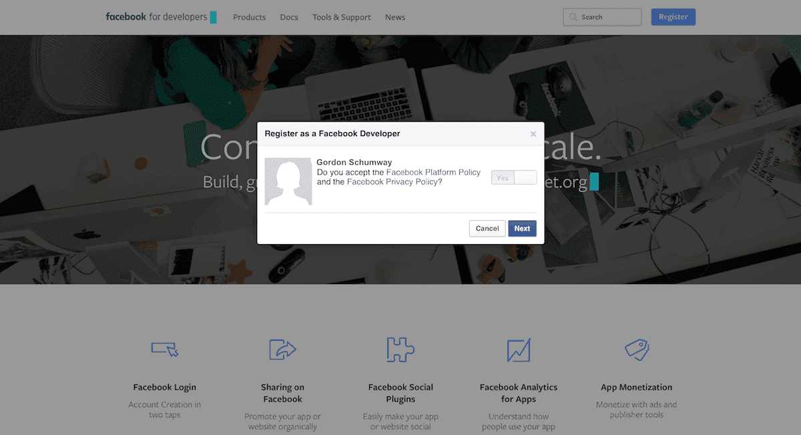
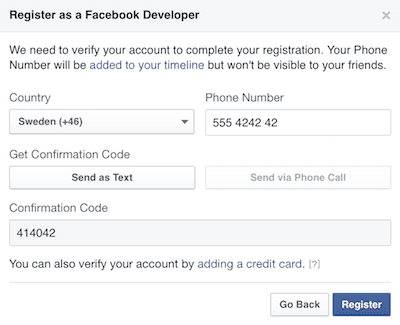
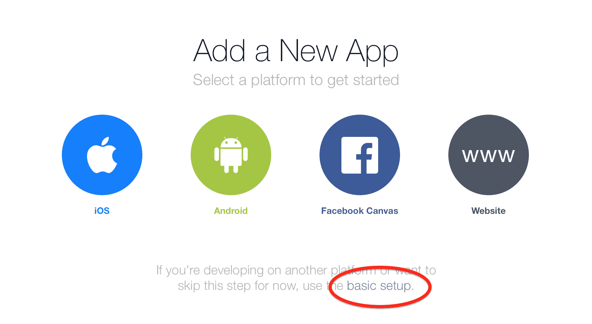
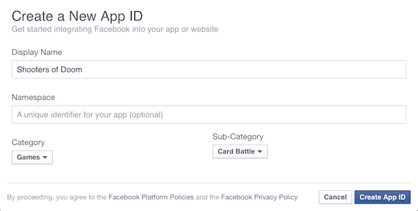
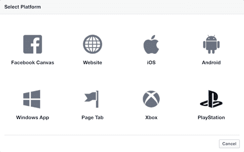
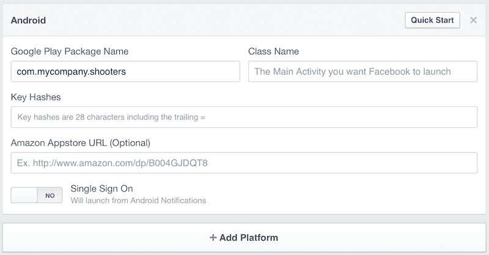
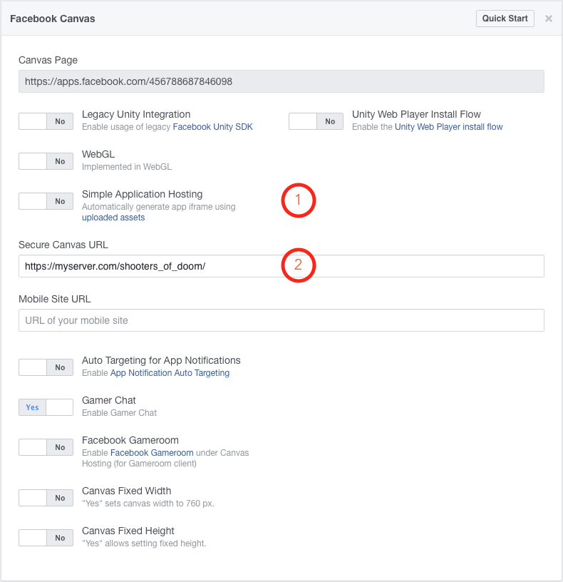
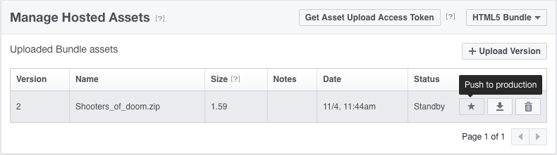

# Facebook

The Facebook API is provided as a [native extension](/manuals/extensions/). The extension allows you to interact with Facebook's game connectivity features in a uniform way for games on iOS, Android and HTML5. The Defold Facebook extension brings the various platform specific Facebook APIs under a unified set of functions that work the same on iOS, Android and HTML5 (through Facebook Canvas). To get started with Facebook connectivity in your games, you need a Facebook account.

## Installing the extension

To start using the Facebook extension you need to add it as a dependency to your `game.project` file. The latest stable version is available with the dependency URL:
```
https://github.com/defold/extension-facebook/archive/master.zip
```

We recommend using a link to a zip file of a [specific release](https://github.com/defold/extension-facebook/releases).

Starting Defold 1.2.162 this extension has one more dependency:
```
https://github.com/defold/extension-gps/archive/master.zip
```

Documentation of the API is available on the [extension GitHub page](https://defold.github.io/extension-facebook/).

## Registering as a Facebook developer

To develop for Facebook you must sign up as a Facebook developer. This allows you to create Facebook applications that your Defold game can communicate with.

* Head over to [Facebook for developers](https://developers.facebook.com)
* Log in with your Facebook account.
* Follow the instructions to register and verify your developer account.




## Creating a Facebook app

The next step is to create a Facebook application. The <kbd>My Apps</kbd> menu in the corner lists your apps, and there is an option to <kbd>Add a New App</kbd>.


You are presented with a selection of target platforms. Click *basic setup* to skip the wizards.

::: sidenote
Most information provided through the wizards is irrelevant when developing on Defold. In particular, you usually don't need to edit *Info.plist* or *AndroidManifest.xml* yourself. Defold does that work for you.
:::



You can easily add, remove and change platform settings in the app dashboard. You are now asked to name your app and select *Display Name*, *Namespace* and *Category*. Again, these can all be edited in the app dashboard. When you have gone through this, Facebook creates an app with a unique app identifier for you. The *App ID* is not possible to change since it identifies this specific app.




Click the *Settings* tab. Notice the numerical *App ID*. That identifier needs to go into the [project settings](/manuals/project-settings) of your Defold game. Open the  *game.project* file from the *Assets pane* and scroll to the *Facebook* section and add the *App ID* to the `Appid` field.

Now, back in the *Settings* tab on the Facebook app page, click *+ Add Platform* to add a new platform to the app. Each platform has a set of settings to fill in.



## iOS

For iOS you need to specify the game's `bundle_identifier` as specified in *game.project*.


## Android

For Android you need to specify a *Google Play Package Name*, which is the game's *package* identifier specified in *game.project*. You should also generate hashes of the certificate(s) you use and enter them into the *Key Hashes* field. You can generate a hash from a *certificate.pem* with openssl:

```sh
$ cat certificate.pem | openssl x509 -outform der | openssl sha1 -binary | openssl base64
```

(See [Creating certificates and keys](/manuals/android/#creating-certificates-and-keys) in the Android manual for details on how to create your own signing files.)



## Facebook Canvas

For HTML5 games, the process is a bit different. Facebook needs access to your game content from somewhere. There are two options:



1. Use Facebook's *Simple Application Hosting*. Click *Yes* to select managed hosting. Select *uploaded assets* to open the hosted asset manager.

    

    Select that you want to host a "HTML5 Bundle":

    

    Compress your HTML5 bundle into a .7z or .zip archive and upload it to Facebook. Make sure to click *Push to production* to start serving the game.

2. The alternative to Facebook hosting is to upload a HTML5 bundle of your game to some server of your choice that serves the game through HTTPS. Set the *Secure Canvas URL* to the URL of your game.

The game now works through the Facebook URL provided as *Canvas Page*.

## Testing the setup

The following basic test can be used to see if things are set up properly.

1. Create a new game object and attach a script component with a new script file to it.
2. Enter the following code in the script file (this requires the use of Facebook extension v.2 or later):

```lua
local function get_me_callback(self, id, response)
    -- The response table includes all the response data
    pprint(response)
end

local function fb_login(self, data)
    if data.status == facebook.STATE_OPEN then
        -- Logged in ok. Let's try reading some "me" data through the
        -- HTTP graph API.
        local token = facebook.access_token()
        local url = "https://graph.facebook.com/me/?access_token=" .. token
        http.request(url, "GET", get_me_callback)
    elseif data.status == facebook.STATE_CLOSED_LOGIN_FAILED then
        -- Do something to indicate that login failed
    end
    if data.error then
        -- An error occurred
    else
        -- No error
    end
end

function init(self)
    -- Log in with read permissions.
    local permissions = { "public_profile", "email" }
    facebook.login_with_permissions(permissions, facebook.AUDIENCE_EVERYONE, fb_login)
end
```

Running this simple test should display something like the following in the console:

```txt
DEBUG:SCRIPT:
{
  status = 200,
  headers = {
    connection = keep-alive,
    date = Fri, 04 Nov 2016 13:54:33 GMT,
    etag = "0725a4f703fe6af27da183cfec0bb22637e331e0",
    access-control-allow-origin = *,
    content-length = 53,
    expires = Sat, 01 Jan 2000 00:00:00 GMT,
    content-type = text/javascript; charset=UTF-8,
    x-fb-debug = Pr1qUssb8Xa3x3r1t913hHMdefh69DSYYV5vcxeOB7O33mcfShIw+r7BoLpn147I2wzLF2CZRTpnR3/VYOtFpA==,
    facebook-api-version = v2.5,
    cache-control = private, no-cache, no-store, must-revalidate,
    pragma = no-cache,
    x-fb-trace-id = F03S5dtsdaS,
    x-fb-rev = 2664414,
  }
  response = {"name":"Max de Fold ","id":"14159265358979323"},
}
```

* The full Defold Facebook API is documented on the [extension GitHub page](https://defold.github.io/extension-facebook/).
* The Facebook Graph API is documented here: https://developers.facebook.com/docs/graph-api


## Facebook Analytics

Facebook Analytics allows you as a developer to get aggregated demographics and rich insights, like how many people launch your app, how often people make purchases and many other interactions.

### Setup

Before you can use Facebook Analytics you need to create a Facebook app and add the *App ID* to *game.project* as described above. Next step is to add the Analytics product to your Facebook app:


Once you have added the Facebook Analytics product to your Facebook app you can optionally configure the Analytics settings. Refer to the Facebook Developer documentation for more information about the different settings:


### Usage

When you have Facebook Analytics added to your Facebook app you can immediately start using it from your application by posting analytics events:

```lua
function init(self)
    -- post a spent credits event
    local params = { [facebook.PARAM_LEVEL] = 30, [facebook.PARAM_NUM_ITEMS] = 2 }
    facebook.post_event(facebook.EVENT_SPENT_CREDITS, 25, params)

    -- post a custom event
    local level = 19
    local params = { kills = 23, gold = 4, xp = 890 }
    facebook.post_event("level_completed", level, params)
end
```

Available predefined events and parameters can be seen in the [Facebook extension API reference](https://defold.github.io/extension-facebook/). These should correlate to the [Standard Events](https://developers.facebook.com/docs/analytics/send_data/events#standard) and [Parameters](https://developers.facebook.com/docs/analytics/send_data/events#parameter) from the Facebook developer documentation.

The Facebook SDK used by Defold will also automatically generate several events, such as app install and app launch. Refer to the [Auto-logged events](https://developers.facebook.com/docs/analytics/send_data/events#autologged) in the Facebook developer documentation.

Once you have sent some events they will show up in the Facebook Analytics dashboard, accessible from your Facebook app page via the *View Analytics* button:


Events are accessed from the *Events* option on the from the Facebook Analytics page:


### Sharing events with Facebook

You can opt to share generated events with Facebook for improved ad-tracking. This is done via the [`enable_event_usage()`](https://defold.github.io/extension-facebook/#enable_event_usage) and [`disable_event_usage()`](https://defold.github.io/extension-facebook/#disable_event_usage) functions. The default setting is according to the Facebook SDK documentation to not share events.
