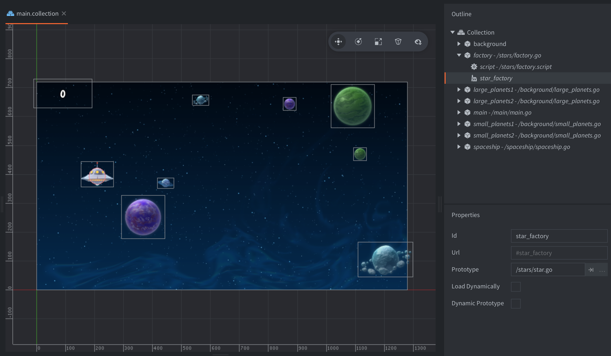
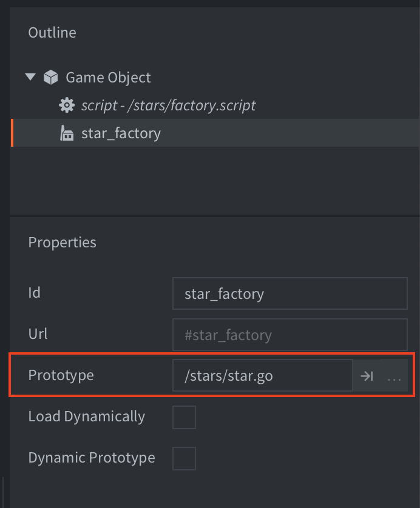
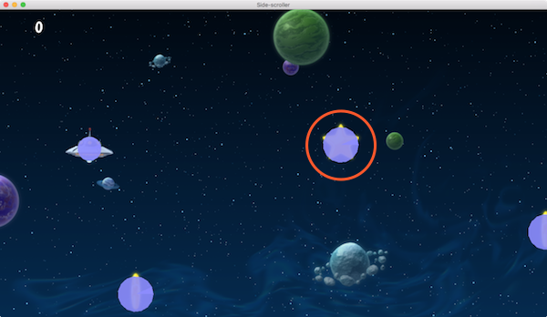
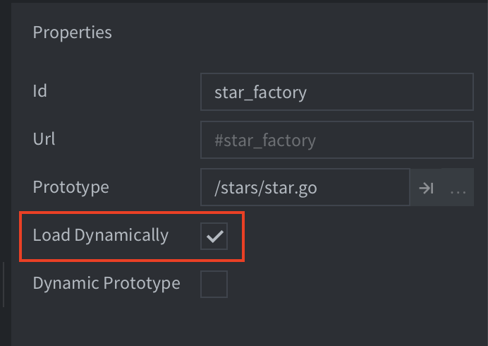
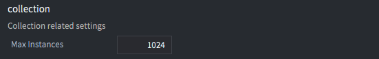

# Factory components

Factory components are used to dynamically spawn game objects from a pool of objects into a running game.

When you add a factory component to a game object you specify in the *Prototype* property what game object file the factory should use as a blueprint for all new game objects it creates.





To trigger the creation of a game object, call `factory.create()`:

```lua
-- factory.script
local p = go.get_position()
p.y = vmath.lerp(math.random(), min_y, max_y)
local component = "#star_factory"
factory.create(component, p)
```


`factory.create()` takes 5 parameters:

`url`
: The id of the factory component that should spawn a new game object.

`[position]`
: (optional) The world position of the new game object. This should be a `vector3`. If you do not specify a position, the game object is spawned at the position of the factory component.

`[rotation]`
: (optional) The world rotation of the new game object. This should be a `quat`.

`[properties]`
: (optional) A Lua table with any script property values to initiate the game object with. See the [Script property manual](/manuals/script-properties) for information on script properties.

`[scale]`
: (optional) The scale of the spawned game object. The scale can be expressed as a `number` (greater than 0) which specifies uniform scaling along all axes. You can also provide a `vector3` where each component specifies scaling along the corresponding axis.

For example:

```lua
-- factory.script
local p = go.get_position()
p.y = vmath.lerp(math.random(), min_y, max_y)
local component = "#star_factory"
-- Spawn with no rotation but double scale.
-- Set the score of the star to 10.
factory.create(component, p, nil, { score = 10 }, 2.0) -- <1>
```
1. Sets the "score" property of the star game object.

```lua
-- star.script
go.property("score", 1) -- <1>

local speed = -240

function update(self, dt)
    local p = go.get_position()
    p.x = p.x + speed * dt
    if p.x < -32 then
        go.delete()
    end
    go.set_position(p)
end

function on_message(self, message_id, message, sender)
    if message_id == hash("collision_response") then
        msg.post("main#gui", "add_score", {amount = self.score}) -- <2>
        go.delete()
    end
end
```
1. The "score" script property is defined with a default value.
2. Reference the "score" script property as a value stored in "self".



::: sidenote
Defold does not currently support non uniform scaling of collision shapes. If you provide a non uniform scale value, for instance `vmath.vector3(1.0, 2.0, 1.0)` the sprite will scale correctly but the collision shapes won't.
:::

## Tracking spawned and parent objects

When you call `factory.create()` you get back the id of the new game object, allowing you to store the id for future reference. One common use is to spawn objects and add their id's to a table so you can delete them all at a later point, for instance when resetting a level layout:

```lua
-- spawner.script
self.spawned_coins = {}

...

-- Spawn a coin and store it in the "coins" table.
local id = factory.create("#coinfactory", coin_position)
table.insert(self.spawned_coins, id)
```

And then later:

```lua
-- coin.script
-- Delete all spawned coins.
for _, coin_id = ipairs(self.spawned_coins) do
    go.delete(coin_id)
end

-- or alternatively
go.delete_all(self.spawned_coins)
```

It is also common that you want the spawned object to be aware of the game object that spawned it. One case would be some type of autonomous object that can be spawned only one at a time. The spawned object then needs to inform the spawner when it is deleted or inactivated so another one can be spawned:

```lua
-- spawner.script
-- Spawn a drone and set its parent to the url of this script component
self.spawned_drone = factory.create("#dronefactory", drone_position, nil, { parent = msg.url() })

...

function on_message(self, message_id, message, sender)
    if message_id == hash("drone_dead") then
        self.spawed_drone = nil
    end
end
```

And the spawned object's logic:

```lua
-- drone.script
go.property("parent", msg.url())

...

function final(self)
    -- I'm dead.
    msg.post(self.parent, "drone_dead")
end
```

## Dynamic loading of factory resources

By checking the *Load Dynamically* checkbox in the factory properties, the engine postpones the loading of the resources associated with the factory.



With the box unchecked the engine loads the prototype resources when the factory component is loaded so they are immediately ready for spawning.

With the box checked, you have two options for usage:

Synchronous loading
: Call [`factory.create()`](/ref/factory/#factory.create) when you want to spawn objects. This  will load the resources synchronously, which may cause a hitch, then spawn new instances.

  ```lua
  function init(self)
      -- No factory resources are loaded when the factory’s parent
      -- collection is loaded. Calling create without having called
      -- load will create the resources synchronously.
      self.go_id = factory.create("#factory")
  end

  function final(self)  
      -- Delete game objects. Will decref resources.
      -- In this case resources are deleted since the factory component
      -- holds no reference.
      go.delete(self.go_id)

      -- Calling unload will do nothing since factory holds no references
      factory.unload("#factory")
  end
  ```

Asynchronous loading
: Call [`factory.load()`](/ref/factory/#factory.load) to explicitly load the resources asynchronously. When the resources are ready for spawning, a callback is received.

  ```lua
  function load_complete(self, url, result)
      -- Loading is complete, resources are ready to spawn
      self.go_id = factory.create(url)
  end

  function init(self)
      -- No factory resources are loaded when the factory’s parent
      -- collection is loaded. Calling load will load the resources.
      factory.load("#factory", load_complete)
  end

  function final(self)
      -- Delete game object. Will decref resources.
      -- In this case resources aren’t deleted since the factory component
      -- still holds a reference.
      go.delete(self.go_id)

      -- Calling unload will decref resources held by the factory component,
      -- resulting in resources being destroyed.
      factory.unload("#factory")
  end
  ```

## Instance limits

The project setting *max_instances* in *Collection related settings* limits the total number of game object instances that can exist in a world (the main.collection loaded at startup or any world loaded via a collection proxy). All game objects that exist in the world are counted agaist that limit and it does not matter if they are placed by hand in the editor or spawned in runtime through a script.



So if you set *max_instances* to 1024 and have 24 manually placed game objects in your main collection, you can spawn an additional 1000 game objects. As soon as you delete a game object, you are free to spawn another instance.

## Pooling of game objects

It may seem like a good idea to save spawned game objects in a pool and reuse them. However, the engine is already doing object pooling under the hood so additional overhead will only slow things down. So delete game objects and spawn new ones, that is both faster and cleaner.
