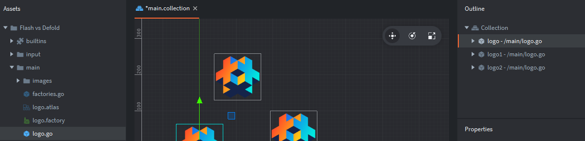
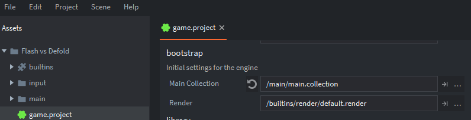
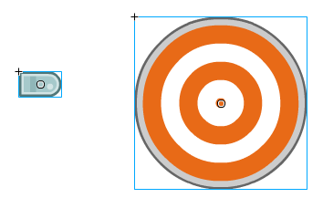
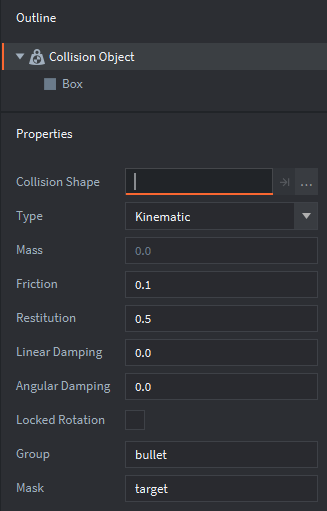

# Defold for Flash users

This guide presents Defold as an alternative for Flash game developers. It covers some of the key concepts used in Flash game development, and explains the corresponding tools and methods in Defold.

## Introduction

Some of the key advantages of Flash were the accessibility and low barriers to entry. New users could learn the program quickly, and could be creating basic games with limited time investment. Defold offers a similar advantage by providing a suite of tools dedicated to game design, while empowering advanced developers to create advanced solutions for more sophisticated requirements (for instance by allowing developers to edit the default render script).

Flash games are programmed in ActionScript (with 3.0 being the most recent version), while Defold scripting is done in Lua. This guide will not go into a detailed comparison of Lua and Actionscript 3.0. The [Defold manual](/manuals/lua) provides a good introduction to Lua programming in Defold, and references the tremendously useful [Programming in Lua](https://www.lua.org/pil/) (first edition) which is freely available online.

An article by Jesse Warden provides a [basic comparison of Actionscript and Lua](http://jessewarden.com/2011/01/lua-for-actionscript-developers.html), which may serve as a good starting point. Note thought that there are deeper differences in how Defold and Flash are constructed than what is visible at the language level. Actionscript and Flash is object oriented in the classical sense with classes and inheritance. Defold does not have classes, nor inheritance. It includes the concept of a *game object* which can contain audivisual representation, behavior and data. Operations on game objects are done with *functions* available in the Defold APIs. Furthermore, Defold encourages the use of *messages* to communicate between objects. Messages are a higher level construct than method calls and are not intended to be used as such. These differences are important and takes a while to get used to, but will not be covered in detail in this guide.

Instead, this guide explores some of the key concepts of game development in Flash, and outlines what the closest Defold equivalents are. Similarities and differences are discussed, along with common pitfalls, to enable you to get off to a running start in transitioning from Flash to Defold.

## Movie clips and game objects

Movie clips are a key component of Flash game development. They are symbols, each containing a unique timeline. The closest equivalent concept in Defold is a game object.


Unlike Flash movie clips, Defold game objects do not have timelines. Instead, a game object consists of multiple components. Components include sprites, sounds, and scripts---among many others (for further details about the components available see the [building blocks documentation](/manuals/building-blocks) and related articles). The game object in the screenshot below consists of a sprite and a script. The script component is used to control the behavior and look of game objects throughout the object’s lifecycle:


While movie clips can contain other movie clips, game objects can not *contain* game objects. However, game objects can be *childed* to other game objects, creating hierarchies that can be moved, scaled or rotated in unison.

## Flash—manually creating movie clips

In Flash, instances of movie clips can be added to your scene manually by dragging them from the library and onto the timeline. This is illustrated in the screenshot below, where each Flash logo is an instance of the "logo" movieclip:


## Defold—manually creating game objects

As mentioned previously, Defold does not have a timeline concept. Instead, game objects are organised in collections. Collections are containers (or prefabs) that hold game objects and other collections. At the most basic level, a game can consist of only one collection. More frequently, Defold games make use of multiple collections, either added manually to the bootstrap “main” collection or dynamically loaded via [collection proxies](/manuals/collection-proxy). This concept of loading "levels" or "screens" does not have a direct Flash equivalent.

In the example below, the "main" collection contains three instances (listed on the right, in the *Outline* window) of the "logo" game object (seen on the left, in the *Assets* browser window):



## Flash—referencing manually created movie clips

Referring to manually created movie clips in Flash requires the use of a manually defined instance name:


## Defold—Game object id

In Defold, all game objects and components are referred to via an address. In most cases only a simple name, or a shorthand is sufficient. For example:

- `"."` addresses the current game object.
- `"#"` addresses the current component (the script).
- `"logo"` addresses the game object with the id "logo".
- `"#script"` addresses the component with id "script" in the current game object.
- `"logo#script"` addresses the component with id "script" in the game object with id "logo".

The address of manually placed game objects is determined by the *Id* property assigned (see bottom right of screenshot). The id has to be unique for the current collection file you are working in. The editor automatically sets an id for you but you can change it for each game object instance that you create.


::: sidenote
You can find the id of a game object by running the following code in its script component: `print(go.get_id())`. This will print the id of the current game object in the console.
:::

The addressing model and message passing are key concepts in Defold game development. The [addressing manual](/manuals/addressing) and the [message passing manual](/manuals/message-passing) explains these in great detail.

## Flash—dynamically creating movie clips

In order to dynamically create movie clips in Flash, ActionScript Linkage first needs to be set up:


This creates a class (Logo in this case), which then enables instantiation of new instances of this class. Adding an instance of the Logo class to the Stage could be done as below:

```as
var logo:Logo = new Logo();
addChild(logo);
```

## Defold—creating game objects using factories

In Defold, dynamic generation of game objects is achieved through the use of *factories*. Factories are components that are used to spawn copies of a specific game object. In this example, a factory has been created with the "logo" game object as a prototype:


It is important to note that factories, like all components, need to be added to a game object before they can be used. In this example, we have created a game object called "factories", to hold our factory component:


The function to call to generate an instance of the logo game object is:

```lua
local logo_id = factory.create("factories#logo_factory")
```

The URL is a required parameter of `factory.create()`. In addition, you can add optional parameters to set position, rotation, properties, and scale. For more information on the factory component, please see the [factory manual](/manuals/factory). It is worth noting that calling `factory.create()` returns the id of the created game object. This id can be stored for later reference in a table (which is the Lua equivalent of an array).

## Flash—stage

In Flash, we are familiar with the Timeline (top section of the screenshot below) and the Stage (visible below the Timeline):


As discussed in the movie clips section above, the Stage is essentially the top level container of a Flash game and is created each time a project is exported. The Stage will by default have one child, the *MainTimeline*. Each movie clip generated in the project will have its own timeline, and can serve as a container for other symbols (including movie clips).

## Defold—collections

The Defold equivalent of the Flash Stage is a collection. When the engine starts up it creates a new game world based on the content of a collection file. By default, this file is called "main.collection" but you can change which collection is loaded at startup by accessing the *game.project* settings file that is in the root of every Defold project:



Collections are containers that are used in the editor to organize game objects and other collections. The contents of a collection can also be spawned via script into the runtime using a [collection factory](/manuals/collection-factory/#spawning-a-collection), which works the same way as a regular game object factory. This is useful for spawning groups of enemies, or a pattern of coin collectables, for instance. In the screenshot below, we have manually placed two instances of the "logos" collection into the "main" collection.


In some cases, you want to load a completely new game world. The [collection proxy](/manuals/collection-proxy/) component allows you to create a new game world based on the contents of a collection file. This would be useful for scenarios such as loading new game levels, mini games, or cutscenes.

## Flash—timeline

The Flash timeline is primarily used for animation, using various frame by frame techniques or shape/motion tweens. The overall FPS (frames per second) setting of the project defines the length of time a frame is displayed. Advanced users can modify the overall FPS of the game, or even that of individual movie clips.

Shape tweens allow the interpolation of vector graphics between two states. It is mostly only useful for simple shapes and applications, as the below example of shape tweening a square into a triangle demonstrates:


Motion tweens allow the animation of various properties of an object, including size, position and rotation. In the example below, all the listed properties have been modified.


## Defold—property animation

Defold works with pixel images as opposed to vector graphics, thus it does not have an equivalent for shape tweening. However, motion tweening has a powerful equivalent in [property animation](/ref/go/#go.animate). This is accomplished via script, using the `go.animate()` function. The go.animate() function tweens a property (such as color, scale, rotation or position) from the starting value to the desired end value, using one of many available easing functions (including custom ones). Where Flash required user implementation of more advanced easing functions, Defold includes [many easing functions](/manuals/animation/#easing) built-into the engine.

Where Flash makes use of keyframes of graphics on a timeline for animation, one of the main methods of graphic animation in Defold is by flipbook animation of imported image sequences. Animations are organised in a game object component known as an atlas. In this instance we have an atlas for a game character with an animation sequence called "run". This consists of a series of png files:


## Flash—depth index

In Flash, the display list determines what is shown and in what order. The ordering of objects in a container (such as the Stage) is handled by an index. Objects added to a container using the `addChild()` method will automatically occupy the top position of the index, starting from 0 and incrementing with each additional object. In the screenshot below, we have generated three instances of the "logo" movie clip:


The positions in the display list are indicated by the numbers next to each logo instance. Ignoring any code to handle the x/y position of the movie clips, the above could have been generated like so:

```as
var logo1:Logo = new Logo();
var logo2:Logo = new Logo();
var logo3:Logo = new Logo();

addChild(logo1);
addChild(logo2);
addChild(logo3);
```

Whether an object is displayed above or below another object is determined by their relative positions in the display list index. This is well illustrated by swapping the index positions of two objects, for instance:

```as
swapChildren(logo2,logo3);
```

The result would look like the below (with the index position updated):


## Defold—z position

The positions of game objects in Defold are represented by vectors consisting of three variables: x, y, and z. The z position determines the depth of a game object. In the default [render script](/manuals/render), the available z positions range from -1 to 1.

::: sidenote
Game objects with a z position outside the -1 to 1 range will not be rendered and therefore not visible. This is a common pitfall for developers new to Defold, and is worth keeping in mind if a game object is not visible when you expect it to be.
:::

Unlike in Flash where the editor only implies depth indexing (and allows modification using commands like *Bring Forward* and *Send Backward*), Defold allows you to set the z position of objects directly in the editor. In the screenshot below, you can see that "logo3" is displayed on top, and has a z position of 0.2. The other game objects have z positions of 0.0 and 0.1.


Note that the z position of a game object nested in one or more collections is decided by its own z position, together with that of all its parents. For instance, imagine the logo game objects above were placed in a "logos" collection which in turn was placed in "main" (see screenshot below). If the "logos" collection had a z position of 0.9, the z positions of the game objects contained within would be 0.9, 1.0, and 1.1. Therefore, "logo3" would not be rendered as its z position is greater than 1.


The z position of a game object can of course be changed using script. Assume the below is located in the script component of a game object:

```lua
local pos = go.get_position()
pos.z  = 0.5
go.set_position(pos)
```

## Flash—hitTestObject and hitTestPoint collision detection

Basic collision detection in Flash is achieved by using the `hitTestObject()` method. In this example, we have two movie clips: "bullet" and "bullseye". These are illustrated in the screenshot below. The blue boundary box is visible when selecting the symbols in the Flash editor, and it is these boundary boxes that drive the result of the `hitTestObject()` method.



Collision detection using `hitTestObject()` is done as follows:

```as
bullet.hitTestObject(bullseye);
```

Using the boundary boxes in this case would not be appropriate, as a hit would be registered in the scenario below:


An alternative to `hitTestObject()` is the `hitTestPoint()` method. This method contains a `shapeFlag` parameter, which allows hit tests to be conducted against the actual pixels of an object as opposed to the bounding box. Collision detection using `hitTestPoint()` could be done as below:

```as
bullseye.hitTestPoint(bullet.x, bullet.y, true);
```

This line would check the x and y position of the bullet (top left in this scenario) against the shape of the target. Since `hitTestPoint()` checks a point against a shape, which point (or points!) to check is a key consideration.

## Defold—collision objects

Defold includes a physics engine that can detect collisions and let a script react to it. Collision detection in Defold starts with assigning collision object components to game objects. In the screenshot below, we have added a collision object to the "bullet" game object. The collision object is indicated as the red transparent box (which is visible in the editor only):


Defold includes a modified version of the Box2D physics engine, which can simulate realistic collisions automatically. This guide assumes use of the kinematic collision objects, as these most closely resemble collision detection in Flash. Read more about the dynamic collision objects in the Defold [physics manual](/manuals/physics).

The collision object includes the following properties:



A box shape has been used as this was most appropriate for the bullet graphic. The other shape used for 2D collisions, sphere, will be used for the target. Setting the type to Kinematic means resolving collisions is done by your script as opposed to the built-in physics engine (for more information on the other types, please refer to the [physics manual](/manuals/physics)). The group and mask properties determine what collision group the object belongs to and what collision group it should be checked against, respectively. The current setup means a "bullet" can only collide with a "target". Imagine the setup was changed to the below:


Now, bullets can collide with targets and other bullets. For reference, we have set up a collision object for the target that looks as follows:


Note how the *Group* property is set to "target" and *Mask* is set to "bullet".

In Flash, collision detection occurs only when explicitly called by the script. In Defold, collision detection occurs continuously in the background as long as a collision object remains enabled. When a collision occurs, messages are sent to all components of a game object (most relevantly, the script components). These are the [collision_response and contact_point_response](/manuals/physics/#collision-messages) messages, which contain all the information required to resolve the collision as desired.

The advantage of Defold collision detection is that it is more advanced than that of Flash, with the ability to detect collisions between relatively complex shapes with very little setup effort. Collision detection is automatic, meaning looping through the various objects in the different collision groups and explicitly performing hit tests is not required. The main drawback is that there is no equivalent to the Flash shapeFlag. However, for most uses combinations of the basic box and sphere shapes suffice. For more complex scenarios, custom shapes [are possible](//forum.defold.com/t/does-defold-support-only-three-shapes-for-collision-solved/1985).

## Flash—event handling

Event objects and their associated listeners are used to detect various events (e.g. mouse clicks, button presses, clips being loaded) and trigger actions in response. There are a variety of events to work with.

## Defold—call-back functions and messaging

The Defold equivalent of the Flash event handling system consists of a few aspects. Firstly, each script component comes with a set of callback-functions that detect specific events. These are:

init
:   Called when the script component is initialised. Equivalent to the constructor function in Flash.

final
:   Called when the script component is destroyed (e.g. a spawned game object is removed).

update
:   Called every frame. Equivalent to enterFrame in Flash.

on_message
:   Called when the script component receives a message.

on_input
:   Called when user input (e.g. mouse or keyboard) is sent to a game object with [input focus](/ref/go/#acquire_input_focus), which means that the object receives all input and can react to it.

on_reload
:   Called when the script component is reloaded.

The callback functions listed above are all optional and can be removed if not used. For details on how to set up input, please refer to the [input manual](/manuals/input). A common pitfall occurs when working with collection proxies - please refer to [this section](/manuals/input/#input-dispatch-and-on_input) of the input manual for more information.

As discussed in the collision detection section, collision events are dealt with through the sending of messages to the game objects involved. Their respective script components receive the message in their on_message callback functions.

## Flash—button symbols

Flash uses a dedicated symbol type for buttons. Buttons use specific event handler methods (e.g. `click` and `buttonDown`) to execute actions when user interaction is detected. The graphical shape of a button in the "Hit" section of the button symbol determines the hit area of the button.


## Defold—GUI scenes and scripts

Defold does not include a native button component, nor can clicks be easily detected against the shape of a given game object in the way buttons are handled in Flash. The use of a [GUI](/manuals/gui) component is the most common solution, partially because the positions of the Defold GUI components are not affected by the in-game camera (if used). The GUI API also contains functions for detecting if user input like clicks and touch events are within the bounds of a GUI element.

## Debugging

In Flash, the `trace()` command is your friend when debugging. The Defold equivalent is `print()`, and is used in the same way as `trace()`:

```lua
print("Hello world!"")
```

You can print multiple variables using one `print()` function:

```lua
print(score, health, ammo)
```

There is also a `pprint()` function (pretty print), which is useful when dealing with tables. This function prints the content of tables, including nested tables. Consider the script below:

```lua
factions = {"red", "green", "blue"}
world = {name = "Terra", teams = factions}
pprint(world)
```

This contains a table (`factions`) nested in a table (`world`). Using the regular `print()` command would output the unique id of the table, but not the actual contents:

```
DEBUG:SCRIPT: table: 0x7ff95de63ce0
```

Using the `pprint()` function as illustrated above gives more meaningful results:

```
DEBUG:SCRIPT:
{
  name = Terra,
  teams = {
    1 = red,
    2 = green,
    3 = blue,
  }
}
```

If your game uses collision detection, you can toggle physics debugging by posting the message below:

```lua
msg.post("@system:", "toggle_physics_debug")
```

Physics debug can also be enabled in the project settings. Before toggling physics debug our project would look like this:


Toggling physics debug displays the collision objects added to our game objects:


When collisions occur, the relevant collision objects light up. In addition, the collision vector is displayed:


Finally, see the [profiler documentation](/ref/profiler/) for information on how to monitor CPU and memory usage. For more information on advanced debugging techniques, see the [debugging section](/manuals/debugging) in the Defold manual.

## Where to go from here

- [Defold examples](/examples)
- [Tutorials](/tutorials)
- [Manuals](/manuals)
- [Reference](/ref/go)
- [FAQ](/faq/faq)

If you have questions or get stuck, the [Defold forums](//forum.defold.com) are a great place to reach out for help.
