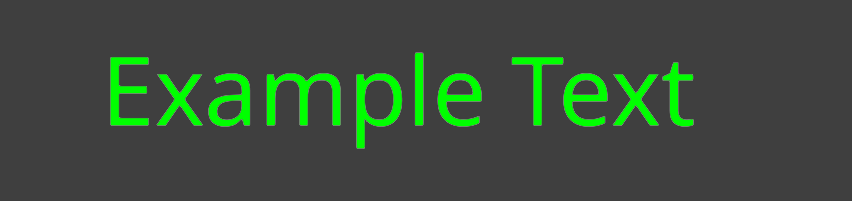
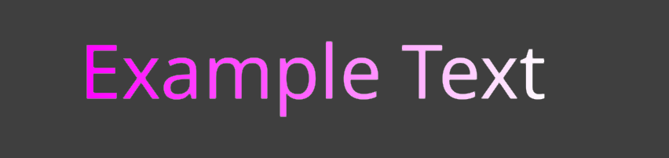
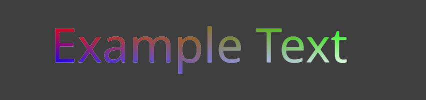
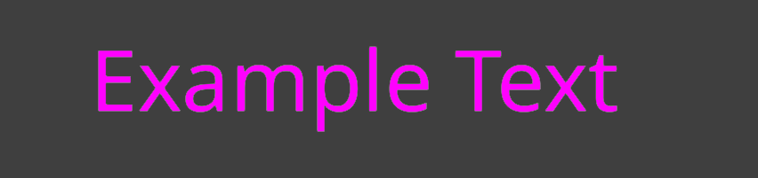
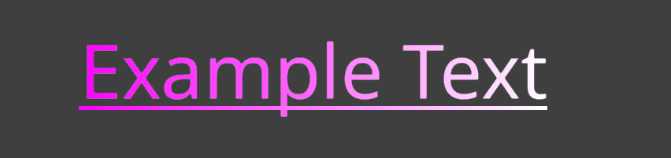

# Rich text markup

Use markup in Label components and GUI text nodes to apply nested visual styles and effects, and inspect links and sprites from Lua.

```lua
label.set_text("#label", "Score: <color=#69D2E7>1200</color>")
```

Alternatively, define a reusable named object style on the font and select it from a link:

```lua
local fontpath = "/fonts/ui.fontc"
font.set_style(fontpath, "menu_link", "<color=#69D2E7>")
label.set_text("#label", "Open <link style=menu_link src=inventory>inventory</link>")
```

## Tag reference

| Tag | Purpose | Example |
| --- | --- | --- |
| [`color`](#color) | Set the glyph face color. |  |
| [`size`](#size) | Change glyph shaping and layout size. |  |
| [`gradient`](#gradient) | Apply a static or animated color gradient. |  |
| [`ul`](#ul) | Underline text. |  |
| [`strike`](#strike) | Strike through text. |  |
| [`outline`](#outline) | Set the glyph outline width and color. |  |
| [`shadow`](#shadow) | Add a shadow to text. |  |
| [`shake`](#shake) | Apply an animated random offset. |  |
| [`wave`](#wave) | Move text in an animated sine wave. |  |
| [`sprite`](#sprite) | Add an inline sprite object. |  |
| [`link`](#link) | Add an interactive link object. |  |

## Syntax

Tags and attribute names are case-sensitive. A paired tag applies to the visible UTF-32 text inside it. Sprite objects use self-closing tags.

```text
<color=#69D2E7>colored text</color>
<ul pattern=dashed>underlined text</ul>
<outline size=2 color=#000000>outlined text</outline>
<shadow x=2 y=-2 color=#00000080>shadowed text</shadow>
<sprite src=images/icon.png width=2em/>
```

### Attributes

Attributes may be unquoted when they contain no whitespace, or quoted with single or double quotes. `color` and `size` support a shorthand first value as well as the named `value` form.

```text
<color=#FF8800>Orange</color>
<color value="#FF8800">Orange</color>
<size='120%'>Larger</size>
```

### Nesting

Tags must close in last-in, first-out order. Inner style values override the same property from an outer style. Different properties combine. Span effects remain independently active, so nested gradients multiply colors and nested position effects add their offsets.

```text
<color=#FFCC00>
    Gold <outline size=2 color=#000000>with a black outline</outline>
</color>
```

### Entities

Use `&amp;`, `&apos;`, `&gt;`, `&lt;`, and `&quot;` for reserved characters in visible text. Numeric entities are not currently supported.

## Tags

Rich-text tags either style an enclosed text span or describe an object that can be inspected from Lua. Style tags use a matching closing tag. The `sprite` object is self-closing, while `link` encloses its linked text.

### `color`

Sets the glyph face color. Colors use `#RRGGBB` or `#RRGGBBAA`. The hash prefix is required; `0xFF0000` and `FF0000` are invalid. The result multiplies the label or renderer base color.

| Attribute | Required | Default | Meaning |
| --- | --- | --- | --- |
| `=color` or `value=color` | Yes | No default | Face color in RGB or RGBA hexadecimal form. |

```text
<color=#00FF00>Opaque green</color>
<color=#00FF0080>Half-alpha green</color>
```

<div style="display:flex;flex-wrap:wrap;gap:1rem;align-items:flex-start;margin:1rem 0 2rem;" markdown="1">
<div style="flex:1 1 280px;max-width:426px;" markdown="1">

*#00FF00*



</div>
<div style="flex:1 1 280px;max-width:426px;" markdown="1">

*#00FF0080*


</div>
</div>

### `size`

Changes glyph shaping and layout size, not only vertex scale. Relative values always use the layout's base font size. They do not compound with an enclosing `size` tag.

| Attribute | Required | Default | Meaning |
| --- | --- | --- | --- |
| `=size` or `value=size` | Yes | No default | Absolute size, percentage, base-size multiple, or signed base-size offset using one of the forms below. |

| Form | Example at 32 px | Resolved size |
| --- | --- | --- |
| Bare number or `px` | `24`, `24px` | 24 px |
| Percentage of base size | `120%` | 38.4 px |
| Multiple of base size | `2em` | 64 px |
| Signed offset from base size | `+4`, `-4` | 36 px, 28 px |

```text
<size=24px>Exactly 24 pixels</size>
<size=120%>120% of the layout base size</size>
<size=2em>Twice the layout base size</size>
```

<div style="display:flex;flex-wrap:wrap;gap:1rem;align-items:flex-start;margin:1rem 0 2rem;" markdown="1">
<div style="flex:1 1 280px;max-width:426px;" markdown="1">

*24px*


</div>
<div style="flex:1 1 280px;max-width:426px;" markdown="1">

*120% of 32px*


</div>
<div style="flex:1 1 280px;max-width:426px;" markdown="1">

*2em of 32px*


</div>
</div>

### `gradient`

A gradient accepts exactly one complete attribute set. Mixing sets or omitting a member is invalid.

| Mode | Required attributes | Interpolation |
| --- | --- | --- |
| Horizontal | `left`, `right` | Interpolates between the two horizontal colors. |
| Vertical | `bottom`, `top` | Interpolates between the bottom and top colors. |
| Four-corner | `tl`, `tr`, `bl`, `br` | Interpolates between four vertex colors. |

| Attribute | Required | Default | Meaning |
| --- | --- | --- | --- |
| `left`, `right` | For horizontal mode | None | Horizontal endpoint colors in `#RRGGBB` or `#RRGGBBAA` form. Both must be present. |
| `bottom`, `top` | For vertical mode | None | Vertical endpoint colors. Both must be present. |
| `tl`, `tr`, `bl`, `br` | For four-corner mode | None | Top-left, top-right, bottom-left, and bottom-right colors. All four must be present. |
| `fit` | No | `span` | `glyph` samples each shaped text position; `span` distributes the gradient across the complete tagged text. |
| `hz` | No | `0` | Complete flowing cycles per second in `[0,)`; zero keeps the gradient static. |
| `direction` | No | `forward` | `forward` or `reverse`. Controls the flow direction when `hz` is non-zero. |

When `fit` is omitted, `fit=span` distributes the gradient across the complete tagged text. `fit=glyph` samples each shaped text position independently. Optional `hz` specifies complete flowing animation cycles per second; its default of zero keeps the gradient static. The repeating mirrored color ramp flows continuously and wraps without a color jump. `direction=forward` is the default; use `direction=reverse` to reverse the flow.

```text
<gradient left=#FF00FF right=#FFFFFF>Horizontal Gradient</gradient>

<gradient hz=0.25 fit=glyph bottom=#182848 top=#4B6CB7>Animated vertical glyphs</gradient>

<gradient hz=0.25 direction=reverse left=#FF0000 right=#0000FF>Reverse flow</gradient>

<gradient hz=0.25 direction=reverse fit=span left=#FF0000 right=#0000FF>One animated span color</gradient>

<gradient fit=glyph tl=#FF0000 tr=#00FF00 bl=#0000FF br=#FFFFFF>
    Four corners
</gradient>
```

<div style="display:flex;flex-wrap:wrap;gap:1rem;align-items:flex-start;margin:1rem 0 2rem;" markdown="1">
<div style="flex:1 1 280px;max-width:426px;" markdown="1">

*Horizontal*



</div>
<div style="flex:1 1 280px;max-width:426px;" markdown="1">

*Vertical*


</div>
</div>

**Four corner**

<div style="display:flex;flex-wrap:wrap;gap:1rem;align-items:flex-start;margin:1rem 0 2rem;" markdown="1">
<div style="flex:1 1 280px;max-width:426px;" markdown="1">

*`fit=glyph`*


</div>
<div style="flex:1 1 280px;max-width:426px;" markdown="1">

*`fit=span`*



</div>
</div>

**Animated**

<div style="display:flex;flex-wrap:wrap;gap:1rem;align-items:flex-start;margin:1rem 0 2rem;" markdown="1">
<div style="flex:1 1 280px;max-width:426px;" markdown="1">

*`fit=glyph`*


</div>
<div style="flex:1 1 280px;max-width:426px;" markdown="1">

*`fit=span`*



</div>
</div>

Gradient colors multiply the current face color. A gradient inside `color=#808080` therefore cannot produce a channel brighter than that base multiplier.

### `ul`

Draws an underline using the font's underline metrics when they are available. The tag has no independent color: the line inherits the effective face color, including horizontal, vertical, and four-corner gradients.

| Attribute | Required | Default | Meaning |
| --- | --- | --- | --- |
| `pattern` | No | `solid` | `solid` or `dashed`. |

```text
<ul>Solid underline</ul>
<ul pattern=dashed>Dashed underline</ul>
<ul><gradient left=#FF00FF right=#FFFFFF>Gradient line</gradient></ul>
```

<div style="display:flex;flex-wrap:wrap;gap:1rem;align-items:flex-start;margin:1rem 0 2rem;" markdown="1">
<div style="flex:1 1 280px;max-width:426px;" markdown="1">

*Solid*


</div>
<div style="flex:1 1 280px;max-width:426px;" markdown="1">

*Dashed*


</div>
<div style="flex:1 1 280px;max-width:426px;" markdown="1">

*Gradient*



</div>
</div>

### `strike`

Draws a line through the enclosed text. It accepts the same `pattern` values as `ul` and likewise inherits the effective face color.

| Attribute | Required | Default | Meaning |
| --- | --- | --- | --- |
| `pattern` | No | `solid` | `solid` or `dashed`. |

```text
<strike>No longer available</strike>
<strike pattern=dashed>Dashed strikethrough</strike>
```

<div style="display:flex;flex-wrap:wrap;gap:1rem;align-items:flex-start;margin:1rem 0 2rem;" markdown="1">
<div style="flex:1 1 280px;max-width:426px;" markdown="1">

*Solid*


</div>
<div style="flex:1 1 280px;max-width:426px;" markdown="1">

*Dashed*


</div>
</div>

### `outline`

Sets outline width, outline color, or both. At least one attribute is required. A zero width explicitly disables the outline for the span.

| Attribute | Required | Default | Meaning |
| --- | --- | --- | --- |
| `size` | One of size/color | Inherited; `0` on a default font | Width in layout units, range `[0,)`. Unit suffixes are not accepted. |
| `color` | One of size/color | Inherited; `#000000` on a default label | `#RRGGBB` or `#RRGGBBAA`. |

```text
<outline size=3 color=#000000>Black outline</outline>
<outline color=#FF0000>Keep inherited width, change color</outline>
<outline size=0>Disable inherited outline</outline>
```

<div style="display:flex;flex-wrap:wrap;gap:1rem;align-items:flex-start;margin:1rem 0 2rem;" markdown="1">
<div style="flex:1 1 280px;max-width:426px;" markdown="1">

*External black outline*


</div>
</div>

### `shadow`

Adds a hard shadow to the enclosed text. At least one attribute is required. Attributes omitted by a nested tag retain the enclosing shadow value; attributes omitted by the outermost tag retain the font's base shadow value.

| Attribute | Required | Default | Meaning |
| --- | --- | --- | --- |
| `color` | No | Inherited; `#000000` on a default label | Shadow color in `#RRGGBB` or `#RRGGBBAA` form. |
| `x` | No | Inherited; `0` on a default font | Horizontal shadow offset in layout units. Positive values move it right. |
| `y` | No | Inherited; `0` on a default font | Vertical shadow offset in layout units. Positive values move it up. |
| `blur` | No | Inherited; `0` on a default font | Blur radius in layout units, range `[0,)`. |

```text
<shadow x=6 y=-6 blur=4 color=#000000A0>Shadow</shadow>
<shadow x=-2>Override only the horizontal offset</shadow>
```

<div style="display:flex;flex-wrap:wrap;gap:1rem;align-items:flex-start;margin:1rem 0 2rem;" markdown="1">
<div style="flex:1 1 280px;max-width:426px;" markdown="1">

*x=6, y=-6, blur=4*


</div>
</div>

::: sidenote
Shadow blur is generated into the glyph atlas. A span can request a smaller blur than the font's baked blur; larger values are preserved in the layout but currently render using the largest blur available in the atlas.
:::

### `shake`

Applies a deterministic animated random offset without changing line breaking or layout bounds. The effect keeps time internally; scripts do not need to modify the label text for each animation frame.

| Attribute | Required | Default | Valid values | Meaning |
| --- | --- | --- | --- | --- |
| `hz` | No | 20 | `[0,)` | Random target transitions per second. Zero pauses the effect. |
| `amplitude` | No | 0.5 | `[0,)` | Maximum displacement in layout units. |
| `fit` | No | `glyph` | `glyph` or `span` | `glyph` samples a cluster-safe offset for each shaped glyph unit. `span` moves the complete tagged text span as one rigid unit. |

```text
<shake>Default shake</shake>
<shake hz=12 amplitude=0.8 fit=glyph>Glyph shake</shake>
<shake hz=12 amplitude=0.8 fit=span>Rigid span shake</shake>
```

<div style="display:flex;flex-wrap:wrap;gap:1rem;align-items:flex-start;margin:1rem 0 2rem;" markdown="1">
<div style="flex:1 1 280px;max-width:426px;" markdown="1">

*`fit=glyph`*


</div>
<div style="flex:1 1 280px;max-width:426px;" markdown="1">

*`fit=span`*


</div>
</div>

### `wave`

Moves characters up and down in an animated sine wave without changing line breaking or layout bounds. The layout accumulates animation time when it is updated.

| Attribute | Required | Default | Meaning |
| --- | --- | --- | --- |
| `amplitude` | No | 1 | Maximum vertical displacement in layout units, range `[0,)`. |
| `hz` | No | 1 | Complete temporal cycles per second, range `[0,)`. Zero pauses the wave. |
| `wavelength` | No | 6 | Visible UTF-32 text positions per complete spatial cycle, range `[1,)`. Glyphs in the same shaped cluster remain connected. |
| `fit` | No | `glyph` | `glyph` applies the spatial wave across the text. `span` gives the complete tagged text span one shared vertical sine offset. |
| `direction` | No | `forward` | `forward` advances normally. `reverse` reverses the wave's travel direction. |

```text
<wave>Animated character wave</wave>
<wave amplitude=4 hz=3 wavelength=8 fit=glyph>Travelling wave</wave>
<wave amplitude=4 hz=3 wavelength=8 fit=glyph direction=reverse>Reverse travelling wave</wave>
<wave amplitude=4 hz=1 fit=span>Whole span moves together</wave>
```

<div style="display:flex;flex-wrap:wrap;gap:1rem;align-items:flex-start;margin:1rem 0 2rem;" markdown="1">
<div style="flex:1 1 280px;max-width:426px;" markdown="1">

*`fit=glyph`*


</div>
<div style="flex:1 1 280px;max-width:426px;" markdown="1">

*`fit=span`*


</div>
</div>

### `sprite`

Adds a self-closing sprite object at the current position in the visible text. Its attributes are preserved as metadata for `label.get_layout_objects()` and `gui.get_layout_objects()`.

| Attribute | Required | Default | Meaning |
| --- | --- | --- | --- |
| `id` | No | Generated | Stable identifier hashed into the returned layout object's `id`. |
| `src` | No | None | Application-defined sprite resource identifier, such as an image or atlas project path. |
| `animation` | No | None | Application-defined animation identifier within the resource. |
| `width` | No | `1em` | Resolved sprite width. |
| `height` | No | `1em` | Resolved sprite height. |
| Any other attribute | No | Absent | Application-defined metadata preserved for the object resolver and the layout-object APIs. |

```text
A <sprite src=engine/engine/content/builtins/assets/images/logo/logo_256.png/> logo
<sprite src=images/banner.png width=4em height=2em/>
<sprite src=images/icons.atlas animation=coin width=2em/>
```

<div style="display:flex;flex-wrap:wrap;gap:1rem;align-items:flex-start;margin:1rem 0 2rem;" markdown="1">
<div style="flex:1 1 280px;max-width:426px;" markdown="1">

*Resolved inline sprite*


</div>
</div>

Dimensions accept positive bare layout units, `px`, `em`, or `%`. Both `em` and `%` use the text layout's base font size.

Each missing dimension defaults independently to `1em`. Omitting both produces a `1em × 1em` object; specifying only the width does not derive the height from a resource aspect ratio.

::: important
The sprite tag is merely a placeholder for the developer to fit whatever object in that place!
:::

### `link`

Describes a range of visible text as a link object. The enclosed text is laid out normally and receives the named `link` style by default. Label and GUI components select `link:hover` and `link:active` in response to input without reshaping the text. See [Interaction messages](#interaction-messages) for the messages produced by link input.

| Attribute | Required | Default | Meaning |
| --- | --- | --- | --- |
| `src` | No | None | Application-defined link target. The value is returned as a string without automatic validation or navigation. |
| `id` | No | Generated | Stable identifier hashed into the returned layout object's `id`. |
| `style` | No | `link` | Named default style for the link text. |
| Any other attribute | No | Absent | Application-defined metadata, such as an identifier, action, tooltip, or analytics value. |

```text
<ul><link id=website src=https://www.defold.com>www.defold.com</link></ul>
<link id=inventory style=menu_link action=open_inventory item=sword>Iron sword</link>
```

<div style="display:flex;flex-wrap:wrap;gap:1rem;align-items:flex-start;margin:1rem 0 2rem;" markdown="1">
<div style="flex:1 1 280px;max-width:426px;" markdown="1">

*`style=link`*


</div>
</div>

The component owns link interaction state and selects a named style on the layout object for each transition. Clearing the selected style restores the object's default.

### Interaction messages

When a label or GUI component receives pointer input, links produce the following messages. Label messages are sent to the owning game object; GUI messages are sent to the GUI script.

| Message | When sent |
| --- | --- |
| `text_object_hovered` | The pointer enters a link. |
| `text_object_unhovered` | The pointer leaves a link. |
| `text_object_clicked` | A press is released over the same link. |

Each message contains these fields:

| Field | Type | Description |
| --- | --- | --- |
| `id` | `hash` | The object's `id` attribute, or its generated layout-object id. |
| `type` | `hash` | The layout-object type, currently `hash("link")`. |
| `src` | `string` | The application-defined value of the object's `src` attribute, or an empty string when absent. |

```lua
function on_message(self, message_id, message)
    if message_id == hash("text_object_clicked") then
        assert(message.type == hash("link"))
        print(message.id, message.src)
    end
end
```

## Named styles

Each font collection contains render-only named object styles. A link uses the style named by its `style` attribute, or `link` when the attribute is absent. There is no general `<style>` span tag.

Defold provides the following defaults:

| Style | Face-color multiplier | Decoration |
| --- | --- | --- |
| `link` | `(0.10, 0.45, 0.90, 1.0)` | Solid underline |
| `link:hover` | `(0.30, 0.65, 1.00, 1.0)` | None |
| `link:active` | `(0.05, 0.30, 0.70, 1.0)` | None |

Define a style with a text string containing opening tags. The tags are implicitly closed in reverse order, so closing tags and visible text are not allowed.

```lua
font.set_style("/fonts/ui.fontc", "link",
    "<color=#2673ff><outline color=#000000 size=1>")

font.set_style("/fonts/ui.fontc", "link:hover",
    "<color=#66b3ff><shake amplitude=0.2 hz=20>")
```

Tags are applied from left to right, as though they were nested around the object text. A caller-selected object style is applied after the default style. Static fields supplied later replace earlier fields; effects are appended in order.

::: sidenote
Calling `font.set_style()` replaces that named style's render properties and effects. Resource-defined decorations remain unchanged, so redefining `link` does not remove its default underline. Named styles accept render-only tags such as `color`, `outline`, `shadow`, `gradient`, `wave`, and `shake`. Layout-changing, decoration, and object tags are rejected.
:::

## Layout object API

Use `label.get_layout_objects()` or `gui.get_layout_objects()` to retrieve the `sprite` and `link` objects from laid-out text.

### `label.get_layout_objects()`

```lua
objects = label.get_layout_objects(url)
```

| Argument | Type | Description |
| --- | --- | --- |
| `url` | `string`, `hash`, or `url` | The label component to inspect, for example `"#label"`. |

### `gui.get_layout_objects()`

```lua
objects = gui.get_layout_objects(node)
```

| Argument | Type | Description |
| --- | --- | --- |
| `node` | `node` | The GUI text node to inspect, for example `gui.get_node("rich_text")`. |

Both functions return a newly created array containing the current layout objects in source order. They return an empty array when the text contains no object tags. Since the objects and their attributes are copied into Lua on every call, cache the result and query again after changing the text or another property that changes its layout.

### Returned object fields

| Field | Type | Description |
| --- | --- | --- |
| `type` | `string` | `"sprite"` or `"link"`. |
| `id` | `hash` | Object identifier used in interaction messages. |
| `text_offset` | `number` | Zero-based position in the visible text, counted in Unicode codepoints after markup has been removed and entities have been decoded. For a sprite, this is its insertion point. |
| `text_length` | `number` | Length of the enclosed visible text in Unicode codepoints. A sprite has length one for its inserted U+FFFC object-replacement codepoint. |
| `width` | `number` | Resolved width in text-layout units. Links currently have width zero. |
| `height` | `number` | Resolved height in text-layout units. Links currently have height zero. |
| `x` | `number` | Horizontal position of the object's lower-left corner relative to the text layout's upper-left origin. |
| `y` | `number` | Vertical position of the object's lower-left corner relative to the text layout's upper-left origin. |
| `attributes` | `table` | All tag attributes as string key/value pairs. Attribute values retain their source representation, such as `"2em"`. A shorthand unnamed value is stored under the key `value`. |

::: sidenote
`text_offset` and `text_length` are not UTF-8 byte offsets. A non-ASCII character such as `å` or `猫` counts as one position.
:::

### Lua example

```lua
local text = [[
Read the <link src=https://defold.com/manuals/ id=manual>manual</link>
or inspect <sprite src=images/info.png width=2em/> for more information.
]]

label.set_text("#label", text)

local objects = label.get_layout_objects("#label")
for _, object in ipairs(objects) do
    if object.type == "link" then
        print("link", object.attributes.src)
        print("visible range", object.text_offset, object.text_length)
        print("position", object.x, object.y)
    elseif object.type == "sprite" then
        print("sprite", object.x, object.y, object.width, object.height)
        pprint(object.attributes)
    end
end

local gui_objects = gui.get_layout_objects(gui.get_node("rich_text"))
```

## Useful combinations

### Colored outline with a horizontal gradient

```text
<outline size=2 color=#101820>
    <gradient left=#FEE715 right=#FF6F61>Gradient title</gradient>
</outline>
```

The gradient multiplies the face color only; the outline keeps its own color.

### Shake a sentence, gradient one word

```text
<shake hz=20 amplitude=0.5>
    This <gradient left=#FF00FF right=#FFFFFF>whole</gradient> text shakes!
</shake>
```

The outer position effect applies to every glyph. The nested color effect applies only to “whole”.

### Override one property without losing the others

```text
<color=#FFFFFF><outline size=2 color=#000000>
    Normal <color=#FF4040>warning</color> normal
</outline></color>
```

The inner color changes the face while retaining the inherited outline width and color.
