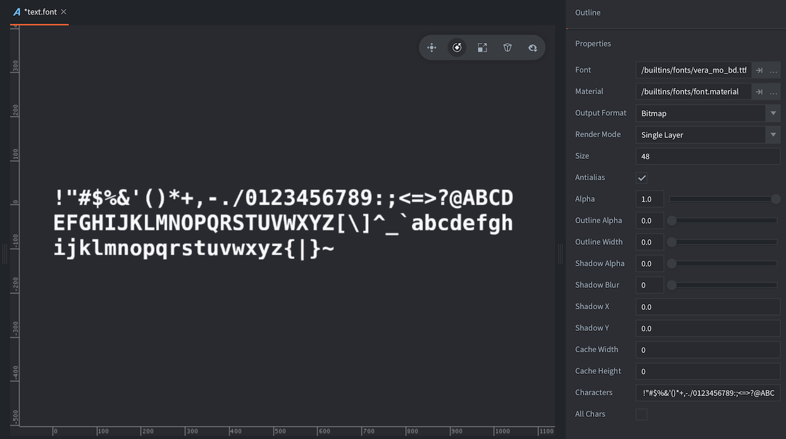
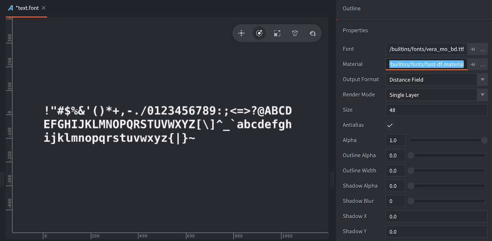

# Font files

Fonts are used to render text on Label components and GUI text nodes. Defold supports several font file formats:

- TrueType
- OpenType
- BMFont

Fonts added to your project are automatically converted into a texture format that Defold can render. Two font rendering techniques are available, each with its own specific benefits and drawbacks:

- Bitmap
- Distance field

## Offline or Runtime fonts

By default, the conversion to rasterized glyph images happens at build time (offline). This has the drawback that each font needs to rasterize all possible glyphs in the build stage, producing potentially very large textures that consume memory and also increase the bundle size.

By using "runtime fonts", the .ttf fonts will be bundled as-is, and the rasterization will happen on-demand at runtime. This minimizes both runtime memory usage and the bundle size.

## Text layout support (e.g. Right-to-left)

The runtime fonts also have the benefit of supporting full text layout, e.g. right-to-left.
We currently use the libraries [HarfBuzz](https://github.com/harfbuzz/harfbuzz), [SheenBidi](https://github.com/Tehreer/SheenBidi), [libunibreak](https://github.com/adah1972/libunibreak) and [SkriBidi](https://github.com/memononen/Skribidi).

See [Enabling Runtime Fonts](/manuals/font#enabling-runtime-fonts)

## Font collection

The `.fontc` file format is also known as a font collection. In offline mode, only one font is associated with it.
When using runtime fonts, you can associate more than one font file (.ttf) with the font collection.

This allows for using the a font collection when rendering multiple texts in different languages, while also keeping the memory footprint low.
E.g. loading a collection with the Japanese font, then associate that font with the current main font, followed by unloading the Japanese font collection.

## Creating a font

To create a font for use in Defold, create a new Font file by selecting <kbd>File ▸ New...</kbd> from the menu, then select <kbd>Font</kbd>. You can also <kbd>right click</kbd> a location in the *Assets* browser and select <kbd>New... ▸ Font</kbd>.


Give the new font file a name and click <kbd>Ok</kbd>. The new font file now opens in the editor.



Drag the font you wish to use into the *Assets* browser and drop it in a good spot.

Set the *Font* property to the font file and set the font properties as needed.

## Properties

*Font*
: The TTF, OTF or *`.fnt`* file to use for generating the font data.

*Material*
: The material to use when rendering this font. Make sure to change this for distance field and BMFonts (see below for details).

*Output Format*
: The type of font data that is generated.

  - `TYPE_BITMAP` converts the imported OTF or TTF file into a font sheet texture where the bitmap data is used to render text nodes. The color channels are used to encode the face shape, outline and drop shadow. For *`.fnt`* files, the source texture bitmap is used as is.
  - `TYPE_DISTANCE_FIELD` The imported font is converted into a font sheet texture where the pixel data represents not screen pixels but distances to the font edge. See below for details.

*Render Mode*
: The render mode to use for glyph rendering.

  - `MODE_SINGLE_LAYER` produces a single quad for each character.
  - `MODE_MULTI_LAYER` produces separate quads for the glyph shape, outline and shadows respectively. The layers are rendered in back-to-front order, which prevents a character from obscuring previously rendered characters if the outline is wider than the distance between glyphs. This render mode also enables proper drop shadow offsetting, as specified by the Shadow X/Y properties in the font resource.

*Size*
: The target size of the glyphs in pixels.

*Antialias*
: If the font should be antialiased when baked onto the target bitmap. Set to 0 if you want pixel perfect font rendering.

*Alpha*
: The transparency of the glyph. 0.0--1.0 where 0.0 means transparent and 1.0 opaque.

*Outline Alpha*
: The transparency of the generated outline. 0.0--1.0.

*Outline Width*
: The width of the generated outline in pixels. Set to 0 for no outline.

*Shadow Alpha*
: The transparency of the generated shadow. 0.0--1.0.

::: sidenote
Shadow support is enabled by the built-in font material shaders and handles both the single and multi layered render mode. If you don't need layered font rendering or shadow support, it is best to use a simpler shader such as the *`builtins/font-singlelayer.fp`*.
:::

*Shadow Blur*
: For bitmap fonts, this setting indicates the number of times a small blur kernel will be applied to each font glyph. For distance field fonts, this setting equals the actual pixel width of the blur.

*Shadow X/Y*
: The horizontal and vertical offset in pixels of the generated shadow. This setting will only affect the glyph shadow when the Render Mode is set to `MODE_MULTI_LAYER`.

*Characters*
: Which characters to include in the font. By default this field include the ASCII printable characters (character codes 32-126). You can add or remove characters from this field to include more or less characters in the font..

For runtime fonts, this text acts as a cache prewarming with the correct glyphs. This happens during load time. See `font.prewarm_text()`.

::: sidenote
The ASCII printable characters are:
space ! " # $ % & ' ( ) * + , - . / 0 1 2 3 4 5 6 7 8 9 : ; < = > ? @ A B C D E F G H I J K L M N O P Q R S T U V W X Y Z [ \ ] ^ _ \` a b c d e f g h i j k l m n o p q r s t u v w x y z { | } ~
:::

*All Chars*
: If you check this property all glyphs available in the source file will be included in the output.

*Cache Width/Height*
: Constrains the size of the glyph cache bitmap. When the engine renders text, it looks up the glyph from the cache bitmap. If it does not exist there, it will be added to the cache before rendering. If the cache bitmap is too small to contain all the glyphs the engine is asked to render, an error is signalled (`ERROR:RENDER: Out of available cache cells! Consider increasing cache_width or cache_height for the font.`).

  If set to 0 the cache size is set automatically, and will grow to 2048x4096 max.

## Distance field fonts

Distance field fonts store the distance to the edge of the glyph in the texture instead of bitmap data. When the engine renders the font, a special shader is required to interpret the distance data and use that to draw the glyph. Distance field fonts are more resource intensive than bitmap fonts, but allow for greater sizing flexibility.



Make sure to change the *Material* property of the font to *`builtins/fonts/font-df.material`* (or any other material that can handle the distance field data) when you create the font---or the font will not use the correct shader when it is rendered to screen.

## Bitmap BMFonts

In addition to generated bitmaps Defold supports prebaked bitmap "BMFont" format fonts. These fonts consists of a PNG font sheet with all the glyphs. In addition, a *`.fnt`* file contains information on where on the sheet each glyph can be found as well as size and kerning information. (Note that Defold does not support the XML version of the *`.fnt`* format that is used by Phaser and some other tools)

These types of fonts provide no performance improvement from bitmap fonts generated from TrueType or OpenType font files, but can include arbitrary graphics, coloring and shadows right in the image.

Add the generated *`.fnt`* and *`.png`* files to your Defold project. These files should reside in the same folder. Create a new font file and set the *font* property to the *`.fnt`* file. Make sure that *output_format* is set to `TYPE_BITMAP`. Defold will not generate a bitmap but use the one provided in the PNG.

::: sidenote
To create a BMFont, you need to use a tool that can generate the appropriate files. Several options exist:

* [Bitmap Font Generator](http://www.angelcode.com/products/bmfont/), a Windows only tool provided by AngelCode.
* [Shoebox](http://renderhjs.net/shoebox/), a free Adobe Air based app for Windows and macOS.
* [Hiero](https://libgdx.com/wiki/tools/hiero), an open source Java based tool.
* [Glyph Designer](https://71squared.com/glyphdesigner), a commercial macOS tool from 71 Squared.
* [bmGlyph](https://www.bmglyph.com), a commercial macOS tool from Sovapps.
:::


For the font to render correctly, don't forget to set the material property to *`builtins/fonts/font-fnt.material`* when you create the font.

## Artifacts and best practices

Generally, bitmap fonts are best when the font is rendered with no scaling. They are faster to render to screen than distance field fonts.

Distance field fonts respond very good to upscaling. Bitmap fonts, on the other hand, being just pixelated images will increase in size so the pixels will grow as the font is scaled, resulting in blocky artifacts. The following is a sample at font size 48 pixels, scaled up 4 times.


When scaling down, bitmap textures can be nicely and efficiently scaled down and antialiased by the GPU. A bitmap font keeps its color better than a distance field font. Here is a zoom of the same sample font at size 48 pixels, scaled down to 1/5 of the size:


Distance field fonts need to be rendered to a target size that is big enough to hold distance information that can express the curves of the font glyphs. This is the same font as above, but at 18 pixels size and scaled up 10 times. It is clear that this is too small to encode the shapes of this typeface:


If you don't want shadow or outline support, set their respective alpha values to zero. Otherwise, shadow and outline data will still be generated, taking up unnecessary memory.

## Font Cache
A font resource in Defold will result in two things at runtime, a texture and the font data.

* The font data consist of a list of glyph entries, each containing some basic kerning info and the bitmap data for that glyph.
* The texture is internally called the "glyph cache texture" and it will be used when rendering text for a specific font.

At runtime, when rendering text, the engine will first loop through the glyphs to be rendered to check which glyphs are available in the texture cache. Each glyph that is missing from the glyph texture cache will trigger a texture upload from the bitmap data stored in the font data.

Each glyph is placed internally in the cache according to the font baseline, which enables calculating local texture coordinates of the glyph within its corresponding cache cell in a shader. This means that you can achieve certain text effects such as gradients or texture overlays dynamically. The engine exposes metrics about the cache to the shader via a special shader constant called `texture_size_recip`, which contains the following information in the vector components:

* `texture_size_recip.x` is the inverse of the cache width
* `texture_size_recip.y` is the inverse of the cache height
* `texture_size_recip.z` is the ratio of cache cell width to the cache width
* `texture_size_recip.w` is the ratio of cache cell height to the cache height

For example - to generate a gradient in a shader fragment, simply write:

`float horizontal_gradient = fract(var_texcoord0.y / texture_size_recip.w);`

For more information about shader uniforms, see the [Shader manual](/manuals/shader).

## Enabling Runtime Fonts

It is possible to use runtime generation for SDF type fonts, when using TrueType (.ttf) fonts.
This approach can greatly reduce the download size and runtime memory consumption of a Defold game.
The small downside is the asynchronous nature of generating each glyph.

* Enable the feature by setting `font.runtime_generation` in game.project.

* Add an [App Manifest](/manuals/app-manifest) and enable the `Use full text layout system` option.
This builds a custom engine that has this feature enabled.

::: sidenote
This feature is currently experimental, but with the intention to be used as the default workflow in the future.
:::

::: important
The `font.runtime_generation` setting affects all .ttf fonts in the project.
:::


### Font Scripting

#### Prewarming glyph cache

In order to make the runtime fonts easier to use, they support prewarming of the glyph cache.
This means the font will generate the glyphs listed in *Characters* in the font.

::: sidenote
If `All Chars` is selected, there will be no prewarming as it defeats the purpose of not having to generate all glyphs at the same time.
:::

If the `Characters` field of the `.fontc` file is set, this is used as a text, to figure out which glyphs needs to be updated in the glyph cache.

It is also possible to manually update the glyph cache by calling `font.prewarm_text(font_collection, text, callback)`. It provides a callback to let you know when all the missing glyphs have been added to the glyph cache, and it's safe to present the text on screen.

### Adding/removing fonts to a font collection

For runtime fonts, it's possible to add or remove fonts (.ttf) to a font collection.
This is useful when a large font has been split up into multiple files for different character sets (e.g. CJK)

::: important
Adding a font to a font collection doesn't automatically load or render all the glyphs.
:::

```lua
-- get the main font
local font_collection = go.get("#label", "font")
font.add_font(font_collection, self.language_ttf_hash)

-- get the selected language font
local font_collection_language = go.get("localization_japanese#label", "font")
local font_info = font.get_info(font_collection_language)
self.language_ttf_hash = font_info.fonts[1].path_hash -- get the first font (the one specified in the editor)
font.add_font(self.font_collection, self.language_ttf_hash) -- increases the reference count to the font
```

```lua
-- remove the font reference
font.add_font(self.font_collection, self.language_ttf_hash)
```

### Prewarming glyphs

To properly show a text with a runtime font, the glyphs need to be resolved. The `font.prewarm_text()` does this for you.
It is an asynchronous operation, and once it's done and you get the callback, it's safe to progress to show any message containing the glyphs.

::: important
If the glyph cache gets full, the oldest glyph in the cache will be evicted.
:::

```lua
font.prewarm_text(self.font_collection, info.text, function (self, request_id, result, err)
    if result then
      print("PREWARMING OK!")
      label.set_text(self.label, info.text)
    else
      print("Error prewarming text:", err)
    end
  end)
```

