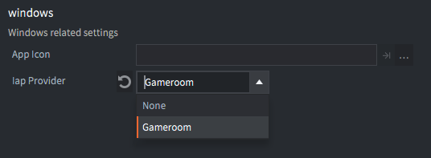
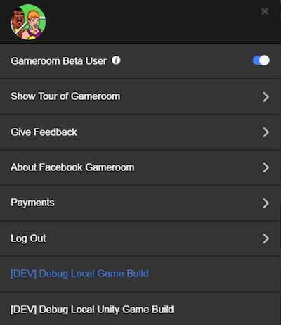

# Facebook Gameroom

Facebook Gameroom is a Windows-native client allowing players to play web games as well as native games built exclusively for the platform.


<span class="icon-windows"></span> The client is [available for download here](https://www.facebook.com/gameroom/download/) for Windows 7 and above.

Gameroom builds work with the same Facebook Lua API as usual. See the [Facebook manual](/manuals/facebook) for more information on the Defold Facebook API.

## Configuring for Gameroom

You need to set up your project for Facebook first. See the [Facebook manual](/manuals/facebook) for details.

Secondly, you should set the *IAP provider* setting under *Windows* in your "game.project" file to `Gameroom`:



## Building and testing locally

Bundle your game for the Windows platform. (<kbd>Project ▸ Bundle ▸ Windows Application</kbd>). Notice that there is a file named "launch" in the bundle directory.

You need a Windows machine to fully test your game. You also need the Gameroom client to test that your game integrates correctly with the SDK.

1. Start the client and click on your profile icon in the top right corner of the application window:

   

2. Click *[DEV] Debug Local Game Build*:

   

3. Click *Launch Game* and select the file "launch":

   

   

## Publishing your game

Your app must be approved in the Facebook App Center before it can go live. You can find instructions on how to proceed on the Facebook for developers pages here: https://developers.facebook.com/docs/games/gameroom/launch


## Premium games

You can set up your game as a premium game in Gameroom to provide paid content to players:

Premium Game
: Pay before you download and play.

Trial Mode
: Try before you buy.

See https://developers.facebook.com/docs/games/gameroom/premium for details on how to set up your game as a premium game on the Facebook *App Dashboard*.

Gameroom adds two functions to the iap API. Use them to implement a license check in order to separate trial and paid content.

[iap.has_premium()](/ref/iap#iap.has_premium)
: Checks if the user has purchased a license for the game.

[iap.buy_premium()](/ref/iap#iap.buy_premium)
: Let the user purchase a premium game license. The purchase transaction is handled like other IAP purchases, via an iap listener function.

To implement a trial mode, you do both a license check and a time limit (3 hour trial) or a content limit (first level trial) check. If the license check fails and the conditions for the trial does not hold anymore, you prompt the player to purchase the game. The Gameroom API will automatically display a payment dialog with the price configured in the Facebook App Dashboard.

```lua
local function iap_listener(self, transaction, error)
  if error == nil then
    if (transaction.state == iap.TRANS_STATE_PURCHASED) then
      iap.finish(transaction)
      msg.post("game#controller", "continue_after_purchase")
    end
  else
    -- an error occurred...
  end
end

local function premium_result(self, has_premium)
  -- how many minutes has player tried this game?
  local playminutes = go.get("game#timekeeper", "playtime"))

  -- if user has played for more than 3 hours and has not yet purchased.
  if playminutes > 180 and not has_premium then
     -- stop the game until game is purchased
     msg.post("game#controller", "stop_for_purchase")
     iap.buy_premium()
  end
end

function init()
  -- set the listener function for iap transactions
  iap.set_listener(iap_listener)

  -- check if the player needs to purchase a license.
  -- this should probably be done at regular intervals.
  iap.has_premium(premium_result)
end
```
