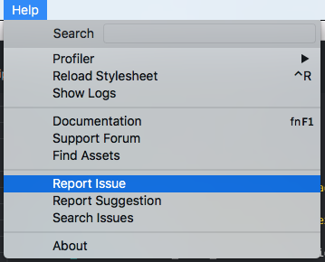

# Getting help

If you run into a problem while using Defold we'd like to hear from you so that we can fix the issue and/or help you work around the problem! There are several ways to discuss and also report issues. Chose the option that works best for you:

## Report a problem on the forum

A good way to discuss and get help with a problem is to post a question on our [forum](https://forum.defold.com). Post either in the [Questions](https://forum.defold.com/c/questions) or [Bugs](https://forum.defold.com/c/bugs) category depending on the type of problem you have. When you post a support question make sure to include as much information as possible. Remember to [search](https://forum.defold.com/search) for your question/issue before asking as there may already be a solution to your problem. You must include the following for us to provide help:

* **Describe the bug (REQUIRED)** - A clear and concise description of the problem.

* **To Reproduce (REQUIRED)** - Steps to reproduce the problem:
  1. Go to '...'
  2. Click on '....'
  3. Scroll down to '....'
  4. See error

* **Expected behavior (REQUIRED)** - A clear and concise description of what you expected to happen.

* **Defold version (REQUIRED)** - Version [e.g. 1.2.155]. Preferably also the SHA1 of the engine and editor, as seen in the <kbd>Help->About</kbd> menu option.

* **Platforms (REQUIRED)** - On which platforms does the problem happen?
  - Platforms: [e.g. iOS, Android, Windows, macOS, Linux, HTML5]
  - OS: [e.g. iOS8.1, Windows 10, High Sierra]
  - Device: [e.g. iPhone6]

* **Logs (OPTIONAL)** - Please include any relevant logs (engine and/or editor). Editor logs are located here:
  - Windows: `C:\Users\ **Your Username** \AppData\Local\Defold`
  - macOS: `/Users/ **Your Username** /Library/Application Support/` or `~/Library/Application Support/Defold`
  - Linux: `~/.Defold`

  Engine logs for Android can be accessed using the `adb` command line tool (Android Debug Bridge). Read more about the `adb` command line tool in the [Android manual](/manuals/android/#android-debug-bridge).

  Engine logs for iOS can be accessed using XCode and the Devices and Simulators menu option.

  Engine logs for HTML5 builds can be viewed in the browser developer console:
  - Chrome: Menu > More Tools > Developer Tools
  - Firefox: Tools > Web Developer > Web Console
  - Safari: Develop > Show JavaScript Console

  Engine logs for desktop builds can be viewed by running the Defold application from a terminal/command prompt.

  You can also write engine logs to a file and access this once the application has been shut down. You can read more about how to enable and access the log in the [Debugging manual](/manuals/debugging/#extracting-the-logtxt-file).

* **Minimal repro case project (OPTIONAL)** - Please attach a minimal project where the bug is reproduced. This will greatly help the person trying to investigate and fix the bug. If you share the project as a zip file make sure to exclude the `.git`, `.internal` and `build` folders from the archive.

* **Workaround (OPTIONAL)** - If there is a workaround, please describe it here.

* **Screenshots (OPTIONAL)** - If applicable, add screenshots to help explain your problem.

* **Additional context (OPTIONAL)** - Add any other context about the problem here.

## Report a problem from the editor

The editor provides a convenient way to report issues. Select the <kbd>Help->Report Issue</kbd> menu option from within the editor to report an issue.

Selecting this menu option will bring you to an issue tracker on GitHub. Please fill out the form and include as much information as possible. Note that you need a GitHub account to submit a bug report this way.

## Discuss a problem on Slack

If you run into a problem while using Defold you can try to ask the question on [Slack](https://www.defold.com/slack/). We do however recommend that complex questions and in-depth discussions are posted on the forum. Also note that we do not accept bug reports submitted through Slack.
