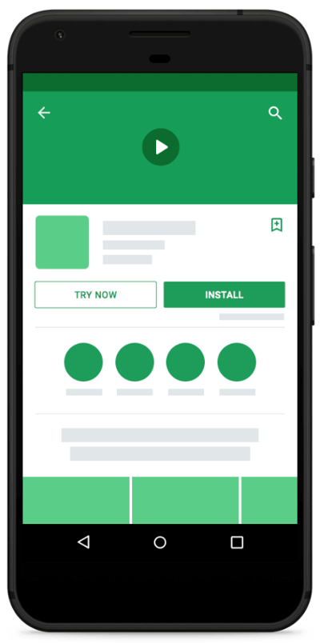
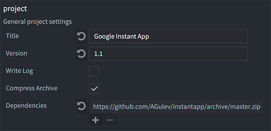
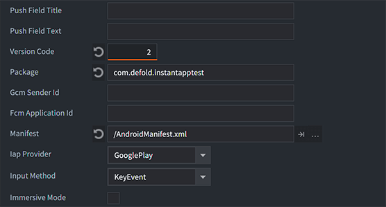
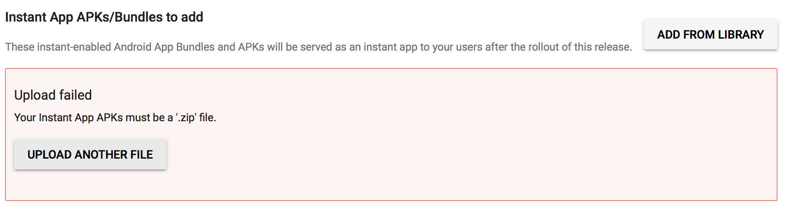
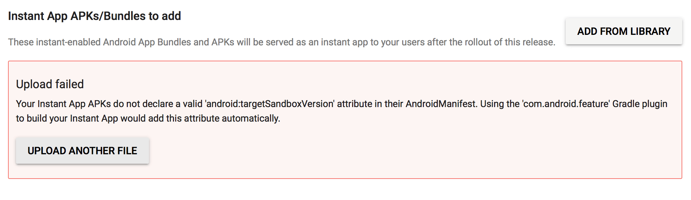
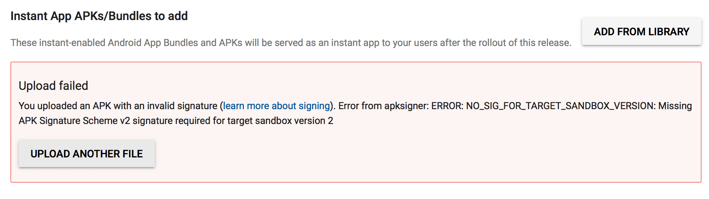

# Google Play Instant

Google Play Instant enables native games to launch on devices running Android 6.0 without being installed.




## Publishing process

To be able to publish your game as Google Play Instant app you need to set your project properly:

1. Create custom `AndroidManifest.xml` file and add next two attributes to the `<manifest>` element:

```lua
xmlns:dist="http://schemas.android.com/apk/distribution"
android:targetSandboxVersion="2"
```
How it should looks with default AndroidManifest.xml for example:

```lua
<manifest xmlns:android="http://schemas.android.com/apk/res/android"
        package="{{android.package}}"
        android:versionCode="{{android.version_code}}"
        android:versionName="{{project.version}}"
        android:installLocation="auto"
        xmlns:dist="http://schemas.android.com/apk/distribution"
        android:targetSandboxVersion="2">
```

2. Add a dependency to the Google Instant Apps extension in your “game.project” file. Add “https://github.com/AGulev/instantapp/archive/master.zip” or point to the ZIP file of a [specific release](https://github.com/AGulev/instantapp/releases) to the Dependencies property.



3. Download libraries: Project->Fetch Libraries
4. Bundle `apk` Project->Bundle->Android Application
5. Create a `zip` archive with `apk` file
6. Now you can upload this `zip` in your Google Play Console as Android Instant App

### Version codes
Pay attention to [the recommendations about the version codes](https://developer.android.com/topic/google-play-instant/getting-started/game-instant-app#version-codes): Instant Game version code needs to be less than version code of the installable game.



### android:targetSandboxVersion="2"

If you set `android:targetSandboxVersion="2"` in the main installable game you will be able to work with the same files as instant game (a save file for example). But then you would have restrictions in the main application. More information in [the official documentation](https://developer.android.com/guide/topics/manifest/manifest-element#targetSandboxVersion).
::: sidenote
Once an app is installed, you can only update its target sandbox value to a higher value. To downgrade the target sandbox value, you must uninstall the app and replace it with a version whose manifest contains a lower value for this attribute.
::: 
Even if you set different `android:targetSandboxVersion` in the installable game and instant game you still able to use `instantapp.set_cookie()` and `instantapp.get_cookie()` for communication between the game versions.


## API Usage

The Google Play Instant extension is accessible through the `instantapp.*` namespace where it wraps Java [PackageManagerCompat methods](https://developers.google.com/android/reference/com/google/android/gms/instantapps/PackageManagerCompat) in a Lua API.

If you are working on cross-platform application the best practice to check the existence of `instantapp` module, this module exists only in android bundle:
```lua
if instantapp then
  -- call instantapp methods
end
```

For example:

```lua
if instantapp.is_instant_app() then
  -- if this is instant app save data for the main app and show install prompt
  local cookie_size = instantapp.get_cookie_max_size()
  if cookie_size > 0 then
    instantapp.set_cookie(bytes_of_save_data)
  end
  instantapp.show_install_prompt()
else
  -- regular app logic
end
```

Refer to the extension [API documentation](https://github.com/AGulev/instantapp/blob/master/README.md) for details on how to use the Google Instant API in Defold.

## Technical Requirements
According to the [Google Play Instant Technical Requirements](https://developer.android.com/topic/google-play-instant/game-tech-requirements) `apk` size must be less than or equal to 10 MB. Information about application size optimisation available [here](/manuals/instant-games/#_reducing_bundle_size).

## Troubleshooting

---

Your Instant App APKs must be a ‘.zip’ file.



> You need to upload `zip` with `apk` file, instead of `apk` file ([see p.5](/manuals/google-play-instant/#_publishing_process)).

---

Upload failed

Your Instant App APKs do not declare a valid ‘android:targetSandboxVersion’ attribute in their AndroidManifest. Using the ‘com.android.feature’ Gradle plugin to build your Instant App would add this attribute automatically.



> You need to add `android:targetSandboxVersion="2"` the the `<manifest>` element ([see p.1](/manuals/google-play-instant/#_publishing_process)).

---

Upload failed
You uploaded an APK with an invalid signature ([learn more about signing](http://developer.android.com/tools/publishing/app-signing.html)). Error from apksigner: ERROR: NO_SIG_FOR_TARGET_SANDBOX_VERSION: Missing APK Signature Scheme v2 signature required for target sandbox version 2



> Starting Defold 1.2.156 we are using both signing method v1 and v2. If you are using older Defold version check [the instruction how to re-sign `apk` manually](https://forum.defold.com/t/instruction-android-instant-app-creation/48471).

---
