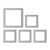
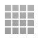

# Graphics

Defold is a full 3D engine, but it is designed and built with strong support for 2D games. The editor is currently best suited for making 2D games. 

## Importing Image Files

Defold needs all assets that should be in your project hierarchy. Therefore you need to import all graphics asset files that you need for your graphics. To import an assets, simply drag the files from the file system on your computer and drop them in an appropriate place in the Defold editor _Project Explorer_.

{srcset="images/graphics/import@2x.png 2x"}

Defold supports images in the PNG and JPEG image formats. For models, Defold uses the Collada DAE format.

## Image resources

In Defold, there are two types of resource that are used as an image source for visual components:

{.icon} Atlas
: An atlas contains a list of separate images files, which are automatically combined into a larger texture image. Atlases can contain still images and *Animation Groups*, sets of images that together form a flipbook animation.

  {srcset="images/graphics/atlas@2x.png 2x"}

{.icon} Tile Source
: A tile source references an image file that is already made out to consist of smaller sub-images ordered on a uniform grid. Another term commonly used for this type of compound image is _sprite sheet_. Tile sources can contain flipbook animations, defined by the first and last tile for the animation. It is also possible to use an image to automatically attach collision shapes to tiles.

  {srcset="images/graphics/tilesource@2x.png 2x"}

## Visual components

There are several component types that get their image data from atlas or tile source image resources:

{.icon}
: A sprite is a simple image or flipbook animation that is displayed on screen.

  {srcset="images/graphics/sprite@2x.png 2x"}


{.icon} Tile map
: A tilemap component pieces together a map from tiles (image and collision shapes) that come from a tile source. Tile maps cannot use atlas sources.

  {srcset="images/graphics/tilemap@2x.png 2x"}


{.icon} Particle fx
: Particles that are spawned from a particle emitter consist of a still image or a flipbook animation from an atlas or tile source. 

  {srcset="images/graphics/particles@2x.png 2x"}


{.icon} GUI
: GUI box nodes and pie nodes can use still images and flip book animations from atlases and tile sources.

  {srcset="images/graphics/gui@2x.png 2x"}

{.icon} Spine model
: Spine models gets their data from Spine scene resources. Those contain two pieces of data:

  1. A Spine Json file that describes the bone animations.
  2. An atlas that contain the images that are attached to the bones. Spine models cannot use data from tile maps.

  {srcset="images/graphics/spine@2x.png 2x"}


## 3D graphics

Models get its image data directly from an image file that is mapped onto the model according to the model's UV map:

{.icon} Model
: 3D models 

  {srcset="images/graphics/model@2x.png 2x"}

Collada support
: Defold's 3D support requires you to save or export model, skeleton and animation data in the _Collada_ format. This is a widely adopted format that most 3D modelling software supports. So you should be able to create assets in in _Maya_, _3D Max_, _Blender_, _Sketchup_ or any other popular software and then bring the results into Defold.

  Defold currently only supports baked animations. Animations need to have matrices for each animated bone each keyframe, and not position, rotation and scale as separate keys.

  Animations are also linearly interpolated. If you do more advanced curve interpolation the animations needs to be prebaked from the exporter.

  Animation clips in Collada are not supported. To use multiple animations per model, export them into separate *.dae* files and gather the files into an *.animationset* file in Defold.

Materials, shaders and textures
: 3D software commonly allows you to set properties on your object vertices, like coloring and texturing. This information goes into the Collada *.dae* file that you export from your 3D software. Depending on the requirements of your game you will have to select and/or create appropriate and _performant_ materials for your objects. A material combines _shader programs_ with a set of parameters for rendering of the object.

  You will also need to design and implement a game camera that works with your intended gameplay.

  There is a simple 3D model material available in the built-in materials folder. If you need to create custom materials for your models, see the [Material documentation](/manuals/material) for information. The [Shader manual](/manuals/shader) contains information on how shader programs work.

Rendering models
: The default render script is tailor made for 2D games and does not work with 3D models. But by copying the default render script and adding a handful of lines of code to the render script you can enable rendering of your models. For instance:

  ```lua

  function init(self)
    self.model_pred = render.predicate({"model"})
    ...
  end

  function update()
    ...
    render.set_depth_mask(true)
    render.enable_state(render.STATE_DEPTH_TEST)
    render.set_projection(stretch_projection(-1000, 1000))  -- orthographic
    render.draw(self.model_pred)
    render.set_depth_mask(false)
    ...
  end
  ```

  See the [Render documentation](/manuals/render) for details on how render scripts work.


## Z order

All game objects and components are positioned in 3D space with positions expressed as vector3 objects. When you view your game's graphics content in 2D, the X and Y value determine the position of an object along the "width" and "height" axis, and the Z position determines the position along the "depth" axis. The Z position allows you to control the visibility of overlapping objects: a sprite with a Z value of 1 will appear in front of a sprite at Z position 0. By default, Defold uses a coordinate system allowing Z values between -1 and 1:

{srcset="images/graphics/z-order@2x.png 2x"}

The numerical precision on the Z values with a near and far limit of -1 and 1 is very high. When working with 3D assets, you may need to change the near and far limits of the default projection in a custom render script. See the [Render manual](/manuals/render/) for more information.

## Blend modes

The *Blend Mode* property defines how the sprite should be blended with the graphics behind it. These are the available blend modes and how they are calculated:

Alpha
: Normal blending: a~0~ * rgb~0~ + (1 - a~0~) * rgb~1~

Add
: Brighten the background with the color values of the corresponding sprite pixels: rgb~0~ + rgb~1~

Add Alpha (deprecated!)
: Brighten the background with the corresponding visible sprite pixels: a~0~ * rgb~0~ + rgb~1~

Multiply
: Darken the background with values of the the corresponding sprite pixels: rgb~0~ * rgb~1~


## Texture filtering and sampling

You can control the filtering that is done during texture sampling. The filter method governs the visual result in cases when a _texel_ (a pixel in a texture) is not perfectly aligned with a screen pixel. This happens when you move a graphical element that contains the texture less than a pixel. The following filter methods are available:

Nearest
: The nearest texel will be picked to color the screen pixel. This sampling method should be chosen if you want a perfect one-to-one pixel mapping from your textures to what you see on screen. With nearest filtering everything will snap from pixel to pixel when moving. This may  look twitchy if the Sprite moves slowly.

Linear
: The texel will be averaged with its neighbors before coloring the screen pixel. This produces smooth appearances for slow, continuous motions as a Sprite will bleed into the pixels before fully coloring them--thus it is possible to move a Sprite less than a whole pixel.

The setting for which filtering to use is stored in the [Project Settings](/manuals/project-settings) file. There are two settings:

default_texture_min_filter
: Minifying filtering applies whenever the texel is smaller than the screen pixel.

default_texture_mag_filter
: Magnifying filtering applies whenever the texel is larger than the screen pixel.

Both settings accept the values `linear` or `nearest`. For example:

```ini
[graphics]
default_texture_min_filter = nearest
default_texture_mag_filter = nearest
```

If you don’t specify anything, both are set to `linear` by default.

Note that the setting in "game.project" is used by in the default samplers. If you specify samplers in a custom material, you can set the filter method on each sampler specifically. See the [Materials manual](/manuals/material/) for details.

## Materials and shaders

The default material and shader files are located under "/builtins/materials/" in your project. The default shaders for sprites, tiles, spine models and models performs a texture lookup through a sampler with filtering set according to the settings in "game.project". The fragment shader also uses a fragment shader constant called `tint` that is multiplied with the texture color.

You can set the `tint` and other shader constant while the game is running with the functions [`sprite.set_constant()`](/ref/sprite#sprite.set_constant) and [`sprite.reset_constant()`](/ref/sprite#sprite.reset_constant). Similar functions exist for other component types than sprites.

The [Materials manual](/manuals/material/) explains how to create custom materials.
