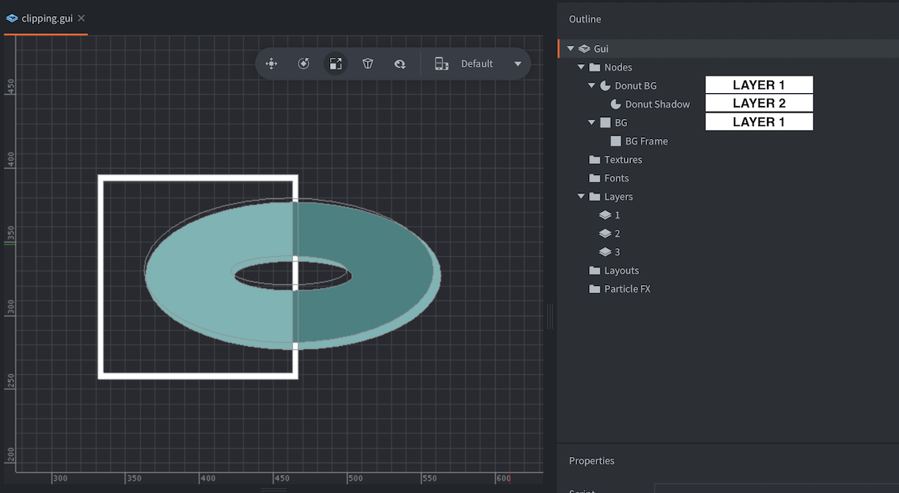

# Clipping

GUI nodes can be used as *clipping* nodes---masks that control how other nodes are rendered. This manual explains how this feature works.

## Creating a clipping node

Box, Text and Pie nodes can be used for clipping. To create a clipping node, add a node in your GUI, then set its properties accordingly:

Clipping Mode
: The mode used for clipping.
  - `None` renders the node without any clipping taking place.
  - `Stencil` makes the node writing to the current stencil mask.

Clipping Visible
: Check to render the content of the node.

Clipping Inverted
: Check to write the inversion of the node's shape to the mask.

Then add the node(s) you want to be clipped as children to the clipping node.

{srcset="images/gui-clipping/create@2x.png 2x"}

## Stencil mask

Clipping works by having nodes writing to a *stencil buffer*. This buffer contains clipping masks: information that that tells the graphics card whether a pixel should be rendered or not.

- A node with no clipper parent but with clipping mode set to `Stencil` will write its shape (or its inverse shape) to an new clipping mask stored in the stencil buffer.
- If a clipping node has a clipper parent it will instead clip the parent's clipping mask. A clipping child node can never _extend_ the current clipping mask, only clip it further.
- Non clipper nodes that are children to clippers will be rendered with the clipping mask created by the parent hierarchy.

{srcset="images/gui-clipping/setup@2x.png 2x"}

Here, three nodes are set up in a hierarchy:

- The hexagon and square shapes are both stencil clippers.
- The hexagon creates a new clipping mask, the square clips it further.
- The circle node is a regular pie node so it will be rendered with the clipping mask created by its parent clippers.

Four combinations of normal and inverted clippers are possible for this hierarchy. The green area marks the part of the circle that is rendered. The rest is masked:

{srcset="images/gui-clipping/modes@2x.png 2x"}

## Stencil limitations

- The total number of stencil clippers can not exceed 256.
- The maximum nesting depth of child _stencil_ nodes is 8 levels deep. (Only nodes with stencil clipping count.)
- The maximum number of stencil node siblings is 127. For each level down a stencil hierarchy, the max limit is halved.
- Inverted nodes have a higher cost. There is a limit to 8 inverted clipping nodes and each will halve the max amount of non-inverted clipping nodes.
- Stencils render a stencil mask from the _geometry_ of the node (not the texture). It is possible to invert the mask by setting the *Inverted clipper* property.

## Layers

Layers can be used to control rendering order (and batching) of nodes. When using layers and clipping nodes the usual layering order is overridden.

- Clipping order take precedence over layer order---regardless of what layer a node belongs to, it will be clipped according to the node hierarchy.
- Layers only affect the draw order of graphics---and furthermore, the layer set on a clipping node only affects the draw order _in that clipper's hierarchy_.

::: sidenote
A clipping node and its hierarchy will be drawn first if it has a layer assigned and in the regular order if no layer is assigned.
:::

{srcset="images/gui-clipping/layers@2x.png 2x"}

Here the clipper node "ocular" is set to "layer3" and the "bean" node is set to "layer1". The ocular clipper's texture is therefore rendered on top of the clipped bean.

The node "shield" is set to "layer2", but it has no effect on the node's render order in relation to "ocular" or "bean". To change the render order of "shield", change the node tree index order.
