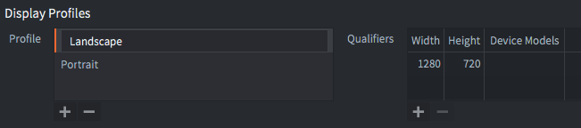
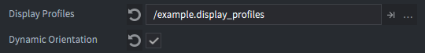
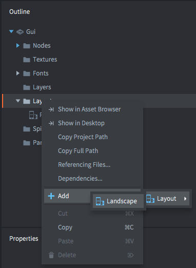
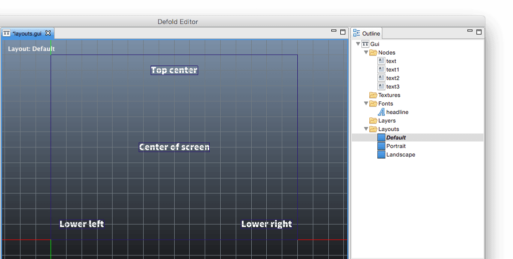
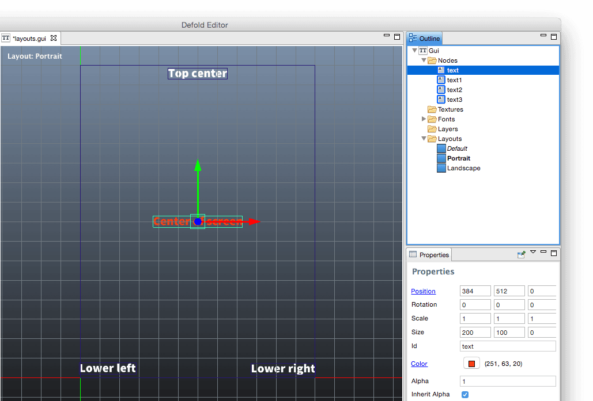

# Layouts

Defold supports GUIs that automatically adapt to screen orientation changes on mobile devices. Using this feature allows you to design GUIs that adapt to the orientation and aspect ratio of the screen.

The dynamic layout of GUIs works by matching display profiles to the current width and height of the display that the game is running on.

## Display profiles

Each project contains a `builtins/render/default.display_profiles` with two profiles:



Landscape
: 1280 pixels wide and 720 pixels high

Portrait
: 720 pixels wide and 1280 pixels high

For devices with an aspect ratio of 16:9 these profiles are probably enough. Even if the actual physical dimensions of the screen are higher or lower, the engine will automatically select the a profile that is closest. If you need to alter the default profiles, simply copy the built in file to a new place within your project or create a new file, then change the setting in `project.settings` so the engine knows which profiles-file to use:



The project settings also allow you to enable *dynamic_orientation* which means that the engine will dynamically select a matching layout and also change the selection if the device changes orientation.

::: sidenote
The current development app for iOS does not respect the *dynamic_orientation* setting but will always change orientation dynamically.
:::

## GUI layouts

The defined display profiles can then be used to create layouts in the GUI editor. When working in the editor, a *Default* layout is used by default. If you have not added any additional layout(s), the default layout will be used. To add a new layout, right-click the *Layouts* icon in the *Outline* view and select the <kbd>Layout ▸ ...</kbd> menu item:



::: sidenote
The *Default* layout is only used if there are no other layouts added to the GUI scene. So, if you add a "Landscape" layout, that will be the best match for all orientations until you also add a "Portrait" layout.
:::

When editing a GUI scene, all nodes are edited on a particular layout. The currently selected layout is indicated in the *Outline* view. The current layout is marked in *bold*.



You also get visual feedback on whether a node overrides a property on the currently selected layer (other than *Default*) or not. Each change to a node property that you do with a layout selected _overrides_ the property in respect to the *Default* layout. Properties that are overridden are marked in blue. You can click on the blue property name to reset the property to the default value.



Note that layers only override properties. A layer cannot delete or create new nodes. If you need to remove a node from a layer you can either move the node off-screen or delete it with script logic. You should also pay attention to the currently selected layout. If you add a layout to your project, the new layout will be set up according to the currently selected layout. Also, copying and pasting nodes considers the currently selected layout, when copying *and* when pasting.

## Layout change messages

When the engine switches layout as a result of device rotation, a `layout_changed` message is posted to the GUI components' scripts that are affected by the change. The message contains the hashed id of the layout so the script can perform logic depending on which layout is selected:

```lua
function on_message(self, message_id, message, sender)
    if message_id == hash("layout_changed") and message.id == hash("Landscape") then
        -- switching layout to landscape
    ...
    elseif message_id == hash("layout_changed") and message.id == hash("Portrait") then
    -- switching layout to portrait
    ...
    end
end
```

In addition, the current render script receives a message whenever the window (game view) changes and this includes orientation changes.

```lua
function on_message(self, message_id, message)
    if message_id == hash("window_resized") then
      -- The window was resized. message.width and message.height contain the
      -- new dimensions of the window.
    end
end
```

## In game content

Note that when orientation is switched, the GUI layout manager will automatically rescale and reposition GUI nodes according to your layout and node properties. For in-game content, the view is rendered as is, by default stretch-fit into the current window.


If your game design puts specific contraints on how the game view should be rendered, you can change the render script and implement precisely the behavior you need, taking camera, viewport and whatnot into consideration.

(Some of the graphic assets used are made by Kenney: http://kenney.nl/assets)
