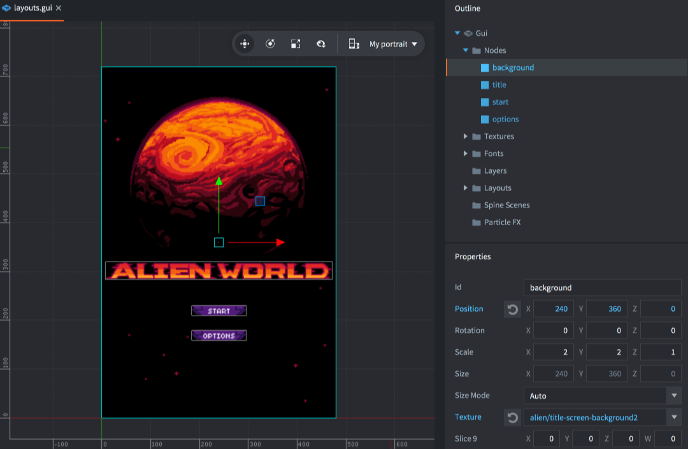

# Layouts

Defold supports GUIs that automatically adapt to screen orientation changes on mobile devices. By using this feature you can design GUIs that adapt to the orientation and aspect ratio of a range of screen sizes. It is also possible to create layouts that match particular device models.

## Creating display profiles

By default, the *game.project* settings specify that a built-in display profiles settings file ("builtins/render/default.display_profiles") is used. The default profiles are "Landscape" (1280 pixels wide and 720 pixels high) and "Portrait" (720 pixels wide and 1280 pixels high). No device models are set on the profiles so they will match on any device.

To create a new profiles settings file, either copy the one from the "builtins" folder or <kbd>right click</kbd> a suitable location in the *Assets* view and select <kbd>New... ▸ Display Profiles</kbd>. Give the new file a suitable name and click <kbd>Ok</kbd>.

The editor now opens the new file for editing. Add new profiles by clicking the <kbd>+</kbd> in the *Profiles* list. For each profile, add a set of *qualifiers* for the profile:

Width
: The pixel width of the qualifier.

Height
: The pixel height of the qualifier.

Device Models
: A comma separated list of device models. The device model matches the start of the device model name, e.g. `iPhone10` will match "iPhone10,\*" models. Model names with commas should be enclosed in quotes, i.e. `"iPhone10,3", "iPhone10,6"` matches iPhone X models (see [iPhone wiki](https://www.theiphonewiki.com/wiki/Models)). Note that the only platforms reporting a device model when calling `sys.get_sys_info()` is Android and iOS. Other platforms return an empty string and will therefore never pick a display profile that has a device model qualifier.


You also need to specify that the engine should use your new profiles. Open *game.project* and select the display profiles file in the *Display Profiles* setting under *display*:


If you want the engine to automatically switch between portrait and landscape layouts on device rotation, check the *Dynamic Orientation* box. The engine will dynamically select a matching layout and also change the selection if the device changes orientation.

### Auto Layout Selection (Display Profiles)

Display Profiles resource has an “Auto Layout Selection” option (ON by default). When ON, the engine automatically selects the best matching GUI layout both when the scene is created and when the window/display size changes. When OFF, the engine will not change layouts automatically—use `gui.set_layout()` from your GUI script to switch layouts manually. This setting is stored in the Display Profiles file and affects all GUI scene.

## GUI layouts

The current set of display profiled can be used to create layout variants of your GUI node setup. To add a new layout to a GUI scene, right-click the *Layouts* icon in the *Outline* view and select <kbd>Add ▸ Layout ▸ ...</kbd>:


When editing a GUI scene, all nodes are edited on a particular layout. The currently selected layout is indicated in the GUI scene layout dropdown in the toolbar. If no layout is chosen, the nodes are edited in the *Default* layout.




Each change to a node property that you do with a layout selected _overrides_ the property in respect to the *Default* layout. Properties that are overridden are marked in blue. Nodes with overridden properties are also marked in blue. You can click on the reset button next to any overridden property to reset it to the original value.


A layout cannot delete or create new nodes, only override properties. If you need to remove a node from a layout you can either move the node off-screen or delete it with script logic. You should also pay attention to the currently selected layout. If you add a layout to your project, the new layout will be set up according to the currently selected layout. Also, copying and pasting nodes considers the currently selected layout, when copying *and* when pasting.

## Dynamic profile selection

When Auto Layout Selection is enabled, the engine automatically selects the best matching layout. The dynamic layout matching scores each display profile qualifier according to the following rules:

1. If there is no device model set, or the device model matches, a score (S) is calculated for the qualifier.

2. The score (S) is calculated with the area of the display (A), the area from the qualifier (A_Q), the aspect ratio of the display (R) and the aspect ratio of the qualifier (R_Q):


3. The profile with the lowest scoring qualifier is selected, if the orientation (landscape or portrait) of the qualifier matches the display.

4. If no profile with a qualifier of the same orientation is found, the profile with the best scoring qualifier of the other orientation is selected.

5. If no profile can be selected, the *Default* fallback profile is used.

Since the *Default* layout is used as fallback in runtime if there are no better matching layout it means that if you add a "Landscape" layout, it will be the best match for *all* orientations until you also add a "Portrait" layout.

## Layout change messages

When the layout changes, a `layout_changed` message is posted to the GUI component’s script. This happens when the engine changes layout automatically (Auto Layout Selection ON) or when your script calls `gui.set_layout()` and the layout actually changes. The message contains the hashed id of the layout so the script can perform logic depending on which layout is selected:

```lua
function on_message(self, message_id, message, sender)
  if message_id == hash("layout_changed") and message.id == hash("My Landscape") then
    -- switching layout to landscape
  elseif message_id == hash("layout_changed") and message.id == hash("My Portrait") then
    -- switching layout to portrait
  end
end
```

In addition, the current render script receives a message whenever the window (game view) changes and this includes orientation changes.

```lua
function on_message(self, message_id, message)
  if message_id == hash("window_resized") then
    -- The window was resized. message.width and message.height contain the
    -- new dimensions of the window.
  end
end
```

When orientation is switched, the GUI layout manager will automatically scale and reposition GUI nodes according to your layout and node properties. In-game content, however, is rendered in a separate pass (by default) with a stretch-fit projection into the current window. To change this behavior, either supply your own modified render script, or use a camera [library](/assets/).

## Manual layout selection (Lua)

When Auto Layout Selection is OFF for the Display Profiles in use, the engine won’t switch layouts automatically. Use these functions from a GUI script to manage layouts manually:

### gui.set_layout(layout)

- Accepts a string or hash (layout id).
- Returns boolean: `true` if the layout exists in the scene and was applied; `false` otherwise.
- If the layout exists in Display Profiles, updates the scene resolution to the profile’s width/height.
- Emits `layout_changed` when the layout actually changes.

Example:

```lua
function init(self)
    -- Manually apply the "Portrait" layout
    local ok = gui.set_layout("Portrait")
    if not ok then
        print("Portrait layout not found in this scene")
    end
end
```

### gui.get_layouts()

- Returns a table mapping each layout id hash to `vmath.vector3(width, height, 0)`.
- For the default layout, returns the current scene resolution.

Example:

```lua
local layouts = gui.get_layouts()
for id, size in pairs(layouts) do
    print(id, size.x, size.y)
end
```

Note: If a GUI layout exists in the scene but is not present in Display Profiles, `gui.set_layout()` still applies the per-layout node overrides but does not change the scene resolution.
