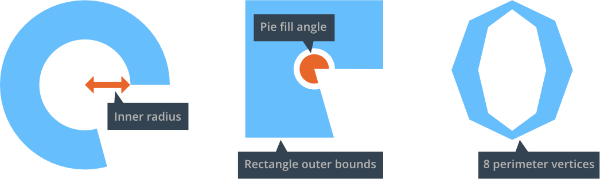

# GUI pie nodes

Pie nodes are used to create circular or ellipsoid objects ranging from plain circles to pies and square donut shapes.

## Creating a pie node

<kbd>Right click</kbd> the *Nodes* section in the *Outline* and select <kbd>Add ▸ Pie</kbd>. The new pie node is selected and you can modify its properties.

{srcset="images/gui-pie/create@2x.png 2x"}

The following properties are unique to pie nodes:

Inner Radius
: The inner radius of the node, expressed along the X axis.

Outer Bounds
: The shape of the outer bounds of the node.

  - `Ellipse` will extend the node to the outer radius.
  - `Rectangle` will extend the node to the node's bounding box.

Perimeter Vertices
: The number of segments that will be used to build the shape, expressed as the number of vertices required to fully circumscribe the 360 degree perimeter of the node.

Pie Fill Angle
: How much of the pie should be filled. Expressed as a counter-clockwise angle starting from the right.

{srcset="images/gui-pie/properties@2x.png 2x"}

If you set a texture on the node, the texture image is applied flat, with the corners of the texture correlating to the corners of the node bounding box.

## Modify pie nodes at runtime

Pie nodes respond to any generic node manipulation functions for setting size, pivot, color and so forth. A few pie node only functions and properties exist:

```lua
local pienode = gui.get_node("my_pie_node")

-- get the outer bounds
local fill_angle = gui.get_fill_angle(pienode)

-- increase perimeter vertices
local vertices = gui.get_perimeter_vertices(pienode)
gui.set_perimeter_vertices(pienode, vertices + 1)

-- change outer bounds
gui.set_outer_bounds(pienode, gui.PIEBOUNDS_RECTANGLE)

-- animate the inner radius
gui.animate(pienode, "inner_radius", 100, gui.EASING_INOUTSINE, 2, 0, nil, gui.PLAYBACK_LOOP_PINGPONG)
```
