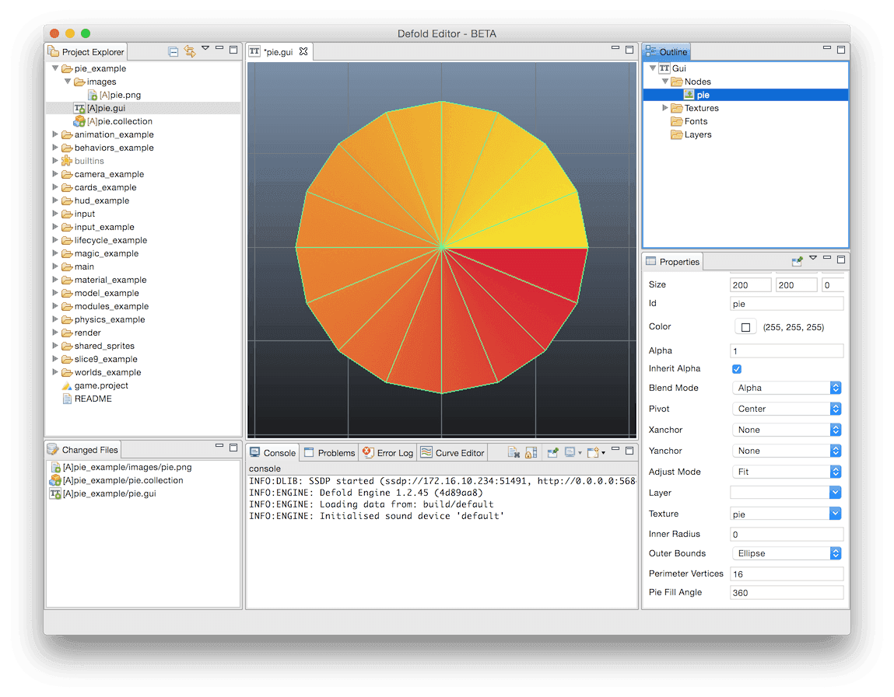
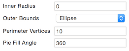
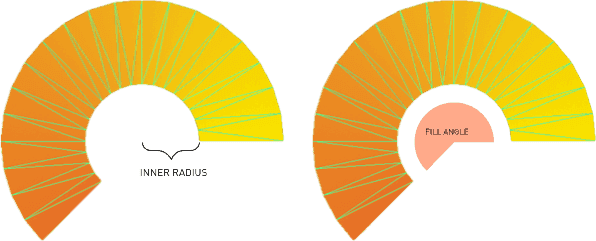
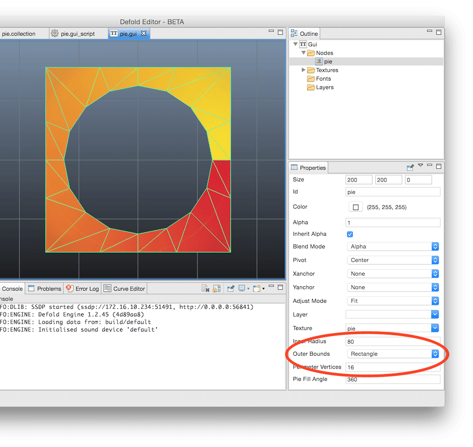
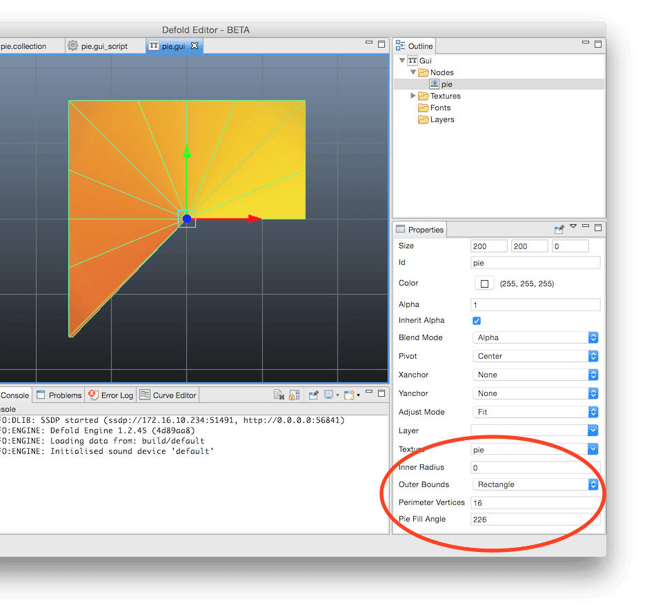

# GUI pie nodes

Pie nodes can be used to create circular or ellipsoid objects. In its simplest form, a pie node is simply a circle or ellipse inscribed in the node bounding box. If the width and height is identical, the circle's diameter will be that value. If the width and height differ, the node is instead an ellipse with the node width being the horizontal extent of the ellipse and the height being the vertical extent. The texture set for the node is applied straight, with the corners of the texture correlating to the corners of the node bounding box.

Pie nodes have a set of properties that makes it possible to use them to create a wide range of shapes. All of these properties can be changed programmatically (see [GUI API documentation](/ref/gui) for details) and some can be animated.

Inner radius
: The inner radius of the node, expressed along the X axis.

Outer bounds
: Extend the node to the outer radius (`Ellipse`) or to the node's bounding box (`Rectangle`).

Perimeter vertices
: The number of segments that will be used to build the shape, expressed as the number of vertices required to fully circumscribe the 360 degree perimeter of the node.

Pie fill angle
: How much of the pie should be filled. Expressed as an counter-clockwise angle starting from the right.

The *Outer bounds* extend the shape to the node bounding box. Together with an *Inner radius* and/or a *Pie fill angle*, some pretty complex shapes can be created.

