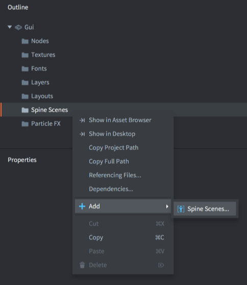

# GUI Spine nodes

Spine animated models can be added as GUI nodes as well as game object components. This manual explains how to use imported Spine animation data in GUI scenes.

## Creating a spine node

First you have to import the animation data and set up a Spine Scene resource. The [Spine animation](/manuals/spine) documentation describes how to do that.

Second, the contents of your Spine Scene resource must be available in your GUI scene. Add it by <kbd>right-clicking</kbd> the *Spine Scenes* section of the scene in the *Outline* and select <kbd>Add ▸ Spine Scenes...</kbd>. Choose the Spine Scenes (one or more) you wish to use in the scene.

{srcset="images/gui-spine/add@2x.png 2x"}

Third, create a Spine node by <kbd>right clicking</kbd> the *Nodes* section of the *Outline* and selecting <kbd>Add ▸ Spine</kbd>).

{srcset="images/gui-spine/new_node@2x.png 2x"}

The new node is automatically selected. Make sure to set its properties:

Spine Scene
: The Spine Scene to use as a data source for this node.

Spine Default Animation
: The animation to automatically start playing when the scene is initialized.

Skin
: The skin to use for the animation when the scene is initialized.

## Runtime animation control

Spine nodes can be controlled in runtime through script. To start an animation on a node, simply call the [`gui.play_spine_anim()`](/ref/gui/#gui.play_spine_anim:node-animation_id-playback-[play_properties]-[complete_function]) function:

```lua
local catnode = gui.get_node("cat_note")
local play_properties = { blend_time = 0.3, offset = 0, playback_rate = 1 }
gui.play_spine_anim(catnode, hash("run"), gui.PLAYBACK_ONCE_FORWARD, play_properties, function(self, node)
    print("Animation done!")
end)
```

## The bone hierarchy

The individual bones in the Spine skeleton can be accessed as GUI nodes. The nodes are named according to their names in the Spine setup.

{srcset="images/gui-spine/bone@2x.png 2x"}

For instance, to attach another node to an existing bone node, fetch the bone node by name with [`gui.get_spine_bone()`](/ref/gui#gui.get_spine_bone) and attach the child to it:

```lua
-- Attach a text node to the tail of the cat
local cat = gui.get_node("cat_node")
local textnode = gui.new_text_node(vmath.vector3(400, 0, 0), "Hello tail!")
local tail = gui.get_spine_bone(cat, "tail")
gui.set_parent(textnode, tail)
```

Bones are also accessible through [`gui.get_node()`](/ref/gui#gui.get_node), by the bone name prefixed by the name of the name of the Spine node and a slash (`/`):

```lua
-- Attach a text node to the tail of the cat
local textnode = gui.new_text_node(vmath.vector3(400, 0, 0), "Hello tail!")
local tail = gui.get_node("cat_node/tail")
gui.set_parent(textnode, tail)
```
