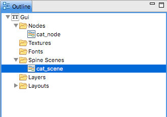
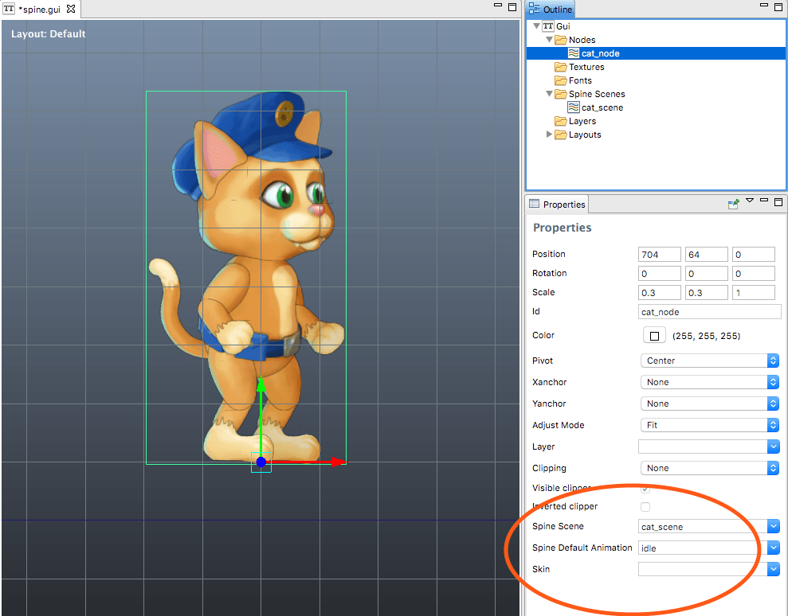
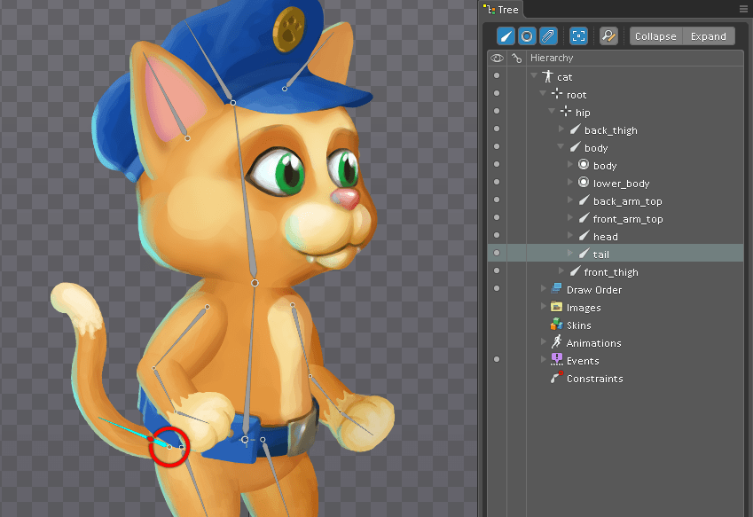

# GUI Spine nodes

Spine bone animations are available in GUI animations as well as in game objects. This manual explains how to use imported Spine animation data in GUI scenes.

Any imported Spine bone animation is available in GUI scenes as well as in game objects (through the *SpineModel* component). In order to work with Spine bone animations in Defold, you first have to import the animation data and set up a Spine Scene resource. The [Spine animation](/manuals/spine) documentation describes how to do that.

To make the contents of a Spine Scene resource available in a GUI scene, add it to the scene by right-clicking the *Spine Scenes* section of the scene in the *Outline* and select <kbd>Add Spine Scene</kbd>. Choose the Spine Scene you wish to use in the scene.




Now, if you create a Spine node (right click in the *Nodes* section of the *Outline* and select <kbd>Add Spine Node</kbd>) you are able to set the properties of the new Spine node accordingly:



Spine Scene
: The Spine Scene to use as a data source for this node.

Spine Default Animation
: The animation to automatically start playing when the scene is initialized.

Skin
: The skin to use for the animation when the scene is initialized.

## Runtime animation control

Spine nodes can be controlled in runtime through script. To start an animation on a node, simply call the [`gui.play_spine()`](/ref/gui#gui.play_spine) function:

```lua
local catnode = gui.get_node("cat_note")
local blend_time = 0.3
gui.play_spine(catnode, hash("run"), gui.PLAYBACK_ONCE_FORWARD, blend_time, function(self, node)
    print("Animation done!")
end)
```

## The bone hierarchy

The individual bones in the Spine skeleton exist as GUI nodes. The nodes are named according to their names in the Spine setup.



For instance, to attach another node to an existing bone node, fetch the bone node by name with [`gui.get_spine_bone()`](/ref/gui#gui.get_spine_bone) and attach the child to it:

```lua
-- Attach a text node to the tail of the cat
local cat = gui.get_node("cat_node")
local textnode = gui.new_text_node(vmath.vector3(400, 0, 0), "Hello tail!")
local tail = gui.get_spine_bone(cat, "tail")
gui.set_parent(textnode, tail)
```

All bones are also accessible through [`gui.get_node()`](/ref/gui#gui.get_node), by the bone name prefixed by the name of the name of the Spine node and a slash (`/`):

```lua
-- Attach a text node to the tail of the cat
local textnode = gui.new_text_node(vmath.vector3(400, 0, 0), "Hello tail!")
local tail = gui.get_node("cat_node/tail")
gui.set_parent(textnode, tail)
```

